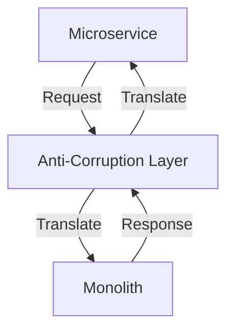

---

linkTitle: "15.2.2 Anti-Corruption Layer"
title: "Anti-Corruption Layer: A Key Design Pattern for Microservices Migration"
description: "Explore the Anti-Corruption Layer pattern, a crucial strategy for migrating from monolithic to microservices architecture, ensuring seamless integration and evolution."
categories:
- Microservices
- Design Patterns
- Software Architecture
tags:
- Anti-Corruption Layer
- Microservices
- Migration Strategies
- Software Design
- Legacy Systems
date: 2024-10-25
type: docs
nav_weight: 1522000
---

## 15.2.2 Anti-Corruption Layer

As organizations transition from monolithic architectures to microservices, one of the critical challenges they face is managing the interaction between legacy systems and new microservices. The Anti-Corruption Layer (ACL) design pattern provides a robust solution to this challenge by acting as a protective boundary that prevents the complexities and constraints of legacy systems from affecting the new microservices architecture. This section delves into the intricacies of the Anti-Corruption Layer, offering insights into its implementation and maintenance.

### Defining the Anti-Corruption Layer (ACL)

The Anti-Corruption Layer is a design pattern that serves as an intermediary between a legacy monolithic system and new microservices. Its primary purpose is to prevent the legacy system's models and logic from "leaking" into the microservices, thereby maintaining the integrity and independence of the new architecture. By encapsulating the interaction logic, the ACL ensures that microservices can operate with their own models and paradigms without being constrained by the legacy system's architecture.

### Encapsulating Interaction Logic

Encapsulation is at the heart of the ACL's functionality. All interaction logic with the monolith is contained within the ACL, which acts as a translator and adapter. This encapsulation allows the microservices to communicate with the monolith without directly interacting with its complex and often outdated logic. By doing so, the ACL isolates the microservices from any changes or peculiarities in the legacy system.

### Implementing Translation and Mapping

A crucial function of the ACL is to implement translation and mapping mechanisms. These mechanisms convert data formats, units, and structures between the monolith and the microservices. For example, if the monolith uses a proprietary data format, the ACL can translate this into a standard format used by the microservices. This translation ensures that data integrity is maintained and that microservices can process the data without modification.

```java
public class LegacyToMicroserviceTranslator {

    public MicroserviceData translate(LegacyData legacyData) {
        MicroserviceData microserviceData = new MicroserviceData();
        // Example of data mapping
        microserviceData.setId(legacyData.getLegacyId());
        microserviceData.setName(legacyData.getLegacyName());
        microserviceData.setAmount(convertCurrency(legacyData.getLegacyAmount()));
        return microserviceData;
    }

    private double convertCurrency(double legacyAmount) {
        // Conversion logic, e.g., from legacy currency to microservice currency
        return legacyAmount * 1.1; // Example conversion rate
    }
}
```

### Using Adapters and Facades

The ACL often employs adapters and facades to provide a simplified and consistent interface for microservices. Adapters translate the interface of the monolith into one that the microservices can use, while facades offer a unified interface to a set of interfaces in the monolith. This approach hides the complexity of monolithic interactions, allowing microservices to interact with a straightforward API.

```java
public class MonolithAdapter implements MicroserviceInterface {

    private final MonolithService monolithService;

    public MonolithAdapter(MonolithService monolithService) {
        this.monolithService = monolithService;
    }

    @Override
    public MicroserviceResponse performOperation(MicroserviceRequest request) {
        LegacyRequest legacyRequest = translateToLegacyRequest(request);
        LegacyResponse legacyResponse = monolithService.execute(legacyRequest);
        return translateToMicroserviceResponse(legacyResponse);
    }

    private LegacyRequest translateToLegacyRequest(MicroserviceRequest request) {
        // Translation logic
    }

    private MicroserviceResponse translateToMicroserviceResponse(LegacyResponse response) {
        // Translation logic
    }
}
```

### Enforcing Separation of Concerns

The ACL enforces a clear separation of concerns, allowing microservices to evolve independently. By decoupling the microservices from the monolith's architecture and logic, the ACL ensures that changes in the monolith do not directly impact the microservices. This separation is crucial for maintaining the agility and scalability of the microservices architecture.

### Managing Transaction Boundaries

Managing transaction boundaries is a critical aspect of the ACL. Operations that cross the boundary between the monolith and microservices must be handled reliably and consistently. The ACL can implement transaction management strategies to ensure data consistency and integrity across systems.

```java
public class TransactionManager {

    public void executeTransaction(Runnable operation) {
        try {
            beginTransaction();
            operation.run();
            commitTransaction();
        } catch (Exception e) {
            rollbackTransaction();
            throw new RuntimeException("Transaction failed", e);
        }
    }

    private void beginTransaction() {
        // Begin transaction logic
    }

    private void commitTransaction() {
        // Commit transaction logic
    }

    private void rollbackTransaction() {
        // Rollback transaction logic
    }
}
```

### Implementing Security Controls

Security is paramount when integrating legacy systems with microservices. The ACL should implement security controls such as authentication, authorization, and data validation to protect interactions. This ensures that only authorized microservices can access the monolith and that data exchanged is valid and secure.

### Monitoring and Maintaining the ACL

Continuous monitoring and maintenance of the ACL are essential to ensure its effectiveness. As both the monolith and microservices evolve, the ACL must adapt to these changes. Regular updates and monitoring can help identify and address any issues that arise, ensuring the ACL continues to serve its purpose effectively.

### Practical Example: E-Commerce Platform Migration

Consider an e-commerce platform transitioning from a monolithic architecture to microservices. The monolith handles inventory, orders, and customer data. The ACL can be implemented to manage interactions between the new microservices and the legacy system, translating data formats and ensuring secure and reliable communication.

#### Diagram: Anti-Corruption Layer in Action



### Best Practices and Common Pitfalls

- **Best Practices:**
  - Ensure the ACL is well-documented and its logic is transparent to developers.
  - Regularly update the ACL to accommodate changes in both the monolith and microservices.
  - Use automated testing to verify the ACL's functionality and reliability.

- **Common Pitfalls:**
  - Overcomplicating the ACL with excessive logic can lead to maintenance challenges.
  - Neglecting security considerations can expose the system to vulnerabilities.
  - Failing to monitor the ACL can result in unnoticed integration issues.

### Conclusion

The Anti-Corruption Layer is a vital pattern for organizations migrating from monolithic systems to microservices. By encapsulating interaction logic, implementing translation mechanisms, and enforcing separation of concerns, the ACL ensures a smooth transition while maintaining the integrity and independence of the new architecture. As you implement this pattern, consider the best practices and potential challenges to maximize its effectiveness.

## Quiz Time!



### What is the primary purpose of the Anti-Corruption Layer (ACL)?

- [x] To prevent the legacy system's models and logic from leaking into the new microservices.
- [ ] To enhance the performance of microservices.
- [ ] To replace the legacy system entirely.
- [ ] To manage user authentication across microservices.

> **Explanation:** The ACL acts as a boundary to prevent legacy system complexities from affecting new microservices.

### How does the ACL encapsulate interaction logic?

- [x] By containing all interaction logic with the monolith within itself.
- [ ] By directly modifying the monolith's code.
- [ ] By integrating microservices into the monolith.
- [ ] By bypassing the monolith entirely.

> **Explanation:** The ACL encapsulates interaction logic to isolate microservices from the monolith's complexities.

### What role do adapters and facades play in the ACL?

- [x] They provide a simplified and consistent interface for microservices.
- [ ] They increase the complexity of the ACL.
- [ ] They are used to replace the monolith.
- [ ] They are unnecessary in the ACL.

> **Explanation:** Adapters and facades simplify interactions by hiding the complexity of monolithic systems.

### What is a key benefit of enforcing separation of concerns in the ACL?

- [x] It allows microservices to evolve independently.
- [ ] It makes the monolith more complex.
- [ ] It reduces the need for testing.
- [ ] It eliminates the need for documentation.

> **Explanation:** Separation of concerns ensures that microservices are not tightly coupled to the monolith.

### How does the ACL manage transaction boundaries?

- [x] By implementing transaction management strategies.
- [ ] By ignoring transaction boundaries.
- [ ] By directly modifying database transactions.
- [ ] By using a single global transaction for all operations.

> **Explanation:** The ACL manages transaction boundaries to ensure data consistency across systems.

### Why is it important to implement security controls within the ACL?

- [x] To protect interactions between the monolith and microservices.
- [ ] To increase the complexity of the ACL.
- [ ] To reduce the need for encryption.
- [ ] To bypass authentication requirements.

> **Explanation:** Security controls protect data and ensure only authorized access to the monolith.

### What is a common pitfall when implementing the ACL?

- [x] Overcomplicating the ACL with excessive logic.
- [ ] Using too few adapters and facades.
- [ ] Completely replacing the monolith.
- [ ] Ignoring the need for translation mechanisms.

> **Explanation:** Excessive logic can make the ACL difficult to maintain and understand.

### What should be regularly monitored and maintained in the ACL?

- [x] The effectiveness and adaptation to changes in the monolith or microservices.
- [ ] The number of microservices connected to the ACL.
- [ ] The total lines of code in the ACL.
- [ ] The frequency of requests to the monolith.

> **Explanation:** Regular monitoring ensures the ACL remains effective and adapts to changes.

### Which of the following is a best practice for the ACL?

- [x] Regularly updating the ACL to accommodate changes.
- [ ] Avoiding documentation of the ACL.
- [ ] Using the ACL to replace the monolith.
- [ ] Ignoring security considerations.

> **Explanation:** Regular updates ensure the ACL adapts to changes in the architecture.

### True or False: The ACL can help manage user authentication across microservices.

- [x] True
- [ ] False

> **Explanation:** The ACL can implement security controls, including authentication and authorization.




