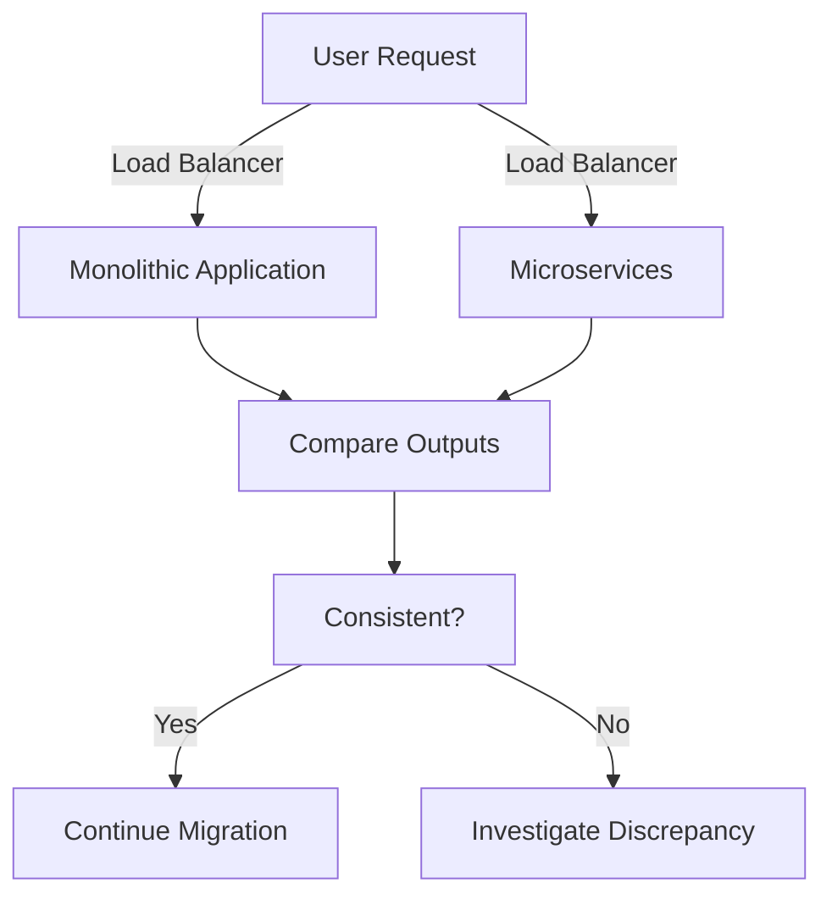

## 15.2.3 Parallel Run and Incremental Migration

Transitioning from a monolithic architecture to a microservices-based system is a complex endeavor that requires careful planning and execution. One effective strategy to manage this transition is the Parallel Run and Incremental Migration approach. This method allows organizations to gradually shift from a monolithic system to microservices, ensuring continuity, reliability, and minimal disruption to users. In this section, we will delve into the intricacies of this strategy, exploring its implementation, benefits, and challenges.

### Defining Parallel Run

Parallel Run is a migration strategy where both the monolithic application and the new microservices architecture operate simultaneously. This dual operation allows for parallel processing and comparison of outputs, providing a safety net during the migration process. By running both systems concurrently, organizations can ensure that the new microservices replicate the functionality and performance of the monolith before fully transitioning.

### Implementing Dual Environments

To effectively execute a Parallel Run, it's crucial to set up dual environments. The monolithic application continues to handle existing workloads, while microservices are introduced to manage new or migrated functionalities. This setup ensures that the system remains operational and reliable throughout the migration process.

#### Steps to Set Up Dual Environments:

1. **Infrastructure Preparation:** Ensure that the infrastructure can support both the monolith and microservices. This may involve provisioning additional resources or leveraging cloud-based solutions for scalability.

2. **Environment Configuration:** Configure environments to mirror production settings as closely as possible. This includes setting up databases, networking, and security protocols.

3. **Deployment Pipelines:** Establish deployment pipelines for both the monolith and microservices to facilitate continuous integration and delivery.

4. **Data Access Layer:** Implement a data access layer that allows both systems to access and update shared data consistently.

### Comparing Outputs for Consistency

A critical aspect of the Parallel Run strategy is ensuring that the outputs and behaviors of the microservices align with those of the monolith. This involves rigorous testing and validation to confirm that the new system meets the same functional and performance criteria.

#### Techniques for Output Comparison:

- **Automated Testing:** Use automated test suites to compare outputs from both systems. This includes unit tests, integration tests, and end-to-end tests.

- **Logging and Monitoring:** Implement comprehensive logging and monitoring to track discrepancies in outputs and performance metrics.

- **User Feedback:** Gather feedback from users interacting with both systems to identify any inconsistencies or issues.

### Gradually Shifting Traffic

Once confidence in the microservices' performance and reliability is established, traffic can be gradually shifted from the monolith to the microservices. This gradual shift helps mitigate risks and allows for real-time monitoring of the microservices under load.

#### Guidelines for Traffic Shifting:

- **Canary Releases:** Start by routing a small percentage of traffic to the microservices and gradually increase as confidence grows.

- **Load Balancing:** Use load balancers to distribute traffic between the monolith and microservices, ensuring optimal performance.

- **Rollback Mechanisms:** Implement rollback mechanisms to revert traffic to the monolith in case of issues with the microservices.

### Monitoring and Validating Performance

Continuous monitoring and validation are essential during the Parallel Run phase. This ensures that both systems perform optimally and any issues are promptly addressed.

#### Monitoring Strategies:

- **Performance Metrics:** Track key performance indicators (KPIs) such as response time, throughput, and error rates.

- **Resource Utilization:** Monitor resource utilization to ensure that both systems operate efficiently without overloading infrastructure.

- **Alerting Systems:** Set up alerting systems to notify teams of any anomalies or performance degradation.

### Addressing Data Synchronization

Data synchronization between the monolith and microservices is a critical challenge during migration. Ensuring consistent and up-to-date data across both systems is vital for maintaining data integrity.

#### Data Synchronization Techniques:

- **Event Sourcing:** Use event sourcing to capture changes in data and propagate them to both systems.

- **Data Replication:** Implement data replication strategies to keep databases in sync.

- **Conflict Resolution:** Develop conflict resolution mechanisms to handle discrepancies in data updates.

### Facilitating Team Coordination

Running parallel systems requires close coordination between development and operations teams. Effective communication and collaboration are essential to manage dependencies and ensure seamless integration.

#### Coordination Strategies:

- **Cross-Functional Teams:** Form cross-functional teams with members from both development and operations to facilitate collaboration.

- **Regular Meetings:** Conduct regular meetings to discuss progress, challenges, and solutions.

- **Documentation:** Maintain comprehensive documentation to track changes, decisions, and lessons learned.

### Planning for Complete Migration

The ultimate goal of the Parallel Run strategy is to retire the monolith once all functionalities have been successfully migrated and validated within the microservices architecture. This requires a clear and well-defined migration plan.

#### Steps for Complete Migration:

1. **Functionality Mapping:** Map all functionalities from the monolith to corresponding microservices.

2. **Validation and Testing:** Conduct thorough validation and testing to ensure all functionalities are correctly implemented.

3. **Decommissioning Plan:** Develop a plan for decommissioning the monolith, including data migration and system shutdown procedures.

4. **Post-Migration Monitoring:** Continue monitoring the microservices architecture post-migration to ensure stability and performance.

### Practical Java Code Example

To illustrate the Parallel Run strategy, let's consider a simplified example where a monolithic application is being incrementally migrated to a microservices architecture.

```java
// Monolithic Service
public class MonolithicService {
    public String processRequest(String request) {
        // Simulate processing
        return "Monolith Response: " + request;
    }
}

// Microservice
public class Microservice {
    public String processRequest(String request) {
        // Simulate processing
        return "Microservice Response: " + request;
    }
}

// Parallel Run Controller
public class ParallelRunController {
    private MonolithicService monolithicService = new MonolithicService();
    private Microservice microservice = new Microservice();

    public void handleRequest(String request) {
        // Process request in both systems
        String monolithResponse = monolithicService.processRequest(request);
        String microserviceResponse = microservice.processRequest(request);

        // Compare outputs
        if (!monolithResponse.equals(microserviceResponse)) {
            System.out.println("Discrepancy detected!");
        } else {
            System.out.println("Outputs are consistent.");
        }
    }

    public static void main(String[] args) {
        ParallelRunController controller = new ParallelRunController();
        controller.handleRequest("Test Request");
    }
}
```

### Diagram: Parallel Run Architecture

Below is a diagram illustrating the Parallel Run architecture, where both the monolithic application and microservices operate concurrently.



### Best Practices and Common Pitfalls

- **Best Practices:**
  - Ensure thorough testing and validation at each migration stage.
  - Maintain clear communication and documentation throughout the process.
  - Use automated tools for monitoring and alerting to quickly identify issues.

- **Common Pitfalls:**
  - Neglecting data synchronization can lead to inconsistencies.
  - Insufficient testing may result in undetected discrepancies.
  - Poor coordination between teams can cause delays and errors.

### Conclusion

The Parallel Run and Incremental Migration strategy offers a structured approach to transitioning from a monolithic architecture to microservices. By running both systems concurrently, organizations can ensure a smooth and reliable migration, minimizing risks and disruptions. With careful planning, monitoring, and coordination, this strategy can lead to a successful and sustainable transition to a modern microservices architecture.

## Quiz Time!



### What is the primary purpose of the Parallel Run strategy in migration?

- [x] To run both monolithic and microservices systems simultaneously for comparison
- [ ] To replace the monolith immediately with microservices
- [ ] To test microservices in a production environment without user impact
- [ ] To ensure microservices are faster than the monolith

> **Explanation:** The Parallel Run strategy involves running both the monolithic application and microservices simultaneously to compare outputs and ensure consistency before fully transitioning.

### How should traffic be shifted from the monolith to microservices during migration?

- [x] Gradually, using canary releases
- [ ] All at once, to test microservices under full load
- [ ] Only during off-peak hours
- [ ] By disabling the monolith first

> **Explanation:** Traffic should be gradually shifted using canary releases to mitigate risks and allow for real-time monitoring of microservices performance.

### What is a key challenge when running parallel systems during migration?

- [x] Data synchronization between monolith and microservices
- [ ] Lack of user feedback
- [ ] Insufficient server capacity
- [ ] Inability to monitor performance

> **Explanation:** Ensuring consistent and up-to-date data across both systems is a critical challenge during the migration process.

### Which tool can help in comparing outputs from monolithic and microservices systems?

- [x] Automated testing suites
- [ ] Manual testing
- [ ] Load balancers
- [ ] API gateways

> **Explanation:** Automated testing suites can be used to compare outputs from both systems, ensuring consistency and correctness.

### What is the role of a load balancer in the Parallel Run strategy?

- [x] To distribute traffic between the monolith and microservices
- [ ] To replace the monolith with microservices
- [ ] To monitor server performance
- [ ] To manage data synchronization

> **Explanation:** Load balancers distribute traffic between the monolith and microservices, ensuring optimal performance and reliability.

### Why is team coordination important in the Parallel Run strategy?

- [x] To manage dependencies and ensure seamless integration
- [ ] To reduce the number of developers needed
- [ ] To eliminate the need for documentation
- [ ] To speed up the migration process

> **Explanation:** Effective team coordination is essential to manage dependencies and ensure seamless integration between parallel systems.

### What should be done if discrepancies are found during output comparison?

- [x] Investigate and resolve the discrepancies
- [ ] Ignore them and continue migration
- [ ] Rollback to the monolith
- [ ] Increase traffic to microservices

> **Explanation:** Discrepancies should be investigated and resolved to ensure the microservices replicate the functionality of the monolith accurately.

### What is the ultimate goal of the Parallel Run strategy?

- [x] To retire the monolith after successful migration
- [ ] To maintain both systems indefinitely
- [ ] To increase system complexity
- [ ] To reduce server costs

> **Explanation:** The ultimate goal is to retire the monolith once all functionalities have been successfully migrated and validated within the microservices architecture.

### Which of the following is a best practice during the Parallel Run phase?

- [x] Thorough testing and validation at each migration stage
- [ ] Immediate traffic shift to microservices
- [ ] Minimal documentation
- [ ] Isolated team operations

> **Explanation:** Thorough testing and validation at each migration stage is a best practice to ensure a smooth transition.

### True or False: The Parallel Run strategy involves running only the microservices in a test environment.

- [ ] True
- [x] False

> **Explanation:** False. The Parallel Run strategy involves running both the monolithic application and microservices simultaneously to compare outputs and ensure consistency.


