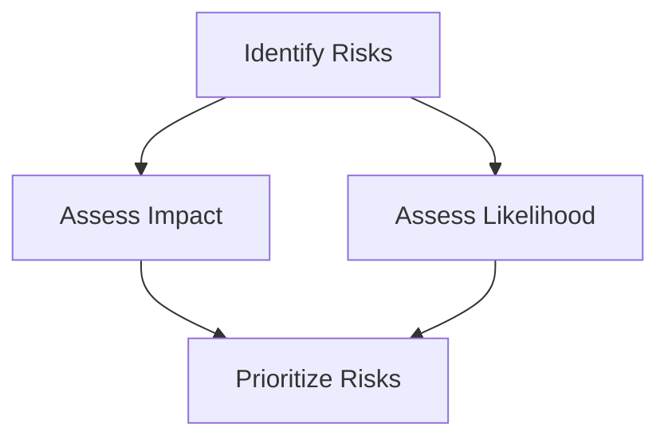

## 15.4.2 Risk Management in Legacy System Decommissioning

The process of decommissioning legacy systems as part of a microservices migration is fraught with potential risks. These risks can range from data loss and service downtime to performance degradation and security vulnerabilities. Effective risk management is crucial to ensure a smooth transition and to safeguard the integrity and availability of services. This section delves into the strategies and best practices for identifying, assessing, and mitigating risks during the decommissioning process.

### Identifying Migration Risks

The first step in risk management is to identify potential risks that could arise during the migration process. These risks can be broadly categorized into several areas:

1. **Data Loss:** The risk of losing critical data during the migration process due to errors in data transfer or system failures.
2. **Service Downtime:** The potential for service interruptions that can affect business operations and user experience.
3. **Performance Degradation:** The risk of reduced system performance post-migration, impacting application responsiveness and user satisfaction.
4. **Security Vulnerabilities:** The introduction of new security risks as legacy systems are replaced or integrated with new microservices.
5. **Integration Challenges:** Difficulties in ensuring seamless integration between new microservices and existing systems.
6. **Compliance Issues:** The risk of non-compliance with regulatory requirements during the migration process.

### Assessing Risk Impact and Likelihood

Once risks are identified, the next step is to assess their impact and likelihood. This involves evaluating the potential consequences of each risk and the probability of its occurrence. 

- **Impact Assessment:** Determine the severity of each risk's potential impact on the business, considering factors such as financial loss, reputational damage, and operational disruption.
- **Likelihood Assessment:** Estimate the probability of each risk occurring based on historical data, expert judgment, and current system vulnerabilities.

A risk matrix can be a useful tool for visualizing and prioritizing risks based on their impact and likelihood.



### Developing Risk Mitigation Strategies

For high-priority risks, it is essential to develop robust mitigation strategies. These strategies should include:

- **Preventive Measures:** Actions taken to reduce the likelihood of risks occurring, such as implementing data validation checks and security audits.
- **Contingency Plans:** Predefined responses to be enacted if a risk materializes, ensuring minimal disruption to operations.
- **Recovery Procedures:** Steps to restore normal operations and recover lost data or services following a risk event.

#### Example: Mitigating Data Loss Risk

```java
import java.util.logging.Logger;

public class DataMigration {
    private static final Logger logger = Logger.getLogger(DataMigration.class.getName());

    public void migrateData() {
        try {
            // Perform data backup before migration
            backupData();
            // Proceed with data migration
            transferData();
            // Verify data integrity post-migration
            verifyDataIntegrity();
        } catch (Exception e) {
            logger.severe("Data migration failed: " + e.getMessage());
            // Execute recovery procedure
            restoreBackup();
        }
    }

    private void backupData() {
        // Code to backup data
        logger.info("Data backup completed successfully.");
    }

    private void transferData() {
        // Code to transfer data
        logger.info("Data transfer in progress...");
    }

    private void verifyDataIntegrity() {
        // Code to verify data integrity
        logger.info("Data integrity verified.");
    }

    private void restoreBackup() {
        // Code to restore data from backup
        logger.info("Data restored from backup.");
    }
}
```

### Implementing Monitoring and Alerts

Real-time monitoring and alerting systems are critical for detecting and responding to risks promptly. These systems should be configured to track key performance indicators (KPIs) and alert stakeholders to any anomalies or potential issues.

- **Monitoring Tools:** Utilize tools like Prometheus and Grafana to monitor system performance and health.
- **Alerting Systems:** Set up alerts for critical thresholds, such as CPU usage, memory consumption, and response times.

### Conducting Regular Risk Assessments

Risk management is an ongoing process. Regular risk assessments should be conducted throughout the migration to identify new risks and evaluate the effectiveness of existing mitigation strategies. This involves:

- **Continuous Monitoring:** Keeping track of system performance and security post-migration.
- **Feedback Loops:** Incorporating feedback from stakeholders and team members to refine risk management plans.

### Engaging Stakeholders in Risk Management

Engaging stakeholders in the risk management process ensures that all relevant perspectives are considered and that there is alignment on risk priorities and responses. Stakeholders may include:

- **Business Leaders:** To understand the business impact of risks and ensure alignment with organizational goals.
- **Technical Teams:** To provide insights into technical risks and mitigation strategies.
- **Compliance Officers:** To ensure adherence to regulatory requirements.

### Documenting Risk Management Plans

All risk management plans should be thoroughly documented. This documentation should include:

- **Identified Risks:** A comprehensive list of all identified risks.
- **Mitigation Strategies:** Detailed strategies for mitigating each risk.
- **Response Procedures:** Clear procedures for responding to risk events.

### Training Teams on Risk Awareness

Finally, it is crucial to train teams to be aware of potential risks during migration. This training should focus on:

- **Risk Identification:** Teaching team members how to recognize potential risks.
- **Response Protocols:** Ensuring that team members know how to respond to risks effectively.
- **Continuous Improvement:** Encouraging a culture of continuous learning and improvement in risk management practices.

### Conclusion

Effective risk management is essential for the successful decommissioning of legacy systems during a microservices migration. By identifying potential risks, assessing their impact and likelihood, and developing robust mitigation strategies, organizations can minimize disruptions and ensure a smooth transition. Engaging stakeholders, documenting plans, and training teams further enhance the organization's ability to manage risks effectively.

## Quiz Time!



### Which of the following is a potential risk during the migration of legacy systems?

- [x] Data loss
- [ ] Increased user engagement
- [ ] Reduced server costs
- [ ] Improved system performance

> **Explanation:** Data loss is a common risk during system migrations due to potential errors in data transfer or system failures.

### What is the purpose of a risk matrix in risk management?

- [x] To visualize and prioritize risks based on their impact and likelihood
- [ ] To calculate the financial cost of risks
- [ ] To eliminate all risks before migration
- [ ] To document risk management plans

> **Explanation:** A risk matrix helps in visualizing and prioritizing risks by assessing their impact and likelihood.

### Which strategy is NOT part of risk mitigation?

- [ ] Preventive measures
- [ ] Contingency plans
- [ ] Recovery procedures
- [x] Risk denial

> **Explanation:** Risk denial is not a strategy; it involves ignoring risks, which is not advisable.

### Why is stakeholder engagement important in risk management?

- [x] To ensure all relevant perspectives are considered and there is alignment on risk priorities
- [ ] To increase the number of risks identified
- [ ] To reduce the cost of risk management
- [ ] To simplify the migration process

> **Explanation:** Engaging stakeholders ensures that all perspectives are considered and there is alignment on risk priorities and responses.

### What is the role of monitoring and alerts in risk management?

- [x] To detect and respond to risks in real-time
- [ ] To eliminate all risks
- [ ] To increase system complexity
- [ ] To reduce the need for documentation

> **Explanation:** Monitoring and alerts help in detecting and responding to risks in real-time, ensuring prompt action.

### Which of the following is a preventive measure for data loss?

- [x] Data backup
- [ ] Ignoring data integrity
- [ ] Delaying data migration
- [ ] Disabling security protocols

> **Explanation:** Data backup is a preventive measure to safeguard against data loss during migration.

### What should be included in risk management documentation?

- [x] Identified risks and mitigation strategies
- [ ] Only successful risk responses
- [ ] Financial reports
- [ ] Marketing strategies

> **Explanation:** Risk management documentation should include identified risks, mitigation strategies, and response procedures.

### How often should risk assessments be conducted during migration?

- [x] Regularly throughout the migration process
- [ ] Only at the beginning of the migration
- [ ] Once a year
- [ ] After the migration is complete

> **Explanation:** Regular risk assessments throughout the migration process help in identifying new risks and evaluating existing strategies.

### What is the benefit of training teams on risk awareness?

- [x] Enhancing their ability to recognize and respond to emerging issues
- [ ] Increasing the complexity of risk management
- [ ] Reducing the number of stakeholders
- [ ] Simplifying the migration process

> **Explanation:** Training teams on risk awareness enhances their ability to recognize and respond to emerging issues effectively.

### True or False: Risk management is a one-time activity during migration.

- [ ] True
- [x] False

> **Explanation:** Risk management is an ongoing process that requires continuous assessment and adaptation throughout the migration.


