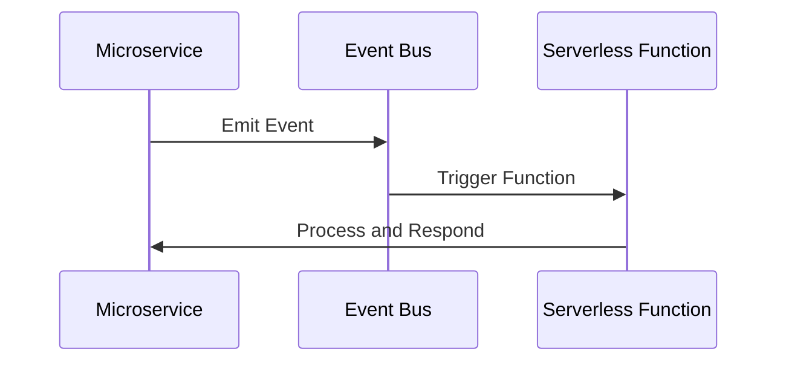

---

linkTitle: "16.1.3 Integration with Microservices"
title: "Integrating Serverless with Microservices: Key Strategies and Best Practices"
description: "Explore the integration of serverless functions with microservices, focusing on orchestration, event-driven communication, data flow, security, and performance optimization."
categories:
- Microservices
- Serverless Architecture
- Software Engineering
tags:
- Microservices
- Serverless
- API Gateway
- Event-Driven Architecture
- Security
- Observability
- Performance Optimization
date: 2024-10-25
type: docs
nav_weight: 1613000
---

## 16.1.3 Integration with Microservices

As organizations increasingly adopt microservices architectures, the integration of serverless computing offers a compelling approach to enhance scalability, flexibility, and cost-efficiency. This section explores the integration of serverless functions with microservices, focusing on key strategies and best practices to ensure seamless interaction between these two paradigms.

### Defining Integration Points

The integration of serverless functions with microservices involves identifying key interaction points. These points are where serverless functions can effectively complement microservices, enhancing the overall architecture. Common integration points include:

- **API Gateways:** Serve as the entry point for requests, routing them to appropriate serverless functions or microservices.
- **Message Queues:** Facilitate asynchronous communication, allowing serverless functions to process messages from microservices.
- **Event Streams:** Enable event-driven architectures, triggering serverless functions in response to events generated by microservices.

### Using API Gateways for Orchestration

API gateways play a crucial role in orchestrating requests between serverless functions and microservices. They manage various aspects of communication, including routing, authentication, and rate limiting.

- **Routing and Load Balancing:** API gateways direct incoming requests to the appropriate serverless functions or microservices, ensuring efficient load distribution.
- **Authentication and Authorization:** They enforce security policies, verifying that requests are authenticated and authorized before reaching the backend services.
- **Rate Limiting and Throttling:** API gateways control the rate of incoming requests, preventing overload and ensuring fair resource allocation.

**Example: Configuring an API Gateway with AWS Lambda**

```java
// AWS Lambda function handler in Java
public class LambdaHandler implements RequestHandler<APIGatewayProxyRequestEvent, APIGatewayProxyResponseEvent> {
    @Override
    public APIGatewayProxyResponseEvent handleRequest(APIGatewayProxyRequestEvent request, Context context) {
        // Process the request and generate a response
        String responseMessage = "Hello, " + request.getPathParameters().get("name");
        return new APIGatewayProxyResponseEvent().withStatusCode(200).withBody(responseMessage);
    }
}
```

### Leveraging Event-Driven Communication

Event-driven communication is a powerful paradigm that enhances the decoupling and responsiveness of microservices architectures. By using event buses like AWS EventBridge or Apache Kafka, serverless functions can be triggered by events emitted from microservices, enabling reactive workflows.

- **Event Producers and Consumers:** Microservices act as event producers, emitting events to an event bus. Serverless functions, as consumers, react to these events, executing business logic in response.
- **Decoupled Architecture:** This approach reduces dependencies between services, allowing them to evolve independently and scale efficiently.

**Mermaid Diagram: Event-Driven Architecture**



### Managing Data Flow and State

Managing data flow and state between serverless functions and microservices is critical for maintaining consistency and reliability. Strategies include:

- **Shared Databases:** Use a common database to store state, ensuring that both serverless functions and microservices have access to the latest data.
- **Caching Layers:** Implement caching solutions to reduce latency and improve data retrieval efficiency.
- **State Management Services:** Utilize services like AWS Step Functions to manage complex workflows and maintain state across function invocations.

### Implementing Microservice Coordination

Coordination between serverless functions and microservices is essential for handling complex workflows and transactions. Consider the following guidelines:

- **Orchestration vs. Choreography:** Decide between orchestrating workflows using a central controller or allowing services to coordinate through event-driven interactions.
- **Transaction Management:** Implement mechanisms to ensure data consistency across distributed transactions, such as the Saga pattern.

**Example: Using AWS Step Functions for Orchestration**

```json
{
  "Comment": "A simple AWS Step Functions state machine",
  "StartAt": "FirstStep",
  "States": {
    "FirstStep": {
      "Type": "Task",
      "Resource": "arn:aws:lambda:us-east-1:123456789012:function:FirstFunction",
      "Next": "SecondStep"
    },
    "SecondStep": {
      "Type": "Task",
      "Resource": "arn:aws:lambda:us-east-1:123456789012:function:SecondFunction",
      "End": true
    }
  }
}
```

### Ensuring Security and Compliance

Security is paramount when integrating serverless functions with microservices. Key practices include:

- **Encryption:** Use TLS to encrypt data in transit and ensure secure communication between components.
- **IAM Roles:** Define fine-grained access controls using IAM roles, restricting permissions to the minimum necessary.
- **Secure APIs:** Implement secure API endpoints, validating inputs and protecting against common vulnerabilities.

### Monitoring and Observing Distributed Systems

Comprehensive monitoring and observability are essential for tracking the performance and interactions of serverless functions within a microservices ecosystem.

- **Distributed Tracing:** Use tools like AWS X-Ray to trace requests across services, identifying bottlenecks and performance issues.
- **Metrics Collection:** Implement metrics collection using Prometheus or similar tools to monitor resource usage and application health.
- **Logging:** Ensure detailed logging of function invocations and interactions for debugging and auditing purposes.

### Optimizing Performance and Cost

Optimizing the performance and cost of integrated serverless and microservices architectures involves several strategies:

- **Reduce Invocation Latency:** Minimize cold start times by keeping functions warm or using provisioned concurrency.
- **Efficient Resource Usage:** Monitor and adjust resource allocations to avoid over-provisioning and reduce costs.
- **Data Access Patterns:** Implement efficient data access patterns, such as batching requests or using read replicas, to improve performance.

### Conclusion

Integrating serverless functions with microservices offers a powerful approach to building scalable, flexible, and cost-effective systems. By leveraging key integration points, orchestrating interactions through API gateways, adopting event-driven communication, and implementing robust security and observability practices, organizations can harness the full potential of serverless computing within their microservices architectures.

For further exploration, consider diving into official documentation and resources on AWS Lambda, API Gateway, and event-driven architectures. Books like "Building Event-Driven Microservices" by Adam Bellemare provide deeper insights into these topics.

## Quiz Time!



### Which of the following is a key integration point for serverless functions with microservices?

- [x] API Gateways
- [ ] Load Balancers
- [ ] Firewalls
- [ ] DNS Servers

> **Explanation:** API Gateways serve as a crucial integration point, orchestrating requests between serverless functions and microservices.

### What is the primary role of an API Gateway in a serverless microservices architecture?

- [x] Orchestrating requests
- [ ] Storing data
- [ ] Compiling code
- [ ] Managing DNS

> **Explanation:** API Gateways orchestrate requests, managing routing, authentication, and rate limiting between serverless functions and microservices.

### How do event buses like AWS EventBridge facilitate communication in a microservices architecture?

- [x] By enabling event-driven communication
- [ ] By storing large datasets
- [ ] By compiling serverless functions
- [ ] By managing DNS records

> **Explanation:** Event buses enable event-driven communication, allowing serverless functions to react to events emitted by microservices.

### What is a common strategy for managing data flow between serverless functions and microservices?

- [x] Using shared databases
- [ ] Using local storage
- [ ] Using DNS caching
- [ ] Using static files

> **Explanation:** Shared databases allow both serverless functions and microservices to access and maintain consistent data.

### Which pattern is used for managing distributed transactions in a serverless microservices architecture?

- [x] Saga pattern
- [ ] Singleton pattern
- [ ] Factory pattern
- [ ] Observer pattern

> **Explanation:** The Saga pattern is used for managing distributed transactions, ensuring data consistency across services.

### What is a key security practice when integrating serverless functions with microservices?

- [x] Using IAM roles for access control
- [ ] Using static IP addresses
- [ ] Using local storage
- [ ] Using DNS caching

> **Explanation:** IAM roles provide fine-grained access control, ensuring that serverless functions and microservices have appropriate permissions.

### Which tool is commonly used for distributed tracing in serverless microservices architectures?

- [x] AWS X-Ray
- [ ] Jenkins
- [ ] Docker
- [ ] Terraform

> **Explanation:** AWS X-Ray is used for distributed tracing, helping to identify performance bottlenecks and trace requests across services.

### What is a strategy for reducing the cold start time of serverless functions?

- [x] Using provisioned concurrency
- [ ] Using local storage
- [ ] Using DNS caching
- [ ] Using static IP addresses

> **Explanation:** Provisioned concurrency keeps functions warm, reducing cold start times and improving performance.

### How can you optimize resource usage in a serverless microservices architecture?

- [x] By monitoring and adjusting resource allocations
- [ ] By using static IP addresses
- [ ] By using DNS caching
- [ ] By using local storage

> **Explanation:** Monitoring and adjusting resource allocations help avoid over-provisioning and reduce costs.

### True or False: Event-driven communication in microservices architectures reduces dependencies between services.

- [x] True
- [ ] False

> **Explanation:** Event-driven communication decouples services, allowing them to evolve independently and scale efficiently.


