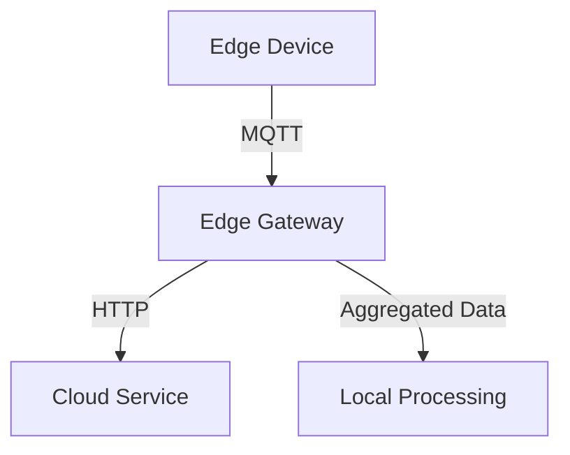
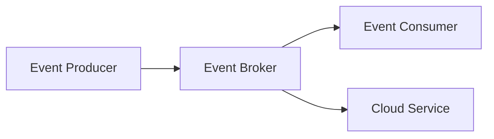

## 16.2.2 Patterns for Edge Deployment

As the demand for low-latency, high-performance applications grows, deploying microservices at the edge has become a crucial strategy for modern software architectures. This section explores the patterns and best practices for effectively deploying microservices at the edge, enabling systems to process data closer to the source and respond to events in real-time.

### Distributed Microservice Deployment

Deploying microservices in distributed edge locations allows services to run closer to data sources, reducing communication latency and improving responsiveness. This pattern involves strategically placing microservices across various edge nodes, such as IoT devices, local servers, or regional data centers.

#### Key Considerations:

- **Latency Reduction:** By processing data locally, edge deployments minimize the time it takes for data to travel to a central server and back, which is critical for applications requiring real-time responses.
- **Bandwidth Optimization:** Local processing reduces the amount of data sent over the network, conserving bandwidth and lowering costs.
- **Scalability:** Distributed deployments can scale horizontally by adding more edge nodes as demand increases.

**Example Scenario:**

Consider a smart city application that monitors traffic lights and adjusts them in real-time based on traffic flow. Deploying microservices on edge devices at each intersection allows for immediate data processing and decision-making, reducing the need for constant communication with a central server.

### Data Streaming and Processing at the Edge

Implementing data streaming and real-time processing at the edge is essential for handling large volumes of data generated by edge devices. Tools like Apache Kafka, AWS IoT, or Azure IoT Hub facilitate data ingestion and analysis locally.

#### Implementation Steps:

1. **Data Ingestion:** Use lightweight protocols such as MQTT or CoAP to collect data from edge devices.
2. **Local Processing:** Implement stream processing frameworks like Apache Flink or Apache Storm to analyze data in real-time.
3. **Edge Analytics:** Perform data aggregation and filtering at the edge to derive insights without sending raw data to the cloud.

**Java Code Example:**

```java
import org.apache.kafka.clients.consumer.ConsumerConfig;
import org.apache.kafka.clients.consumer.KafkaConsumer;
import org.apache.kafka.clients.consumer.ConsumerRecords;
import org.apache.kafka.clients.consumer.ConsumerRecord;
import org.apache.kafka.common.serialization.StringDeserializer;

import java.util.Collections;
import java.util.Properties;

public class EdgeDataProcessor {
    public static void main(String[] args) {
        Properties props = new Properties();
        props.put(ConsumerConfig.BOOTSTRAP_SERVERS_CONFIG, "localhost:9092");
        props.put(ConsumerConfig.GROUP_ID_CONFIG, "edge-processor-group");
        props.put(ConsumerConfig.KEY_DESERIALIZER_CLASS_CONFIG, StringDeserializer.class.getName());
        props.put(ConsumerConfig.VALUE_DESERIALIZER_CLASS_CONFIG, StringDeserializer.class.getName());

        KafkaConsumer<String, String> consumer = new KafkaConsumer<>(props);
        consumer.subscribe(Collections.singletonList("edge-data-stream"));

        while (true) {
            ConsumerRecords<String, String> records = consumer.poll(100);
            for (ConsumerRecord<String, String> record : records) {
                System.out.printf("Processing data: key = %s, value = %s%n", record.key(), record.value());
                // Perform real-time processing here
            }
        }
    }
}
```

### Use of Edge Gateways

Edge gateways act as intermediaries between edge devices and cloud-based microservices, providing protocol translation, data aggregation, and security features. They are crucial for managing communication and ensuring seamless integration with cloud services.

#### Functions of Edge Gateways:

- **Protocol Translation:** Convert data from device-specific protocols to standard protocols like HTTP or MQTT.
- **Data Aggregation:** Combine data from multiple devices to reduce the number of messages sent to the cloud.
- **Security:** Implement encryption and authentication to secure data transmission.

**Diagram:**



### Implement Edge-Native Microservices

Designing edge-native microservices involves optimizing them for resource-constrained environments, ensuring efficient execution and minimal latency. These microservices should be lightweight, modular, and capable of running on devices with limited computational power.

#### Design Principles:

- **Modularity:** Break down services into smaller, independent components that can be deployed and updated individually.
- **Resource Efficiency:** Use lightweight frameworks and libraries to minimize resource consumption.
- **Fault Tolerance:** Implement mechanisms to handle failures gracefully, such as retries and fallbacks.

### Leverage Containerization and Orchestration

Containerization tools like Docker and orchestration platforms like Kubernetes or K3s are essential for managing microservices deployments at the edge. They provide scalability, ease of management, and consistency across environments.

#### Steps to Implement:

1. **Containerize Microservices:** Use Docker to package applications and their dependencies into containers.
2. **Deploy with Kubernetes:** Use Kubernetes or K3s to orchestrate containers, manage scaling, and ensure high availability.
3. **Automate Deployments:** Implement CI/CD pipelines to automate the deployment and update processes.

**Example Kubernetes Deployment:**

```yaml
apiVersion: apps/v1
kind: Deployment
metadata:
  name: edge-microservice
spec:
  replicas: 3
  selector:
    matchLabels:
      app: edge-microservice
  template:
    metadata:
      labels:
        app: edge-microservice
    spec:
      containers:
      - name: edge-microservice
        image: myregistry/edge-microservice:latest
        ports:
        - containerPort: 8080
```

### Implement Resilient Communication

Resilient communication between edge and cloud microservices is crucial to maintain service availability and reliability. Techniques such as redundant connections, local caching, and failover strategies help achieve this.

#### Strategies:

- **Redundant Connections:** Establish multiple communication paths to ensure connectivity even if one path fails.
- **Local Caching:** Store frequently accessed data locally to reduce dependency on cloud services.
- **Failover Mechanisms:** Automatically switch to backup services in case of failures.

### Use Event-Driven Architectures at the Edge

Adopting event-driven architectures at the edge allows microservices to react to local events and integrate seamlessly with broader system workflows. This approach enhances responsiveness and scalability.

#### Key Components:

- **Event Producers:** Devices or services that generate events based on specific triggers.
- **Event Consumers:** Microservices that process events and perform actions.
- **Event Brokers:** Systems like Kafka or RabbitMQ that manage event distribution.

**Diagram:**



### Ensure Security and Compliance at the Edge

Implementing robust security practices at the edge is essential to protect sensitive data and comply with regional regulations. This includes device authentication, data encryption, secure boot processes, and adherence to data protection laws.

#### Security Measures:

- **Device Authentication:** Use certificates or tokens to verify device identities.
- **Data Encryption:** Encrypt data both at rest and in transit to prevent unauthorized access.
- **Compliance:** Ensure that deployments adhere to regulations such as GDPR or HIPAA.

### Conclusion

Deploying microservices at the edge presents unique challenges and opportunities. By leveraging distributed deployment patterns, data streaming, edge gateways, and containerization, organizations can build scalable, efficient, and secure edge computing solutions. As edge computing continues to evolve, staying informed about best practices and emerging technologies will be crucial for success.

## Quiz Time!



### What is a key benefit of deploying microservices at the edge?

- [x] Reduced communication latency
- [ ] Increased central server load
- [ ] Higher bandwidth usage
- [ ] Greater dependency on cloud services

> **Explanation:** Deploying microservices at the edge reduces communication latency by processing data closer to the source.

### Which tool is commonly used for data streaming and processing at the edge?

- [x] Apache Kafka
- [ ] MySQL
- [ ] Redis
- [ ] Jenkins

> **Explanation:** Apache Kafka is a popular tool for data streaming and processing, suitable for edge deployments.

### What role do edge gateways play in edge computing?

- [x] Protocol translation and data aggregation
- [ ] Centralized data storage
- [ ] Cloud service replacement
- [ ] Device manufacturing

> **Explanation:** Edge gateways manage communication between edge devices and cloud services, providing protocol translation and data aggregation.

### What is a characteristic of edge-native microservices?

- [x] Optimized for resource-constrained environments
- [ ] Require high computational power
- [ ] Depend on centralized databases
- [ ] Lack modularity

> **Explanation:** Edge-native microservices are designed to operate efficiently in resource-constrained environments.

### Which containerization tool is commonly used for edge deployments?

- [x] Docker
- [ ] VirtualBox
- [ ] VMware
- [ ] Hyper-V

> **Explanation:** Docker is widely used for containerizing applications, including those deployed at the edge.

### What is a strategy for implementing resilient communication at the edge?

- [x] Redundant connections
- [ ] Single-point connections
- [ ] Manual data synchronization
- [ ] Static IP addressing

> **Explanation:** Redundant connections ensure communication reliability by providing multiple paths for data transmission.

### How do event-driven architectures benefit edge deployments?

- [x] Enable microservices to react to local events
- [ ] Increase dependency on cloud services
- [ ] Require centralized event processing
- [ ] Limit scalability

> **Explanation:** Event-driven architectures allow microservices to respond to local events, enhancing responsiveness and scalability.

### What is a security measure for edge deployments?

- [x] Device authentication
- [ ] Open data transmission
- [ ] Unencrypted storage
- [ ] Public access to devices

> **Explanation:** Device authentication ensures that only authorized devices can communicate with edge services.

### What is the purpose of local caching in edge deployments?

- [x] Reduce dependency on cloud services
- [ ] Increase data transfer rates
- [ ] Centralize data processing
- [ ] Eliminate data redundancy

> **Explanation:** Local caching stores frequently accessed data locally, reducing the need for constant cloud communication.

### True or False: Edge deployments can help comply with regional data protection regulations.

- [x] True
- [ ] False

> **Explanation:** Edge deployments can enhance compliance by processing and storing data locally, adhering to regional regulations.


