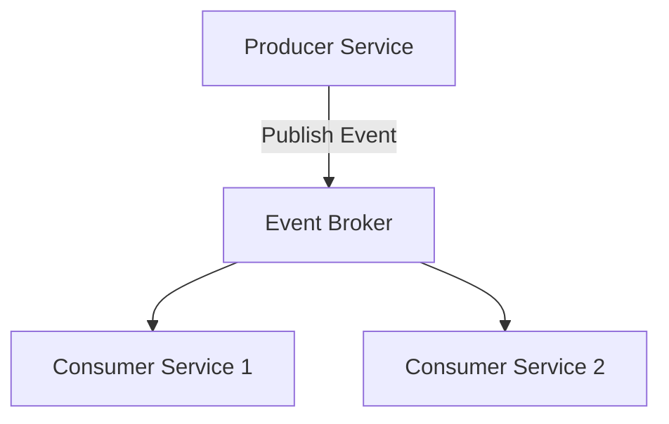
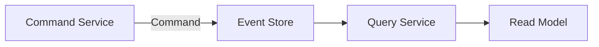
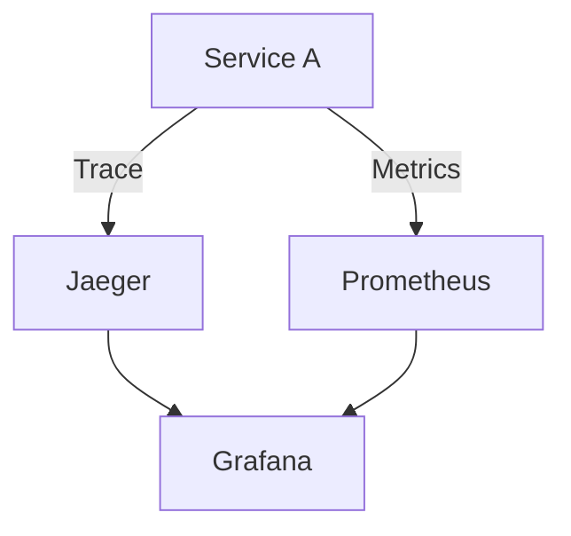

## 16.3.2 Building Reactive Microservices

In the rapidly evolving landscape of software architecture, reactive microservices have emerged as a powerful paradigm for building scalable, resilient, and responsive systems. This section delves into the core principles and practices of building reactive microservices, focusing on asynchronous communication, loose coupling, and the adoption of reactive frameworks. We will explore how to implement backpressure mechanisms, ensure fault tolerance, and establish event-driven data flows. Additionally, we will discuss monitoring and testing strategies to ensure the robustness of reactive microservices.

### Designing for Asynchronous Communication

Asynchronous communication is a cornerstone of reactive microservices, enabling non-blocking interactions and improving system responsiveness. By decoupling the sender and receiver, asynchronous communication allows microservices to operate independently, enhancing scalability and fault tolerance.

#### Message Queues and Event Streams

Message queues and event streams are fundamental components for implementing asynchronous communication. They act as intermediaries that decouple services, allowing them to communicate without waiting for each other to be ready.

- **Message Queues**: Tools like RabbitMQ and Apache Kafka provide robust messaging capabilities, enabling services to send and receive messages asynchronously. These queues ensure message delivery even if the receiving service is temporarily unavailable.

- **Event Streams**: Event streaming platforms like Apache Kafka and AWS Kinesis facilitate real-time data processing by streaming events between services. This approach is particularly useful for applications requiring real-time analytics or monitoring.

#### RESTful APIs with Asynchronous Features

While RESTful APIs are traditionally synchronous, they can be adapted for asynchronous communication using techniques such as long polling, WebSockets, or Server-Sent Events (SSE). These methods allow clients to receive updates without constantly polling the server, reducing latency and server load.

```java
@RestController
public class ReactiveController {

    @GetMapping(value = "/stream", produces = MediaType.TEXT_EVENT_STREAM_VALUE)
    public Flux<String> streamEvents() {
        return Flux.interval(Duration.ofSeconds(1))
                   .map(sequence -> "Event " + sequence);
    }
}
```

In this example, a Spring WebFlux controller uses SSE to stream events to clients asynchronously.

### Implementing Loose Coupling

Loose coupling is essential for building flexible and resilient microservices. By minimizing direct dependencies, services can evolve independently, reducing the risk of cascading failures.

#### Event-Driven Communication

Event-driven communication is a powerful strategy for achieving loose coupling. By using events to signal changes or actions, services can react to events without needing to know the details of the event source.

- **Publish-Subscribe Model**: In this model, services publish events to a central broker, and interested services subscribe to these events. This decouples the producer and consumer, allowing them to scale independently.



This diagram illustrates a simple publish-subscribe model where a producer service publishes events to an event broker, which then distributes them to consumer services.

### Adopting Reactive Frameworks

Reactive frameworks and libraries provide the tools necessary to build microservices that can handle high concurrency efficiently. These frameworks are designed to support non-blocking operations, making them ideal for reactive microservices.

#### Spring WebFlux

Spring WebFlux is a reactive programming framework that builds on the Spring ecosystem. It provides a non-blocking, event-driven programming model that is well-suited for building reactive microservices.

```java
@Service
public class ReactiveService {

    public Mono<String> getReactiveData() {
        return Mono.just("Reactive Data")
                   .delayElement(Duration.ofSeconds(1));
    }
}
```

In this example, a service method returns a `Mono`, representing a single asynchronous computation that completes with a value.

#### Vert.x and Akka Streams

- **Vert.x**: A toolkit for building reactive applications on the JVM, Vert.x provides a polyglot environment supporting multiple languages and a powerful event bus for inter-service communication.

- **Akka Streams**: Part of the Akka toolkit, Akka Streams provides a powerful API for processing data streams asynchronously, leveraging the actor model for concurrency and resilience.

### Using Backpressure Mechanisms

Backpressure is a critical concept in reactive systems, ensuring that services can handle data flow without being overwhelmed. It allows consumers to signal to producers to slow down or stop sending data when they are unable to process it quickly enough.

#### Implementing Backpressure

Reactive frameworks like Project Reactor and Akka Streams provide built-in support for backpressure, allowing developers to manage data flow effectively.

```java
Flux.range(1, 100)
    .onBackpressureDrop()
    .subscribe(System.out::println);
```

In this example, a `Flux` is configured to drop elements when backpressure is applied, preventing resource exhaustion.

### Ensuring Fault Tolerance and Resilience

Reactive microservices must be designed to handle failures gracefully, ensuring that the system remains responsive even under adverse conditions.

#### Circuit Breakers and Retries

Circuit breakers and retries are essential patterns for managing failures in reactive systems. They prevent cascading failures by temporarily halting requests to a failing service and retrying operations when appropriate.

```java
@Bean
public ReactiveCircuitBreakerFactory reactiveCircuitBreakerFactory() {
    return new ReactiveResilience4JCircuitBreakerFactory();
}
```

This configuration uses Resilience4J to create a reactive circuit breaker, enhancing fault tolerance.

### Implementing Event-Driven Data Flow

Event-driven data flows are central to reactive microservices, enabling real-time processing and data consistency across distributed systems.

#### Event Sourcing and CQRS

- **Event Sourcing**: This pattern involves storing state changes as a sequence of events, allowing systems to reconstruct state by replaying these events.

- **CQRS (Command Query Responsibility Segregation)**: CQRS separates read and write operations, optimizing each for performance and scalability.



This diagram illustrates the flow of commands and queries in a CQRS architecture, with an event store acting as the central repository for state changes.

### Monitoring and Observing Reactive Behaviors

Comprehensive monitoring and observability are crucial for understanding the performance and behavior of reactive microservices. Tools like Jaeger, Prometheus, and Grafana provide insights into system health and performance.

#### Implementing Observability

- **Distributed Tracing**: Tools like Jaeger enable tracing of requests across service boundaries, providing visibility into the flow of data and identifying bottlenecks.

- **Metrics Collection**: Prometheus collects metrics from services, allowing for real-time monitoring and alerting based on predefined thresholds.



This diagram shows how services integrate with observability tools to provide comprehensive monitoring and tracing.

### Testing Reactive Microservices Thoroughly

Testing is a critical aspect of ensuring the reliability and performance of reactive microservices. It involves a combination of unit tests, integration tests, and performance tests.

#### Guidelines for Testing

- **Unit Tests**: Focus on testing individual components in isolation, ensuring that each unit behaves as expected.

- **Integration Tests**: Validate the interactions between services, ensuring that they communicate correctly and handle failures gracefully.

- **Performance Tests**: Assess the system's ability to handle high loads and stress conditions, ensuring that it remains responsive and resilient.

```java
@Test
public void testReactiveService() {
    StepVerifier.create(reactiveService.getReactiveData())
                .expectNext("Reactive Data")
                .verifyComplete();
}
```

In this example, a unit test uses `StepVerifier` to verify the behavior of a reactive service method.

### Conclusion

Building reactive microservices involves embracing asynchronous communication, loose coupling, and event-driven architectures. By adopting reactive frameworks, implementing backpressure mechanisms, and ensuring fault tolerance, developers can create systems that are scalable, resilient, and responsive. Comprehensive monitoring and testing further enhance the reliability of these systems, providing insights into their performance and behavior.

For further exploration, consider diving into the official documentation of frameworks like Spring WebFlux, Vert.x, and Akka Streams. Books such as "Reactive Design Patterns" by Roland Kuhn and "Reactive Programming with Java" by Tomasz Nurkiewicz offer deeper insights into reactive programming principles and practices.

## Quiz Time!



### What is the primary benefit of asynchronous communication in reactive microservices?

- [x] Non-blocking interactions and improved system responsiveness
- [ ] Simplified synchronous processing
- [ ] Reduced need for error handling
- [ ] Increased complexity in service interactions

> **Explanation:** Asynchronous communication allows services to interact without blocking, improving responsiveness and scalability.

### Which of the following tools is commonly used for event streaming in reactive microservices?

- [ ] RabbitMQ
- [x] Apache Kafka
- [ ] RESTful APIs
- [ ] Spring MVC

> **Explanation:** Apache Kafka is widely used for event streaming, enabling real-time data processing and communication between services.

### What is the role of backpressure in reactive systems?

- [x] Managing data flow to prevent resource exhaustion
- [ ] Increasing data processing speed
- [ ] Simplifying service interactions
- [ ] Reducing the need for monitoring

> **Explanation:** Backpressure helps manage data flow, ensuring that services do not become overwhelmed and remain responsive.

### Which reactive framework is part of the Spring ecosystem?

- [x] Spring WebFlux
- [ ] Vert.x
- [ ] Akka Streams
- [ ] Node.js

> **Explanation:** Spring WebFlux is a reactive framework within the Spring ecosystem, designed for building non-blocking applications.

### How does the publish-subscribe model contribute to loose coupling?

- [x] By decoupling producers and consumers through a central broker
- [ ] By requiring direct communication between services
- [ ] By simplifying data processing
- [ ] By increasing dependency on synchronous calls

> **Explanation:** The publish-subscribe model decouples producers and consumers, allowing them to operate independently and scale separately.

### What is the purpose of a circuit breaker in reactive microservices?

- [x] To prevent cascading failures by halting requests to a failing service
- [ ] To increase the speed of service interactions
- [ ] To simplify data processing
- [ ] To reduce the need for error handling

> **Explanation:** Circuit breakers prevent cascading failures by temporarily stopping requests to a service that is experiencing issues.

### Which pattern involves storing state changes as a sequence of events?

- [x] Event Sourcing
- [ ] CQRS
- [ ] Publish-Subscribe
- [ ] RESTful APIs

> **Explanation:** Event Sourcing stores state changes as events, allowing systems to reconstruct state by replaying these events.

### What is a key advantage of using distributed tracing in reactive microservices?

- [x] Providing visibility into the flow of requests across service boundaries
- [ ] Simplifying service interactions
- [ ] Reducing the need for monitoring
- [ ] Increasing data processing speed

> **Explanation:** Distributed tracing provides insights into how requests flow through a system, helping identify bottlenecks and performance issues.

### Which tool is commonly used for collecting metrics in reactive microservices?

- [ ] Jaeger
- [x] Prometheus
- [ ] Grafana
- [ ] Akka Streams

> **Explanation:** Prometheus is a popular tool for collecting metrics, enabling real-time monitoring and alerting based on predefined thresholds.

### True or False: Reactive microservices should rely heavily on synchronous communication to ensure consistency.

- [ ] True
- [x] False

> **Explanation:** Reactive microservices should use asynchronous communication to enhance scalability and resilience, rather than relying on synchronous interactions.


