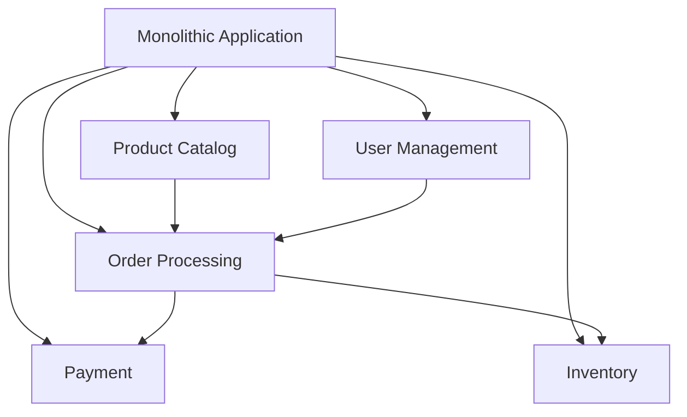
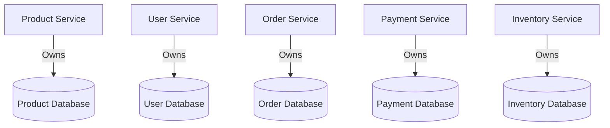

## 17.1.1 Decomposition and Design

Transforming a monolithic e-commerce platform into a microservices architecture is a strategic endeavor that requires careful planning and execution. This section delves into the decomposition and design process, offering insights into how to effectively break down a monolithic system into manageable, scalable microservices.

### Analyzing the Monolithic Structure

The first step in the transformation process is a thorough analysis of the existing monolithic e-commerce platform. This involves identifying tightly coupled components and dependencies that hinder scalability and maintainability. A typical monolithic e-commerce application might include modules for product catalog, user management, order processing, payment, and inventory, all intertwined within a single codebase.

#### Identifying Tightly Coupled Components

To identify tightly coupled components, examine the codebase for modules that frequently interact with each other. Look for shared data models, common utility functions, and cross-cutting concerns that are not well isolated. Tools such as static code analyzers and dependency graphs can be invaluable in this phase.



### Identifying Microservices Boundaries

Once the monolithic structure is understood, the next step is to define clear boundaries for each microservice. This is typically done based on business domains, ensuring that each service encapsulates a specific business capability.

#### Business Domain Analysis

Conduct a business domain analysis to identify distinct areas such as:

- **Product Catalog:** Manages product listings, categories, and search functionalities.
- **User Management:** Handles user registration, authentication, and profile management.
- **Order Processing:** Manages order creation, status tracking, and history.
- **Payment:** Processes payments and handles transaction security.
- **Inventory:** Tracks stock levels and manages restocking processes.

### Designing APIs for Inter-Service Communication

With boundaries established, design APIs that facilitate communication between microservices. These APIs should be well-defined, adhering to RESTful principles or using gRPC for performance-critical interactions.

#### RESTful API Design

For most interactions, RESTful APIs are suitable due to their simplicity and widespread adoption. Ensure that each API is designed with clear endpoints, HTTP methods, and status codes.

```java
// Example of a RESTful API endpoint in Java using Spring Boot
@RestController
@RequestMapping("/products")
public class ProductController {

    @GetMapping("/{id}")
    public ResponseEntity<Product> getProductById(@PathVariable Long id) {
        // Logic to retrieve product by ID
        return ResponseEntity.ok(productService.findById(id));
    }

    @PostMapping
    public ResponseEntity<Product> createProduct(@RequestBody Product product) {
        // Logic to create a new product
        return ResponseEntity.status(HttpStatus.CREATED).body(productService.save(product));
    }
}
```

#### gRPC for Performance-Critical Interactions

For high-performance needs, such as real-time inventory updates, consider using gRPC, which offers efficient binary serialization and supports streaming.

### Implementing Data Ownership

Assign distinct databases to each microservice to ensure data encapsulation and reduce inter-service dependencies. This promotes autonomy and allows each service to scale independently.

#### Database per Service Pattern

Each microservice should have its own database, tailored to its specific data needs. This pattern enhances data ownership and reduces the risk of data contention.



### Adopting Domain-Driven Design (DDD)

Utilize Domain-Driven Design principles to model business domains accurately. This ensures that each microservice aligns closely with specific business capabilities and processes.

#### Bounded Contexts

Define bounded contexts for each microservice, ensuring that the domain model is consistent within the context but may vary across different services.

### Planning for Service Isolation

Ensure that each microservice operates independently, handling its own lifecycle, deployments, and scaling. This isolation prevents one service's issues from impacting others.

#### Independent Deployment

Adopt continuous integration and continuous deployment (CI/CD) practices to enable independent deployment of services. This allows for rapid iteration and scaling.

### Incorporating Resilience Patterns

Integrate resilience patterns such as circuit breakers, retries, and fallbacks within each microservice to enhance fault tolerance and maintain system stability.

#### Circuit Breaker Pattern

Implement circuit breakers to prevent cascading failures by temporarily blocking requests to a failing service.

```java
// Example using Resilience4j Circuit Breaker
CircuitBreakerConfig config = CircuitBreakerConfig.custom()
    .failureRateThreshold(50)
    .waitDurationInOpenState(Duration.ofMillis(1000))
    .build();

CircuitBreakerRegistry registry = CircuitBreakerRegistry.of(config);
CircuitBreaker circuitBreaker = registry.circuitBreaker("productService");

Supplier<Product> decoratedSupplier = CircuitBreaker.decorateSupplier(circuitBreaker, () -> productService.findById(id));
```

### Developing Comprehensive Documentation

Maintain detailed documentation for the microservices architecture, including service responsibilities, API contracts, data models, and interaction flows. This facilitates collaboration and onboarding.

#### Documentation Best Practices

- **API Documentation:** Use tools like Swagger/OpenAPI to generate interactive API documentation.
- **Service Contracts:** Clearly define service contracts and ensure they are versioned and maintained.
- **Data Models:** Document data models and schemas for each service's database.

### Conclusion

Decomposing a monolithic e-commerce platform into microservices requires a strategic approach that considers business domains, data ownership, and resilience. By following these guidelines, organizations can achieve a scalable, maintainable architecture that supports rapid innovation and growth.

## Quiz Time!



### What is the first step in transforming a monolithic application into microservices?

- [x] Analyzing the existing monolithic structure
- [ ] Designing APIs for inter-service communication
- [ ] Implementing data ownership
- [ ] Incorporating resilience patterns

> **Explanation:** The first step is to analyze the existing monolithic structure to understand its components and dependencies.

### Which principle helps in defining microservice boundaries?

- [x] Business domain analysis
- [ ] API design
- [ ] Data ownership
- [ ] Service isolation

> **Explanation:** Business domain analysis helps in identifying distinct areas that can be transformed into microservices.

### What is a key benefit of assigning distinct databases to each microservice?

- [x] Data encapsulation and autonomy
- [ ] Simplified API design
- [ ] Reduced need for resilience patterns
- [ ] Easier monolithic integration

> **Explanation:** Distinct databases ensure data encapsulation and autonomy, allowing services to scale independently.

### Which design pattern is used to prevent cascading failures in microservices?

- [x] Circuit Breaker Pattern
- [ ] Adapter Pattern
- [ ] Proxy Pattern
- [ ] Aggregator Pattern

> **Explanation:** The Circuit Breaker Pattern is used to prevent cascading failures by blocking requests to a failing service.

### What is the purpose of using gRPC in microservices?

- [x] For performance-critical interactions
- [ ] To simplify API design
- [ ] To enhance data ownership
- [ ] For easier documentation

> **Explanation:** gRPC is used for performance-critical interactions due to its efficient binary serialization.

### What is a bounded context in Domain-Driven Design?

- [x] A specific domain model within a microservice
- [ ] A shared database across services
- [ ] An API design principle
- [ ] A resilience pattern

> **Explanation:** A bounded context is a specific domain model within a microservice, ensuring consistency within the context.

### Why is independent deployment important in microservices?

- [x] It allows for rapid iteration and scaling
- [ ] It simplifies API design
- [ ] It enhances data ownership
- [ ] It reduces the need for documentation

> **Explanation:** Independent deployment allows for rapid iteration and scaling, enabling services to evolve independently.

### Which tool can be used to generate interactive API documentation?

- [x] Swagger/OpenAPI
- [ ] Resilience4j
- [ ] Docker
- [ ] Kubernetes

> **Explanation:** Swagger/OpenAPI is used to generate interactive API documentation, facilitating understanding and collaboration.

### What is the role of resilience patterns in microservices?

- [x] To enhance fault tolerance and maintain stability
- [ ] To simplify API design
- [ ] To ensure data ownership
- [ ] To define service boundaries

> **Explanation:** Resilience patterns enhance fault tolerance and maintain stability by handling failures gracefully.

### True or False: Each microservice should have its own database to ensure autonomy.

- [x] True
- [ ] False

> **Explanation:** True. Each microservice should have its own database to ensure autonomy and reduce dependencies.


