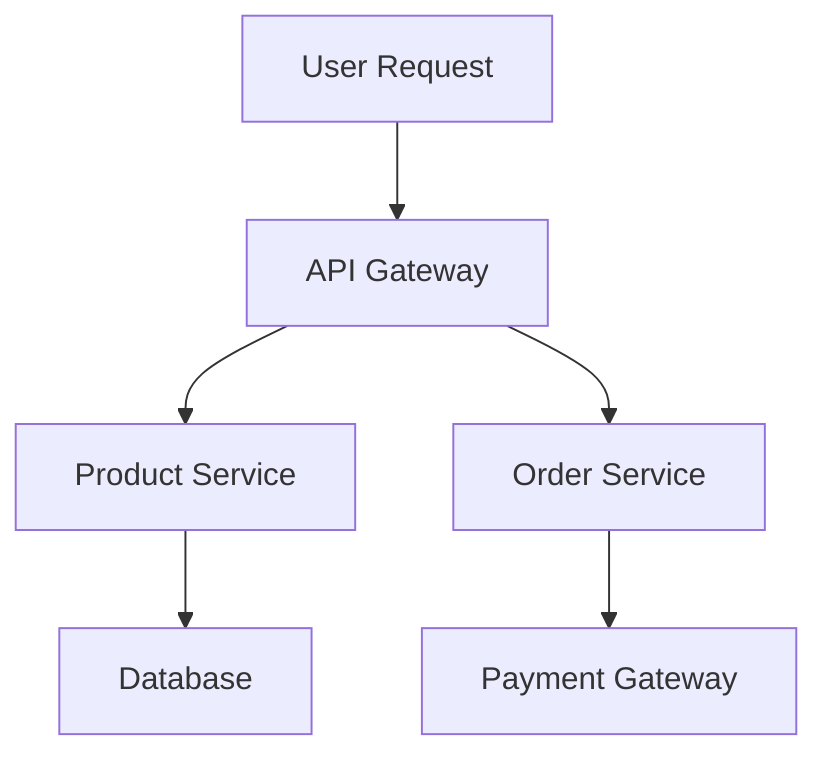
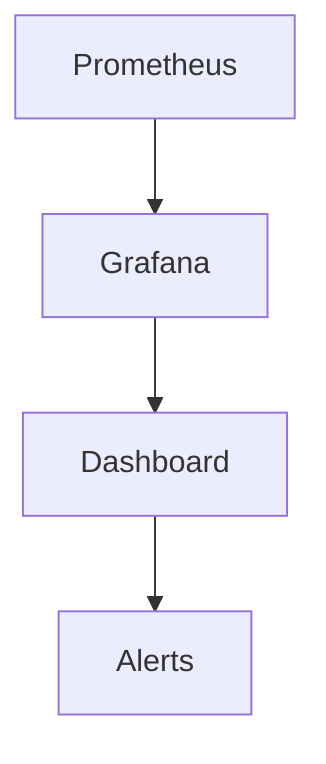

---

linkTitle: "17.1.2 Implementing Scalability"
title: "Implementing Scalability in E-Commerce Platforms: A Microservices Approach"
description: "Explore strategies for implementing scalability in e-commerce platforms using microservices, including auto-scaling, load balancing, resource optimization, and more."
categories:
- Microservices
- Scalability
- E-Commerce
tags:
- Microservices
- Scalability
- E-Commerce
- Auto-Scaling
- Load Balancing
date: 2024-10-25
type: docs
nav_weight: 17120

---

## 17.1.2 Implementing Scalability

In the ever-evolving landscape of e-commerce, scalability is not just a luxury—it's a necessity. As consumer demands fluctuate, e-commerce platforms must be able to handle varying loads efficiently. Implementing scalability in a microservices architecture involves several key strategies, each contributing to a robust and flexible system. This section delves into these strategies, providing practical insights and examples to help you build scalable e-commerce platforms.

### Leverage Auto-Scaling

Auto-scaling is a cornerstone of scalability in microservices. It allows your system to dynamically adjust the number of service instances based on real-time demand and performance metrics. This ensures that your platform can handle peak loads without over-provisioning resources during low-demand periods.

#### Cloud Provider Auto-Scaling

Most cloud providers offer auto-scaling features. For instance, AWS Auto Scaling can automatically adjust the number of EC2 instances in response to traffic patterns. Similarly, Kubernetes' Horizontal Pod Autoscaler can scale the number of pods in a deployment based on observed CPU utilization or other select metrics.

**Example: AWS Auto Scaling**

```java
// AWS SDK for Java example to configure auto-scaling
import software.amazon.awssdk.services.autoscaling.AutoScalingClient;
import software.amazon.awssdk.services.autoscaling.model.*;

public class AutoScalingExample {
    public static void main(String[] args) {
        AutoScalingClient autoScalingClient = AutoScalingClient.builder().build();

        PutScalingPolicyRequest request = PutScalingPolicyRequest.builder()
            .autoScalingGroupName("my-auto-scaling-group")
            .policyName("scale-out")
            .adjustmentType("ChangeInCapacity")
            .scalingAdjustment(2)
            .build();

        PutScalingPolicyResponse response = autoScalingClient.putScalingPolicy(request);
        System.out.println("Scaling Policy ARN: " + response.policyARN());
    }
}
```

This Java snippet demonstrates how to configure an auto-scaling policy using AWS SDK. It sets up a policy to increase the capacity of an auto-scaling group by two instances when triggered.

### Implement Load Balancing

Load balancing is essential for distributing incoming traffic evenly across microservice instances, preventing any single instance from becoming a bottleneck. This not only improves performance but also enhances fault tolerance.

#### Load Balancing Solutions

Tools like NGINX, HAProxy, and AWS Elastic Load Balancing are popular choices for implementing load balancing in microservices architectures. They can distribute HTTP requests, TCP traffic, and more, ensuring efficient resource utilization.

**Example: NGINX Configuration**

```nginx
http {
    upstream my_app {
        server app1.example.com;
        server app2.example.com;
        server app3.example.com;
    }

    server {
        listen 80;

        location / {
            proxy_pass http://my_app;
        }
    }
}
```

This NGINX configuration sets up a simple load balancer that distributes requests among three backend servers. By using `upstream`, NGINX can efficiently manage traffic distribution.

### Optimize Resource Allocation

Efficient resource allocation is critical for maintaining performance and cost-effectiveness. Continuously monitoring resource usage (CPU, memory, I/O) allows you to optimize resource allocation for each microservice.

#### Monitoring Tools

Tools like Prometheus and Grafana can provide insights into resource usage, helping you identify bottlenecks and optimize accordingly.

**Example: Prometheus Configuration**

```yaml
scrape_configs:
  - job_name: 'my_microservice'
    static_configs:
      - targets: ['localhost:9090']
```

This Prometheus configuration snippet sets up a job to scrape metrics from a microservice running on `localhost:9090`. By analyzing these metrics, you can make informed decisions about resource allocation.

### Use Stateless Services

Designing microservices to be stateless is a fundamental principle for scalability. Stateless services can scale horizontally without the need for maintaining session information, simplifying scaling and improving resilience.

#### Stateless Design

In a stateless design, any instance of a service can handle any request, as there is no dependency on previous interactions. This allows for easy scaling and failover.

**Example: Stateless Service in Java**

```java
@RestController
public class ProductController {

    @GetMapping("/products")
    public List<Product> getProducts() {
        // Fetch products from database
        return productService.getAllProducts();
    }
}
```

This simple REST controller in Java demonstrates a stateless service. Each request to `/products` is independent, allowing the service to scale easily.

### Adopt Containerization

Containerization with tools like Docker and orchestration platforms like Kubernetes ensures consistent deployments, easy scaling, and efficient resource management.

#### Docker and Kubernetes

Docker containers encapsulate microservices, providing a consistent environment across development and production. Kubernetes orchestrates these containers, managing scaling, load balancing, and more.

**Example: Kubernetes Deployment**

```yaml
apiVersion: apps/v1
kind: Deployment
metadata:
  name: my-microservice
spec:
  replicas: 3
  selector:
    matchLabels:
      app: my-microservice
  template:
    metadata:
      labels:
        app: my-microservice
    spec:
      containers:
      - name: my-microservice
        image: my-microservice-image:latest
```

This Kubernetes deployment configuration specifies a microservice with three replicas, ensuring that the service can handle increased load by distributing requests across multiple instances.

### Implement Caching Strategies

Caching is a powerful technique to reduce latency and offload repetitive data fetching tasks, enhancing the scalability and performance of microservices.

#### Caching Tools

Redis and Memcached are popular caching solutions that can be integrated into your microservices architecture to store frequently accessed data.

**Example: Redis Caching in Java**

```java
import redis.clients.jedis.Jedis;

public class CacheExample {
    public static void main(String[] args) {
        Jedis jedis = new Jedis("localhost");
        jedis.set("product:123", "Product Details");
        String productDetails = jedis.get("product:123");
        System.out.println("Cached Product Details: " + productDetails);
    }
}
```

This Java example demonstrates how to use Redis to cache product details, reducing the need to repeatedly fetch the same data from a database.

### Design for Elasticity

Elasticity ensures that microservices can handle varying loads gracefully, supporting both scaling up during peak times and scaling down during low demand periods to optimize costs.

#### Elastic Design Principles

Design microservices to be modular and decoupled, allowing for independent scaling and deployment. Use asynchronous communication where possible to decouple services further.

**Example: Elastic Design**



This diagram illustrates an elastic design where the API Gateway routes requests to different services, each of which can scale independently based on demand.

### Monitor and Analyze Performance

Implementing comprehensive monitoring and performance analysis tools is crucial for gaining insights into system behavior under different loads, enabling proactive scalability adjustments.

#### Monitoring Tools

Prometheus and Grafana are widely used for monitoring and visualizing system performance. They provide real-time insights into metrics, helping you identify and address performance bottlenecks.

**Example: Grafana Dashboard**



This diagram shows how Prometheus collects metrics, which are then visualized in Grafana dashboards. Alerts can be configured to notify you of performance issues.

### Conclusion

Implementing scalability in an e-commerce platform using microservices involves a combination of strategies, from auto-scaling and load balancing to caching and monitoring. By leveraging these techniques, you can build a robust, flexible system capable of handling varying loads efficiently. Remember, the key to successful scalability lies in continuous monitoring and optimization, ensuring that your platform can meet the demands of your users while maintaining performance and cost-effectiveness.

## Quiz Time!



### Which tool is commonly used for auto-scaling in Kubernetes?

- [ ] NGINX
- [ ] Redis
- [x] Horizontal Pod Autoscaler
- [ ] HAProxy

> **Explanation:** The Horizontal Pod Autoscaler is used in Kubernetes to automatically scale the number of pods in a deployment based on observed metrics.

### What is the primary benefit of using stateless services in microservices architecture?

- [x] Easier horizontal scaling
- [ ] Improved security
- [ ] Reduced development time
- [ ] Enhanced data consistency

> **Explanation:** Stateless services can be easily scaled horizontally because they do not rely on session information, allowing any instance to handle any request.

### Which of the following is a popular caching solution for microservices?

- [ ] Prometheus
- [x] Redis
- [ ] Grafana
- [ ] Kubernetes

> **Explanation:** Redis is a popular in-memory data structure store used as a caching solution to enhance the performance of microservices.

### What is the role of a load balancer in a microservices architecture?

- [ ] To store session data
- [x] To distribute incoming traffic evenly
- [ ] To manage database connections
- [ ] To encrypt data

> **Explanation:** A load balancer distributes incoming traffic evenly across multiple service instances, preventing any single instance from becoming a bottleneck.

### Which tool is used for visualizing metrics collected by Prometheus?

- [ ] Redis
- [ ] Docker
- [x] Grafana
- [ ] HAProxy

> **Explanation:** Grafana is used for visualizing metrics collected by Prometheus, providing real-time insights into system performance.

### What is a key advantage of containerizing microservices?

- [ ] Increased memory usage
- [ ] Simplified database management
- [x] Consistent deployments
- [ ] Enhanced security

> **Explanation:** Containerizing microservices ensures consistent deployments across different environments, making it easier to manage and scale applications.

### Which of the following is a strategy for optimizing resource allocation in microservices?

- [ ] Using more servers
- [ ] Increasing memory limits
- [x] Monitoring CPU and memory usage
- [ ] Disabling auto-scaling

> **Explanation:** Monitoring CPU and memory usage helps optimize resource allocation, ensuring efficient utilization and preventing over-provisioning.

### What does the term "elasticity" refer to in the context of microservices?

- [ ] The ability to store large amounts of data
- [x] The ability to scale up and down based on demand
- [ ] The ability to encrypt data
- [ ] The ability to handle multiple requests simultaneously

> **Explanation:** Elasticity refers to the ability of a system to scale up during peak times and scale down during low demand periods, optimizing resource usage.

### Which configuration tool is used to set up a job to scrape metrics in Prometheus?

- [ ] Docker
- [ ] Redis
- [x] YAML
- [ ] NGINX

> **Explanation:** YAML is used to configure jobs in Prometheus for scraping metrics from different targets.

### True or False: Stateless services require maintaining session information.

- [ ] True
- [x] False

> **Explanation:** Stateless services do not require maintaining session information, which allows them to scale horizontally more easily.


