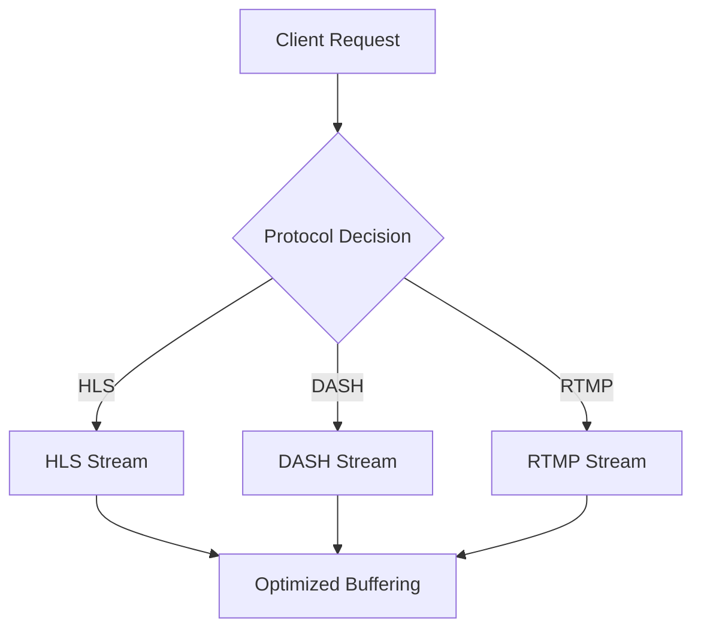
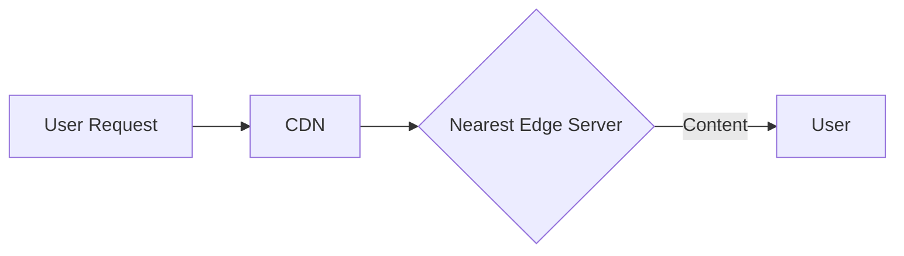

## 17.3.3 Performance Improvements

In the rapidly evolving world of media streaming, performance is a critical factor that can make or break user experience. As media consumption continues to grow, ensuring that your streaming service is optimized for performance is paramount. This section delves into various strategies and techniques to enhance the performance of media streaming services, focusing on key areas such as benchmarking, protocol optimization, adaptive bitrate streaming, and more.

### Conduct Performance Benchmarking

Performance benchmarking is the first step in identifying bottlenecks and areas for optimization. By using tools like JMeter, Locust, or Gatling, you can simulate user load and measure the performance of your streaming service under different conditions.

**Steps for Effective Benchmarking:**

1. **Define Performance Metrics:** Identify key performance indicators (KPIs) such as latency, throughput, error rates, and buffering times.
2. **Simulate Real-World Scenarios:** Use tools to simulate various user scenarios, including peak traffic conditions.
3. **Analyze Results:** Identify patterns and bottlenecks from the collected data.
4. **Iterate and Improve:** Use insights to guide optimization efforts and re-test to measure improvements.

```java
// Example of a simple JMeter test plan setup
public class JMeterTestPlan {
    public static void main(String[] args) {
        // Configure JMeter test plan
        StandardJMeterEngine jmeter = new StandardJMeterEngine();
        HashTree testPlanTree = new HashTree();

        // Add HTTP request sampler
        HTTPSamplerProxy httpSampler = new HTTPSamplerProxy();
        httpSampler.setDomain("example.com");
        httpSampler.setPort(80);
        httpSampler.setPath("/stream");
        httpSampler.setMethod("GET");

        // Add a thread group
        ThreadGroup threadGroup = new ThreadGroup();
        threadGroup.setNumThreads(100); // Simulate 100 concurrent users
        threadGroup.setRampUp(10); // Ramp up over 10 seconds

        // Add elements to test plan
        testPlanTree.add(threadGroup, httpSampler);

        // Run the test
        jmeter.configure(testPlanTree);
        jmeter.run();
    }
}
```

### Optimize Streaming Protocols

Optimizing streaming protocols such as HLS, DASH, and RTMP can significantly reduce buffering times and improve video quality. These protocols need to be configured to handle varying network conditions efficiently.

**Key Optimization Techniques:**

- **Segment Size Tuning:** Adjust segment sizes to balance between startup delay and buffering.
- **Protocol Selection:** Choose the appropriate protocol based on the target audience and device capabilities.
- **Network Adaptation:** Implement logic to adapt to changing network conditions dynamically.



### Implement Adaptive Bitrate Streaming

Adaptive bitrate streaming (ABR) is essential for maintaining video quality across different network conditions and device capabilities. ABR adjusts the video quality in real-time, ensuring a seamless viewing experience.

**Implementation Steps:**

1. **Analyze Bandwidth:** Continuously monitor the user's bandwidth and device capabilities.
2. **Switch Bitrates:** Dynamically switch between different bitrate streams based on the analysis.
3. **Minimize Interruptions:** Ensure smooth transitions between bitrates to avoid playback interruptions.

```java
// Pseudocode for adaptive bitrate streaming
public class AdaptiveBitrateStreaming {
    private int currentBitrate;
    private List<Integer> availableBitrates;

    public void adjustBitrate(int currentBandwidth) {
        for (int bitrate : availableBitrates) {
            if (bitrate <= currentBandwidth) {
                currentBitrate = bitrate;
                break;
            }
        }
        // Switch stream to currentBitrate
    }
}
```

### Use Efficient Data Storage Solutions

Efficient data storage solutions are crucial for managing large volumes of media content. Distributed storage systems like Amazon S3 or Google Cloud Storage offer scalability and high availability.

**Best Practices:**

- **Data Partitioning:** Distribute data across multiple storage nodes to enhance access speed.
- **Caching Strategies:** Implement caching to reduce latency and improve access times.
- **Redundancy and Replication:** Ensure data redundancy to prevent data loss and improve availability.

### Adopt Microservice Optimization Techniques

Optimizing individual microservices is vital for overall system performance. Techniques such as code profiling, memory management, and concurrency handling can minimize latency and improve efficiency.

**Optimization Guidelines:**

- **Code Profiling:** Use tools like VisualVM or JProfiler to identify performance bottlenecks in your code.
- **Memory Management:** Optimize memory usage to prevent leaks and reduce garbage collection overhead.
- **Concurrency Handling:** Implement efficient concurrency models to handle multiple requests simultaneously.

```java
// Example of optimizing a microservice with concurrency
public class StreamingService {
    private ExecutorService executor = Executors.newFixedThreadPool(10);

    public void streamVideo(String videoId) {
        executor.submit(() -> {
            // Stream video logic
        });
    }
}
```

### Implement Content Delivery Optimization

Content delivery optimization involves leveraging Content Delivery Networks (CDNs) and geolocation-based content distribution to minimize the distance between users and content servers.

**Strategies for Optimization:**

- **CDN Integration:** Use CDNs to cache content closer to users, reducing latency.
- **Geolocation-Based Distribution:** Distribute content based on user location to optimize delivery paths.
- **Load Balancing:** Implement load balancing to distribute traffic evenly across servers.



### Enhance Monitoring and Analytics

Enhancing monitoring and analytics capabilities provides deeper insights into service performance, user behavior, and media consumption patterns. Tools like Prometheus, Grafana, or New Relic can be used for this purpose.

**Key Monitoring Aspects:**

- **Real-Time Metrics:** Collect and analyze metrics in real-time to identify performance issues quickly.
- **User Behavior Analysis:** Understand user interactions and preferences to optimize content delivery.
- **Alerting and Reporting:** Set up alerts for critical performance thresholds and generate reports for analysis.

### Conduct Continuous Performance Testing

Continuous performance testing ensures that performance improvements are validated regularly and that the system remains optimized under evolving conditions. Integrating performance tests into the CI/CD pipeline is crucial.

**Steps for Continuous Testing:**

1. **Automate Tests:** Use tools like Jenkins or GitLab CI to automate performance tests.
2. **Integrate with CI/CD:** Ensure tests run automatically with every code change.
3. **Analyze Results:** Continuously analyze test results to identify and address performance regressions.

```java
// Example of integrating performance testing in CI/CD pipeline
pipeline {
    agent any
    stages {
        stage('Build') {
            steps {
                // Build application
            }
        }
        stage('Test') {
            steps {
                // Run unit and integration tests
            }
        }
        stage('Performance Test') {
            steps {
                // Run performance tests
                sh 'jmeter -n -t testplan.jmx -l results.jtl'
            }
        }
    }
}
```

By implementing these strategies, media streaming services can achieve significant performance improvements, ensuring a high-quality user experience even during peak traffic periods. Continuous monitoring, testing, and optimization are key to maintaining these improvements over time.

## Quiz Time!



### What is the first step in improving the performance of a media streaming service?

- [x] Conducting performance benchmarking
- [ ] Implementing adaptive bitrate streaming
- [ ] Optimizing streaming protocols
- [ ] Enhancing monitoring and analytics

> **Explanation:** Conducting performance benchmarking is essential to identify bottlenecks and areas for optimization before implementing other improvements.

### Which tool is commonly used for performance benchmarking in media streaming services?

- [ ] VisualVM
- [x] JMeter
- [ ] Prometheus
- [ ] Jenkins

> **Explanation:** JMeter is a popular tool for performance benchmarking, allowing you to simulate user load and measure service performance.

### What is the purpose of adaptive bitrate streaming?

- [ ] To reduce data storage costs
- [x] To adjust video quality based on user bandwidth
- [ ] To enhance monitoring capabilities
- [ ] To optimize streaming protocols

> **Explanation:** Adaptive bitrate streaming adjusts video quality in real-time based on user bandwidth and device capabilities, ensuring a seamless viewing experience.

### Which of the following is a benefit of using CDNs in content delivery optimization?

- [ ] Increased data storage costs
- [ ] Higher latency
- [x] Reduced latency
- [ ] Increased buffering times

> **Explanation:** CDNs cache content closer to users, reducing latency and improving content delivery speed.

### What is a key benefit of using distributed storage systems like Amazon S3?

- [ ] Reduced data redundancy
- [x] High availability and scalability
- [ ] Increased latency
- [ ] Limited data access

> **Explanation:** Distributed storage systems like Amazon S3 offer high availability and scalability, making them ideal for managing large volumes of media content.

### Which tool is used for code profiling to identify performance bottlenecks?

- [x] VisualVM
- [ ] JMeter
- [ ] Jenkins
- [ ] Prometheus

> **Explanation:** VisualVM is a tool used for code profiling, helping to identify performance bottlenecks in Java applications.

### What is the role of geolocation-based content distribution in content delivery optimization?

- [ ] To increase data storage costs
- [x] To optimize delivery paths based on user location
- [ ] To reduce monitoring capabilities
- [ ] To enhance protocol optimization

> **Explanation:** Geolocation-based content distribution optimizes delivery paths by distributing content based on user location, reducing latency.

### Why is continuous performance testing important in a CI/CD pipeline?

- [ ] To increase deployment times
- [ ] To reduce test coverage
- [x] To validate performance improvements regularly
- [ ] To limit code changes

> **Explanation:** Continuous performance testing ensures that performance improvements are validated regularly, maintaining system optimization under evolving conditions.

### Which tool can be used for real-time metrics collection and analysis?

- [ ] Jenkins
- [ ] JMeter
- [x] Prometheus
- [ ] VisualVM

> **Explanation:** Prometheus is a tool used for real-time metrics collection and analysis, providing insights into service performance.

### True or False: Adaptive bitrate streaming can help reduce buffering times during high traffic periods.

- [x] True
- [ ] False

> **Explanation:** True. Adaptive bitrate streaming adjusts video quality based on network conditions, helping to reduce buffering times during high traffic periods.


