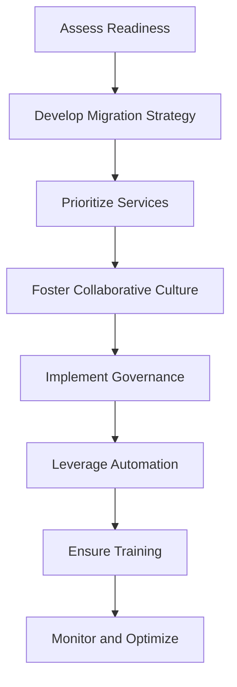

## 17.5.2 Applying to Your Organization

Transitioning to a microservices architecture is a significant undertaking that requires careful planning and execution. This section provides a comprehensive guide to applying microservices design patterns within your organization, ensuring a successful migration that aligns with your business goals and technical capabilities.

### Assess Organizational Readiness

Before embarking on a microservices journey, it's crucial to assess your organization's readiness. This involves evaluating several key factors:

1. **Team Expertise:** Determine whether your team has the necessary skills and experience to design, develop, and maintain microservices. Consider providing training or hiring experts if there are gaps.

2. **Existing Infrastructure:** Analyze your current infrastructure to identify potential bottlenecks or limitations that could affect the migration. Ensure that your infrastructure can support the distributed nature of microservices.

3. **Business Requirements:** Align the migration with your business objectives. Understand the specific needs and challenges of your organization to tailor the microservices architecture accordingly.

4. **Cultural Readiness:** Assess the organizational culture to ensure it supports the collaborative and iterative nature of microservices development.

### Develop a Tailored Migration Strategy

A successful migration strategy is one that is customized to fit your organization's unique context. Here’s how to develop such a strategy:

1. **Identify Key Drivers:** Understand the primary reasons for moving to microservices, such as scalability, agility, or improved deployment frequency.

2. **Select Relevant Patterns:** Choose design patterns that address your specific challenges. For example, if you need to manage complex inter-service communication, consider implementing the API Gateway pattern.

3. **Plan Incremental Migration:** Use patterns like the Strangler Fig to gradually replace parts of your monolithic system with microservices, minimizing risk and disruption.

4. **Incorporate Lessons Learned:** Leverage insights from case studies and past experiences to avoid common pitfalls and apply best practices.

### Prioritize Critical Services

Not all services need to be migrated at once. Prioritize services based on their business impact and technical feasibility:

1. **High-Impact Services:** Focus on services that directly affect customer experience or revenue generation. These should be migrated first to maximize business value.

2. **Technical Dependencies:** Identify services with fewer dependencies to simplify the migration process.

3. **Risk Assessment:** Evaluate the risks associated with migrating each service and prioritize those with manageable risks.

### Foster a Collaborative Culture

Microservices thrive in an environment where collaboration is encouraged. Here’s how to foster such a culture:

1. **Cross-Functional Teams:** Form teams that include members from different disciplines (e.g., development, operations, QA) to promote knowledge sharing and collaboration.

2. **Open Communication:** Encourage open lines of communication across teams to facilitate problem-solving and innovation.

3. **Shared Goals:** Align teams around common objectives to ensure everyone is working towards the same outcomes.

### Implement Robust Governance

Governance is essential to maintain consistency and quality during the migration:

1. **Architectural Standards:** Define and enforce architectural standards to ensure all microservices adhere to best practices.

2. **Security Policies:** Implement security measures to protect data and ensure compliance with regulations.

3. **Compliance Requirements:** Regularly review and update policies to comply with industry standards and legal requirements.

### Leverage Automation and Tooling

Automation is key to efficiently managing microservices:

1. **CI/CD Pipelines:** Implement continuous integration and continuous deployment pipelines to automate testing and deployment processes.

2. **Infrastructure as Code:** Use tools like Terraform or Ansible to manage infrastructure changes programmatically, ensuring consistency and repeatability.

3. **Automated Testing:** Incorporate automated testing frameworks to ensure each microservice functions correctly and integrates well with others.

### Ensure Comprehensive Training and Support

Equip your team with the necessary skills and resources:

1. **Training Programs:** Provide training sessions on microservices architecture, design patterns, and relevant technologies.

2. **Mentorship:** Pair less experienced team members with mentors who can guide them through the migration process.

3. **Resource Availability:** Ensure access to documentation, tools, and support channels to facilitate learning and problem-solving.

### Continuously Monitor and Optimize

Once the migration is underway, continuous monitoring and optimization are crucial:

1. **Observability Tools:** Implement tools like Prometheus, Grafana, or OpenTelemetry to monitor the performance and health of microservices.

2. **Feedback Loops:** Establish feedback mechanisms to gather insights from users and stakeholders, using this data to drive improvements.

3. **Performance Optimization:** Regularly review and optimize microservices to enhance performance, scalability, and reliability.

### Practical Example: Java Code Snippet

To illustrate the application of these principles, consider the following Java code snippet for a simple microservice using Spring Boot:

```java
import org.springframework.boot.SpringApplication;
import org.springframework.boot.autoconfigure.SpringBootApplication;
import org.springframework.web.bind.annotation.GetMapping;
import org.springframework.web.bind.annotation.RestController;

@SpringBootApplication
public class ExampleMicroserviceApplication {

    public static void main(String[] args) {
        SpringApplication.run(ExampleMicroserviceApplication.class, args);
    }
}

@RestController
class ExampleController {

    @GetMapping("/hello")
    public String sayHello() {
        return "Hello, Microservices!";
    }
}
```

This code demonstrates a basic microservice with a RESTful endpoint. It can be expanded with additional features such as database integration, security, and inter-service communication.

### Diagram: Microservices Migration Workflow

Below is a diagram illustrating a typical microservices migration workflow:



This workflow provides a high-level overview of the steps involved in migrating to a microservices architecture.

### Conclusion

Applying microservices design patterns to your organization requires a strategic approach that considers technical, cultural, and business factors. By assessing readiness, developing a tailored strategy, and fostering collaboration, you can successfully transition to a microservices architecture that enhances agility, scalability, and resilience.

## Quiz Time!



### What is the first step in applying microservices design patterns to your organization?

- [x] Assess Organizational Readiness
- [ ] Develop a Tailored Migration Strategy
- [ ] Prioritize Critical Services
- [ ] Implement Robust Governance

> **Explanation:** Assessing organizational readiness is crucial to understand the current capabilities and limitations before proceeding with a migration strategy.

### Why is it important to prioritize critical services during migration?

- [x] To ensure high-impact services are addressed first
- [ ] To migrate all services simultaneously
- [ ] To focus on low-impact services
- [ ] To avoid any service migration

> **Explanation:** Prioritizing critical services ensures that those with the highest business impact are migrated first, maximizing value and minimizing risk.

### What role does fostering a collaborative culture play in microservices migration?

- [x] Encourages cross-functional teamwork and knowledge sharing
- [ ] Ensures strict hierarchical control
- [ ] Limits communication between teams
- [ ] Focuses solely on technical aspects

> **Explanation:** A collaborative culture promotes teamwork and knowledge sharing, which are essential for the success of a microservices migration.

### How can automation and tooling enhance the migration process?

- [x] By streamlining processes and reducing manual effort
- [ ] By increasing manual intervention
- [ ] By complicating the deployment process
- [ ] By eliminating the need for CI/CD pipelines

> **Explanation:** Automation and tooling streamline the migration process by reducing manual effort and ensuring consistency through CI/CD pipelines and infrastructure as code.

### What is the purpose of implementing robust governance during migration?

- [x] To ensure adherence to standards and compliance
- [ ] To eliminate all security policies
- [ ] To reduce oversight and control
- [ ] To focus solely on technical implementation

> **Explanation:** Robust governance ensures that architectural standards, security policies, and compliance requirements are met throughout the migration process.

### Why is continuous monitoring important after migrating to microservices?

- [x] To gain insights and optimize performance
- [ ] To stop all monitoring activities
- [ ] To focus only on initial deployment
- [ ] To ignore user feedback

> **Explanation:** Continuous monitoring provides insights into the performance and health of microservices, allowing for ongoing optimization and improvement.

### What should be included in comprehensive training for teams involved in migration?

- [x] Skills, knowledge, and resources for microservices
- [ ] Only basic programming skills
- [ ] No training is necessary
- [ ] Focus solely on legacy systems

> **Explanation:** Comprehensive training equips teams with the necessary skills, knowledge, and resources to effectively adopt and manage microservices architectures.

### How does the Strangler Fig pattern assist in microservices migration?

- [x] By allowing incremental replacement of monolithic components
- [ ] By requiring a complete system overhaul
- [ ] By focusing on data migration only
- [ ] By ignoring existing systems

> **Explanation:** The Strangler Fig pattern allows for the gradual replacement of monolithic components with microservices, reducing risk and disruption.

### What is the benefit of using infrastructure as code in microservices migration?

- [x] Ensures consistency and repeatability in infrastructure changes
- [ ] Increases manual configuration
- [ ] Eliminates the need for version control
- [ ] Focuses only on application code

> **Explanation:** Infrastructure as code ensures that infrastructure changes are consistent and repeatable, reducing errors and improving efficiency.

### True or False: Microservices migration should be aligned with business objectives.

- [x] True
- [ ] False

> **Explanation:** Aligning microservices migration with business objectives ensures that the architecture supports the organization's strategic goals and delivers maximum value.


