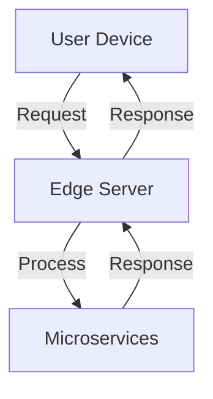
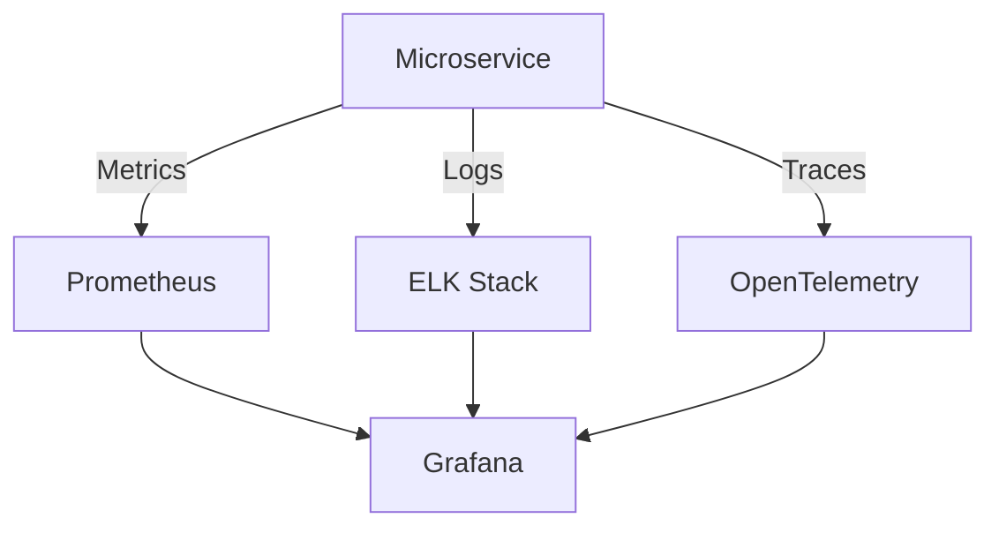

## 17.5.3 Future Considerations

As the landscape of software development continues to evolve, microservices architectures must adapt to stay relevant and effective. This section explores future considerations for microservices, focusing on embracing evolving technologies, enhancing security and compliance, adopting event-driven architectures, investing in observability, promoting continuous learning, planning for scalability, implementing advanced governance practices, and fostering a DevOps culture.

### Embrace Evolving Technologies

The microservices ecosystem is constantly changing, with new technologies and trends emerging that can significantly impact how systems are designed and operated. Embracing these evolving technologies is crucial for staying competitive and innovative.

#### Serverless Computing

Serverless computing offers a paradigm shift in how applications are built and deployed. By abstracting away the underlying infrastructure, serverless allows developers to focus on writing code without worrying about server management. This can lead to faster development cycles and reduced operational overhead.

**Example: AWS Lambda for Event-Driven Microservices**

```java
// AWS Lambda function handler in Java
public class LambdaFunctionHandler implements RequestHandler<SQSEvent, Void> {

    @Override
    public Void handleRequest(SQSEvent event, Context context) {
        for (SQSEvent.SQSMessage msg : event.getRecords()) {
            System.out.println("Message: " + msg.getBody());
            // Process message
        }
        return null;
    }
}
```

In this example, an AWS Lambda function processes messages from an SQS queue, demonstrating how serverless can be used for event-driven microservices.

#### Edge Computing

Edge computing brings computation and data storage closer to the location where it is needed, improving response times and saving bandwidth. This is particularly useful for applications that require real-time processing, such as IoT and autonomous systems.

**Mermaid Diagram: Edge Computing Architecture**



This diagram illustrates how edge servers interact with user devices and microservices to provide low-latency responses.

#### Artificial Intelligence

Integrating AI into microservices can enhance decision-making, automate processes, and provide personalized experiences. AI models can be deployed as microservices, allowing them to scale independently and be reused across different applications.

### Focus on Security and Compliance

As microservices architectures grow in complexity, ensuring security and compliance becomes increasingly important. Organizations must stay vigilant against new threats and adapt to regulatory changes.

#### Security Best Practices

Implementing robust security measures, such as encryption, authentication, and access control, is essential. Regular security audits and penetration testing can help identify vulnerabilities.

**Example: Implementing OAuth 2.0 for Secure API Access**

```java
// Spring Security configuration for OAuth 2.0
@Configuration
@EnableWebSecurity
public class SecurityConfig extends WebSecurityConfigurerAdapter {

    @Override
    protected void configure(HttpSecurity http) throws Exception {
        http
            .authorizeRequests()
            .antMatchers("/api/**").authenticated()
            .and()
            .oauth2Login();
    }
}
```

This configuration secures API endpoints using OAuth 2.0, ensuring that only authenticated users can access them.

#### Compliance with Regulations

Staying compliant with regulations such as GDPR and HIPAA requires careful data management and documentation. Automated compliance checks and policy-as-code can help maintain consistency and reduce the risk of non-compliance.

### Adopt Event-Driven and Reactive Architectures

Event-driven and reactive architectures can enhance the responsiveness, scalability, and resilience of microservices, enabling them to handle complex and dynamic workloads effectively.

#### Event-Driven Architectures

Event-driven architectures decouple services by using events to communicate between them. This allows services to react to changes asynchronously, improving scalability and fault tolerance.

**Example: Using Kafka for Event Streaming**

```java
// Kafka producer example in Java
Properties props = new Properties();
props.put("bootstrap.servers", "localhost:9092");
props.put("key.serializer", "org.apache.kafka.common.serialization.StringSerializer");
props.put("value.serializer", "org.apache.kafka.common.serialization.StringSerializer");

Producer<String, String> producer = new KafkaProducer<>(props);
producer.send(new ProducerRecord<>("my-topic", "key", "value"));
producer.close();
```

This code snippet demonstrates how to produce messages to a Kafka topic, enabling event-driven communication between microservices.

#### Reactive Programming

Reactive programming models systems as a series of asynchronous data streams, allowing them to handle large volumes of data efficiently. Frameworks like Spring WebFlux and Project Reactor provide tools for building reactive microservices.

### Invest in Observability and Monitoring

Continuous investment in observability and monitoring capabilities is essential for maintaining deep insights into system performance, detecting anomalies early, and ensuring reliability and scalability.

#### Observability Tools

Tools like Prometheus, Grafana, and OpenTelemetry provide comprehensive monitoring and tracing capabilities, allowing teams to visualize system performance and identify bottlenecks.

**Mermaid Diagram: Observability Architecture**



This diagram shows how different observability tools integrate to provide a complete view of system performance.

### Promote Continuous Learning and Innovation

Fostering a culture of continuous learning and innovation is vital for keeping teams motivated and ensuring that they are equipped to tackle new challenges.

#### Encouraging Experimentation

Encouraging teams to explore new tools, frameworks, and methodologies can lead to innovative solutions and improvements in the microservices architecture.

#### Training and Development

Providing training and development opportunities helps teams stay up-to-date with the latest technologies and best practices, ensuring that they can effectively implement and maintain microservices.

### Plan for Future Scalability

Planning for future scalability ensures that the microservices architecture remains flexible and adaptable to accommodate growth, increased traffic, and evolving business needs.

#### Scalability Strategies

Implementing strategies such as horizontal scaling, load balancing, and caching can help manage increased demand and ensure that services remain responsive.

**Example: Configuring Horizontal Scaling in Kubernetes**

```yaml
apiVersion: autoscaling/v1
kind: HorizontalPodAutoscaler
metadata:
  name: my-service-hpa
spec:
  scaleTargetRef:
    apiVersion: apps/v1
    kind: Deployment
    name: my-service
  minReplicas: 2
  maxReplicas: 10
  targetCPUUtilizationPercentage: 50
```

This YAML configuration sets up horizontal scaling for a Kubernetes deployment, automatically adjusting the number of replicas based on CPU utilization.

### Implement Advanced Governance Practices

Implementing advanced governance practices, such as policy-as-code and automated compliance checks, helps maintain control and consistency across a rapidly expanding microservices ecosystem.

#### Policy-as-Code

Policy-as-code allows organizations to define and enforce policies programmatically, ensuring that they are consistently applied across all services.

#### Automated Compliance Checks

Automated compliance checks can identify potential issues early, reducing the risk of non-compliance and ensuring that systems adhere to regulatory requirements.

### Foster a DevOps and Collaborative Culture

Fostering a DevOps and collaborative culture ensures that development, operations, and other functional teams work together seamlessly to support the ongoing success and evolution of the microservices architecture.

#### DevOps Practices

Implementing DevOps practices such as continuous integration, continuous delivery, and infrastructure as code can improve collaboration and streamline the development process.

#### Cross-Functional Teams

Encouraging cross-functional teams to work together promotes knowledge sharing and ensures that all aspects of the microservices architecture are considered and optimized.

### Conclusion

By embracing evolving technologies, focusing on security and compliance, adopting event-driven architectures, investing in observability, promoting continuous learning, planning for scalability, implementing advanced governance practices, and fostering a DevOps culture, organizations can ensure that their microservices architectures remain robust, scalable, and adaptable to future challenges.

## Quiz Time!



### What is a key benefit of serverless computing in microservices?

- [x] Reduces operational overhead
- [ ] Increases server management complexity
- [ ] Requires more infrastructure management
- [ ] Limits scalability

> **Explanation:** Serverless computing reduces operational overhead by abstracting away server management, allowing developers to focus on writing code.

### How does edge computing benefit microservices?

- [x] Improves response times
- [ ] Increases bandwidth usage
- [ ] Centralizes data processing
- [ ] Reduces real-time processing capabilities

> **Explanation:** Edge computing improves response times by bringing computation and data storage closer to the location where it is needed.

### Which security measure is essential for securing API endpoints?

- [x] OAuth 2.0
- [ ] Plain text passwords
- [ ] Open access
- [ ] Hardcoded credentials

> **Explanation:** OAuth 2.0 is a widely used security measure for securing API endpoints, ensuring that only authenticated users can access them.

### What is a primary advantage of event-driven architectures?

- [x] Improved scalability and fault tolerance
- [ ] Increased coupling between services
- [ ] Synchronous communication
- [ ] Reduced responsiveness

> **Explanation:** Event-driven architectures improve scalability and fault tolerance by decoupling services and allowing them to react to changes asynchronously.

### Why is investing in observability important for microservices?

- [x] To maintain deep insights into system performance
- [ ] To reduce system monitoring
- [ ] To eliminate the need for logging
- [ ] To increase system complexity

> **Explanation:** Investing in observability is important for maintaining deep insights into system performance, detecting anomalies early, and ensuring reliability.

### What is a benefit of promoting continuous learning within an organization?

- [x] Encourages exploration of new tools and methodologies
- [ ] Limits innovation
- [ ] Reduces team motivation
- [ ] Increases resistance to change

> **Explanation:** Promoting continuous learning encourages teams to explore new tools and methodologies, leading to innovative solutions and improvements.

### How does horizontal scaling benefit microservices?

- [x] Manages increased demand by adjusting the number of replicas
- [ ] Reduces the number of service instances
- [ ] Limits service availability
- [ ] Increases single point of failure

> **Explanation:** Horizontal scaling manages increased demand by adjusting the number of replicas, ensuring that services remain responsive.

### What is the role of policy-as-code in microservices governance?

- [x] Defines and enforces policies programmatically
- [ ] Eliminates the need for policies
- [ ] Increases manual policy enforcement
- [ ] Reduces policy consistency

> **Explanation:** Policy-as-code defines and enforces policies programmatically, ensuring consistent application across all services.

### Why is fostering a DevOps culture important in microservices?

- [x] Improves collaboration and streamlines development
- [ ] Increases siloed work environments
- [ ] Reduces team communication
- [ ] Limits cross-functional collaboration

> **Explanation:** Fostering a DevOps culture improves collaboration and streamlines development, ensuring that development and operations teams work together seamlessly.

### True or False: Automated compliance checks reduce the risk of non-compliance in microservices.

- [x] True
- [ ] False

> **Explanation:** Automated compliance checks reduce the risk of non-compliance by identifying potential issues early and ensuring adherence to regulatory requirements.


