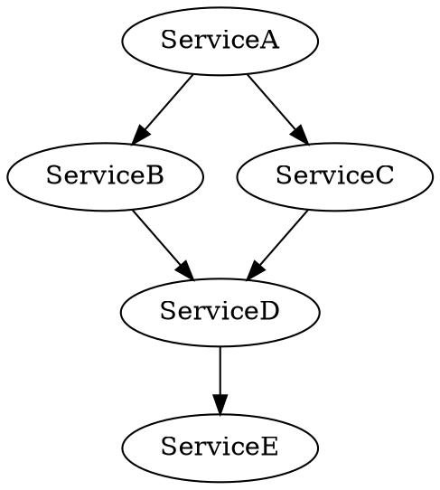

---

linkTitle: "18.3.1 Managing Service Interdependencies"
title: "Managing Service Interdependencies in Microservices"
description: "Explore strategies for managing service interdependencies in microservices architecture, including mapping dependencies, implementing dependency injection, and using service registries for discovery."
categories:
- Microservices
- Software Architecture
- System Design
tags:
- Microservices
- Dependency Management
- Service Discovery
- Loose Coupling
- Communication Patterns
date: 2024-10-25
type: docs
nav_weight: 1831000
---

## 18.3.1 Managing Service Interdependencies

In the realm of microservices, managing service interdependencies is crucial for maintaining a scalable, resilient, and efficient system. As microservices architectures grow, so do the complexities of inter-service communications and dependencies. This section delves into strategies and best practices for effectively managing these interdependencies, ensuring that your microservices ecosystem remains robust and adaptable.

### Map and Visualize Dependencies

Understanding the web of dependencies between microservices is the first step in managing them effectively. Visualization tools like Graphviz, Dependency Maps, or service meshes' built-in tools can help you map out these dependencies, providing a clear picture of how services interact.

#### Using Graphviz for Dependency Mapping

Graphviz is a powerful tool for creating visual representations of service dependencies. By defining services and their interactions in a DOT file, you can generate a graph that highlights the connections between services.



This graph can help identify critical paths, potential bottlenecks, and opportunities for optimization.

#### Service Mesh Visualization

Service meshes like Istio provide built-in tools for visualizing service interactions. They offer real-time insights into traffic flows, latency, and error rates, helping you understand the operational dynamics of your microservices.

### Implement Dependency Injection

Dependency injection (DI) is a design pattern that promotes loose coupling between components, making it easier to manage service interdependencies. By injecting dependencies at runtime rather than hardcoding them, you enhance the flexibility and testability of your services.

#### Dependency Injection in Java

In Java, frameworks like Spring provide robust support for dependency injection. Here's a simple example of how DI can be implemented:

```java
public interface PaymentService {
    void processPayment();
}

public class PayPalService implements PaymentService {
    public void processPayment() {
        // PayPal payment processing logic
    }
}

public class OrderService {
    private final PaymentService paymentService;

    @Autowired
    public OrderService(PaymentService paymentService) {
        this.paymentService = paymentService;
    }

    public void placeOrder() {
        paymentService.processPayment();
        // Order placement logic
    }
}
```

In this example, `OrderService` depends on `PaymentService`, but the specific implementation (`PayPalService`) is injected at runtime, allowing for easy substitution and testing.

### Use Service Registries for Discovery

Service registries play a pivotal role in dynamic service discovery, allowing services to locate and communicate with each other without hardcoded endpoints. Tools like Consul, Eureka, and Istio facilitate this process.

#### Implementing Service Discovery with Eureka

Eureka, a service registry from Netflix, enables dynamic service registration and discovery. Here's a basic setup:

1. **Add Eureka Client Dependency:**

   ```xml
   <dependency>
       <groupId>org.springframework.cloud</groupId>
       <artifactId>spring-cloud-starter-netflix-eureka-client</artifactId>
   </dependency>
   ```

2. **Configure Eureka Client:**

   ```yaml
   eureka:
     client:
       serviceUrl:
         defaultZone: http://localhost:8761/eureka/
   ```

3. **Enable Eureka Client:**

   ```java
   @EnableEurekaClient
   @SpringBootApplication
   public class Application {
       public static void main(String[] args) {
           SpringApplication.run(Application.class, args);
       }
   }
   ```

With Eureka, services can register themselves and discover other services, facilitating seamless inter-service communication.

### Adopt Loose Coupling Frameworks

Loose coupling is essential for reducing the impact of changes or failures in one service on others. By adopting frameworks and practices that promote loose coupling, you enhance the resilience of your system.

#### Strategies for Loose Coupling

- **Event-Driven Architecture:** Use event-driven patterns to decouple services, allowing them to communicate asynchronously through events.
- **API Gateways:** Implement API gateways to abstract service interactions, providing a unified interface for clients and reducing direct dependencies.

### Implement Synchronous and Asynchronous Communication

Choosing the right communication method is critical for managing service interdependencies. Both synchronous and asynchronous communications have their place in a microservices architecture.

#### Synchronous Communication

Synchronous communication, such as REST or gRPC, is suitable for real-time interactions where immediate responses are required. However, it can lead to tight coupling and increased latency.

```java
@RestController
public class OrderController {

    @Autowired
    private OrderService orderService;

    @GetMapping("/order/{id}")
    public ResponseEntity<Order> getOrder(@PathVariable String id) {
        Order order = orderService.getOrderById(id);
        return ResponseEntity.ok(order);
    }
}
```

#### Asynchronous Communication

Asynchronous communication, using messaging systems like RabbitMQ or Kafka, allows services to communicate without waiting for a response, enhancing scalability and resilience.

```java
@Component
public class OrderEventListener {

    @KafkaListener(topics = "order-events", groupId = "order-group")
    public void listen(OrderEvent orderEvent) {
        // Process order event
    }
}
```

### Monitor and Alert on Dependency Health

Monitoring the health of service dependencies is crucial for maintaining system stability. Observability tools like Prometheus, Grafana, and ELK Stack can help you track performance metrics and set up alerts for failures or degradations.

#### Setting Up Alerts with Prometheus

Prometheus can be configured to monitor service health and trigger alerts based on predefined conditions.

```yaml
groups:
- name: service-health
  rules:
  - alert: ServiceDown
    expr: up == 0
    for: 5m
    labels:
      severity: critical
    annotations:
      summary: "Instance {{ $labels.instance }} down"
      description: "{{ $labels.instance }} of job {{ $labels.job }} has been down for more than 5 minutes."
```

### Handle Circular Dependencies

Circular dependencies can lead to deadlocks and increased complexity. Detecting and resolving them is essential for maintaining clean service interactions.

#### Strategies for Resolving Circular Dependencies

- **Bounded Contexts:** Use Domain-Driven Design (DDD) to define clear boundaries and contexts, reducing interdependencies.
- **Dependency Inversion:** Apply the dependency inversion principle to decouple services and break circular dependencies.

### Review and Optimize Dependencies Regularly

Regular reviews and optimizations of service dependencies help simplify and streamline inter-service interactions, reducing complexity and enhancing performance.

#### Best Practices for Dependency Optimization

- **Conduct Dependency Audits:** Regularly audit service dependencies to identify and eliminate unnecessary or redundant interactions.
- **Refactor for Simplicity:** Simplify complex dependency chains by refactoring services and consolidating related functionalities.

### Conclusion

Managing service interdependencies in a microservices architecture requires a strategic approach, leveraging tools and patterns that promote loose coupling, dynamic discovery, and effective communication. By visualizing dependencies, implementing dependency injection, using service registries, and adopting loose coupling frameworks, you can build a resilient and scalable microservices ecosystem. Regular monitoring, alerting, and optimization further ensure that your system remains robust and adaptable to change.

## Quiz Time!



### Which tool can be used to visualize service dependencies in a microservices architecture?

- [x] Graphviz
- [ ] Jenkins
- [ ] Docker
- [ ] Maven

> **Explanation:** Graphviz is a tool used to create visual representations of service dependencies, helping to understand and manage inter-service interactions.

### What is the primary benefit of using dependency injection in microservices?

- [x] Promotes loose coupling and enhances testability
- [ ] Increases service performance
- [ ] Reduces code complexity
- [ ] Simplifies database management

> **Explanation:** Dependency injection promotes loose coupling by allowing dependencies to be injected at runtime, enhancing the flexibility and testability of services.

### Which service registry is commonly used for dynamic service discovery in microservices?

- [x] Eureka
- [ ] Jenkins
- [ ] Docker
- [ ] Maven

> **Explanation:** Eureka is a service registry from Netflix that enables dynamic service registration and discovery, facilitating seamless inter-service communication.

### What is a key advantage of using asynchronous communication in microservices?

- [x] Enhances scalability and resilience
- [ ] Provides immediate responses
- [ ] Simplifies service deployment
- [ ] Reduces network latency

> **Explanation:** Asynchronous communication allows services to communicate without waiting for a response, enhancing scalability and resilience.

### Which observability tool can be used to monitor service health and set up alerts?

- [x] Prometheus
- [ ] Jenkins
- [ ] Docker
- [ ] Maven

> **Explanation:** Prometheus is an observability tool that can monitor service health and trigger alerts based on predefined conditions.

### What is a common strategy for resolving circular dependencies in microservices?

- [x] Use bounded contexts
- [ ] Increase service instances
- [ ] Implement synchronous communication
- [ ] Use a single database

> **Explanation:** Using bounded contexts helps define clear boundaries and contexts, reducing interdependencies and resolving circular dependencies.

### Which communication method is suitable for real-time interactions requiring immediate responses?

- [x] Synchronous communication
- [ ] Asynchronous communication
- [ ] Batch processing
- [ ] File transfer

> **Explanation:** Synchronous communication, such as REST or gRPC, is suitable for real-time interactions where immediate responses are required.

### What is the role of an API gateway in a microservices architecture?

- [x] Abstracts service interactions and provides a unified interface for clients
- [ ] Manages database transactions
- [ ] Monitors service health
- [ ] Deploys microservices

> **Explanation:** An API gateway abstracts service interactions, providing a unified interface for clients and reducing direct dependencies.

### How can service meshes help in managing service interdependencies?

- [x] Provide real-time insights into traffic flows, latency, and error rates
- [ ] Simplify code deployment
- [ ] Increase database performance
- [ ] Reduce network bandwidth

> **Explanation:** Service meshes offer real-time insights into traffic flows, latency, and error rates, helping to understand and manage service interdependencies.

### True or False: Regular reviews and optimizations of service dependencies can reduce complexity and enhance performance.

- [x] True
- [ ] False

> **Explanation:** Regular reviews and optimizations help simplify and streamline inter-service interactions, reducing complexity and enhancing performance.


