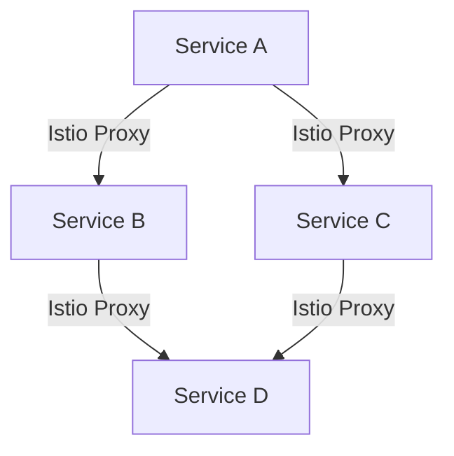
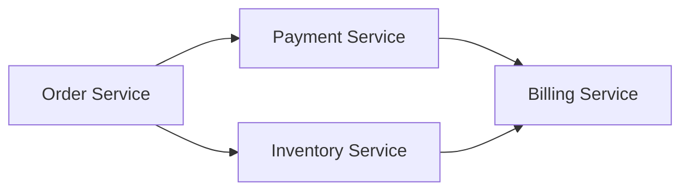
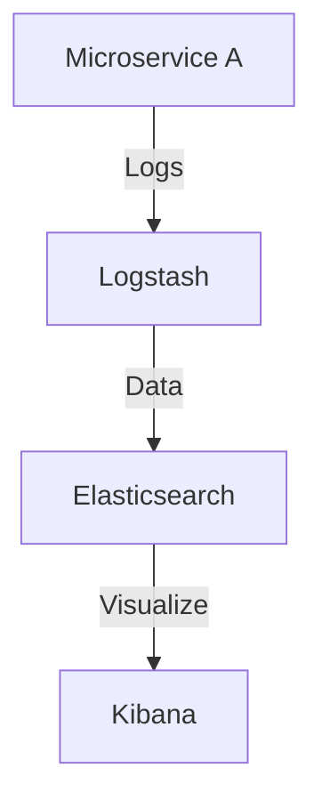

## 18.3.4 Managing System Complexity

In the world of microservices, managing system complexity is a critical challenge that architects and developers must address to ensure scalability, maintainability, and operational efficiency. As systems grow, the intricacies of managing numerous independent services can become overwhelming. This section explores strategies and best practices to effectively manage system complexity in microservices architecture.

### Implement Microservices Orchestration

Microservices orchestration is essential for managing the deployment, scaling, and operation of services. Tools like Kubernetes, Istio, and Apache Mesos provide robust frameworks for automating these processes, reducing operational complexity.

#### Kubernetes: The Orchestration Powerhouse

Kubernetes is a leading orchestration tool that automates the deployment, scaling, and management of containerized applications. It provides a platform for automating deployment, scaling, and operations of application containers across clusters of hosts.

```java
// Example of a Kubernetes Deployment YAML
apiVersion: apps/v1
kind: Deployment
metadata:
  name: my-microservice
spec:
  replicas: 3
  selector:
    matchLabels:
      app: my-microservice
  template:
    metadata:
      labels:
        app: my-microservice
    spec:
      containers:
      - name: my-microservice
        image: my-microservice-image:latest
        ports:
        - containerPort: 8080
```

This YAML file defines a Kubernetes deployment for a microservice, specifying the number of replicas and the container image to use. Kubernetes handles the orchestration, ensuring that the desired state is maintained.

#### Istio: Enhancing Service Management

Istio is a service mesh that provides a uniform way to secure, connect, and observe microservices. It simplifies the complexities of managing service-to-service communication, traffic routing, and security.



In this diagram, Istio proxies manage the communication between services, providing traffic management, security, and observability.

### Use Service Mesh for Communication Management

Service meshes like Istio and Linkerd provide a dedicated infrastructure layer for handling service-to-service communication. They offer features like traffic management, security, and observability, which are crucial for managing the complexity of microservices interactions.

#### Traffic Management and Security

Service meshes allow for sophisticated traffic routing and security policies, enabling fine-grained control over how requests are handled and secured.

```java
// Example of an Istio VirtualService for traffic routing
apiVersion: networking.istio.io/v1alpha3
kind: VirtualService
metadata:
  name: my-microservice
spec:
  hosts:
  - my-microservice
  http:
  - route:
    - destination:
        host: my-microservice
        subset: v1
      weight: 80
    - destination:
        host: my-microservice
        subset: v2
      weight: 20
```

This configuration routes 80% of traffic to version 1 of a service and 20% to version 2, allowing for canary deployments and gradual rollouts.

### Adopt Domain-Driven Design (DDD)

Domain-Driven Design (DDD) is a strategic approach to software development that focuses on modeling complex business domains. By adopting DDD, teams can define and model business domains accurately, aiding in the identification of appropriate microservice boundaries and reducing architectural complexity.

#### Bounded Contexts and Microservices

DDD emphasizes the concept of bounded contexts, which are distinct areas of the business domain with clear boundaries. Each bounded context can map to a microservice, ensuring that services are cohesive and aligned with business capabilities.



In this diagram, each service represents a bounded context, focusing on a specific business capability.

### Implement Modular and Reusable Components

Creating modular and reusable components within microservices promotes code reuse, simplifies maintenance, and reduces the risk of inconsistencies. By designing services with clear interfaces and responsibilities, teams can build systems that are easier to manage and evolve.

#### Guidelines for Modularity

- **Define Clear Interfaces:** Ensure that each service exposes well-defined interfaces, making it easier to integrate and reuse components.
- **Encapsulate Functionality:** Keep related functionality within the same service to reduce dependencies and improve cohesion.
- **Promote Reusability:** Identify common functionality that can be extracted into shared libraries or services.

### Simplify Deployment Pipelines

As the number of microservices grows, managing deployments can become complex. Simplifying deployment pipelines using CI/CD automation, containerization, and standardized deployment practices is crucial for efficiency.

#### CI/CD Automation

Continuous Integration and Continuous Deployment (CI/CD) pipelines automate the process of building, testing, and deploying microservices, ensuring that changes are delivered quickly and reliably.

```java
// Example of a Jenkins Pipeline for deploying a microservice
pipeline {
    agent any
    stages {
        stage('Build') {
            steps {
                sh 'mvn clean package'
            }
        }
        stage('Test') {
            steps {
                sh 'mvn test'
            }
        }
        stage('Deploy') {
            steps {
                sh 'kubectl apply -f deployment.yaml'
            }
        }
    }
}
```

This Jenkins pipeline automates the build, test, and deployment stages for a Java microservice, integrating with Kubernetes for deployment.

### Use Centralized Monitoring and Logging

Centralized monitoring and logging systems provide visibility into the entire microservices ecosystem, enabling easier management of complex interactions and system behaviors.

#### Tools for Centralized Monitoring

- **Prometheus and Grafana:** For metrics collection and visualization.
- **ELK Stack (Elasticsearch, Logstash, Kibana):** For centralized logging and analysis.
- **OpenTelemetry:** For distributed tracing and observability.



This diagram illustrates how logs from microservices are processed by Logstash, stored in Elasticsearch, and visualized using Kibana.

### Implement Robust Documentation Practices

Maintaining detailed and up-to-date documentation for all microservices, APIs, and operational procedures is essential for managing system complexity. Robust documentation practices ensure that team members can easily understand and work with the system.

#### Best Practices for Documentation

- **Automate Documentation Generation:** Use tools like Swagger or OpenAPI to generate API documentation automatically.
- **Maintain Versioned Documentation:** Keep documentation versioned alongside code to ensure consistency.
- **Encourage Collaborative Documentation:** Use platforms like Confluence or GitHub Wikis to facilitate collaborative documentation efforts.

### Continuously Refine Architecture

Microservices architecture should be continuously refined and iterated upon. Regular architectural reviews and feedback loops help address and reduce system complexity over time.

#### Strategies for Continuous Refinement

- **Conduct Regular Architectural Reviews:** Schedule periodic reviews to assess the architecture and identify areas for improvement.
- **Incorporate Feedback Loops:** Gather feedback from development and operations teams to inform architectural decisions.
- **Embrace Change:** Be open to evolving the architecture as business needs and technologies change.

### Conclusion

Managing system complexity in microservices architecture requires a combination of strategic planning, robust tooling, and continuous improvement. By implementing orchestration, service meshes, domain-driven design, modular components, simplified deployment pipelines, centralized monitoring, robust documentation, and continuous refinement, teams can effectively manage complexity and build scalable, maintainable systems.

## Quiz Time!



### Which tool is commonly used for microservices orchestration?

- [x] Kubernetes
- [ ] Apache Kafka
- [ ] Prometheus
- [ ] Jenkins

> **Explanation:** Kubernetes is a leading tool for orchestrating microservices, handling deployment, scaling, and management of containerized applications.

### What is a key benefit of using a service mesh like Istio?

- [x] Simplifies inter-service communication
- [ ] Provides a database management solution
- [ ] Enhances frontend development
- [ ] Automates code testing

> **Explanation:** Service meshes like Istio simplify inter-service communication by providing traffic management, security, and observability features.

### How does Domain-Driven Design (DDD) help in managing system complexity?

- [x] By defining clear service boundaries
- [ ] By automating deployment processes
- [ ] By providing centralized logging
- [ ] By enhancing frontend design

> **Explanation:** DDD helps manage complexity by defining clear service boundaries through bounded contexts, aligning services with business capabilities.

### What is the purpose of using centralized monitoring and logging?

- [x] To gain visibility into system interactions
- [ ] To automate deployment processes
- [ ] To enhance frontend performance
- [ ] To manage database transactions

> **Explanation:** Centralized monitoring and logging provide visibility into system interactions, making it easier to manage complex microservices ecosystems.

### Which practice is essential for maintaining up-to-date documentation?

- [x] Automating documentation generation
- [ ] Using manual spreadsheets
- [ ] Relying on verbal communication
- [ ] Avoiding version control

> **Explanation:** Automating documentation generation ensures that documentation is consistently updated and aligned with the codebase.

### What is a key feature of CI/CD pipelines?

- [x] Automating build, test, and deployment processes
- [ ] Providing a frontend design framework
- [ ] Managing database schemas
- [ ] Enhancing manual testing

> **Explanation:** CI/CD pipelines automate the build, test, and deployment processes, ensuring efficient and reliable delivery of microservices.

### How can modular components reduce system complexity?

- [x] By promoting code reuse
- [ ] By increasing code duplication
- [ ] By complicating interfaces
- [ ] By reducing service boundaries

> **Explanation:** Modular components promote code reuse, simplifying maintenance and reducing the risk of inconsistencies.

### What is a benefit of conducting regular architectural reviews?

- [x] Identifying areas for improvement
- [ ] Increasing system downtime
- [ ] Reducing team collaboration
- [ ] Complicating deployment processes

> **Explanation:** Regular architectural reviews help identify areas for improvement, ensuring the architecture evolves to meet changing needs.

### Which tool is used for distributed tracing and observability?

- [x] OpenTelemetry
- [ ] Docker
- [ ] Jenkins
- [ ] Apache Kafka

> **Explanation:** OpenTelemetry is a tool used for distributed tracing and observability, providing insights into service interactions.

### True or False: Continuous refinement of architecture is unnecessary once the system is stable.

- [ ] True
- [x] False

> **Explanation:** Continuous refinement is necessary to adapt to changing business needs and technological advancements, even in stable systems.


