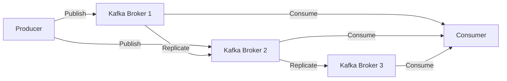

## A.2.2 Apache Kafka

Apache Kafka is a powerful distributed event streaming platform that plays a crucial role in modern microservices architectures. It enables the processing of real-time data feeds, making it an essential tool for building scalable and resilient systems. In this section, we will delve into the core concepts of Kafka, its architecture, and how it can be effectively utilized in microservices environments.

### Introduction to Kafka

Apache Kafka is designed to handle real-time data feeds with high throughput and low latency. It is based on a distributed architecture that allows it to scale horizontally, making it suitable for large-scale data processing applications.

#### Core Concepts

- **Topics:** Kafka organizes data into topics, which are essentially categories or feeds to which records are published. Each topic can have multiple partitions, allowing for parallel processing and scalability.

- **Partitions:** A topic is divided into partitions, which are ordered, immutable sequences of records. Each partition is replicated across multiple brokers for fault tolerance.

- **Brokers:** Kafka runs as a cluster of one or more servers, each of which is called a broker. Brokers are responsible for storing data and serving client requests.

- **Producers and Consumers:** Producers publish data to topics, while consumers read data from topics. Kafka's design allows for multiple producers and consumers to interact with the same topics simultaneously.

#### Kafka Architecture

Kafka's architecture is built around the concept of distributed systems, ensuring high availability and fault tolerance. The following diagram illustrates the basic architecture of Kafka:



### Installation and Setup

Setting up Kafka involves installing the Kafka binaries, configuring the brokers, and starting the Kafka server. Below is a step-by-step guide to getting Kafka up and running:

1. **Download Kafka:**
   - Visit the [Apache Kafka Downloads](https://kafka.apache.org/downloads) page and download the latest version of Kafka.

2. **Extract the Archive:**
   - Extract the downloaded archive to a directory of your choice.

3. **Start Zookeeper:**
   - Kafka requires Zookeeper to manage its cluster. Start Zookeeper using the following command:
     ```bash
     bin/zookeeper-server-start.sh config/zookeeper.properties
     ```

4. **Start Kafka Broker:**
   - Start the Kafka broker by running:
     ```bash
     bin/kafka-server-start.sh config/server.properties
     ```

5. **Create a Topic:**
   - Create a new topic named "test-topic" with a single partition and replication factor of one:
     ```bash
     bin/kafka-topics.sh --create --topic test-topic --bootstrap-server localhost:9092 --partitions 1 --replication-factor 1
     ```

### Producing and Consuming Streams

Kafka provides a straightforward API for producing and consuming messages. Below are examples of how to produce and consume messages using Kafka clients in Java.

#### Producing Messages

To produce messages to a Kafka topic, you need to create a Kafka producer and send records to the desired topic.

```java
import org.apache.kafka.clients.producer.KafkaProducer;
import org.apache.kafka.clients.producer.ProducerRecord;
import java.util.Properties;

public class KafkaProducerExample {
    public static void main(String[] args) {
        Properties props = new Properties();
        props.put("bootstrap.servers", "localhost:9092");
        props.put("key.serializer", "org.apache.kafka.common.serialization.StringSerializer");
        props.put("value.serializer", "org.apache.kafka.common.serialization.StringSerializer");

        KafkaProducer<String, String> producer = new KafkaProducer<>(props);
        for (int i = 0; i < 10; i++) {
            producer.send(new ProducerRecord<>("test-topic", Integer.toString(i), "Message " + i));
        }
        producer.close();
    }
}
```

#### Consuming Messages

To consume messages from a Kafka topic, you need to create a Kafka consumer and subscribe to the desired topic.

```java
import org.apache.kafka.clients.consumer.ConsumerRecord;
import org.apache.kafka.clients.consumer.ConsumerRecords;
import org.apache.kafka.clients.consumer.KafkaConsumer;
import java.util.Collections;
import java.util.Properties;

public class KafkaConsumerExample {
    public static void main(String[] args) {
        Properties props = new Properties();
        props.put("bootstrap.servers", "localhost:9092");
        props.put("group.id", "test-group");
        props.put("key.deserializer", "org.apache.kafka.common.serialization.StringDeserializer");
        props.put("value.deserializer", "org.apache.kafka.common.serialization.StringDeserializer");

        KafkaConsumer<String, String> consumer = new KafkaConsumer<>(props);
        consumer.subscribe(Collections.singletonList("test-topic"));

        while (true) {
            ConsumerRecords<String, String> records = consumer.poll(100);
            for (ConsumerRecord<String, String> record : records) {
                System.out.printf("offset = %d, key = %s, value = %s%n", record.offset(), record.key(), record.value());
            }
        }
    }
}
```

### Kafka Streams API

The Kafka Streams API is a powerful library for building real-time data processing applications. It allows you to process data in a streaming fashion, enabling complex transformations and aggregations.

#### Example of Kafka Streams

Below is an example of a simple Kafka Streams application that processes input data and writes the results to an output topic.

```java
import org.apache.kafka.streams.KafkaStreams;
import org.apache.kafka.streams.StreamsBuilder;
import org.apache.kafka.streams.StreamsConfig;
import org.apache.kafka.streams.kstream.KStream;

import java.util.Properties;

public class KafkaStreamsExample {
    public static void main(String[] args) {
        Properties props = new Properties();
        props.put(StreamsConfig.APPLICATION_ID_CONFIG, "streams-example");
        props.put(StreamsConfig.BOOTSTRAP_SERVERS_CONFIG, "localhost:9092");

        StreamsBuilder builder = new StreamsBuilder();
        KStream<String, String> source = builder.stream("input-topic");
        source.mapValues(value -> value.toUpperCase()).to("output-topic");

        KafkaStreams streams = new KafkaStreams(builder.build(), props);
        streams.start();
    }
}
```

### Replication and Fault Tolerance

Kafka ensures data durability and fault tolerance through its replication mechanism. Each partition of a topic is replicated across multiple brokers, providing redundancy and high availability.

- **Replication Factor:** The replication factor determines the number of copies of a partition that are maintained across the Kafka cluster. A higher replication factor increases fault tolerance but requires more storage.

- **Leader and Followers:** Each partition has a leader broker that handles all reads and writes, while follower brokers replicate the data. If the leader fails, one of the followers is elected as the new leader.

### Kafka Connect

Kafka Connect is a tool for integrating Kafka with various data sources and sinks. It provides a scalable and reliable way to move data between Kafka and other systems.

#### Using Kafka Connect

Kafka Connect uses connectors to define the source or sink of data. Connectors can be configured using JSON files or programmatically.

```json
{
  "name": "jdbc-source-connector",
  "config": {
    "connector.class": "io.confluent.connect.jdbc.JdbcSourceConnector",
    "tasks.max": "1",
    "connection.url": "jdbc:mysql://localhost:3306/mydb",
    "table.whitelist": "my_table",
    "mode": "incrementing",
    "incrementing.column.name": "id",
    "topic.prefix": "jdbc-"
  }
}
```

### Monitoring and Maintenance

Monitoring Kafka clusters is essential for ensuring optimal performance and reliability. Key strategies include:

- **Consumer Offsets:** Track consumer offsets to ensure messages are processed correctly and to avoid data loss.

- **Metrics Collection:** Use tools like Prometheus and Grafana to collect and visualize Kafka metrics.

- **Log Retention:** Configure log retention policies to manage disk usage and ensure data availability.

### Security Features

Kafka provides robust security features to protect data and control access:

- **SSL Encryption:** Encrypt data in transit using SSL to prevent unauthorized access.

- **SASL Authentication:** Use SASL mechanisms to authenticate clients and brokers.

- **Access Control Lists (ACLs):** Define ACLs to control access to Kafka resources, ensuring only authorized users can produce or consume messages.

### Conclusion

Apache Kafka is a versatile and powerful tool for building scalable and resilient microservices architectures. By understanding its core concepts, architecture, and features, you can leverage Kafka to process real-time data streams efficiently. Whether you're integrating with existing systems using Kafka Connect or building complex data processing applications with the Kafka Streams API, Kafka provides the flexibility and reliability needed for modern distributed systems.

## Quiz Time!



### What is the primary purpose of Apache Kafka?

- [x] Distributed event streaming platform
- [ ] Relational database management
- [ ] Web server for hosting applications
- [ ] File storage system

> **Explanation:** Apache Kafka is designed as a distributed event streaming platform for handling real-time data feeds.

### In Kafka, what is a 'topic'?

- [x] A category or feed to which records are published
- [ ] A single message in the stream
- [ ] A configuration setting for brokers
- [ ] A type of consumer group

> **Explanation:** A topic in Kafka is a category or feed name to which records are published.

### What role does a 'broker' play in Kafka?

- [x] Stores data and serves client requests
- [ ] Manages consumer offsets
- [ ] Provides authentication services
- [ ] Handles network communication

> **Explanation:** A broker in Kafka is responsible for storing data and serving client requests.

### How does Kafka ensure fault tolerance?

- [x] By replicating partitions across multiple brokers
- [ ] By using a single broker for all data
- [ ] By storing data in a central database
- [ ] By encrypting all data

> **Explanation:** Kafka ensures fault tolerance by replicating partitions across multiple brokers, providing redundancy.

### What is the Kafka Streams API used for?

- [x] Building real-time data processing applications
- [ ] Managing consumer offsets
- [ ] Configuring broker settings
- [ ] Encrypting data

> **Explanation:** The Kafka Streams API is used for building real-time data processing applications.

### Which of the following is a security feature of Kafka?

- [x] SSL Encryption
- [ ] Data compression
- [ ] Load balancing
- [ ] Data partitioning

> **Explanation:** SSL Encryption is a security feature in Kafka to encrypt data in transit.

### What is the purpose of Kafka Connect?

- [x] Integrating Kafka with various data sources and sinks
- [ ] Monitoring Kafka clusters
- [ ] Encrypting Kafka data
- [ ] Managing Kafka consumer groups

> **Explanation:** Kafka Connect is used for integrating Kafka with various data sources and sinks.

### How can you monitor Kafka clusters effectively?

- [x] Using tools like Prometheus and Grafana
- [ ] By manually checking logs
- [ ] By using a single broker for all data
- [ ] By encrypting all data

> **Explanation:** Tools like Prometheus and Grafana are used to collect and visualize Kafka metrics for effective monitoring.

### What is a 'partition' in Kafka?

- [x] An ordered, immutable sequence of records
- [ ] A configuration setting for brokers
- [ ] A type of consumer group
- [ ] A single message in the stream

> **Explanation:** A partition in Kafka is an ordered, immutable sequence of records.

### True or False: Kafka can only be used for real-time data processing.

- [ ] True
- [x] False

> **Explanation:** While Kafka is optimized for real-time data processing, it can also be used for batch processing and other use cases.


