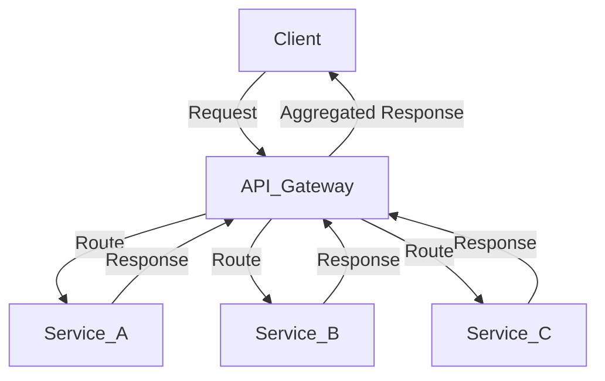

## 2.1.2 Solving Common Problems

Microservices architectures, while offering numerous benefits such as scalability and flexibility, also introduce a set of unique challenges. These challenges often revolve around service communication, data consistency, and fault tolerance. In this section, we will explore how design patterns provide structured solutions to these common problems, offering tested approaches that mitigate risks and enhance system robustness.

### Identifying Common Challenges

Before diving into the solutions, it's crucial to understand the typical problems encountered in microservices architectures:

1. **Service Communication:** Ensuring reliable and efficient communication between distributed services is a fundamental challenge. This includes handling network latency, message serialization, and service discovery.

2. **Data Consistency:** Maintaining data consistency across distributed services can be complex, especially when services have their own databases. This often leads to issues with eventual consistency and data synchronization.

3. **Fault Tolerance:** Microservices must be resilient to failures, whether they are network-related or due to service crashes. Ensuring that the system can gracefully handle such failures is critical.

4. **Scalability:** While microservices are designed to scale, managing the scalability of individual services and the system as a whole requires careful planning and design.

5. **Security:** Protecting data and ensuring secure communication between services is paramount, especially in distributed environments.

### Pattern-Based Solutions

Design patterns offer structured solutions to these challenges by providing reusable, tested approaches that can be adapted to specific needs. Let's explore how these patterns address the common problems in microservices:

#### Problem-Solution Mapping

To facilitate easier decision-making, here is a mapping of common problems to corresponding design patterns:

- **Service Communication:**
  - **API Gateway Pattern:** Manages all requests from clients, providing a single entry point and handling routing, composition, and protocol translation.
  - **Service Discovery Patterns:** Enable services to find each other dynamically, using client-side or server-side discovery mechanisms.

- **Data Consistency:**
  - **Saga Pattern:** Manages distributed transactions by breaking them into a series of local transactions, ensuring eventual consistency.
  - **Event Sourcing:** Captures all changes to an application state as a sequence of events, allowing the system to rebuild state from these events.

- **Fault Tolerance:**
  - **Circuit Breaker Pattern:** Prevents a service from repeatedly trying to execute an operation that's likely to fail, allowing it to recover gracefully.
  - **Bulkhead Pattern:** Isolates different parts of the system to prevent a failure in one part from cascading to others.

- **Scalability:**
  - **Database per Service Pattern:** Ensures that each service has its own database, allowing it to scale independently.
  - **CQRS (Command Query Responsibility Segregation):** Separates read and write operations to optimize performance and scalability.

- **Security:**
  - **Access Tokens (JWT, OAuth 2.0):** Securely manage authentication and authorization across services.

### Examples of Solutions

Let's delve into some examples of how specific patterns solve particular issues:

#### Circuit Breaker Pattern for Fault Tolerance

The Circuit Breaker pattern is akin to an electrical circuit breaker. It monitors for failures and prevents the application from performing operations that are likely to fail. Here's a simple Java implementation using the Resilience4j library:

```java
import io.github.resilience4j.circuitbreaker.CircuitBreaker;
import io.github.resilience4j.circuitbreaker.CircuitBreakerConfig;
import io.github.resilience4j.circuitbreaker.CircuitBreakerRegistry;

import java.time.Duration;
import java.util.function.Supplier;

public class CircuitBreakerExample {
    public static void main(String[] args) {
        CircuitBreakerConfig config = CircuitBreakerConfig.custom()
                .failureRateThreshold(50)
                .waitDurationInOpenState(Duration.ofMillis(1000))
                .build();

        CircuitBreakerRegistry registry = CircuitBreakerRegistry.of(config);
        CircuitBreaker circuitBreaker = registry.circuitBreaker("myCircuitBreaker");

        Supplier<String> decoratedSupplier = CircuitBreaker.decorateSupplier(circuitBreaker, () -> {
            // Simulate a remote service call
            if (Math.random() > 0.5) {
                throw new RuntimeException("Service failure");
            }
            return "Service response";
        });

        for (int i = 0; i < 10; i++) {
            try {
                String result = decoratedSupplier.get();
                System.out.println("Received: " + result);
            } catch (Exception e) {
                System.out.println("Failed to call service: " + e.getMessage());
            }
        }
    }
}
```

**Explanation:** This code sets up a Circuit Breaker with a failure rate threshold of 50%. If more than 50% of the calls fail, the circuit opens, and subsequent calls fail immediately without attempting the operation, allowing the system to recover.

#### API Gateway Pattern for Service Communication

The API Gateway pattern acts as a single entry point for client requests, handling routing, composition, and protocol translation. It simplifies client interactions by aggregating responses from multiple services. Here's a conceptual diagram:



**Explanation:** The API Gateway receives requests from clients and routes them to the appropriate services. It can also aggregate responses from multiple services before sending them back to the client, reducing the complexity of client-side logic.

### Comparative Analysis

Different patterns can solve the same problem, each with its advantages and trade-offs. For example, both the Circuit Breaker and Retry patterns address fault tolerance, but they do so differently:

- **Circuit Breaker Pattern:** Prevents repeated execution of operations likely to fail, reducing the load on the system and allowing it to recover.
- **Retry Pattern:** Automatically retries failed operations, which can be useful for transient failures but may increase load if not managed carefully.

**Trade-offs:** The Circuit Breaker pattern is more suitable for preventing cascading failures, while the Retry pattern is effective for handling temporary network glitches.

### Implementation Guidelines

When implementing these patterns, consider the following guidelines:

1. **Understand the Context:** Ensure that the chosen pattern aligns with your specific use case and system requirements.
2. **Start Simple:** Implement a basic version of the pattern and iterate based on feedback and performance metrics.
3. **Monitor and Adjust:** Continuously monitor the system's behavior and adjust configurations as needed to optimize performance.
4. **Leverage Frameworks:** Use established frameworks and libraries, such as Resilience4j for Circuit Breakers, to simplify implementation and ensure reliability.

### Real-World Scenarios

Consider a real-world scenario where a financial services company uses the Circuit Breaker pattern to enhance fault tolerance. By implementing Circuit Breakers, they prevent cascading failures during peak transaction periods, ensuring that critical services remain operational even when some components fail.

### Best Practices

To effectively apply these patterns, follow these best practices:

- **Document Patterns:** Clearly document the patterns used and their configurations to facilitate maintenance and onboarding.
- **Test Thoroughly:** Implement comprehensive testing to ensure that patterns behave as expected under different scenarios.
- **Balance Complexity:** Avoid over-engineering by selecting patterns that provide the most value without introducing unnecessary complexity.
- **Educate Teams:** Train development teams on the benefits and trade-offs of each pattern to ensure informed decision-making.

By understanding and applying these design patterns, you can address common challenges in microservices architectures, enhancing system reliability, scalability, and maintainability.

## Quiz Time!



### What is a common challenge in microservices architectures?

- [x] Service communication
- [ ] Monolithic design
- [ ] Lack of modularity
- [ ] Single point of failure

> **Explanation:** Service communication is a common challenge in microservices due to the distributed nature of the architecture.

### Which pattern is used to manage distributed transactions?

- [ ] Circuit Breaker
- [x] Saga
- [ ] API Gateway
- [ ] Bulkhead

> **Explanation:** The Saga pattern is used to manage distributed transactions by breaking them into a series of local transactions.

### What does the Circuit Breaker pattern prevent?

- [x] Repeated execution of failing operations
- [ ] Unauthorized access
- [ ] Data inconsistency
- [ ] Slow network responses

> **Explanation:** The Circuit Breaker pattern prevents repeated execution of operations that are likely to fail, allowing the system to recover.

### Which pattern acts as a single entry point for client requests?

- [x] API Gateway
- [ ] Service Discovery
- [ ] Bulkhead
- [ ] Retry

> **Explanation:** The API Gateway pattern acts as a single entry point for client requests, handling routing and aggregation.

### What is a trade-off of the Retry pattern?

- [x] Increased load on the system
- [ ] Reduced fault tolerance
- [ ] Decreased scalability
- [ ] Increased security

> **Explanation:** The Retry pattern can increase the load on the system if not managed carefully, especially during transient failures.

### Which pattern isolates different parts of the system to prevent cascading failures?

- [ ] Retry
- [ ] API Gateway
- [x] Bulkhead
- [ ] Saga

> **Explanation:** The Bulkhead pattern isolates different parts of the system to prevent a failure in one part from affecting others.

### What is the main advantage of the Database per Service pattern?

- [x] Independent scaling of services
- [ ] Centralized data management
- [ ] Simplified data consistency
- [ ] Reduced data redundancy

> **Explanation:** The Database per Service pattern allows each service to scale independently, optimizing performance.

### Which pattern is suitable for handling temporary network glitches?

- [ ] Circuit Breaker
- [x] Retry
- [ ] Bulkhead
- [ ] Saga

> **Explanation:** The Retry pattern is effective for handling temporary network glitches by automatically retrying failed operations.

### What should be considered when implementing design patterns?

- [x] Context and system requirements
- [ ] Only the complexity of the pattern
- [ ] The number of services
- [ ] The programming language used

> **Explanation:** When implementing design patterns, it's important to consider the context and system requirements to ensure alignment with the use case.

### Design patterns in microservices help mitigate risks and enhance system robustness.

- [x] True
- [ ] False

> **Explanation:** Design patterns provide structured solutions to common challenges, mitigating risks and enhancing system robustness.


