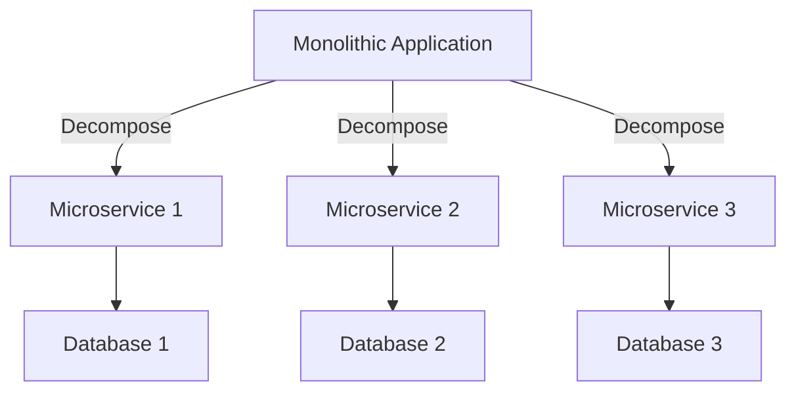

---

linkTitle: "2.2.1 Decomposition Patterns"
title: "Decomposition Patterns in Microservices Architecture"
description: "Explore decomposition patterns in microservices architecture, focusing on breaking down monolithic applications into scalable microservices. Learn about business capability decomposition, Domain-Driven Design, subdomain identification, and best practices."
categories:
- Microservices
- Software Architecture
- Design Patterns
tags:
- Decomposition
- Domain-Driven Design
- Microservices
- Bounded Contexts
- Service Design
date: 2024-10-25
type: docs
nav_weight: 221000
---

## 2.2.1 Decomposition Patterns

In the realm of microservices architecture, decomposition patterns play a pivotal role in transforming monolithic applications into a collection of loosely coupled, independently deployable services. This section delves into the intricacies of decomposition patterns, providing a comprehensive guide to breaking down complex systems into manageable microservices.

### Introduction to Decomposition

Decomposition patterns are strategies used to divide a monolithic application into smaller, more manageable microservices. The goal is to enhance scalability, maintainability, and flexibility by aligning services with specific business functions or domains. By decomposing a monolith, organizations can achieve greater agility, allowing for independent development, deployment, and scaling of services.

### Business Capability Decomposition

Business capability decomposition involves breaking down a system based on distinct business capabilities. Each microservice is aligned with a specific business function, ensuring that it encapsulates all the necessary logic and data required to perform its role. This approach promotes a clear separation of concerns and aligns technical architecture with business objectives.

#### Identifying Business Capabilities

To effectively decompose by business capability, it's essential to identify the core functions that drive the business. This involves:

1. **Analyzing Business Processes:** Understand the key processes that deliver value to customers.
2. **Mapping Capabilities to Services:** Align each capability with a potential microservice.
3. **Defining Service Boundaries:** Ensure that each service has a well-defined boundary and responsibility.

#### Aligning Services with Business Functions

Aligning services with business functions ensures that each microservice is focused on a specific area of the business, reducing complexity and enhancing cohesion. This alignment facilitates easier communication with stakeholders and ensures that technical changes reflect business needs.

### Domain-Driven Design (DDD)

Domain-Driven Design (DDD) is a strategic approach to software development that emphasizes collaboration between technical and domain experts. DDD provides a framework for decomposing systems based on domain models and bounded contexts.

#### Bounded Contexts and Subdomains

In DDD, a bounded context defines the boundaries within which a particular domain model is applicable. It ensures that each microservice operates within its own context, minimizing dependencies and promoting autonomy.

- **Core Subdomains:** These are critical to the business and often require custom solutions.
- **Supporting Subdomains:** These support core subdomains and may leverage existing solutions.
- **Generic Subdomains:** These are common across many domains and can often be outsourced or standardized.

#### Aggregates and Entities

Aggregates are clusters of domain objects that can be treated as a single unit. They ensure consistency within a bounded context by defining clear rules for how entities interact.

#### Integrating DDD with Microservices

Integrating DDD with microservices involves using bounded contexts to define service boundaries and ensuring that each service encapsulates a specific domain model. This approach reduces coupling and enhances scalability.

### Subdomain Identification

Identifying subdomains is crucial for structuring microservices effectively. This involves categorizing domains into core, supporting, and generic subdomains, each with its own set of responsibilities and interactions.

#### Core Subdomains

Core subdomains are unique to the business and provide competitive advantage. They require custom development and are often the focus of innovation.

#### Supporting Subdomains

Supporting subdomains assist core subdomains by providing necessary functionality. These can often be implemented using existing solutions or frameworks.

#### Generic Subdomains

Generic subdomains are common across industries and can be standardized or outsourced. They include functionalities like authentication, logging, and monitoring.

### Bounded Context Implementation

Implementing bounded contexts involves defining clear service boundaries to minimize dependencies and ensure that each service operates independently.

#### Ensuring Clear Service Boundaries

Clear service boundaries prevent the leakage of domain concepts across services, reducing complexity and enhancing maintainability.

#### Minimizing Dependencies

Minimizing dependencies between services promotes autonomy and allows for independent scaling and deployment.

### Case Studies

Real-world examples demonstrate the effectiveness of decomposition patterns in transforming monolithic architectures into scalable microservices.

#### Case Study 1: E-Commerce Platform

An e-commerce platform successfully decomposed its monolithic application by aligning services with business capabilities such as inventory management, order processing, and customer service. This transformation enabled independent scaling and faster deployment cycles.

#### Case Study 2: Financial Services

A financial services company used DDD to identify core subdomains like transaction processing and risk assessment. By implementing bounded contexts, they reduced dependencies and improved system resilience.

### Tools and Techniques

Several tools and techniques can aid in analyzing and planning service decomposition.

#### Domain Modeling Tools

Tools like Context Mapper and Domain Storytelling facilitate the visualization and analysis of domain models and bounded contexts.

#### Architectural Diagrams

Architectural diagrams, such as component and sequence diagrams, help visualize service interactions and dependencies.

### Best Practices

Adhering to best practices ensures successful decomposition and long-term maintainability.

#### Maintaining Autonomy

Ensure that each microservice is autonomous, with its own data store and minimal dependencies on other services.

#### Minimizing Inter-Service Dependencies

Minimize dependencies between services to reduce complexity and enhance resilience.

#### Ensuring Clear Ownership of Services

Assign clear ownership of services to specific teams, promoting accountability and facilitating communication.

### Conclusion

Decomposition patterns are essential for transforming monolithic applications into scalable microservices. By aligning services with business capabilities and leveraging DDD principles, organizations can achieve greater agility and resilience. Implementing bounded contexts and identifying subdomains are key steps in this process, supported by tools and best practices that ensure successful decomposition.

## Quiz Time!



### What is the primary goal of decomposition patterns in microservices?

- [x] To enhance scalability, maintainability, and flexibility
- [ ] To increase the complexity of the system
- [ ] To reduce the number of services
- [ ] To centralize data management

> **Explanation:** Decomposition patterns aim to enhance scalability, maintainability, and flexibility by breaking down monolithic applications into smaller, manageable microservices.

### Which approach involves breaking down a system based on distinct business capabilities?

- [x] Business Capability Decomposition
- [ ] Domain-Driven Design
- [ ] Subdomain Identification
- [ ] Bounded Context Implementation

> **Explanation:** Business Capability Decomposition involves breaking down a system based on distinct business capabilities, aligning each microservice with a specific business function.

### What is a bounded context in Domain-Driven Design?

- [x] A boundary within which a particular domain model is applicable
- [ ] A shared database for all services
- [ ] A centralized service registry
- [ ] A common user interface for all services

> **Explanation:** A bounded context in Domain-Driven Design defines the boundaries within which a particular domain model is applicable, ensuring clear service boundaries and minimizing dependencies.

### What type of subdomain is critical to the business and often requires custom solutions?

- [x] Core Subdomain
- [ ] Supporting Subdomain
- [ ] Generic Subdomain
- [ ] External Subdomain

> **Explanation:** Core subdomains are critical to the business and often require custom solutions, providing a competitive advantage.

### Which tool is used for visualizing and analyzing domain models and bounded contexts?

- [x] Context Mapper
- [ ] Docker
- [ ] Kubernetes
- [ ] Prometheus

> **Explanation:** Context Mapper is a tool used for visualizing and analyzing domain models and bounded contexts, aiding in the decomposition process.

### What is the benefit of minimizing dependencies between microservices?

- [x] It enhances resilience and allows for independent scaling
- [ ] It increases the complexity of the system
- [ ] It centralizes data management
- [ ] It reduces the number of services

> **Explanation:** Minimizing dependencies between microservices enhances resilience and allows for independent scaling and deployment.

### Which subdomain type is common across industries and can often be standardized or outsourced?

- [x] Generic Subdomain
- [ ] Core Subdomain
- [ ] Supporting Subdomain
- [ ] External Subdomain

> **Explanation:** Generic subdomains are common across industries and can often be standardized or outsourced, including functionalities like authentication and logging.

### What is the role of architectural diagrams in service decomposition?

- [x] To visualize service interactions and dependencies
- [ ] To increase the complexity of the system
- [ ] To centralize data management
- [ ] To reduce the number of services

> **Explanation:** Architectural diagrams help visualize service interactions and dependencies, aiding in the planning and analysis of service decomposition.

### Which best practice involves assigning clear ownership of services to specific teams?

- [x] Ensuring Clear Ownership of Services
- [ ] Centralizing Data Management
- [ ] Increasing System Complexity
- [ ] Reducing the Number of Services

> **Explanation:** Ensuring clear ownership of services involves assigning specific teams to manage and maintain each service, promoting accountability and facilitating communication.

### True or False: Decomposition patterns are only applicable to new systems and not existing monolithic applications.

- [ ] True
- [x] False

> **Explanation:** Decomposition patterns are applicable to both new systems and existing monolithic applications, helping transform them into scalable microservices.



