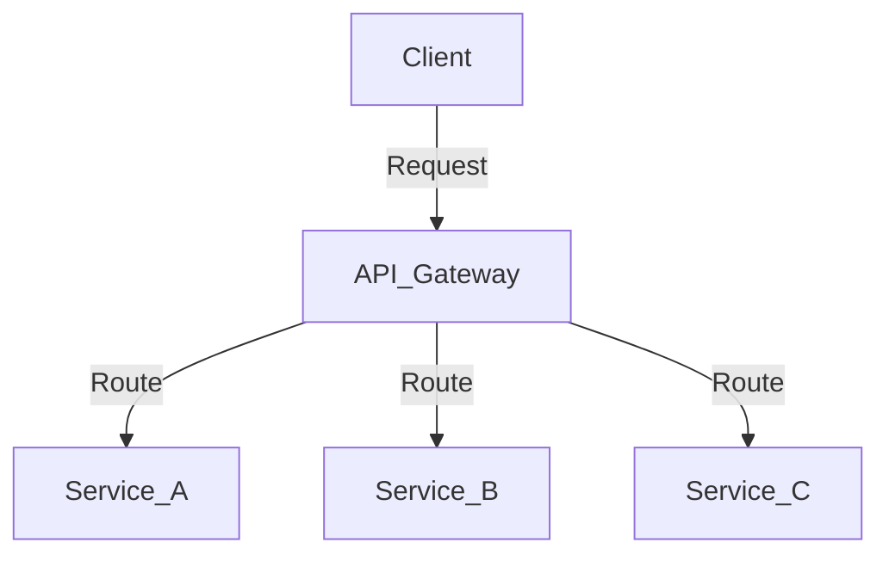

## 2.2.2 Communication Patterns

In the realm of microservices, effective communication between services is paramount to building scalable and resilient systems. As microservices are inherently distributed, they require robust communication strategies to ensure seamless interaction. This section delves into various communication patterns, exploring both synchronous and asynchronous methods, and the tools and techniques that facilitate these interactions.

### Overview of Communication Needs

Microservices architecture necessitates a shift from traditional monolithic communication to a more distributed approach. The communication between microservices can be broadly categorized into:

- **Synchronous Communication:** This involves real-time interactions where a service sends a request and waits for a response. It's akin to a phone call where both parties are engaged simultaneously.
- **Asynchronous Communication:** Here, services communicate without waiting for an immediate response, similar to sending an email or a message.

Understanding when to use each type of communication is crucial for designing efficient microservices systems.

### Synchronous Communication Patterns

#### RESTful APIs

REST (Representational State Transfer) is a widely adopted architectural style for designing networked applications. RESTful APIs are stateless and leverage HTTP methods such as GET, POST, PUT, and DELETE for communication.

**Use Cases:**
- Ideal for CRUD (Create, Read, Update, Delete) operations.
- Suitable for scenarios where real-time data retrieval is essential.

**Implementation Strategy:**
- Define clear and concise endpoints.
- Use HTTP status codes to indicate the outcome of requests.
- Employ JSON or XML for data interchange.

**Java Example:**

```java
import javax.ws.rs.GET;
import javax.ws.rs.Path;
import javax.ws.rs.Produces;
import javax.ws.rs.core.MediaType;

@Path("/products")
public class ProductService {

    @GET
    @Produces(MediaType.APPLICATION_JSON)
    public List<Product> getProducts() {
        // Logic to retrieve products
        return productService.getAllProducts();
    }
}
```

#### gRPC

gRPC is a high-performance, open-source RPC (Remote Procedure Call) framework that uses HTTP/2 for transport and Protocol Buffers as the interface description language.

**Use Cases:**
- Suitable for low-latency, high-throughput scenarios.
- Ideal for microservices requiring strong typing and contract-first development.

**Implementation Strategy:**
- Define service interfaces using Protocol Buffers.
- Generate client and server code using gRPC tools.

**Java Example:**

```proto
syntax = "proto3";

service ProductService {
  rpc GetProduct (ProductRequest) returns (ProductResponse);
}

message ProductRequest {
  int32 id = 1;
}

message ProductResponse {
  string name = 1;
  double price = 2;
}
```

```java
public class ProductServiceImpl extends ProductServiceGrpc.ProductServiceImplBase {

    @Override
    public void getProduct(ProductRequest req, StreamObserver<ProductResponse> responseObserver) {
        // Logic to retrieve product
        ProductResponse response = ProductResponse.newBuilder()
                .setName("Sample Product")
                .setPrice(29.99)
                .build();
        responseObserver.onNext(response);
        responseObserver.onCompleted();
    }
}
```

### Asynchronous Communication Patterns

#### Publish/Subscribe

In the Publish/Subscribe pattern, services publish messages to a topic, and subscribers receive messages without knowing the publishers.

**Advantages:**
- Decouples services, allowing them to operate independently.
- Supports scalable and flexible communication.

**Implementation Strategy:**
- Use message brokers like Apache Kafka or RabbitMQ.
- Define topics for different message types.

**Java Example with Kafka:**

```java
Properties props = new Properties();
props.put("bootstrap.servers", "localhost:9092");
props.put("key.serializer", "org.apache.kafka.common.serialization.StringSerializer");
props.put("value.serializer", "org.apache.kafka.common.serialization.StringSerializer");

Producer<String, String> producer = new KafkaProducer<>(props);
producer.send(new ProducerRecord<>("topicName", "key", "message"));
producer.close();
```

#### Event Streaming

Event streaming involves capturing data in real-time from event sources like databases, sensors, or user interactions.

**Advantages:**
- Enables real-time data processing and analytics.
- Facilitates event-driven architectures.

**Implementation Strategy:**
- Utilize platforms like Apache Kafka or AWS Kinesis.
- Stream events to consumers for processing.

#### Message Queues

Message queues provide a buffer that decouples the sender and receiver, allowing for reliable message delivery.

**Advantages:**
- Ensures message persistence and delivery.
- Supports load leveling by queuing messages.

**Implementation Strategy:**
- Use message queue systems like RabbitMQ or Amazon SQS.
- Implement consumers to process messages asynchronously.

### API Gateway Pattern

The API Gateway acts as a single entry point for client requests, routing them to the appropriate microservices.

**Roles and Responsibilities:**
- Request routing and composition.
- Authentication and authorization.
- Rate limiting and caching.

**Implementation Strategy:**
- Deploy API gateways like Kong, NGINX, or AWS API Gateway.
- Configure routes and policies for managing traffic.

**Mermaid Diagram:**



### Service Mesh

A service mesh is a dedicated infrastructure layer for managing service-to-service communication.

**Features:**
- Load balancing and service discovery.
- Security features like mTLS (mutual TLS).
- Observability and traffic management.

**Tools:**
- Istio, Linkerd, and Consul are popular service mesh implementations.

**Implementation Strategy:**
- Deploy a service mesh alongside your microservices.
- Configure policies for traffic management and security.

### Data Synchronization Techniques

Ensuring data consistency across distributed services is challenging. Patterns like Event Sourcing and CQRS help manage this complexity.

#### Event Sourcing

Event Sourcing stores the state of a system as a sequence of events.

**Advantages:**
- Provides a complete audit trail.
- Facilitates rebuilding state from events.

**Implementation Strategy:**
- Capture and store events in an event store.
- Reconstruct state by replaying events.

#### CQRS (Command Query Responsibility Segregation)

CQRS separates the read and write operations of a system, optimizing each for its specific use case.

**Advantages:**
- Improves scalability by separating concerns.
- Allows for different data models for reading and writing.

**Implementation Strategy:**
- Implement separate models for commands and queries.
- Use event-driven mechanisms to synchronize data.

### Error Handling in Communication

Handling communication failures gracefully is crucial for maintaining system resilience.

#### Circuit Breaker Pattern

The Circuit Breaker pattern prevents a service from repeatedly trying to execute an operation that is likely to fail.

**Implementation Strategy:**
- Use libraries like Netflix Hystrix or Resilience4j.
- Monitor failure rates and open the circuit when necessary.

#### Retry Pattern

The Retry pattern attempts to re-execute a failed operation after a delay.

**Implementation Strategy:**
- Implement exponential backoff strategies.
- Use libraries to manage retry logic.

### Case Studies

**Case Study 1: E-Commerce Platform**

An e-commerce platform implemented a combination of RESTful APIs and asynchronous messaging using Kafka to handle high traffic and ensure data consistency across inventory and order services.

**Case Study 2: Financial Services**

A financial services company used gRPC for low-latency transactions and a service mesh to secure and manage inter-service communication, ensuring compliance with industry regulations.

**Case Study 3: Media Streaming Service**

A media streaming service adopted event streaming with Kafka to process real-time user interactions and optimize content delivery, enhancing user experience and scalability.

### Conclusion

Communication patterns are the backbone of microservices architecture, enabling services to interact efficiently and reliably. By understanding and implementing these patterns, developers can build scalable, resilient, and maintainable systems. As you explore these patterns, consider the specific needs of your application and choose the patterns that best fit your architecture.

## Quiz Time!



### What is the primary difference between synchronous and asynchronous communication in microservices?

- [x] Synchronous communication requires a real-time response, while asynchronous communication does not.
- [ ] Asynchronous communication is faster than synchronous communication.
- [ ] Synchronous communication uses message queues, while asynchronous does not.
- [ ] Asynchronous communication is always more reliable than synchronous communication.

> **Explanation:** Synchronous communication involves waiting for a real-time response, whereas asynchronous communication allows for delayed responses.

### Which pattern is most suitable for real-time data retrieval in microservices?

- [x] RESTful APIs
- [ ] Publish/Subscribe
- [ ] Message Queues
- [ ] Event Streaming

> **Explanation:** RESTful APIs are ideal for real-time data retrieval due to their synchronous nature.

### What is the role of an API Gateway in microservices architecture?

- [x] It acts as a single entry point for client requests and routes them to appropriate services.
- [ ] It stores all the data for microservices.
- [ ] It directly communicates with databases.
- [ ] It replaces the need for service discovery.

> **Explanation:** An API Gateway manages client requests and routes them to the correct microservices.

### Which communication pattern is best for decoupling services in a microservices architecture?

- [ ] RESTful APIs
- [x] Publish/Subscribe
- [ ] gRPC
- [ ] Circuit Breaker

> **Explanation:** The Publish/Subscribe pattern decouples services by allowing them to communicate through a message broker.

### What is the primary advantage of using a service mesh?

- [x] It manages service-to-service communication with features like load balancing and security.
- [ ] It replaces the need for an API Gateway.
- [ ] It provides a user interface for microservices.
- [ ] It stores all microservices data.

> **Explanation:** A service mesh provides advanced features for managing inter-service communication, including load balancing and security.

### How does the Circuit Breaker pattern enhance system resilience?

- [x] It prevents repeated execution of operations likely to fail, protecting the system from cascading failures.
- [ ] It retries failed operations indefinitely.
- [ ] It ensures all operations succeed.
- [ ] It replaces failed services automatically.

> **Explanation:** The Circuit Breaker pattern helps prevent cascading failures by stopping repeated execution of failing operations.

### Which tool is commonly used for implementing a service mesh?

- [x] Istio
- [ ] RabbitMQ
- [ ] Kafka
- [ ] Docker

> **Explanation:** Istio is a popular tool for implementing a service mesh, providing features like load balancing and security.

### What is a key benefit of using Event Sourcing in microservices?

- [x] It provides a complete audit trail by storing system state as a sequence of events.
- [ ] It simplifies data storage by using a single database.
- [ ] It eliminates the need for data synchronization.
- [ ] It ensures all services are stateless.

> **Explanation:** Event Sourcing stores system state as events, offering a comprehensive audit trail.

### Which pattern separates read and write operations to optimize scalability?

- [x] CQRS (Command Query Responsibility Segregation)
- [ ] Publish/Subscribe
- [ ] RESTful APIs
- [ ] Retry Pattern

> **Explanation:** CQRS separates read and write operations, optimizing each for scalability.

### True or False: gRPC is suitable for low-latency, high-throughput scenarios in microservices.

- [x] True
- [ ] False

> **Explanation:** gRPC is designed for low-latency, high-throughput communication, making it suitable for such scenarios.


