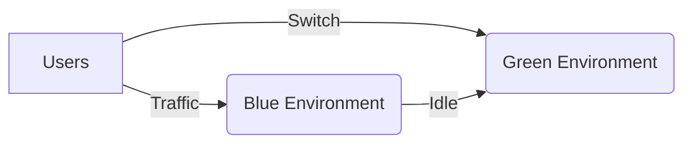
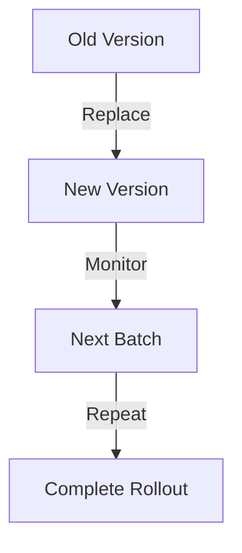

## 2.2.5 Deployment Patterns

In the world of microservices, deploying applications efficiently and reliably is crucial for maintaining service availability and ensuring a seamless user experience. This section explores various deployment patterns that help achieve these goals, focusing on strategies that minimize downtime, reduce risk, and enhance scalability. We will cover continuous deployment fundamentals, blue-green deployments, canary releases, rolling deployments, immutable infrastructure, feature toggles, and infrastructure as code (IaC). Each pattern offers unique benefits and challenges, and understanding them will empower you to choose the right approach for your microservices architecture.

### Continuous Deployment Fundamentals

Continuous Deployment (CD) is a software engineering approach where code changes are automatically built, tested, and deployed to production. This practice is particularly relevant to microservices due to their modular nature and frequent updates. CD ensures that new features, bug fixes, and improvements are delivered to users quickly and reliably.

**Key Principles of Continuous Deployment:**

- **Automation:** Automate the entire deployment pipeline, from code commit to production release, to reduce human error and increase efficiency.
- **Testing:** Implement comprehensive automated testing to ensure code quality and functionality before deployment.
- **Monitoring:** Continuously monitor deployed services to detect and address issues promptly.
- **Rollback:** Prepare for quick rollbacks in case of deployment failures to minimize impact on users.

Continuous deployment fosters a culture of rapid iteration and innovation, allowing teams to respond quickly to market demands and user feedback.

### Blue-Green Deployment

Blue-Green Deployment is a strategy that minimizes downtime and reduces risks during deployments by maintaining two identical environments: Blue and Green. At any given time, one environment serves production traffic while the other is idle or used for staging the next release.

**How Blue-Green Deployment Works:**

1. **Prepare the New Version:** Deploy the new version of your application to the idle environment (e.g., Green).
2. **Test the New Version:** Perform thorough testing in the Green environment to ensure it functions as expected.
3. **Switch Traffic:** Once satisfied, switch production traffic from the Blue environment to the Green environment.
4. **Monitor and Rollback:** Monitor the new version closely. If issues arise, switch back to the Blue environment.

This pattern allows for seamless transitions between versions, reducing the risk of deployment failures and providing a quick rollback mechanism.

### Canary Releases

Canary Releases involve deploying a new version of a service to a small subset of users before rolling it out to the entire user base. This incremental approach allows teams to monitor the new version's performance and gather feedback, enabling quick rollbacks if necessary.

**Steps for Implementing Canary Releases:**

1. **Deploy to a Subset:** Release the new version to a small percentage of users or a specific user group.
2. **Monitor Performance:** Collect metrics and user feedback to assess the new version's impact.
3. **Gradual Rollout:** If the canary release is successful, gradually increase the user base until the new version is fully deployed.
4. **Rollback if Needed:** If issues are detected, roll back to the previous version for the affected users.

Canary releases are particularly useful for validating new features and ensuring they meet performance and reliability standards.

### Rolling Deployment

Rolling Deployment is a strategy where instances of a service are gradually replaced with new versions, ensuring continuous availability. This approach minimizes downtime and allows for smooth transitions between versions.

**Process of Rolling Deployment:**

1. **Update Instances:** Replace a small number of instances with the new version.
2. **Monitor Each Batch:** Monitor the updated instances for issues before proceeding.
3. **Continue the Rollout:** Repeat the process until all instances are updated.

Rolling deployments are ideal for services that require high availability and cannot afford downtime during updates.

### Immutable Infrastructure

Immutable Infrastructure is a practice where servers or environments are not modified after deployment. Instead, any changes require creating a new version of the infrastructure. This approach enhances consistency, reliability, and scalability.

**Benefits of Immutable Infrastructure:**

- **Consistency:** Ensures that all environments are identical, reducing configuration drift.
- **Reliability:** Reduces the risk of errors caused by manual changes.
- **Scalability:** Simplifies scaling by using pre-configured images.

To implement immutable infrastructure, use tools like Docker to create container images that encapsulate your application and its dependencies.

### Feature Toggles

Feature Toggles, also known as feature flags, allow developers to enable or disable features at runtime without deploying new code. This technique facilitates safer deployments and experimentation.

**Use Cases for Feature Toggles:**

- **Gradual Rollout:** Enable features for specific user groups or environments.
- **A/B Testing:** Test different feature variations to determine user preferences.
- **Quick Rollback:** Disable problematic features without redeploying.

Feature toggles provide flexibility and control over feature availability, allowing teams to iterate quickly and safely.

### Infrastructure as Code (IaC)

Infrastructure as Code (IaC) is the practice of managing and provisioning infrastructure through code rather than manual processes. IaC ensures that deployment environments are consistent, reproducible, and scalable.

**Advantages of Infrastructure as Code:**

- **Automation:** Automate the setup and configuration of environments.
- **Version Control:** Track changes to infrastructure configurations using version control systems.
- **Scalability:** Easily replicate environments across different stages and regions.

Tools like Terraform and AWS CloudFormation enable teams to define infrastructure as code, promoting collaboration and reducing errors.

### Best Practices

When selecting and implementing deployment patterns, consider the following best practices:

- **Assess Application Requirements:** Choose patterns that align with your application's availability, scalability, and risk tolerance needs.
- **Automate Everything:** Leverage automation to reduce manual intervention and increase deployment speed.
- **Monitor and Iterate:** Continuously monitor deployments and iterate on patterns to improve reliability and performance.
- **Educate Teams:** Ensure that all team members understand the chosen deployment patterns and their roles in the process.

By carefully selecting and implementing deployment patterns, you can enhance the reliability and scalability of your microservices architecture, delivering value to users efficiently and effectively.

## Quiz Time!



### What is the primary goal of continuous deployment in microservices?

- [x] To automate the deployment pipeline and deliver code changes quickly and reliably
- [ ] To manually deploy code changes to production
- [ ] To ensure that deployments are only done once a month
- [ ] To eliminate the need for automated testing

> **Explanation:** Continuous deployment aims to automate the deployment process, allowing for rapid and reliable delivery of code changes to production.

### In a Blue-Green Deployment, what is the purpose of having two identical environments?

- [x] To minimize downtime and reduce risks during deployments
- [ ] To increase the cost of infrastructure
- [ ] To confuse the deployment team
- [ ] To ensure that only one environment is used at a time

> **Explanation:** Blue-Green Deployment uses two identical environments to minimize downtime and reduce risks by allowing seamless transitions between versions.

### How do Canary Releases help in deploying new features?

- [x] By deploying new features to a subset of users for monitoring and feedback
- [ ] By deploying new features to all users at once
- [ ] By eliminating the need for user feedback
- [ ] By ensuring that features are never rolled back

> **Explanation:** Canary Releases deploy new features to a subset of users, allowing for monitoring and feedback before a full rollout.

### What is the key benefit of Rolling Deployment?

- [x] Gradually replacing instances to ensure continuous availability
- [ ] Deploying all instances at once to minimize time
- [ ] Ensuring that only one instance is updated
- [ ] Replacing instances without any monitoring

> **Explanation:** Rolling Deployment gradually replaces instances, ensuring continuous availability and minimizing downtime.

### What does Immutable Infrastructure prevent?

- [x] Modifying servers after deployment
- [ ] Creating new server instances
- [ ] Deploying new versions of applications
- [ ] Automating infrastructure setup

> **Explanation:** Immutable Infrastructure prevents modifying servers after deployment, enhancing consistency and reliability.

### How do Feature Toggles facilitate safer deployments?

- [x] By enabling or disabling features at runtime without deploying new code
- [ ] By requiring code redeployment for every feature change
- [ ] By eliminating the need for testing
- [ ] By ensuring that features are always enabled

> **Explanation:** Feature Toggles allow features to be enabled or disabled at runtime, facilitating safer deployments and experimentation.

### What is a key advantage of Infrastructure as Code (IaC)?

- [x] Automating the setup and configuration of environments
- [ ] Requiring manual configuration of environments
- [ ] Increasing the complexity of infrastructure management
- [ ] Eliminating the need for version control

> **Explanation:** Infrastructure as Code automates the setup and configuration of environments, ensuring consistency and scalability.

### Which deployment pattern involves deploying a new version to a small subset of users?

- [x] Canary Releases
- [ ] Blue-Green Deployment
- [ ] Rolling Deployment
- [ ] Immutable Infrastructure

> **Explanation:** Canary Releases involve deploying a new version to a small subset of users for monitoring and feedback.

### What is the role of monitoring in continuous deployment?

- [x] To detect and address issues promptly after deployment
- [ ] To eliminate the need for testing
- [ ] To increase the deployment time
- [ ] To ensure that deployments are done manually

> **Explanation:** Monitoring in continuous deployment helps detect and address issues promptly, ensuring reliable service delivery.

### True or False: Feature Toggles require code redeployment to change feature availability.

- [ ] True
- [x] False

> **Explanation:** Feature Toggles allow changing feature availability at runtime without redeploying code.


