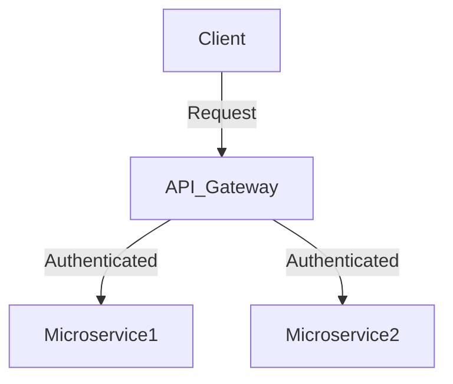
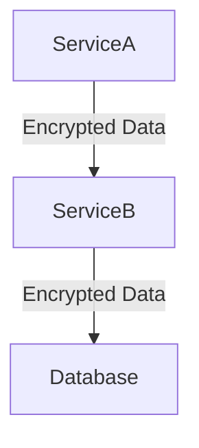

## 2.2.7 Security Patterns

In the realm of microservices, security is not just an add-on; it is a fundamental aspect that must be woven into the fabric of your architecture. As microservices architectures are inherently distributed, they introduce unique security challenges that require a comprehensive approach to protect against threats and vulnerabilities. This section delves into various security patterns essential for safeguarding microservices, ensuring that your system remains resilient against attacks while maintaining data integrity and confidentiality.

### Security in Microservices

Microservices architectures are characterized by their distributed nature, where multiple services communicate over a network. This distribution increases the attack surface, making security a critical concern. Unlike monolithic applications, where security can be centrally managed, microservices require a decentralized approach, with each service responsible for its own security measures. This decentralization necessitates robust security patterns to manage authentication, authorization, data protection, and communication security effectively.

### Authentication and Authorization Patterns

Authentication and authorization are the cornerstones of securing access to microservices. They ensure that only legitimate users and services can access resources, and they define what actions those users and services are permitted to perform.

#### OAuth 2.0

OAuth 2.0 is a widely adopted framework for delegated authorization. It allows third-party services to access user resources without exposing credentials. In a microservices context, OAuth 2.0 can be used to issue access tokens that services use to authenticate requests.

```java
// Example of using OAuth 2.0 in a Spring Boot application
@Configuration
@EnableResourceServer
public class ResourceServerConfig extends ResourceServerConfigurerAdapter {

    @Override
    public void configure(HttpSecurity http) throws Exception {
        http
            .authorizeRequests()
            .antMatchers("/api/public").permitAll()
            .antMatchers("/api/private").authenticated();
    }
}
```

#### JSON Web Tokens (JWT)

JWTs are compact, URL-safe tokens that represent claims between two parties. They are often used in microservices for stateless authentication, where the token contains all the necessary information to authenticate a request.

```java
// Example of creating a JWT in Java
import io.jsonwebtoken.Jwts;
import io.jsonwebtoken.SignatureAlgorithm;

String jwt = Jwts.builder()
    .setSubject("user")
    .claim("role", "admin")
    .signWith(SignatureAlgorithm.HS256, "secretKey")
    .compact();
```

#### API Keys

API keys are simple tokens that identify the calling program. They are often used for service-to-service communication, where the key is included in the request header.

### API Gateway Security

API Gateways play a pivotal role in microservices security by acting as a single entry point for all client requests. They enforce security policies, manage authentication, and protect against threats such as DDoS attacks.

- **Authentication and Authorization:** API Gateways can integrate with OAuth 2.0 providers to authenticate requests and enforce authorization policies.
- **Rate Limiting and Throttling:** To protect against abuse, API Gateways can limit the number of requests a client can make in a given time period.
- **Threat Protection:** API Gateways can filter out malicious requests and protect against common web vulnerabilities.



### Service-to-Service Security

Securing communication between microservices is crucial to prevent unauthorized access and data breaches. Mutual TLS (mTLS) and service mesh security features are commonly used patterns.

#### Mutual TLS (mTLS)

mTLS ensures that both the client and server authenticate each other, providing a secure channel for communication. This is particularly important in microservices, where services often communicate over untrusted networks.

```java
// Example of configuring mTLS in a Spring Boot application
@Configuration
public class SecurityConfig extends WebSecurityConfigurerAdapter {

    @Override
    protected void configure(HttpSecurity http) throws Exception {
        http
            .requiresChannel()
            .anyRequest()
            .requiresSecure();
    }
}
```

#### Service Mesh Security

Service meshes, such as Istio, provide advanced security features like mTLS, policy enforcement, and traffic encryption, making it easier to manage security across a large number of services.

### Data Encryption Patterns

Protecting sensitive data is paramount in any system. Encryption ensures that data remains confidential and secure, both at rest and in transit.

#### Data at Rest

Encrypting data at rest protects it from unauthorized access when stored in databases or file systems. This can be achieved using encryption libraries or database-specific features.

#### Data in Transit

Encrypting data in transit ensures that data exchanged between services is secure from eavesdropping and tampering. TLS is the standard protocol for securing data in transit.



### Security Token Patterns

Security tokens are used to maintain secure sessions and manage user identities across distributed systems. They encapsulate user information and permissions, allowing services to make authorization decisions.

- **Session Tokens:** Used to maintain user sessions across multiple requests.
- **Access Tokens:** Used to authorize access to specific resources or services.

### Input Validation and Sanitization

Input validation and sanitization are critical for preventing common vulnerabilities like SQL injection and cross-site scripting (XSS). By validating and sanitizing inputs, you ensure that only expected data is processed by your services.

- **Validation:** Ensure that inputs conform to expected formats and values.
- **Sanitization:** Remove or encode potentially harmful characters from inputs.

```java
// Example of input validation in Java
public void validateInput(String input) {
    if (!input.matches("[a-zA-Z0-9]+")) {
        throw new IllegalArgumentException("Invalid input");
    }
}
```

### Best Practices

Implementing security patterns effectively requires adherence to best practices:

- **Regular Security Audits:** Conduct regular audits to identify and address vulnerabilities.
- **Compliance Checks:** Ensure that your system complies with relevant security standards and regulations.
- **Automation Tools:** Leverage tools for vulnerability management and automated security testing.

### Conclusion

Security in microservices is a multifaceted challenge that requires a comprehensive approach. By implementing robust security patterns, you can protect your system from threats and ensure the confidentiality, integrity, and availability of your data and services. Remember, security is an ongoing process that requires continuous monitoring, assessment, and improvement.

## Quiz Time!



### Which of the following is a widely adopted framework for delegated authorization in microservices?

- [x] OAuth 2.0
- [ ] JWT
- [ ] API Keys
- [ ] mTLS

> **Explanation:** OAuth 2.0 is a framework for delegated authorization, allowing third-party services to access user resources without exposing credentials.

### What is the primary role of an API Gateway in microservices security?

- [x] Enforce security policies and manage authentication
- [ ] Store user credentials
- [ ] Encrypt data at rest
- [ ] Perform data analytics

> **Explanation:** An API Gateway enforces security policies, manages authentication, and protects against threats, acting as a single entry point for client requests.

### Which pattern ensures that both the client and server authenticate each other in microservices communication?

- [x] Mutual TLS (mTLS)
- [ ] OAuth 2.0
- [ ] JWT
- [ ] API Keys

> **Explanation:** Mutual TLS (mTLS) ensures that both the client and server authenticate each other, providing a secure communication channel.

### What is the purpose of encrypting data at rest?

- [x] Protect data from unauthorized access when stored
- [ ] Speed up data retrieval
- [ ] Improve data compression
- [ ] Enhance data visualization

> **Explanation:** Encrypting data at rest protects it from unauthorized access when stored in databases or file systems.

### Which of the following is used to maintain user sessions across multiple requests?

- [x] Session Tokens
- [ ] Access Tokens
- [ ] API Keys
- [ ] JWT

> **Explanation:** Session Tokens are used to maintain user sessions across multiple requests, encapsulating user information and permissions.

### What is the main advantage of using JSON Web Tokens (JWT) in microservices?

- [x] Stateless authentication
- [ ] Centralized user management
- [ ] Enhanced data encryption
- [ ] Improved network latency

> **Explanation:** JWTs are often used for stateless authentication, where the token contains all the necessary information to authenticate a request.

### Which security pattern involves removing or encoding potentially harmful characters from inputs?

- [x] Sanitization
- [ ] Validation
- [ ] Encryption
- [ ] Tokenization

> **Explanation:** Sanitization involves removing or encoding potentially harmful characters from inputs to prevent vulnerabilities like SQL injection and XSS.

### What is the role of a service mesh in microservices security?

- [x] Provide advanced security features like mTLS and policy enforcement
- [ ] Store user credentials
- [ ] Perform data analytics
- [ ] Manage user sessions

> **Explanation:** A service mesh provides advanced security features like mTLS and policy enforcement, making it easier to manage security across services.

### Which of the following is NOT a method for encrypting data in transit?

- [ ] TLS
- [x] API Keys
- [ ] mTLS
- [ ] HTTPS

> **Explanation:** API Keys are not used for encrypting data in transit; they are used for identifying the calling program.

### True or False: Regular security audits are unnecessary if you have implemented security patterns in microservices.

- [ ] True
- [x] False

> **Explanation:** Regular security audits are essential even if security patterns are implemented, as they help identify and address vulnerabilities continuously.


