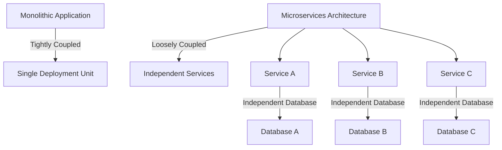

## 2.2.9 Anti-Patterns

In the world of microservices architecture, design patterns play a crucial role in guiding developers towards effective solutions. However, just as there are patterns that lead to success, there are also anti-patterns—common but ineffective or counterproductive solutions that can hinder the scalability and efficiency of a system. Understanding these anti-patterns is essential for avoiding pitfalls that can compromise the benefits of microservices.

### Understanding Anti-Patterns

Anti-patterns are recurring solutions to common problems that initially seem beneficial but ultimately lead to negative consequences. In microservices, these anti-patterns often arise from misunderstandings of the architecture's principles or from attempts to apply traditional monolithic approaches to a distributed system. Recognizing and avoiding these anti-patterns is key to maintaining the integrity and performance of a microservices-based architecture.

### Monolith in Disguise

One of the most prevalent anti-patterns in microservices is the "Monolith in Disguise." This occurs when microservices are not properly decomposed, resulting in a system that retains monolithic characteristics despite being divided into smaller services. This anti-pattern can manifest in several ways:

- **Tight Coupling:** Services are tightly interdependent, requiring coordinated deployments and updates, similar to a monolithic application.
- **Centralized Data Management:** A single database is shared across multiple services, leading to bottlenecks and limiting scalability.

**Example Scenario:**
Imagine a microservices architecture where all services depend on a central authentication service. If this service fails, the entire system becomes inoperative, mimicking the failure characteristics of a monolith.

**Avoidance Strategies:**
- Clearly define service boundaries and responsibilities.
- Ensure services are independently deployable and scalable.
- Use decentralized data management practices.

### God Service

The "God Service" anti-pattern arises when a single service accumulates too many responsibilities, becoming overly complex and difficult to maintain. This often happens when developers are hesitant to split functionality across multiple services due to perceived overhead or complexity.

**Example Scenario:**
A service responsible for user management also handles billing, notifications, and analytics. As the system grows, changes to this service become increasingly risky and time-consuming.

**Avoidance Strategies:**
- Apply the Single Responsibility Principle (SRP) to services.
- Regularly review and refactor services to ensure they remain focused and manageable.
- Use Domain-Driven Design (DDD) to guide service decomposition.

### Chatty Services

"Chatty Services" refer to microservices that engage in excessive inter-service communication, leading to performance bottlenecks and increased latency. This anti-pattern is often a result of poor service design or inadequate data aggregation strategies.

**Example Scenario:**
A front-end service requires data from multiple backend services to render a single page, resulting in numerous network calls and degraded user experience.

**Avoidance Strategies:**
- Implement API Gateway or Aggregator patterns to reduce the number of calls.
- Use asynchronous communication where appropriate to decouple services.
- Optimize data retrieval and caching strategies.

### Shared Database

The "Shared Database" anti-pattern occurs when multiple services access a single database schema, leading to tight coupling and hindering scalability. This approach contradicts the microservices principle of decentralized data management.

**Example Scenario:**
Two services, Order Management and Inventory, directly access the same database tables. Changes to the database schema require coordinated updates across both services.

**Avoidance Strategies:**
- Adopt a "Database per Service" pattern, where each service manages its own database.
- Use event-driven architectures to synchronize data between services.
- Implement data replication or synchronization mechanisms to maintain consistency.

### Service Sprawl

"Service Sprawl" describes the uncontrolled proliferation of microservices, which can lead to management challenges and infrastructural overhead. While microservices promote modularity, an excessive number of services can become unmanageable.

**Example Scenario:**
A company rapidly decomposes its monolithic application into hundreds of microservices without clear ownership or governance, resulting in operational chaos.

**Avoidance Strategies:**
- Establish clear guidelines for service creation and lifecycle management.
- Regularly review and consolidate services where appropriate.
- Implement governance frameworks to manage service dependencies and interactions.

### Synchronous Communication Overuse

Relying heavily on synchronous communication between services can reduce system resilience and scalability. This anti-pattern often emerges when developers default to synchronous APIs for inter-service communication without considering alternatives.

**Example Scenario:**
A payment processing service synchronously calls a fraud detection service, causing delays and potential failures if the fraud service is slow or unavailable.

**Avoidance Strategies:**
- Favor asynchronous communication methods, such as messaging or event streaming.
- Implement timeouts and retries to handle failures gracefully.
- Use circuit breakers to prevent cascading failures.

### Best Practices to Avoid Anti-Patterns

To effectively avoid these anti-patterns, consider the following best practices:

- **Enforce Clear Service Boundaries:** Clearly define the responsibilities and boundaries of each service to prevent overlap and complexity.
- **Promote Loose Coupling:** Design services to be loosely coupled, allowing them to evolve independently and reducing the risk of cascading failures.
- **Adhere to Established Design Principles:** Follow principles such as the Twelve-Factor App, Domain-Driven Design, and SOLID to guide service design and implementation.
- **Regularly Review and Refactor:** Continuously assess the architecture for signs of anti-patterns and refactor services as needed to maintain a healthy system.

By understanding and avoiding these common anti-patterns, developers can harness the full potential of microservices architecture, building scalable, resilient, and maintainable systems.

### Practical Java Code Example: Avoiding Chatty Services

Let's explore a practical example of how to avoid the "Chatty Services" anti-pattern by using an API Gateway to aggregate data from multiple services.

```java
// Example of an API Gateway aggregating responses from multiple services

@RestController
@RequestMapping("/api/gateway")
public class ApiGatewayController {

    private final UserServiceClient userServiceClient;
    private final OrderServiceClient orderServiceClient;

    public ApiGatewayController(UserServiceClient userServiceClient, OrderServiceClient orderServiceClient) {
        this.userServiceClient = userServiceClient;
        this.orderServiceClient = orderServiceClient;
    }

    @GetMapping("/user-details/{userId}")
    public ResponseEntity<UserDetails> getUserDetails(@PathVariable String userId) {
        // Fetch user info from User Service
        UserInfo userInfo = userServiceClient.getUserInfo(userId);

        // Fetch user orders from Order Service
        List<Order> orders = orderServiceClient.getUserOrders(userId);

        // Aggregate data into a single response
        UserDetails userDetails = new UserDetails(userInfo, orders);

        return ResponseEntity.ok(userDetails);
    }
}

// UserDetails class to aggregate user info and orders
public class UserDetails {
    private UserInfo userInfo;
    private List<Order> orders;

    public UserDetails(UserInfo userInfo, List<Order> orders) {
        this.userInfo = userInfo;
        this.orders = orders;
    }

    // Getters and setters
}

// Client interfaces for User and Order services
@FeignClient(name = "user-service")
public interface UserServiceClient {
    @GetMapping("/users/{userId}")
    UserInfo getUserInfo(@PathVariable("userId") String userId);
}

@FeignClient(name = "order-service")
public interface OrderServiceClient {
    @GetMapping("/orders/user/{userId}")
    List<Order> getUserOrders(@PathVariable("userId") String userId);
}
```

In this example, the `ApiGatewayController` acts as an aggregator, fetching data from the `UserServiceClient` and `OrderServiceClient` and combining it into a single `UserDetails` response. This approach reduces the number of network calls from the client, addressing the "Chatty Services" anti-pattern.

### Diagram: Avoiding Monolith in Disguise

Below is a diagram illustrating the difference between a monolithic architecture and a properly decomposed microservices architecture.



In the diagram, the monolithic application is represented as a single deployment unit, whereas the microservices architecture consists of independent services, each with its own database, promoting loose coupling and scalability.

### References and Further Reading

- "Building Microservices" by Sam Newman
- "Domain-Driven Design: Tackling Complexity in the Heart of Software" by Eric Evans
- Official documentation for Spring Cloud and Netflix OSS
- Online courses on microservices architecture from platforms like Coursera and Udemy

By understanding and avoiding these anti-patterns, you can ensure that your microservices architecture remains robust, scalable, and maintainable, allowing you to fully realize the benefits of this architectural style.

## Quiz Time!



### What is an anti-pattern in microservices?

- [x] A common but ineffective or counterproductive solution
- [ ] A design pattern that enhances scalability
- [ ] A pattern used to increase service coupling
- [ ] A method for improving database performance

> **Explanation:** Anti-patterns are common solutions that initially seem beneficial but ultimately lead to negative consequences in microservices architectures.

### Which anti-pattern involves a single service handling too many responsibilities?

- [x] God Service
- [ ] Monolith in Disguise
- [ ] Chatty Services
- [ ] Shared Database

> **Explanation:** The "God Service" anti-pattern occurs when a service becomes overly complex by handling too many responsibilities.

### What is a common issue with "Chatty Services"?

- [x] Performance bottlenecks and increased latency
- [ ] Reduced service autonomy
- [ ] Improved data consistency
- [ ] Enhanced security

> **Explanation:** "Chatty Services" result in excessive inter-service communication, leading to performance bottlenecks and increased latency.

### How can the "Shared Database" anti-pattern be avoided?

- [x] By adopting a "Database per Service" pattern
- [ ] By using a single database for all services
- [ ] By increasing synchronous communication
- [ ] By centralizing data management

> **Explanation:** The "Shared Database" anti-pattern can be avoided by ensuring each service manages its own database, promoting loose coupling.

### What is a drawback of overusing synchronous communication?

- [x] Reduced resilience and scalability
- [ ] Increased service autonomy
- [ ] Improved fault tolerance
- [ ] Enhanced data consistency

> **Explanation:** Overusing synchronous communication can lead to reduced resilience and scalability due to tight coupling and dependency on service availability.

### Which strategy helps avoid the "Monolith in Disguise" anti-pattern?

- [x] Ensuring services are independently deployable
- [ ] Sharing databases among services
- [ ] Increasing service interdependencies
- [ ] Using a single deployment unit

> **Explanation:** Ensuring services are independently deployable helps avoid the "Monolith in Disguise" anti-pattern by promoting loose coupling.

### What is a consequence of "Service Sprawl"?

- [x] Management challenges and infrastructural overhead
- [ ] Improved system performance
- [ ] Enhanced service cohesion
- [ ] Reduced operational complexity

> **Explanation:** "Service Sprawl" leads to management challenges and infrastructural overhead due to the uncontrolled increase in the number of services.

### How can "God Service" be mitigated?

- [x] By applying the Single Responsibility Principle
- [ ] By consolidating multiple services into one
- [ ] By increasing service responsibilities
- [ ] By centralizing service logic

> **Explanation:** Applying the Single Responsibility Principle helps mitigate the "God Service" anti-pattern by ensuring services remain focused and manageable.

### What is an effective way to reduce "Chatty Services"?

- [x] Implementing an API Gateway or Aggregator pattern
- [ ] Increasing synchronous communication
- [ ] Centralizing service logic
- [ ] Sharing databases among services

> **Explanation:** Implementing an API Gateway or Aggregator pattern reduces "Chatty Services" by minimizing the number of network calls required.

### True or False: Anti-patterns are beneficial solutions in microservices architecture.

- [ ] True
- [x] False

> **Explanation:** False. Anti-patterns are common but ineffective or counterproductive solutions that can hinder the scalability and efficiency of a microservices architecture.


