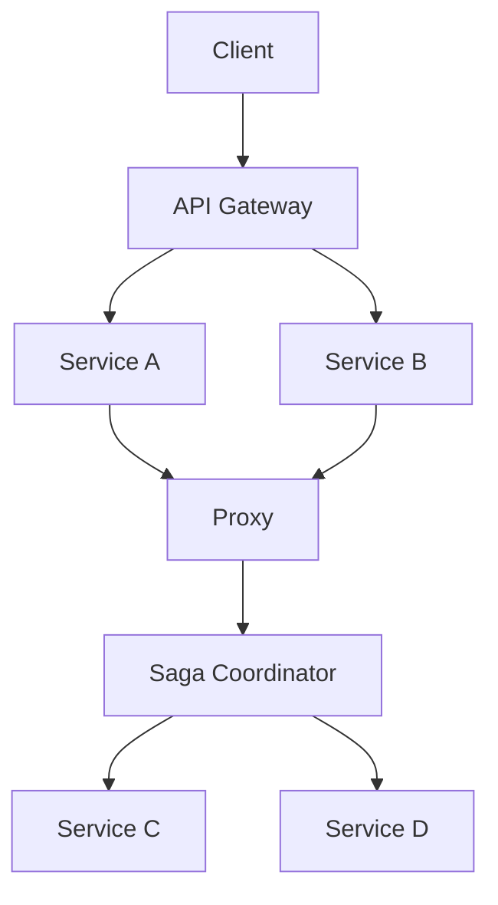

## 2.3.2 Pattern Interactions

In the realm of microservices architecture, design patterns serve as foundational building blocks that address specific challenges and enhance system capabilities. However, the true power of these patterns often emerges when they are combined and interact with one another. Understanding how patterns can complement, depend on, or even conflict with each other is crucial for designing robust, scalable, and maintainable microservices systems.

### Understanding Pattern Dependencies

Design patterns in microservices are not isolated solutions; they often depend on or influence other patterns. Recognizing these dependencies is essential for creating a cohesive architecture. For instance, the **Service Discovery Pattern** is often a prerequisite for implementing the **API Gateway Pattern**, as the gateway needs to know the location of services to route requests appropriately.

**Example:** In a microservices architecture, an API Gateway might rely on a Service Registry to dynamically discover service instances. This dependency ensures that the gateway can route requests to the appropriate service, even as instances scale up or down.

### Complementary Patterns

Certain patterns naturally complement each other, enhancing the system's overall functionality. A classic example is the combination of the **API Gateway Pattern** with the **Circuit Breaker Pattern**. The API Gateway acts as a single entry point for client requests, while the Circuit Breaker helps manage failures and prevent cascading issues by stopping requests to failing services.

**Java Code Example:**

```java
// Example of integrating Circuit Breaker with API Gateway using Resilience4j

import io.github.resilience4j.circuitbreaker.CircuitBreaker;
import io.github.resilience4j.circuitbreaker.CircuitBreakerConfig;
import io.github.resilience4j.circuitbreaker.CircuitBreakerRegistry;

import java.time.Duration;

public class ApiGateway {

    private CircuitBreaker circuitBreaker;

    public ApiGateway() {
        CircuitBreakerConfig config = CircuitBreakerConfig.custom()
                .failureRateThreshold(50)
                .waitDurationInOpenState(Duration.ofMillis(1000))
                .build();

        CircuitBreakerRegistry registry = CircuitBreakerRegistry.of(config);
        this.circuitBreaker = registry.circuitBreaker("apiGatewayCircuitBreaker");
    }

    public String routeRequest(String serviceUrl) {
        return circuitBreaker.executeSupplier(() -> {
            // Logic to route request to the service
            return "Response from " + serviceUrl;
        });
    }
}
```

In this example, the API Gateway uses a Circuit Breaker to manage requests to downstream services, enhancing resilience by preventing requests to services that are currently failing.

### Avoiding Conflicts

While patterns can complement each other, they can also conflict if not carefully managed. Conflicts often arise from overlapping responsibilities or contradictory design principles. For example, both the **Aggregator Pattern** and the **Chained Microservice Pattern** aim to compose responses from multiple services, but they do so in different ways. Using both without clear boundaries can lead to confusion and increased complexity.

**Resolution Strategy:** Clearly define the roles and responsibilities of each pattern within the architecture. Use the Aggregator Pattern for scenarios where a single response is needed from multiple services, and reserve the Chained Microservice Pattern for sequential processing tasks.

### Layered Architecture Integration

Patterns must fit seamlessly into the architecture's layers to maintain a harmonious system design. For instance, the **Proxy Pattern** can be used in the infrastructure layer to handle cross-cutting concerns like authentication and logging, while the **Saga Pattern** operates at the business logic layer to manage distributed transactions.

**Mermaid Diagram:**



This diagram illustrates how different patterns interact across layers, with the Proxy handling cross-cutting concerns and the Saga managing business transactions.

### Combined Effectiveness

Combining multiple patterns can address complex architectural challenges more effectively than using individual patterns alone. For example, integrating the **Bulkhead Pattern** with the **Retry Pattern** can enhance system resilience by isolating failures and retrying failed operations without overwhelming the system.

**Design Considerations:**

- **Complexity Management:** Ensure that the combination of patterns does not introduce unnecessary complexity. Each pattern should have a clear purpose and contribute positively to the overall architecture.
- **Performance Impact:** Evaluate the performance implications of combined patterns. Some patterns, like retries, can increase latency if not configured correctly.

### Case Examples

**Real-World Example:** A leading e-commerce platform successfully combined the **API Gateway Pattern** with the **Service Mesh Pattern** to manage traffic and enhance security. The API Gateway handled client requests, while the Service Mesh provided fine-grained control over service-to-service communication, improving both performance and security.

**Benefits Achieved:**

- **Improved Security:** Enhanced security through mTLS and policy enforcement at the service mesh level.
- **Scalability:** Seamless scaling of services with dynamic routing and load balancing.

### Design Considerations

When combining patterns, consider the following guidelines to ensure they work synergistically:

- **Document Interactions:** Clearly document how patterns interact and depend on each other. This documentation aids in understanding the architecture and facilitates onboarding new team members.
- **Communicate Effectively:** Ensure that development and operations teams understand the rationale behind pattern combinations and their implementation details. This communication is crucial for consistent and effective implementation.

### Documentation and Communication

Effective documentation and communication are vital for the successful implementation of pattern interactions. Use diagrams, flowcharts, and detailed documentation to convey the architecture's design and the role of each pattern. Regularly update this documentation to reflect changes and improvements.

**Best Practices:**

- **Use Visual Aids:** Diagrams and flowcharts can simplify complex interactions and make them more accessible.
- **Regular Reviews:** Conduct regular architecture reviews to ensure that pattern interactions remain effective and aligned with business goals.

### Conclusion

Understanding and leveraging pattern interactions is key to building scalable and resilient microservices architectures. By recognizing dependencies, complementing patterns, and avoiding conflicts, architects can design systems that are both robust and flexible. Effective documentation and communication further ensure that these patterns are implemented consistently and effectively, leading to successful microservices deployments.

## Quiz Time!



### Which pattern is often a prerequisite for implementing the API Gateway Pattern?

- [x] Service Discovery Pattern
- [ ] Circuit Breaker Pattern
- [ ] Bulkhead Pattern
- [ ] Saga Pattern

> **Explanation:** The Service Discovery Pattern is crucial for an API Gateway to dynamically discover service instances and route requests appropriately.

### What is a common complementary pattern to the API Gateway Pattern for enhancing resilience?

- [x] Circuit Breaker Pattern
- [ ] Aggregator Pattern
- [ ] Proxy Pattern
- [ ] Adapter Pattern

> **Explanation:** The Circuit Breaker Pattern is often used with the API Gateway to manage failures and prevent cascading issues.

### What potential conflict can arise when using both the Aggregator Pattern and the Chained Microservice Pattern?

- [x] Overlapping responsibilities
- [ ] Increased security
- [ ] Enhanced performance
- [ ] Simplified architecture

> **Explanation:** Both patterns aim to compose responses from multiple services, but they do so differently, leading to overlapping responsibilities.

### Which pattern operates at the business logic layer to manage distributed transactions?

- [x] Saga Pattern
- [ ] Proxy Pattern
- [ ] API Gateway Pattern
- [ ] Bulkhead Pattern

> **Explanation:** The Saga Pattern is used at the business logic layer to manage distributed transactions.

### What is a key benefit of combining the Bulkhead Pattern with the Retry Pattern?

- [x] Enhanced system resilience
- [ ] Reduced latency
- [ ] Simplified architecture
- [ ] Increased complexity

> **Explanation:** Combining these patterns enhances system resilience by isolating failures and retrying failed operations without overwhelming the system.

### What should be considered to ensure that combined patterns do not introduce unnecessary complexity?

- [x] Complexity Management
- [ ] Increased redundancy
- [ ] Simplified documentation
- [ ] Enhanced security

> **Explanation:** Complexity management ensures that each pattern has a clear purpose and contributes positively to the overall architecture.

### What is a key advantage of using visual aids like diagrams and flowcharts in documenting pattern interactions?

- [x] Simplifying complex interactions
- [ ] Increasing system performance
- [ ] Reducing documentation size
- [ ] Enhancing security

> **Explanation:** Visual aids help simplify complex interactions, making them more accessible and understandable.

### What is a common benefit achieved by combining the API Gateway Pattern with the Service Mesh Pattern?

- [x] Improved security
- [ ] Reduced latency
- [ ] Simplified architecture
- [ ] Increased complexity

> **Explanation:** Combining these patterns can improve security through mTLS and policy enforcement at the service mesh level.

### Why is effective communication important when implementing pattern interactions?

- [x] Ensures consistent and effective implementation
- [ ] Reduces system performance
- [ ] Increases documentation size
- [ ] Enhances security

> **Explanation:** Effective communication ensures that development and operations teams understand the rationale behind pattern combinations and their implementation details.

### True or False: The Proxy Pattern is typically used at the business logic layer.

- [ ] True
- [x] False

> **Explanation:** The Proxy Pattern is usually used in the infrastructure layer to handle cross-cutting concerns like authentication and logging.


