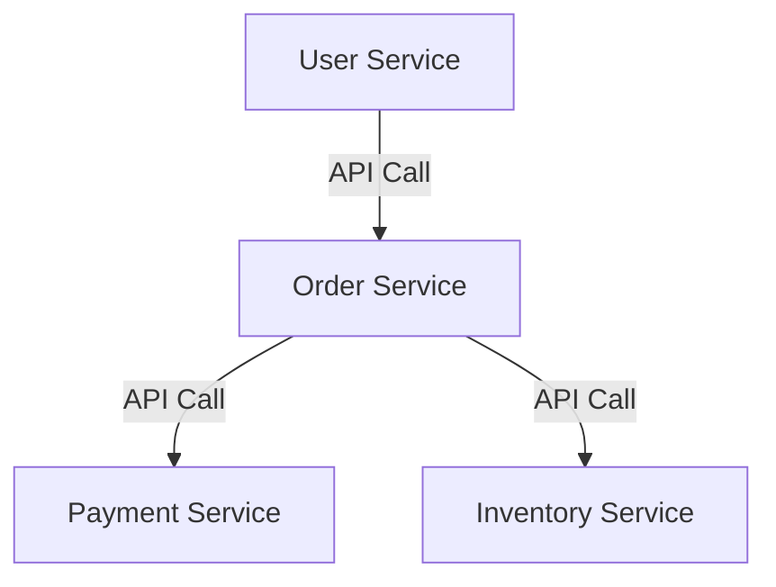
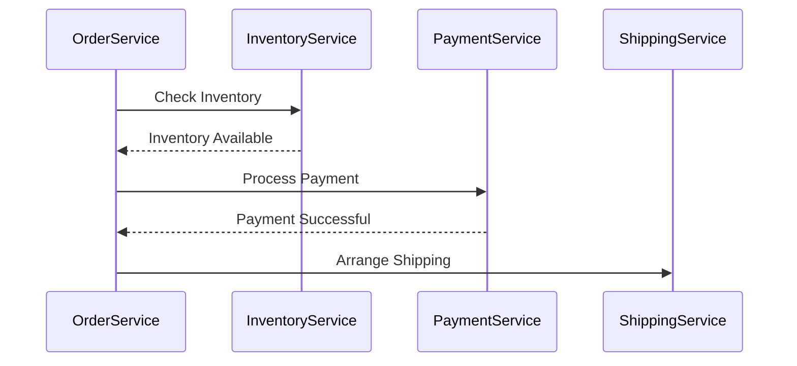

## B.1 Key Microservices Terms

In the realm of software architecture, microservices have emerged as a transformative approach to building scalable and maintainable systems. Understanding the key terms associated with microservices is crucial for anyone looking to design, implement, or manage these systems effectively. This section delves into essential microservices concepts, providing clear definitions, practical examples, and insights into their application.

### Microservices

**Definition:** Microservices is an architectural style that structures an application as a collection of small, autonomous services, each running in its own process and communicating with lightweight mechanisms, often HTTP-based APIs. These services are built around business capabilities and can be developed, deployed, and scaled independently.

**Key Characteristics:**
- **Independence:** Each microservice is a standalone unit that can be developed and deployed independently.
- **Decentralized Data Management:** Microservices often manage their own databases, promoting data ownership and reducing dependencies.
- **Resilience:** The failure of one service does not necessarily affect the entire system, enhancing fault tolerance.

**Practical Example:**
Consider an e-commerce application with separate microservices for user management, product catalog, order processing, and payment. Each service can be developed in different programming languages and deployed independently, allowing teams to work concurrently and release features faster.

```java
// Example of a simple microservice in Java using Spring Boot

@RestController
@RequestMapping("/products")
public class ProductService {

    @GetMapping("/{id}")
    public ResponseEntity<Product> getProduct(@PathVariable String id) {
        // Logic to retrieve product details
        Product product = productService.findProductById(id);
        return ResponseEntity.ok(product);
    }

    @PostMapping
    public ResponseEntity<Product> createProduct(@RequestBody Product product) {
        // Logic to create a new product
        Product createdProduct = productService.saveProduct(product);
        return ResponseEntity.status(HttpStatus.CREATED).body(createdProduct);
    }
}
```

### Service Autonomy

**Definition:** Service autonomy is the principle that each microservice operates independently, encapsulating its own data, logic, and lifecycle. This autonomy allows services to evolve without impacting others, fostering agility and scalability.

**Benefits:**
- **Independent Deployment:** Services can be updated or scaled without affecting others.
- **Technology Diversity:** Teams can choose the best technology stack for each service.
- **Fault Isolation:** Issues in one service do not cascade to others.

**Real-World Scenario:**
In a financial application, the billing service can be updated to support new payment methods without requiring changes to the user authentication service.

### Bounded Context

**Definition:** A bounded context is a design boundary within which a particular model is defined and applicable. It is a core concept in Domain-Driven Design (DDD) that helps manage complexity by clearly delineating where specific terms and models apply.

**Importance:**
- **Clarity:** Ensures that models are consistent and meaningful within their context.
- **Decoupling:** Reduces dependencies between different parts of the system.

**Example:**
In a healthcare system, the term "patient" might mean different things in the billing context versus the clinical context. Each context has its own model and logic.



### API Gateway

**Definition:** An API Gateway is a server that acts as a single entry point for all client requests, routing them to the appropriate microservices. It handles tasks such as request routing, composition, and protocol translation.

**Functions:**
- **Security:** Enforces authentication and authorization.
- **Load Balancing:** Distributes incoming requests across multiple instances.
- **Monitoring:** Provides insights into API usage and performance.

**Example:**
In a microservices architecture, an API Gateway can aggregate data from multiple services to provide a unified response to the client.

```java
// Example of an API Gateway pattern using Spring Cloud Gateway

@SpringBootApplication
public class ApiGatewayApplication {

    public static void main(String[] args) {
        SpringApplication.run(ApiGatewayApplication.class, args);
    }

    @Bean
    public RouteLocator customRouteLocator(RouteLocatorBuilder builder) {
        return builder.routes()
                .route("product_route", r -> r.path("/products/**")
                        .uri("http://product-service"))
                .route("order_route", r -> r.path("/orders/**")
                        .uri("http://order-service"))
                .build();
    }
}
```

### Service Mesh

**Definition:** A service mesh is a dedicated infrastructure layer for managing service-to-service communication within a microservices architecture. It provides capabilities such as load balancing, authentication, monitoring, and more.

**Advantages:**
- **Observability:** Offers insights into service interactions and performance.
- **Security:** Facilitates secure communication between services.
- **Traffic Management:** Controls the flow of traffic and API calls between services.

**Example:**
Using a service mesh like Istio, you can implement mutual TLS (mTLS) to secure communication between microservices without modifying application code.

### CQRS (Command Query Responsibility Segregation)

**Definition:** CQRS is a pattern that separates read and write operations into distinct models, optimizing performance and scalability. The command model handles updates, while the query model handles reads.

**Benefits:**
- **Scalability:** Allows independent scaling of read and write operations.
- **Performance:** Optimizes queries by using denormalized data models.

**Example:**
In an online store, the command model updates inventory levels, while the query model retrieves product details for display.

```java
// Example of CQRS pattern in Java

// Command Model
public class ProductCommandService {
    public void updateProductStock(String productId, int quantity) {
        // Logic to update product stock
    }
}

// Query Model
public class ProductQueryService {
    public Product getProductDetails(String productId) {
        // Logic to retrieve product details
        return productRepository.findById(productId);
    }
}
```

### Saga Pattern

**Definition:** The Saga pattern is a sequence of local transactions that manage distributed transactions, ensuring data consistency across microservices. Each transaction updates the database and publishes an event or message.

**Types:**
- **Orchestration:** A central coordinator manages the saga.
- **Choreography:** Each service listens for events and decides when to act.

**Example:**
In an e-commerce system, a saga might handle an order process that involves inventory checks, payment processing, and shipping.



### Event Sourcing

**Definition:** Event sourcing is a technique where state changes are logged as a sequence of events. This allows for full auditability and replayability, as the current state can be rebuilt by replaying events.

**Benefits:**
- **Auditability:** Provides a complete history of changes.
- **Consistency:** Ensures that all changes are captured as events.

**Example:**
In a banking application, every transaction (deposit, withdrawal) is stored as an event, allowing the account balance to be reconstructed by replaying these events.

```java
// Example of Event Sourcing in Java

public class Account {
    private List<Event> changes = new ArrayList<>();

    public void deposit(BigDecimal amount) {
        applyChange(new MoneyDepositedEvent(amount));
    }

    public void withdraw(BigDecimal amount) {
        applyChange(new MoneyWithdrawnEvent(amount));
    }

    private void applyChange(Event event) {
        changes.add(event);
        // Logic to apply the event to the current state
    }
}
```

### Conclusion

Understanding these key microservices terms is fundamental to designing and implementing scalable, resilient, and maintainable systems. Each concept plays a crucial role in the microservices architecture, offering unique benefits and addressing specific challenges. By mastering these terms, developers and architects can create systems that are not only efficient but also adaptable to changing business needs.

For further exploration, consider delving into official documentation, open-source projects, and additional resources such as books and online courses that provide deeper insights into these topics.

## Quiz Time!



### What is the primary benefit of using microservices architecture?

- [x] Independent deployment and scalability
- [ ] Centralized data management
- [ ] Monolithic codebase
- [ ] Single point of failure

> **Explanation:** Microservices architecture allows for independent deployment and scalability, enabling each service to be developed, deployed, and scaled independently.

### What does service autonomy in microservices imply?

- [x] Each service operates independently with its own data and logic
- [ ] All services share a common database
- [ ] Services depend on each other for data
- [ ] Services are tightly coupled

> **Explanation:** Service autonomy means each microservice operates independently, encapsulating its own data and logic, which allows for independent development and deployment.

### What is a bounded context in Domain-Driven Design?

- [x] A design boundary within which a particular model is defined and applicable
- [ ] A shared database among services
- [ ] A centralized service for all business logic
- [ ] A global context for all models

> **Explanation:** A bounded context is a design boundary within which a particular model is defined and applicable, ensuring clarity and reducing dependencies.

### What role does an API Gateway play in microservices architecture?

- [x] Acts as a single entry point for client requests, routing them to appropriate services
- [ ] Stores data for all services
- [ ] Manages service-to-service communication
- [ ] Provides direct access to databases

> **Explanation:** An API Gateway acts as a single entry point for client requests, routing them to the appropriate microservices and handling tasks like security and load balancing.

### What is a service mesh used for in microservices?

- [x] Managing service-to-service communication
- [ ] Storing service configurations
- [ ] Providing a user interface
- [ ] Centralizing business logic

> **Explanation:** A service mesh is used for managing service-to-service communication, offering capabilities like load balancing, authentication, and monitoring.

### What is the main advantage of using CQRS?

- [x] Separates read and write operations into distinct models
- [ ] Combines read and write operations into one model
- [ ] Centralizes all data in a single database
- [ ] Eliminates the need for databases

> **Explanation:** CQRS separates read and write operations into distinct models, optimizing performance and scalability by allowing independent scaling of these operations.

### How does the Saga pattern ensure data consistency?

- [x] By managing distributed transactions as a sequence of local transactions
- [ ] By using a single global transaction
- [ ] By centralizing all data in one service
- [ ] By eliminating the need for transactions

> **Explanation:** The Saga pattern ensures data consistency by managing distributed transactions as a sequence of local transactions, each updating the database and publishing an event.

### What is event sourcing?

- [x] A technique where state changes are logged as a sequence of events
- [ ] A method for direct database access
- [ ] A centralized logging system
- [ ] A way to eliminate events in the system

> **Explanation:** Event sourcing is a technique where state changes are logged as a sequence of events, allowing for full auditability and replayability.

### Which of the following is a key benefit of event sourcing?

- [x] Full auditability and replayability of state changes
- [ ] Centralized data management
- [ ] Eliminates the need for databases
- [ ] Direct access to all services

> **Explanation:** Event sourcing provides full auditability and replayability of state changes, as the current state can be rebuilt by replaying events.

### True or False: In microservices, each service should ideally have its own database.

- [x] True
- [ ] False

> **Explanation:** True. In microservices, each service should ideally have its own database to ensure service autonomy and reduce dependencies.


