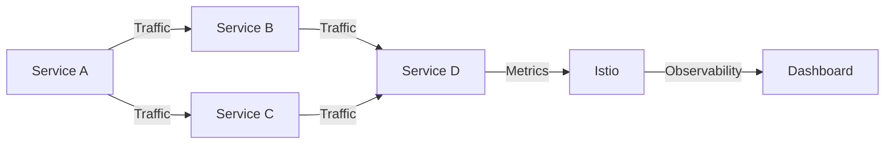

## C.4 Open Source Projects

In the realm of microservices, open source projects play a pivotal role in shaping how developers design, deploy, and manage their systems. These projects provide robust tools and frameworks that simplify complex tasks, enhance scalability, and ensure resilience. This section delves into some of the most influential open source projects that have become cornerstones in the microservices ecosystem.

### Spring Boot

Spring Boot is a powerful framework that simplifies the creation of stand-alone, production-grade Spring-based applications. It is particularly well-suited for building microservices due to its ability to streamline the configuration and deployment processes. By leveraging the Spring ecosystem, Spring Boot reduces the boilerplate code and provides a suite of tools for developing robust microservices.

**Key Features:**
- **Auto-Configuration:** Automatically configures Spring applications based on the dependencies present in the classpath.
- **Embedded Servers:** Supports embedded servers like Tomcat, Jetty, and Undertow, allowing microservices to run independently.
- **Spring Cloud Integration:** Works seamlessly with Spring Cloud to provide solutions for configuration management, service discovery, and circuit breakers.

**Example:**
```java
import org.springframework.boot.SpringApplication;
import org.springframework.boot.autoconfigure.SpringBootApplication;

@SpringBootApplication
public class Application {
    public static void main(String[] args) {
        SpringApplication.run(Application.class, args);
    }
}
```

### Netflix OSS

Netflix OSS is a set of frameworks and libraries developed by Netflix to solve common microservices challenges. Key components include:

- **Eureka:** A service registry that enables service discovery, allowing microservices to find and communicate with each other.
- **Zuul:** An edge service that provides dynamic routing, monitoring, resiliency, and security.
- **Hystrix:** A latency and fault tolerance library designed to isolate points of access to remote systems, services, and third-party libraries.

**Applications:**
- **Eureka** is used to register and discover services, ensuring that microservices can dynamically locate each other.
- **Zuul** acts as a gateway that routes requests to appropriate microservices, handling cross-cutting concerns like authentication.
- **Hystrix** prevents cascading failures by providing fallback options and monitoring service health.

### Istio

Istio is a service mesh that provides a uniform way to secure, connect, and observe microservices. It abstracts the network layer, allowing developers to focus on business logic.

**Capabilities:**
- **Traffic Management:** Controls the flow of traffic and API calls between services.
- **Security:** Provides service-to-service authentication, encryption, and authorization.
- **Observability:** Offers insights into service behavior and performance through metrics, logs, and traces.

**Diagram:**


### Kubernetes

Kubernetes is the leading container orchestration platform that automates the deployment, scaling, and management of containerized applications. It is essential for managing microservices at scale.

**Features:**
- **Automated Rollouts and Rollbacks:** Manages changes to applications or their configurations.
- **Self-Healing:** Restarts failed containers, replaces and reschedules containers when nodes die.
- **Horizontal Scaling:** Automatically scales applications up and down based on demand.

**Example:**
```yaml
apiVersion: apps/v1
kind: Deployment
metadata:
  name: my-microservice
spec:
  replicas: 3
  selector:
    matchLabels:
      app: my-microservice
  template:
    metadata:
      labels:
        app: my-microservice
    spec:
      containers:
      - name: my-microservice
        image: my-microservice-image:latest
```

### Prometheus

Prometheus is a powerful monitoring and alerting toolkit designed for reliability and scalability. It is widely used for collecting metrics and generating alerts in microservices environments.

**Role:**
- **Time Series Database:** Stores metrics data in a time series format.
- **Alerting:** Supports alerting based on the collected metrics.
- **Visualization:** Integrates with Grafana for creating dashboards.

**Example Query:**
```promql
rate(http_requests_total[5m])
```

### Jaeger

Jaeger is an open-source, end-to-end distributed tracing system. It helps in monitoring and troubleshooting transactions in complex microservices architectures.

**Functionality:**
- **Tracing:** Captures request flows across microservices.
- **Performance Optimization:** Identifies bottlenecks and latency issues.
- **Root Cause Analysis:** Facilitates debugging by providing detailed trace information.

### Docker

Docker revolutionized the way applications are built, shipped, and run by introducing containerization. It ensures that microservices run in consistent environments across different stages of development.

**Significance:**
- **Isolation:** Each microservice runs in its own container, ensuring isolation.
- **Portability:** Containers can be run on any system that supports Docker.
- **Efficiency:** Containers are lightweight, enabling efficient resource utilization.

**Example:**
```dockerfile
FROM openjdk:11-jre-slim
COPY target/my-microservice.jar /app/my-microservice.jar
ENTRYPOINT ["java", "-jar", "/app/my-microservice.jar"]
```

### OpenTelemetry

OpenTelemetry provides a standardized approach to collecting telemetry data, such as traces, metrics, and logs, from microservices.

**Purpose:**
- **Unified Observability:** Combines metrics, logs, and traces into a single framework.
- **Vendor-Neutral:** Supports multiple backends and is not tied to any specific vendor.
- **Extensibility:** Easily integrates with existing observability tools.

### HashiCorp Consul

Consul is a tool for service discovery and configuration. It provides a distributed, highly available service mesh that enables secure service communication.

**Role:**
- **Service Discovery:** Allows services to register themselves and discover other services.
- **Configuration Management:** Distributes configuration data across services.
- **Secure Communication:** Provides service segmentation and encryption.

### GraphQL

GraphQL is a query language for APIs that allows clients to request exactly the data they need. It is particularly useful in microservices architectures for API composition and efficient data retrieval.

**Advantages:**
- **Flexible Queries:** Clients can specify the shape and size of the data returned.
- **Efficient Data Retrieval:** Reduces over-fetching and under-fetching of data.
- **Strongly Typed Schema:** Provides a clear contract between client and server.

### Pact

Pact is a consumer-driven contract testing tool that ensures microservices interactions are reliable and consistent.

**Utility:**
- **Contract Testing:** Verifies that services adhere to the agreed-upon API contracts.
- **Consumer-Driven:** Contracts are defined by the consumer, ensuring their needs are met.
- **Integration Testing:** Facilitates testing of service interactions without requiring all services to be deployed.

### Helm

Helm is a package manager for Kubernetes that simplifies the deployment and management of microservices and their dependencies.

**Features:**
- **Charts:** Packages of pre-configured Kubernetes resources.
- **Versioning:** Supports versioned deployments, enabling rollbacks.
- **Templating:** Allows for dynamic configuration of Kubernetes resources.

### Skaffold

Skaffold is a command-line tool that facilitates continuous development for Kubernetes applications, including microservices.

**Role:**
- **Development Workflow:** Automates the build, push, and deploy process.
- **Hot Reloading:** Enables rapid iteration by automatically deploying changes.
- **Integration:** Works with existing CI/CD pipelines.

### Kustomize

Kustomize is a configuration management tool for Kubernetes that allows for declarative management of microservices deployments.

**Capabilities:**
- **Overlay System:** Enables customization of Kubernetes resources without modifying the original files.
- **Declarative Management:** Supports managing configurations in a declarative manner.
- **Resource Composition:** Allows combining multiple resources into a single configuration.

### Linkerd

Linkerd is an open-source service mesh focused on simplicity and performance for microservices communication.

**Highlights:**
- **Lightweight:** Designed to be simple and easy to use.
- **Security:** Provides mTLS for secure communication between services.
- **Observability:** Offers built-in metrics and tracing capabilities.

### Conclusion

These open source projects form the backbone of modern microservices architectures, providing the tools necessary to build, deploy, and manage scalable and resilient systems. By leveraging these projects, developers can focus on delivering business value while relying on proven solutions for common challenges.

## Quiz Time!



### Which framework simplifies the creation of Spring-based microservices?

- [x] Spring Boot
- [ ] Netflix OSS
- [ ] Istio
- [ ] Kubernetes

> **Explanation:** Spring Boot is designed to simplify the creation of Spring-based applications, making it ideal for microservices development.

### What is the primary role of Netflix OSS's Eureka?

- [x] Service discovery
- [ ] Traffic management
- [ ] Distributed tracing
- [ ] Container orchestration

> **Explanation:** Eureka is a service registry that enables service discovery, allowing microservices to find and communicate with each other.

### Which tool is used for distributed tracing in microservices?

- [ ] Prometheus
- [x] Jaeger
- [ ] Docker
- [ ] Helm

> **Explanation:** Jaeger is an open-source tool for end-to-end distributed tracing, helping to trace requests across microservices.

### What is the main purpose of Istio in a microservices architecture?

- [ ] Containerization
- [x] Service mesh management
- [ ] API composition
- [ ] Contract testing

> **Explanation:** Istio is a service mesh that provides a uniform way to secure, connect, and observe microservices.

### Which open source project is a package manager for Kubernetes?

- [ ] Skaffold
- [ ] Kustomize
- [x] Helm
- [ ] Linkerd

> **Explanation:** Helm is a package manager for Kubernetes, simplifying the deployment and management of applications.

### What does Prometheus primarily do in a microservices environment?

- [x] Monitoring and alerting
- [ ] Service discovery
- [ ] API gateway management
- [ ] Configuration management

> **Explanation:** Prometheus is used for monitoring and alerting, collecting metrics from microservices environments.

### Which tool facilitates continuous development for Kubernetes applications?

- [ ] Consul
- [x] Skaffold
- [ ] Pact
- [ ] OpenTelemetry

> **Explanation:** Skaffold automates the build, push, and deploy process, facilitating continuous development for Kubernetes applications.

### What is the main advantage of using GraphQL in microservices?

- [ ] Service discovery
- [x] Efficient data retrieval
- [ ] Container orchestration
- [ ] Distributed tracing

> **Explanation:** GraphQL allows clients to request exactly the data they need, making data retrieval more efficient.

### Which project provides a standardized approach to collecting telemetry data?

- [ ] Docker
- [ ] Jaeger
- [x] OpenTelemetry
- [ ] Linkerd

> **Explanation:** OpenTelemetry provides a standardized approach to collecting telemetry data, such as traces, metrics, and logs.

### True or False: Linkerd is a service mesh focused on simplicity and performance.

- [x] True
- [ ] False

> **Explanation:** Linkerd is designed to be a lightweight service mesh that focuses on simplicity and performance for microservices communication.


