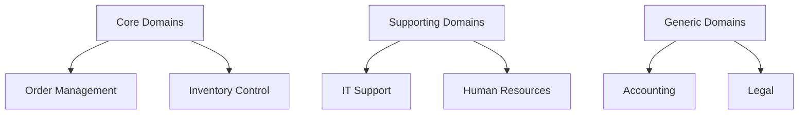

## 3.1.1 Identifying Business Capabilities

In the realm of microservices architecture, identifying business capabilities is a crucial step in designing systems that are scalable, maintainable, and aligned with business objectives. Business capabilities represent distinct areas of functionality that deliver value to customers and are foundational to the decomposition of services. This section delves into the process of identifying these capabilities, mapping business domains, engaging stakeholders, and prioritizing capabilities to inform service design.

### Defining Business Capabilities

Business capabilities are the core building blocks of an organization, encapsulating what the business does to deliver value to its customers. They are not tied to specific processes or technologies but rather represent stable constructs that define the organization's abilities. For example, a retail company might have capabilities such as "Order Management," "Inventory Control," and "Customer Relationship Management."

**Key Characteristics of Business Capabilities:**
- **Stable Over Time:** Unlike processes, which may change frequently, capabilities tend to remain stable.
- **Value-Oriented:** They focus on delivering value to customers or the business itself.
- **Independent of Organizational Structure:** Capabilities are not confined to specific departments or teams.

### Mapping Business Domains

Mapping business domains involves identifying and categorizing the various areas within an organization to understand where core, supporting, and generic capabilities lie. This mapping helps in visualizing the organization's landscape and identifying areas for potential service decomposition.

**Steps to Map Business Domains:**
1. **Identify Core Domains:** These are the domains that directly contribute to the organization's unique value proposition. For instance, in a financial institution, "Risk Management" might be a core domain.
2. **Identify Supporting Domains:** These domains support core domains but do not directly deliver customer value. Examples include "Human Resources" and "IT Support."
3. **Identify Generic Domains:** These are common across many organizations, such as "Accounting" and "Legal."

**Mermaid Diagram Example:**



### Engaging Stakeholders

Engaging business stakeholders is essential in identifying and defining business capabilities. Stakeholders provide insights into business goals, customer needs, and strategic priorities, ensuring that the identified capabilities align with the organization's objectives.

**Strategies for Stakeholder Engagement:**
- **Workshops and Interviews:** Conduct sessions with stakeholders to gather insights and validate identified capabilities.
- **Cross-Functional Teams:** Involve representatives from different departments to ensure a holistic view.
- **Feedback Loops:** Establish mechanisms for continuous feedback and refinement.

### Using Value Stream Mapping

Value stream mapping is a powerful tool for visualizing and analyzing the flow of value through various business capabilities. It helps in identifying bottlenecks, inefficiencies, and areas for improvement.

**Steps for Value Stream Mapping:**
1. **Define the Scope:** Identify the start and end points of the value stream.
2. **Map the Current State:** Document the current flow of value, including processes, information, and interactions.
3. **Identify Waste:** Look for delays, redundancies, and non-value-adding activities.
4. **Design the Future State:** Propose improvements to enhance value delivery.

**Example Value Stream Map:**


### Prioritizing Capabilities

Not all business capabilities are created equal. Prioritizing them based on factors such as customer impact, revenue potential, and strategic importance is crucial for effective service decomposition.

**Criteria for Prioritization:**
- **Customer Impact:** Capabilities that directly affect customer satisfaction and experience.
- **Revenue Potential:** Capabilities that have a significant impact on the organization's bottom line.
- **Strategic Importance:** Capabilities that align with long-term business goals and competitive advantage.

### Documenting Capabilities

Documenting identified business capabilities is vital for maintaining clarity and consistency. This documentation serves as a reference for designing microservices and ensuring alignment across the organization.

**Documentation Techniques:**
- **Capability Maps:** Visual representations of capabilities and their relationships.
- **Descriptive Texts:** Detailed descriptions of each capability, including its purpose, value, and key stakeholders.
- **Use Cases:** Scenarios illustrating how capabilities deliver value in real-world contexts.

### Analyzing Dependencies

Understanding dependencies between different business capabilities is essential for defining service boundaries and interactions. This analysis helps in designing services that are loosely coupled and independently deployable.

**Dependency Analysis Steps:**
1. **Identify Interactions:** Determine how capabilities interact and depend on each other.
2. **Assess Impact:** Evaluate the impact of changes in one capability on others.
3. **Design for Independence:** Aim to minimize dependencies to enhance service autonomy.

### Continuous Refinement

Business capabilities are not static; they evolve with changing business needs and market conditions. Regularly reviewing and refining capabilities ensures that the microservices architecture remains relevant and effective.

**Continuous Refinement Practices:**
- **Periodic Reviews:** Schedule regular assessments of capabilities and their alignment with business goals.
- **Adaptation to Change:** Be responsive to shifts in market dynamics, customer preferences, and technological advancements.
- **Feedback Integration:** Incorporate feedback from stakeholders and end-users to drive improvements.

### Practical Java Code Example

To illustrate the concept of business capabilities, let's consider a Java example where we define a simple capability for "Order Management."

```java
public class OrderManagement {

    private List<Order> orders = new ArrayList<>();

    // Method to place a new order
    public void placeOrder(Order order) {
        orders.add(order);
        System.out.println("Order placed: " + order);
    }

    // Method to cancel an existing order
    public void cancelOrder(int orderId) {
        orders.removeIf(order -> order.getId() == orderId);
        System.out.println("Order canceled: " + orderId);
    }

    // Method to list all orders
    public List<Order> listOrders() {
        return new ArrayList<>(orders);
    }

    // Inner class representing an Order
    public static class Order {
        private int id;
        private String product;
        private int quantity;

        public Order(int id, String product, int quantity) {
            this.id = id;
            this.product = product;
            this.quantity = quantity;
        }

        public int getId() {
            return id;
        }

        @Override
        public String toString() {
            return "Order{id=" + id + ", product='" + product + "', quantity=" + quantity + '}';
        }
    }

    public static void main(String[] args) {
        OrderManagement orderManagement = new OrderManagement();
        Order order1 = new Order(1, "Laptop", 2);
        Order order2 = new Order(2, "Smartphone", 5);

        orderManagement.placeOrder(order1);
        orderManagement.placeOrder(order2);

        System.out.println("All Orders: " + orderManagement.listOrders());

        orderManagement.cancelOrder(1);
        System.out.println("All Orders after cancellation: " + orderManagement.listOrders());
    }
}
```

**Explanation:**
- The `OrderManagement` class represents a business capability for managing orders.
- It provides methods to place, cancel, and list orders, encapsulating the functionality related to order management.
- The `Order` inner class models an order with attributes such as `id`, `product`, and `quantity`.

### Conclusion

Identifying business capabilities is a foundational step in designing microservices architectures that are aligned with business objectives and capable of delivering value. By mapping business domains, engaging stakeholders, using value stream mapping, and prioritizing capabilities, organizations can effectively decompose services and create scalable systems. Continuous refinement ensures that the architecture remains adaptable to changing needs and market conditions.

## Quiz Time!



### What are business capabilities?

- [x] Distinct areas of functionality that deliver value to customers
- [ ] Specific technologies used by a business
- [ ] Organizational departments
- [ ] Individual business processes

> **Explanation:** Business capabilities are distinct areas of functionality that deliver value to customers and are not tied to specific technologies or organizational structures.

### Which tool is used to visualize and analyze the flow of value through business capabilities?

- [ ] Gantt Chart
- [x] Value Stream Mapping
- [ ] SWOT Analysis
- [ ] Fishbone Diagram

> **Explanation:** Value stream mapping is used to visualize and analyze the flow of value through business capabilities, identifying inefficiencies and areas for improvement.

### What is the purpose of engaging stakeholders in identifying business capabilities?

- [x] To ensure alignment with business goals
- [ ] To increase the number of capabilities
- [ ] To reduce the complexity of capabilities
- [ ] To automate the identification process

> **Explanation:** Engaging stakeholders ensures that the identified business capabilities align with business goals and reflect the needs and priorities of the organization.

### What is a core domain in business domain mapping?

- [x] A domain that directly contributes to the organization's unique value proposition
- [ ] A domain that supports core domains
- [ ] A domain common across many organizations
- [ ] A domain that is not important to the business

> **Explanation:** Core domains directly contribute to the organization's unique value proposition and are central to its business model.

### What is the benefit of documenting business capabilities?

- [x] Maintaining clarity and consistency
- [ ] Increasing the number of capabilities
- [ ] Reducing stakeholder involvement
- [ ] Automating business processes

> **Explanation:** Documenting business capabilities helps maintain clarity and consistency, serving as a reference for designing microservices and ensuring alignment across the organization.

### Why is it important to analyze dependencies between business capabilities?

- [x] To inform service boundaries and interactions
- [ ] To increase the number of dependencies
- [ ] To reduce the number of capabilities
- [ ] To automate dependency management

> **Explanation:** Analyzing dependencies between business capabilities helps inform service boundaries and interactions, leading to more autonomous and loosely coupled services.

### What is a characteristic of business capabilities?

- [x] They are stable over time
- [ ] They are tied to specific technologies
- [ ] They change frequently
- [ ] They are confined to specific departments

> **Explanation:** Business capabilities are stable over time and are not tied to specific technologies or confined to specific departments.

### What is the purpose of continuous refinement of business capabilities?

- [x] To adapt to changing business needs and market conditions
- [ ] To increase the number of capabilities
- [ ] To reduce stakeholder involvement
- [ ] To automate business processes

> **Explanation:** Continuous refinement ensures that business capabilities remain relevant and effective, adapting to changing business needs and market conditions.

### Which of the following is NOT a step in value stream mapping?

- [ ] Define the scope
- [ ] Map the current state
- [ ] Identify waste
- [x] Automate the process

> **Explanation:** Automating the process is not a step in value stream mapping. The steps include defining the scope, mapping the current state, and identifying waste.

### True or False: Business capabilities are tied to specific organizational structures.

- [ ] True
- [x] False

> **Explanation:** Business capabilities are independent of organizational structures and represent stable constructs that define the organization's abilities.


