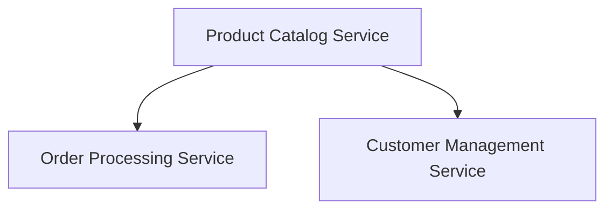

## 3.1.2 Aligning Services with Business Functions

In the realm of microservices architecture, aligning services with business functions is a cornerstone principle that ensures scalability, autonomy, and maintainability. This approach not only enhances the clarity of service responsibilities but also fosters a more agile and responsive system. In this section, we will delve into the intricacies of aligning microservices with business functions, exploring key concepts such as defining service boundaries, ensuring single responsibility, leveraging Domain-Driven Design (DDD), minimizing inter-service dependencies, and more.

### Define Service Boundaries

Establishing clear service boundaries is crucial for maintaining autonomy and clarity within a microservices architecture. Each service should encapsulate a specific business capability, allowing it to operate independently and evolve without impacting other services.

**Key Considerations:**

- **Business Capability Mapping:** Begin by identifying distinct business capabilities within your organization. These capabilities often align with business functions such as customer management, order processing, or inventory management.

- **Boundary Definition:** Once capabilities are identified, define the boundaries of each service. This involves determining the scope of functionality each service will handle, ensuring it aligns with a single business capability.

- **Autonomy and Independence:** Services should be designed to operate independently, minimizing dependencies on other services. This autonomy allows for independent scaling, deployment, and development.

**Example:**

Consider an e-commerce platform with distinct business capabilities such as product catalog management, order processing, and customer management. Each of these capabilities can be encapsulated within its own microservice, with clear boundaries defined around the functionality they provide.



### Ensure Single Responsibility

The Single Responsibility Principle (SRP) is a fundamental concept in software design that states a class or module should have one, and only one, reason to change. In the context of microservices, this principle ensures that each service handles a specific business function, reducing complexity and enhancing maintainability.

**Implementation Strategies:**

- **Focus on Core Functionality:** Each service should focus on its core business function, avoiding the temptation to include unrelated features or logic.

- **Isolate Changes:** By adhering to SRP, changes to a service are isolated to its specific domain, reducing the risk of unintended side effects on other services.

- **Simplify Testing and Maintenance:** Services with a single responsibility are easier to test and maintain, as their functionality is well-defined and limited in scope.

**Example:**

In our e-commerce platform, the Order Processing Service should solely handle order-related tasks, such as order creation, payment processing, and order status updates. It should not manage customer data or product inventory, as these are responsibilities of other services.

### Leverage Domain-Driven Design (DDD)

Domain-Driven Design (DDD) is a strategic approach to software development that emphasizes collaboration between technical and domain experts to create a shared understanding of the business domain. DDD principles can guide the alignment of services with business functions through the concept of bounded contexts.

**Key Concepts:**

- **Bounded Contexts:** A bounded context defines the boundaries within which a particular model is applicable. Each microservice should align with a bounded context, encapsulating the domain logic relevant to its business function.

- **Ubiquitous Language:** DDD promotes the use of a ubiquitous language, a common vocabulary shared by developers and domain experts, to ensure clear communication and understanding of the domain.

- **Aggregates and Entities:** Within a bounded context, identify aggregates and entities that represent core business concepts. These elements form the building blocks of your microservices.

**Example:**

In our e-commerce platform, the Customer Management Service might operate within a bounded context that includes entities such as Customer, Address, and PaymentMethod. This context encapsulates all customer-related logic and interactions.

```java
// Example of a Customer entity within the Customer Management Service
public class Customer {
    private String id;
    private String name;
    private List<Address> addresses;
    private PaymentMethod paymentMethod;

    // Business logic related to customer management
    public void updateAddress(Address newAddress) {
        // Update address logic
    }

    public void changePaymentMethod(PaymentMethod newMethod) {
        // Change payment method logic
    }
}
```

### Minimize Inter-Service Dependencies

Minimizing dependencies between services is essential for enhancing scalability and maintainability. Excessive dependencies can lead to tight coupling, making it difficult to evolve or scale services independently.

**Techniques for Minimization:**

- **Loose Coupling:** Design services to be loosely coupled, with minimal dependencies on other services. This can be achieved through well-defined interfaces and asynchronous communication patterns.

- **Event-Driven Architecture:** Consider using event-driven architecture to decouple services. Services can publish and subscribe to events, allowing them to react to changes without direct dependencies.

- **Shared Libraries and Utilities:** Use shared libraries or utilities sparingly, ensuring they do not introduce tight coupling between services.

**Example:**

In our e-commerce platform, the Order Processing Service might publish an event when an order is completed. Other services, such as the Inventory Management Service, can subscribe to this event and update inventory levels accordingly.

```java
// Example of publishing an event in the Order Processing Service
public class OrderService {
    private EventPublisher eventPublisher;

    public void completeOrder(Order order) {
        // Order completion logic
        eventPublisher.publish(new OrderCompletedEvent(order.getId()));
    }
}
```

### Establish Clear Interfaces

Defining clear and consistent APIs for each service is crucial for facilitating seamless interactions and ensuring that services can communicate effectively.

**Best Practices:**

- **API Design:** Design APIs with a focus on simplicity and clarity. Use RESTful principles or other appropriate protocols to ensure consistency.

- **Versioning:** Implement API versioning to manage changes and ensure backward compatibility.

- **Documentation:** Provide comprehensive documentation for each API, including usage examples and error handling guidelines.

**Example:**

The Product Catalog Service might expose a RESTful API for retrieving product details. This API should be well-documented and versioned to accommodate future changes.

```java
// Example of a RESTful API endpoint in the Product Catalog Service
@RestController
@RequestMapping("/api/v1/products")
public class ProductController {

    @GetMapping("/{productId}")
    public ResponseEntity<Product> getProduct(@PathVariable String productId) {
        // Retrieve and return product details
    }
}
```

### Encapsulate Business Logic

Encapsulating business logic within services promotes reusability and reduces duplication. Each service should contain the logic necessary to fulfill its business function, avoiding reliance on external services for core functionality.

**Guidelines:**

- **Centralize Logic:** Centralize business logic within the service responsible for the relevant business function. This ensures consistency and reduces the risk of logic duplication.

- **Reuse and Share:** Where appropriate, encapsulate reusable logic in shared libraries or modules that can be used across services.

- **Avoid External Dependencies:** Minimize reliance on external services for core business logic, as this can lead to tight coupling and increased complexity.

**Example:**

The Customer Management Service should encapsulate all logic related to customer data management, such as validation, transformation, and persistence.

### Facilitate Independent Deployment

Aligning services with business functions allows for independent deployment, reducing deployment risks and downtime. Each service can be developed, tested, and deployed independently, enabling faster release cycles and greater agility.

**Advantages:**

- **Reduced Risk:** Independent deployment reduces the risk of deployment failures affecting the entire system.

- **Faster Iterations:** Teams can iterate and release changes more quickly, responding to business needs with greater agility.

- **Scalability:** Services can be scaled independently based on demand, optimizing resource usage and performance.

**Example:**

In our e-commerce platform, the Order Processing Service can be deployed independently of the Customer Management Service, allowing for targeted updates and scaling.

### Monitor and Adjust

Monitoring the performance and effectiveness of service alignments is essential for optimizing functionality and efficiency. Regularly assess how well services align with business functions and make adjustments as necessary.

**Monitoring Strategies:**

- **Performance Metrics:** Track key performance metrics for each service, such as response times, error rates, and resource utilization.

- **Feedback Loops:** Establish feedback loops with stakeholders to gather insights on service performance and alignment with business goals.

- **Continuous Improvement:** Use monitoring data to identify areas for improvement and make adjustments to service boundaries or functionality.

**Example:**

Regularly review the performance of the Product Catalog Service, using metrics and stakeholder feedback to identify opportunities for optimization or enhancement.

### Conclusion

Aligning microservices with business functions is a strategic approach that enhances scalability, autonomy, and maintainability. By defining clear service boundaries, ensuring single responsibility, leveraging DDD, minimizing dependencies, and establishing clear interfaces, organizations can create a robust and agile microservices architecture. Continuous monitoring and adjustment further ensure that services remain aligned with evolving business needs, driving efficiency and innovation.

## Quiz Time!



### What is the primary benefit of defining clear service boundaries in microservices?

- [x] Ensures autonomy and clarity
- [ ] Increases code duplication
- [ ] Complicates service interactions
- [ ] Reduces scalability

> **Explanation:** Clear service boundaries ensure autonomy and clarity by encapsulating specific business capabilities within each service, allowing them to operate independently.

### How does the Single Responsibility Principle (SRP) benefit microservices?

- [x] Reduces complexity and enhances maintainability
- [ ] Increases the number of services
- [ ] Complicates testing
- [ ] Requires more dependencies

> **Explanation:** SRP reduces complexity and enhances maintainability by ensuring each service handles a specific business function, making them easier to test and maintain.

### What role does Domain-Driven Design (DDD) play in aligning services with business functions?

- [x] Guides alignment through bounded contexts
- [ ] Increases inter-service dependencies
- [ ] Focuses on technical implementation
- [ ] Reduces business collaboration

> **Explanation:** DDD guides the alignment of services with business functions through bounded contexts, ensuring that each service encapsulates relevant domain logic.

### Which technique helps minimize inter-service dependencies?

- [x] Event-Driven Architecture
- [ ] Tight Coupling
- [ ] Shared Libraries
- [ ] Direct Service Calls

> **Explanation:** Event-driven architecture helps minimize inter-service dependencies by allowing services to publish and subscribe to events, reducing direct dependencies.

### Why is it important to establish clear interfaces for microservices?

- [x] Facilitates seamless interactions
- [ ] Increases complexity
- [ ] Reduces scalability
- [ ] Complicates API design

> **Explanation:** Clear interfaces facilitate seamless interactions between services, ensuring effective communication and reducing complexity.

### What is the advantage of encapsulating business logic within services?

- [x] Promotes reusability and reduces duplication
- [ ] Increases external dependencies
- [ ] Complicates service design
- [ ] Reduces maintainability

> **Explanation:** Encapsulating business logic within services promotes reusability and reduces duplication, ensuring consistency and maintainability.

### How does aligning services with business functions facilitate independent deployment?

- [x] Reduces deployment risks and downtime
- [ ] Increases deployment complexity
- [ ] Requires more resources
- [ ] Complicates testing

> **Explanation:** Aligning services with business functions facilitates independent deployment, reducing deployment risks and downtime by allowing services to be developed and deployed independently.

### What is a key strategy for monitoring the performance of service alignments?

- [x] Track key performance metrics
- [ ] Increase service dependencies
- [ ] Reduce monitoring efforts
- [ ] Focus on technical implementation

> **Explanation:** Tracking key performance metrics is a key strategy for monitoring the performance of service alignments, helping identify areas for improvement.

### Which of the following is a benefit of using event-driven architecture in microservices?

- [x] Decouples services
- [ ] Increases direct dependencies
- [ ] Complicates service interactions
- [ ] Reduces scalability

> **Explanation:** Event-driven architecture decouples services by allowing them to publish and subscribe to events, reducing direct dependencies and enhancing scalability.

### True or False: Independent deployment of services allows for faster release cycles and greater agility.

- [x] True
- [ ] False

> **Explanation:** True. Independent deployment allows for faster release cycles and greater agility by enabling services to be developed, tested, and deployed independently.


