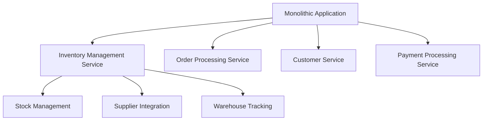
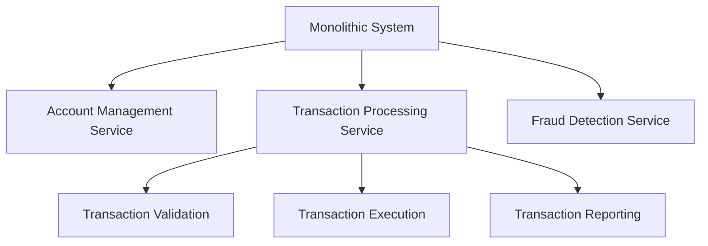
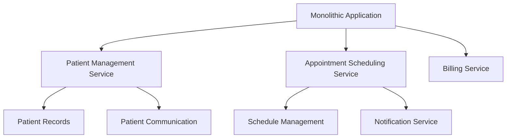

## 3.1.3 Case Studies

In this section, we delve into real-world case studies that exemplify the successful decomposition of monolithic systems into microservices by aligning with business capabilities. These examples span various industries, showcasing the versatility and effectiveness of this approach in different contexts. By examining these case studies, you will gain insights into the practical application of service decomposition, the challenges encountered, and the solutions that led to significant improvements in scalability, deployment speed, and maintainability.

### Case Study 1: E-Commerce Giant

#### Context

Our first case study involves a leading e-commerce company that faced significant challenges with its monolithic architecture. The organization, with a global presence and millions of daily users, struggled with slow deployment cycles, scalability issues during peak shopping seasons, and difficulties in maintaining and updating its codebase.

#### Decomposition Process

The company embarked on a journey to decompose its monolithic application into microservices by identifying distinct business capabilities. The process involved:

1. **Mapping Business Capabilities:** The team conducted workshops with stakeholders from various departments to map out key business capabilities such as inventory management, order processing, customer service, and payment processing.

2. **Service Identification:** Each business capability was analyzed to identify potential microservices. For instance, the inventory management capability was broken down into services like stock management, supplier integration, and warehouse tracking.

3. **Domain-Driven Design (DDD):** The team employed DDD principles to define bounded contexts and ensure that each microservice had a clear responsibility and aligned with a specific business capability.

4. **Incremental Migration:** The migration was carried out incrementally, starting with non-critical services to minimize risk and gradually moving to core functionalities.

#### Challenges and Solutions

- **Data Consistency:** Ensuring data consistency across services was a major challenge. The team implemented the Saga pattern to manage distributed transactions and maintain consistency.

- **Service Communication:** The initial implementation faced latency issues due to synchronous communication. Transitioning to asynchronous messaging with RabbitMQ improved performance and reliability.

#### Achievements

Post-decomposition, the e-commerce giant experienced:

- **Improved Scalability:** The system could handle increased loads during peak seasons without performance degradation.
- **Faster Deployment:** Deployment times reduced from weeks to days, allowing for quicker feature releases.
- **Enhanced Maintainability:** The modular architecture simplified updates and bug fixes, reducing downtime.

#### Lessons Learned

- **Start Small:** Begin with less critical services to build confidence and refine the decomposition process.
- **Invest in Communication Infrastructure:** Robust communication mechanisms are crucial for microservices success.

#### Visual Representation

### Case Study 2: Financial Services Provider

#### Context

A large financial institution sought to modernize its legacy systems to improve customer experience and operational efficiency. The monolithic system was cumbersome, with long lead times for new feature development and deployment.

#### Decomposition Process

The institution's approach to decomposition involved:

1. **Business Capability Workshops:** Cross-functional teams identified core capabilities such as account management, transaction processing, and fraud detection.

2. **Service Design:** Each capability was translated into a set of microservices. For example, the transaction processing capability included services for transaction validation, execution, and reporting.

3. **API-First Strategy:** The team adopted an API-first strategy to ensure that services were designed with clear interfaces, facilitating integration and reuse.

4. **Continuous Integration/Continuous Deployment (CI/CD):** A CI/CD pipeline was established to automate testing and deployment, ensuring rapid and reliable delivery of services.

#### Challenges and Solutions

- **Regulatory Compliance:** Ensuring compliance with financial regulations was critical. The team implemented strict access controls and audit logging to meet compliance requirements.

- **Legacy Integration:** Integrating with legacy systems posed challenges. The Anti-Corruption Layer pattern was used to isolate new services from legacy systems, allowing gradual migration.

#### Achievements

- **Enhanced Customer Experience:** Faster response times and new features improved customer satisfaction.
- **Operational Efficiency:** Automation reduced manual processes, leading to cost savings and increased productivity.

#### Lessons Learned

- **Prioritize Compliance:** Address regulatory requirements early in the design process to avoid costly rework.
- **Leverage APIs:** APIs are powerful tools for ensuring interoperability and flexibility in microservices architectures.

#### Visual Representation

### Case Study 3: Healthcare Platform

#### Context

A healthcare platform aimed to improve its service delivery by transitioning from a monolithic application to a microservices architecture. The monolith hindered innovation and scalability, impacting the platform's ability to adapt to changing healthcare regulations and patient needs.

#### Decomposition Process

The decomposition strategy included:

1. **Capability Mapping:** The team identified key capabilities such as patient management, appointment scheduling, and billing.

2. **Service-Oriented Architecture (SOA):** The platform adopted SOA principles to design services that aligned with business capabilities, ensuring loose coupling and high cohesion.

3. **Iterative Development:** An iterative approach was used, with regular feedback loops to refine services and address emerging challenges.

4. **Cloud-Native Deployment:** Services were deployed on a cloud platform to leverage scalability and resilience features.

#### Challenges and Solutions

- **Data Privacy:** Protecting patient data was paramount. The team implemented encryption and access controls to safeguard sensitive information.

- **Inter-Service Communication:** Ensuring reliable communication between services was challenging. The use of a service mesh provided observability and control over service interactions.

#### Achievements

- **Regulatory Compliance:** The platform achieved compliance with healthcare regulations, enhancing trust with patients and partners.
- **Scalability and Flexibility:** The cloud-native architecture allowed the platform to scale dynamically and adapt to new requirements.

#### Lessons Learned

- **Focus on Security:** Data privacy and security must be integral to the design of healthcare services.
- **Adopt Cloud-Native Practices:** Cloud-native architectures offer significant advantages in terms of scalability and resilience.

#### Visual Representation

### Encouraging Critical Thinking

As you reflect on these case studies, consider how similar strategies could be applied within your organization. What business capabilities are central to your operations? How could decomposing your systems into microservices enhance scalability, maintainability, and innovation? By analyzing these examples, you can gain valuable insights into the practical application of service decomposition and its potential to transform your software architecture.

## Quiz Time!



### Which of the following was a key step in the decomposition process for the e-commerce giant?

- [x] Mapping business capabilities
- [ ] Implementing a monolithic architecture
- [ ] Ignoring stakeholder input
- [ ] Using synchronous communication exclusively

> **Explanation:** Mapping business capabilities was crucial for identifying distinct microservices aligned with specific business functions.

### What pattern did the financial services provider use to isolate new services from legacy systems?

- [ ] Saga Pattern
- [ ] Circuit Breaker Pattern
- [x] Anti-Corruption Layer Pattern
- [ ] Proxy Pattern

> **Explanation:** The Anti-Corruption Layer pattern was used to isolate new services from legacy systems, facilitating gradual migration.

### Which of the following was a challenge faced by the healthcare platform during decomposition?

- [ ] Lack of business capabilities
- [x] Data privacy concerns
- [ ] Insufficient cloud resources
- [ ] Over-reliance on monolithic architecture

> **Explanation:** Data privacy concerns were a significant challenge, requiring robust encryption and access controls.

### What was a common achievement across all case studies post-decomposition?

- [ ] Increased complexity
- [x] Improved scalability
- [ ] Longer deployment times
- [ ] Reduced customer satisfaction

> **Explanation:** Improved scalability was a common achievement, allowing systems to handle increased loads efficiently.

### Which strategy did the e-commerce giant use to manage distributed transactions?

- [ ] Two-Phase Commit
- [x] Saga Pattern
- [ ] Event Sourcing
- [ ] CQRS

> **Explanation:** The Saga pattern was implemented to manage distributed transactions and ensure data consistency.

### What approach did the financial services provider adopt to ensure clear service interfaces?

- [ ] Monolithic Design
- [ ] Legacy Integration
- [x] API-First Strategy
- [ ] Manual Testing

> **Explanation:** An API-first strategy was adopted to ensure services were designed with clear interfaces, facilitating integration.

### How did the healthcare platform enhance its scalability and flexibility?

- [ ] By using a monolithic architecture
- [ ] By ignoring cloud-native practices
- [x] By adopting cloud-native deployment
- [ ] By avoiding service-oriented architecture

> **Explanation:** Cloud-native deployment allowed the healthcare platform to scale dynamically and adapt to new requirements.

### What was a lesson learned from the e-commerce giant's decomposition process?

- [ ] Start with critical services
- [x] Start with less critical services
- [ ] Avoid investing in communication infrastructure
- [ ] Ignore stakeholder feedback

> **Explanation:** Starting with less critical services helped build confidence and refine the decomposition process.

### Which pattern did the healthcare platform use to manage inter-service communication?

- [ ] Circuit Breaker Pattern
- [ ] Bulkhead Pattern
- [x] Service Mesh
- [ ] Retry Pattern

> **Explanation:** A service mesh was used to provide observability and control over inter-service communication.

### True or False: The financial services provider faced challenges with regulatory compliance during decomposition.

- [x] True
- [ ] False

> **Explanation:** Regulatory compliance was a critical challenge that required strict access controls and audit logging.


