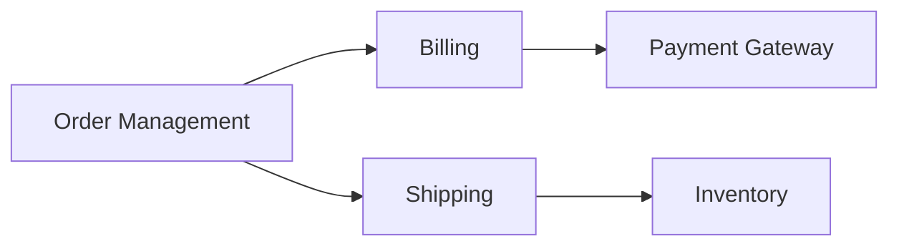

---

linkTitle: "3.2.1 Bounded Contexts and Subdomains"
title: "Bounded Contexts and Subdomains in Domain-Driven Design for Microservices"
description: "Explore the role of bounded contexts and subdomains in Domain-Driven Design (DDD) for microservices. Learn how to define, map, and integrate these concepts to build scalable systems."
categories:
- Software Architecture
- Microservices
- Domain-Driven Design
tags:
- Bounded Contexts
- Subdomains
- Microservices
- DDD
- Service Design
date: 2024-10-25
type: docs
nav_weight: 321000
---

## 3.2.1 Bounded Contexts and Subdomains

In the realm of microservices architecture, Domain-Driven Design (DDD) offers a strategic approach to managing complexity by aligning software design with business needs. Central to DDD are the concepts of bounded contexts and subdomains, which help in structuring and decomposing systems into manageable, cohesive units. This section delves into these concepts, providing insights and methodologies for effectively applying them in microservices design.

### Defining Bounded Contexts

A **bounded context** is a central pattern in DDD that defines a clear boundary within which a particular domain model is applicable. It encapsulates the domain logic and ensures that the model remains consistent and meaningful within its context. This boundary helps prevent ambiguity and confusion that can arise when different parts of a system use the same terminology but with different meanings.

In practice, a bounded context is a self-contained unit where a specific model is defined and used. It is crucial for maintaining the integrity of the domain model and ensuring that changes within one context do not inadvertently affect others.

#### Example

Consider an e-commerce platform. The concept of "Order" might have different meanings in various contexts:

- **Order Management Context:** Focuses on order processing, status tracking, and fulfillment.
- **Billing Context:** Deals with invoicing, payments, and financial transactions related to orders.

Each context has its own model of "Order," tailored to its specific needs and responsibilities.

### Identifying Subdomains

Subdomains are the building blocks of a domain, categorized into core, supporting, and generic subdomains. Identifying these subdomains is essential for structuring services effectively.

- **Core Subdomains:** These are the areas of the business that provide a competitive advantage and are central to the business's success. They require custom development and deep domain knowledge.
  
- **Supporting Subdomains:** These are necessary for the business but do not differentiate it from competitors. They often support core subdomains and can be implemented using off-the-shelf solutions or less custom development.
  
- **Generic Subdomains:** These are common across many businesses and industries. They can be implemented using standard solutions and require minimal customization.

#### Example

In the e-commerce platform:

- **Core Subdomain:** Product recommendation engine.
- **Supporting Subdomain:** Customer service management.
- **Generic Subdomain:** Authentication and authorization.

### Mapping Business Domains to Services

Mapping subdomains to microservices involves aligning each service with a specific business area, ensuring that each service has a clear purpose and scope. This alignment helps maintain a strong connection between the technical architecture and business goals.

#### Methodology

1. **Identify Business Capabilities:** Break down the business into distinct capabilities and processes.
2. **Define Bounded Contexts:** Establish boundaries for each capability where a specific model is applicable.
3. **Assign Subdomains:** Categorize each capability into core, supporting, or generic subdomains.
4. **Design Services:** Create microservices that encapsulate the domain logic of each bounded context.

### Using Context Maps

**Context maps** are tools used to visualize the relationships and interactions between different bounded contexts and subdomains. They provide a high-level overview of how different parts of the system interact and depend on each other.

#### Example Context Map



In this example, the context map illustrates how the "Order Management" context interacts with "Billing" and "Shipping," while "Billing" interacts with the "Payment Gateway."

### Establishing Clear Interfaces

Defining clear interfaces and contracts between bounded contexts is crucial for facilitating communication and integration. These interfaces should be well-documented and versioned to ensure consistency and reliability across services.

#### Best Practices

- Use APIs to define service boundaries and interactions.
- Employ versioning strategies to manage changes over time.
- Document interfaces using tools like OpenAPI/Swagger.

### Handling Domain Integration

Integrating different bounded contexts requires careful consideration to manage dependencies and maintain domain integrity. Strategies such as domain events and anti-corruption layers can be employed to facilitate integration.

#### Strategies

- **Domain Events:** Use events to communicate changes between contexts, allowing for loose coupling and asynchronous communication.
- **Anti-Corruption Layer:** Implement a layer to translate and adapt interactions between contexts, preserving the integrity of each domain model.

### Encapsulating Domain Logic

Encapsulating domain-specific logic within each bounded context is essential for maintaining integrity and reducing coupling. This encapsulation ensures that each context can evolve independently without affecting others.

#### Example in Java

```java
public class OrderService {
    private final OrderRepository orderRepository;

    public OrderService(OrderRepository orderRepository) {
        this.orderRepository = orderRepository;
    }

    public Order createOrder(Customer customer, List<Product> products) {
        // Domain logic for creating an order
        Order order = new Order(customer, products);
        orderRepository.save(order);
        return order;
    }
}
```

In this example, the `OrderService` encapsulates the logic for creating orders, ensuring that this logic is contained within the "Order Management" context.

### Iterating and Refining

As businesses evolve, so too must the bounded contexts and subdomains. Continuous iteration and refinement are necessary to adapt to new requirements and changes in the business environment.

#### Tips for Iteration

- Regularly review and update context maps and service boundaries.
- Engage with domain experts to ensure alignment with business goals.
- Use feedback loops to identify areas for improvement.

### Conclusion

Bounded contexts and subdomains are foundational concepts in Domain-Driven Design that enable effective service decomposition in microservices architecture. By defining clear boundaries, mapping business domains to services, and establishing robust integration strategies, organizations can build scalable and maintainable systems that align with business objectives.

## Quiz Time!



### What is a bounded context in Domain-Driven Design?

- [x] A clear boundary within which a particular domain model is defined and applicable.
- [ ] A generic subdomain common across many businesses.
- [ ] A tool for visualizing relationships between services.
- [ ] A method for integrating different domain models.

> **Explanation:** A bounded context defines a clear boundary within which a specific domain model is applicable, ensuring consistency and clarity.

### Which of the following is a core subdomain?

- [ ] Authentication and authorization
- [x] Product recommendation engine
- [ ] Customer service management
- [ ] Payment processing

> **Explanation:** A core subdomain provides a competitive advantage and is central to the business's success, such as a product recommendation engine.

### What is the purpose of a context map?

- [ ] To define clear interfaces between services
- [x] To visualize relationships and interactions between bounded contexts
- [ ] To encapsulate domain logic within a service
- [ ] To categorize subdomains into core, supporting, and generic

> **Explanation:** A context map is used to visualize the relationships and interactions between different bounded contexts and subdomains.

### How can domain integration be facilitated between bounded contexts?

- [ ] By using generic subdomains
- [x] By employing domain events and anti-corruption layers
- [ ] By encapsulating domain logic within a single service
- [ ] By defining clear interfaces within a bounded context

> **Explanation:** Domain integration can be facilitated using domain events for loose coupling and anti-corruption layers to manage dependencies.

### What is the role of encapsulating domain logic within a bounded context?

- [x] To maintain integrity and reduce coupling
- [ ] To visualize interactions between services
- [ ] To define clear interfaces and contracts
- [ ] To categorize subdomains effectively

> **Explanation:** Encapsulating domain logic within a bounded context helps maintain integrity and reduces coupling between services.

### Why is continuous iteration and refinement important in DDD?

- [ ] To define clear interfaces between services
- [ ] To visualize relationships between bounded contexts
- [x] To adapt to new requirements and changes in the business environment
- [ ] To categorize subdomains into core, supporting, and generic

> **Explanation:** Continuous iteration and refinement are necessary to adapt to new requirements and changes in the business environment.

### Which strategy can be used to manage dependencies between bounded contexts?

- [ ] Using generic subdomains
- [ ] Encapsulating domain logic
- [x] Implementing an anti-corruption layer
- [ ] Defining clear interfaces within a bounded context

> **Explanation:** An anti-corruption layer can be used to manage dependencies between bounded contexts, preserving domain integrity.

### What is the significance of defining clear interfaces between bounded contexts?

- [ ] To encapsulate domain logic within a service
- [x] To facilitate communication and integration
- [ ] To categorize subdomains effectively
- [ ] To visualize relationships between services

> **Explanation:** Defining clear interfaces between bounded contexts facilitates communication and integration, ensuring consistency and reliability.

### How can bounded contexts help in microservices design?

- [x] By providing clear boundaries for domain models
- [ ] By visualizing relationships between services
- [ ] By categorizing subdomains into core, supporting, and generic
- [ ] By managing dependencies between services

> **Explanation:** Bounded contexts provide clear boundaries for domain models, helping to maintain consistency and clarity in microservices design.

### True or False: Core subdomains require minimal customization and are common across many businesses.

- [ ] True
- [x] False

> **Explanation:** Core subdomains provide a competitive advantage and require custom development and deep domain knowledge, unlike generic subdomains which are common and require minimal customization.



By understanding and applying the principles of bounded contexts and subdomains, you can design microservices that are not only aligned with business goals but also scalable and maintainable. As you continue to explore these concepts, consider how they can be tailored to fit the unique needs of your organization.
