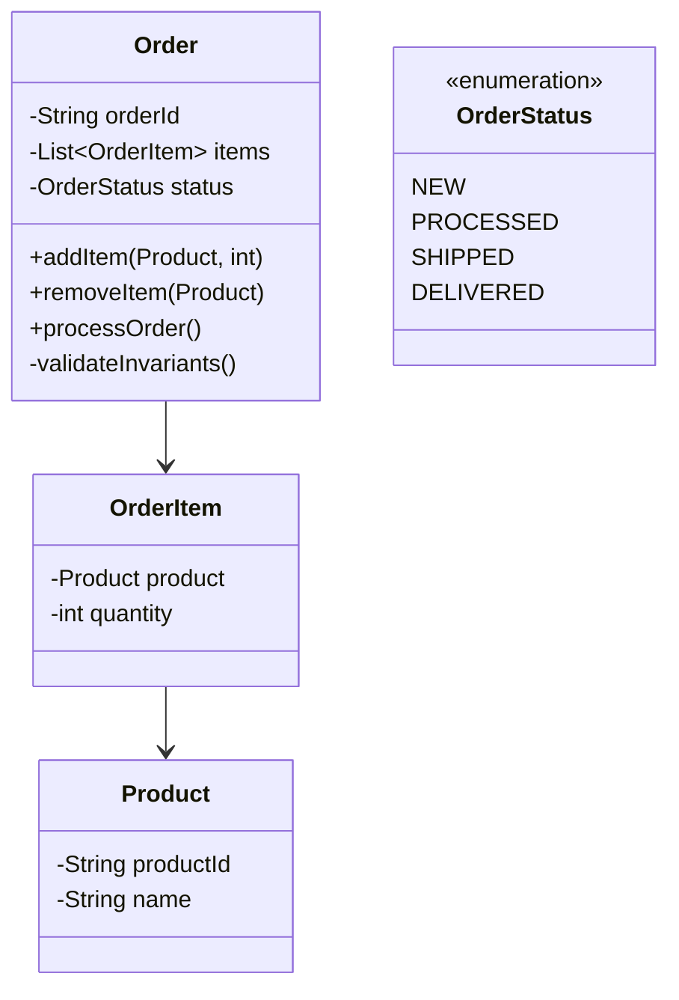

## 3.2.2 Aggregates and Entities

In the realm of Domain-Driven Design (DDD), aggregates and entities play a pivotal role in structuring complex business logic within microservices. Understanding these concepts is crucial for designing systems that are both scalable and maintainable. This section delves into the intricacies of aggregates and entities, providing a comprehensive guide to their implementation in microservices architecture.

### Defining Aggregates

Aggregates are clusters of domain objects that can be treated as a single unit for the purpose of data changes. They are designed to ensure consistency and integrity within the domain model. An aggregate is composed of one or more entities and possibly value objects, with a defined boundary that encapsulates the entire cluster.

#### Key Characteristics of Aggregates:
- **Consistency Boundary:** Aggregates define a consistency boundary within which all changes are atomic. This means that any change to an aggregate is complete and consistent.
- **Single Responsibility:** Each aggregate should have a clear, single responsibility, representing a coherent and meaningful concept in the domain.
- **Transactional Integrity:** Operations on an aggregate are performed in a single transaction, ensuring that the aggregate remains in a valid state.

### Identifying Aggregate Roots

The aggregate root is the main entity within an aggregate that acts as the entry point for accessing and modifying the aggregate's state. It is responsible for enforcing the invariants and rules of the aggregate.

#### Role of Aggregate Roots:
- **Access Control:** All interactions with the aggregate must go through the aggregate root, ensuring that the integrity of the aggregate is maintained.
- **Consistency Enforcement:** The aggregate root ensures that any changes to the aggregate adhere to the business rules and invariants.

### Designing Entity Relationships

Entities within an aggregate should reflect real-world business scenarios accurately. Designing these relationships involves understanding the domain and identifying the key entities and their interactions.

#### Guidelines for Designing Entities:
- **Domain Relevance:** Each entity should represent a significant concept within the domain.
- **Clear Relationships:** Define clear relationships between entities, using associations and compositions to model real-world interactions.
- **Lifecycle Management:** Consider the lifecycle of each entity and how it relates to the aggregate as a whole.

### Maintaining Invariants

Invariants are business rules that must always be true for the aggregate to be in a valid state. Maintaining these invariants is crucial for ensuring data consistency and validity.

#### Strategies for Maintaining Invariants:
- **Centralized Logic:** Implement invariant logic within the aggregate root to ensure that all changes are validated.
- **Validation Methods:** Use validation methods to check invariants before committing changes to the aggregate.

### Transactional Boundaries

Aggregates define transactional boundaries, ensuring that changes within an aggregate are atomic and consistent. This is essential for maintaining the integrity of the domain model.

#### Importance of Transactional Boundaries:
- **Atomic Operations:** All operations within an aggregate should be atomic, meaning they either complete fully or not at all.
- **Consistency Guarantees:** By defining clear transactional boundaries, aggregates provide consistency guarantees within the domain.

### Optimizing for Performance

While aggregates are essential for maintaining consistency, they can also impact performance if not designed carefully. It's important to balance performance and complexity when designing aggregates.

#### Performance Optimization Strategies:
- **Limit Aggregate Size:** Avoid overly large aggregates that can become performance bottlenecks.
- **Use Lazy Loading:** Implement lazy loading for entities that are not always needed, reducing the initial load time.
- **Aggregate Splitting:** Consider splitting large aggregates into smaller ones if they become too complex.

### Implementing Encapsulation

Encapsulation is a fundamental principle in aggregate design, ensuring that the internal structure of aggregates is hidden from external components. This prevents external manipulation and maintains integrity.

#### Best Practices for Encapsulation:
- **Private Members:** Keep the internal state of the aggregate private, exposing only necessary methods.
- **Controlled Access:** Provide controlled access to the aggregate's state through public methods that enforce business rules.

### Using References Wisely

Managing references between aggregates is crucial to reduce coupling and maintain a clean architecture. Direct object references can lead to tight coupling, making the system harder to maintain.

#### Recommendations for Managing References:
- **Use Identifiers:** Instead of direct object references, use unique identifiers to reference other aggregates.
- **Eventual Consistency:** Consider using eventual consistency patterns to handle interactions between aggregates.

### Practical Java Code Example

Let's illustrate these concepts with a practical Java code example. We'll design a simple aggregate for an e-commerce order system.

```java
// Aggregate Root: Order
public class Order {
    private String orderId;
    private List<OrderItem> items;
    private OrderStatus status;

    public Order(String orderId) {
        this.orderId = orderId;
        this.items = new ArrayList<>();
        this.status = OrderStatus.NEW;
    }

    // Add an item to the order
    public void addItem(Product product, int quantity) {
        OrderItem item = new OrderItem(product, quantity);
        items.add(item);
        // Maintain invariants: e.g., check stock availability
        validateInvariants();
    }

    // Remove an item from the order
    public void removeItem(Product product) {
        items.removeIf(item -> item.getProduct().equals(product));
        validateInvariants();
    }

    // Validate business invariants
    private void validateInvariants() {
        if (items.isEmpty()) {
            throw new IllegalStateException("Order must have at least one item.");
        }
    }

    // Process the order
    public void processOrder() {
        if (status != OrderStatus.NEW) {
            throw new IllegalStateException("Order cannot be processed.");
        }
        // Process payment, etc.
        this.status = OrderStatus.PROCESSED;
    }

    // Getters and other methods...
}

// Entity: OrderItem
class OrderItem {
    private Product product;
    private int quantity;

    public OrderItem(Product product, int quantity) {
        this.product = product;
        this.quantity = quantity;
    }

    public Product getProduct() {
        return product;
    }

    // Getters and other methods...
}

// Value Object: Product
class Product {
    private String productId;
    private String name;

    public Product(String productId, String name) {
        this.productId = productId;
        this.name = name;
    }

    // Getters and other methods...
}

// Enum: OrderStatus
enum OrderStatus {
    NEW, PROCESSED, SHIPPED, DELIVERED
}
```

In this example, the `Order` class is the aggregate root, managing the `OrderItem` entities and ensuring that the order remains in a valid state. The `Product` class is a value object used within the aggregate.

### Diagrams and Visualizations

To further illustrate the concept of aggregates and entities, let's use a diagram to visualize the relationships within the `Order` aggregate.



### Best Practices and Common Pitfalls

- **Best Practices:**
  - Clearly define the boundaries of each aggregate.
  - Ensure that the aggregate root is the only entry point for modifications.
  - Use domain events to handle interactions between aggregates.

- **Common Pitfalls:**
  - Creating aggregates that are too large, leading to performance issues.
  - Allowing external components to directly modify entities within an aggregate.
  - Overcomplicating the design with unnecessary entities and relationships.

### Conclusion

Aggregates and entities are foundational concepts in Domain-Driven Design that help maintain consistency and integrity in microservices architecture. By carefully designing aggregates, identifying aggregate roots, and managing entity relationships, you can create robust systems that accurately reflect business domains. Remember to balance performance and complexity, encapsulate internal structures, and use references wisely to reduce coupling.

### Further Reading and Resources

- **Books:** "Domain-Driven Design: Tackling Complexity in the Heart of Software" by Eric Evans.
- **Online Courses:** "Domain-Driven Design Fundamentals" on Pluralsight.
- **Documentation:** Official DDD community resources and patterns.

## Quiz Time!



### What is an aggregate in Domain-Driven Design?

- [x] A cluster of domain objects treated as a single unit for data changes
- [ ] A single entity in the domain model
- [ ] A collection of unrelated objects
- [ ] A database table

> **Explanation:** An aggregate is a cluster of domain objects that can be treated as a single unit for data changes, ensuring consistency and integrity.

### What is the role of an aggregate root?

- [x] To manage access and interactions with the objects within an aggregate
- [ ] To act as a database manager
- [ ] To handle all business logic in the system
- [ ] To store data in a cache

> **Explanation:** The aggregate root manages access and interactions with the objects within an aggregate, ensuring that the integrity of the aggregate is maintained.

### Why is encapsulation important in aggregate design?

- [x] To prevent external components from manipulating the aggregate directly
- [ ] To increase the complexity of the system
- [ ] To allow direct access to all entities within the aggregate
- [ ] To simplify the user interface

> **Explanation:** Encapsulation prevents external components from manipulating the aggregate directly, maintaining its integrity and ensuring that business rules are enforced.

### How should references between aggregates be managed?

- [x] Use unique identifiers instead of direct object references
- [ ] Use direct object references to simplify access
- [ ] Avoid using references altogether
- [ ] Use global variables for reference management

> **Explanation:** Using unique identifiers instead of direct object references reduces coupling and maintains a clean architecture.

### What is a common pitfall in designing aggregates?

- [x] Creating aggregates that are too large, leading to performance issues
- [ ] Using too few entities in the aggregate
- [ ] Over-optimizing for performance
- [ ] Ignoring encapsulation

> **Explanation:** Creating aggregates that are too large can lead to performance issues and make the system harder to maintain.

### What is the significance of transactional boundaries in aggregates?

- [x] They ensure that changes within an aggregate are atomic and consistent
- [ ] They allow for partial updates within an aggregate
- [ ] They define the database schema
- [ ] They simplify the user interface

> **Explanation:** Transactional boundaries ensure that changes within an aggregate are atomic and consistent, maintaining the integrity of the domain model.

### How can performance be optimized in aggregate design?

- [x] Limit aggregate size and use lazy loading
- [ ] Increase the number of entities in each aggregate
- [ ] Use direct object references for all entities
- [ ] Avoid using aggregate roots

> **Explanation:** Limiting aggregate size and using lazy loading can help optimize performance by reducing complexity and load times.

### What is a key characteristic of an aggregate?

- [x] It defines a consistency boundary
- [ ] It is always a single entity
- [ ] It must include all domain objects
- [ ] It is independent of business rules

> **Explanation:** An aggregate defines a consistency boundary within which all changes are atomic, ensuring that the aggregate remains in a valid state.

### What should be the entry point for modifying an aggregate?

- [x] The aggregate root
- [ ] Any entity within the aggregate
- [ ] A database trigger
- [ ] An external service

> **Explanation:** The aggregate root should be the entry point for modifying an aggregate, ensuring that all changes adhere to business rules and invariants.

### True or False: Aggregates should be designed to be as large as possible to include all related entities.

- [ ] True
- [x] False

> **Explanation:** Aggregates should not be designed to be as large as possible. Instead, they should be optimized for performance and complexity, avoiding overly large or complex aggregates.


