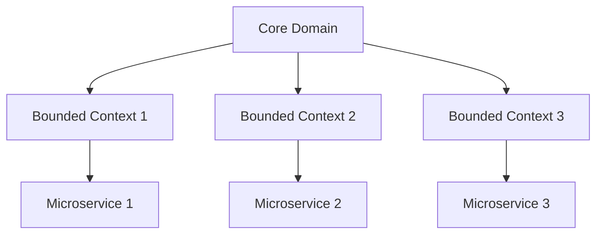

---

linkTitle: "3.2.3 Integrating DDD with Microservices"
title: "Integrating Domain-Driven Design with Microservices: A Comprehensive Guide"
description: "Explore how to effectively integrate Domain-Driven Design (DDD) with microservices architecture, aligning service boundaries with domains, facilitating collaboration, and ensuring data ownership."
categories:
- Software Architecture
- Microservices
- Domain-Driven Design
tags:
- DDD
- Microservices
- Bounded Context
- Strategic Design
- Collaboration
date: 2024-10-25
type: docs
nav_weight: 3230

---

## 3.2.3 Integrating Domain-Driven Design with Microservices

Domain-Driven Design (DDD) and microservices are two powerful paradigms that, when integrated effectively, can lead to highly scalable and maintainable software systems. This section explores how to align microservices with DDD principles, facilitating collaboration, ensuring data ownership, and managing cross-domain interactions.

### Align Microservices with Domains

The core of integrating DDD with microservices lies in aligning microservice boundaries with bounded contexts and subdomains identified through DDD. A bounded context is a specific responsibility within a domain, with its own domain model and language. This alignment ensures that each microservice is responsible for a distinct part of the business domain, reducing complexity and enhancing cohesion.

#### Identifying Bounded Contexts

To align microservices with bounded contexts, start by identifying the core subdomains and supporting subdomains of your business. Use domain experts to map out these areas, ensuring that each microservice corresponds to a single bounded context.



In this diagram, each bounded context is mapped to a microservice, ensuring clear boundaries and responsibilities.

### Facilitate Collaboration Between Teams

DDD emphasizes collaboration between domain experts and development teams. This collaboration is crucial for ensuring that the microservices accurately reflect the business domain.

#### Collaborative Workshops

Conduct workshops where domain experts and developers work together to define domain models and identify bounded contexts. This collaborative approach ensures that the technical design aligns with business needs.

### Implement Ubiquitous Language

A ubiquitous language is a common language used by all team members, including developers and domain experts. It helps reduce misunderstandings and ensures that everyone is on the same page.

#### Creating a Ubiquitous Language

Develop a glossary of terms that are used consistently across all teams and services. This glossary should be part of the documentation and regularly updated as the domain evolves.

### Manage Cross-Domain Interactions

Interactions between different bounded contexts can be complex. DDD provides strategies such as domain events and shared kernels to manage these interactions.

#### Domain Events

Domain events are a way to communicate changes across bounded contexts. When something significant happens in one context, an event is published, and other contexts can react accordingly.

```java
public class OrderPlacedEvent {
    private final String orderId;
    private final String customerId;

    public OrderPlacedEvent(String orderId, String customerId) {
        this.orderId = orderId;
        this.customerId = customerId;
    }

    // Getters
}
```

In this example, an `OrderPlacedEvent` can be published when an order is placed, allowing other services to respond.

#### Shared Kernel

A shared kernel is a small shared domain model between two bounded contexts. It should be used sparingly to avoid tight coupling.

### Ensure Data Ownership

Decentralized data ownership is a key principle in both DDD and microservices. Each microservice should manage its own data within its bounded context.

#### Data Management

Ensure that each microservice has its own database or data store. This approach prevents data coupling and allows each service to evolve independently.

### Use Strategic Design Patterns

Strategic design patterns from DDD, such as Customer-Supplier and Conformist, help manage dependencies between services.

#### Customer-Supplier Pattern

In this pattern, the supplier service provides data or functionality to the customer service. The customer service must adapt to changes in the supplier service.

#### Conformist Pattern

The conformist pattern is used when a service must conform to the model of another service without influencing it. This pattern is useful when integrating with legacy systems.

### Facilitate Continuous Alignment

Continuous alignment between domain models and microservice designs is essential to accommodate evolving business requirements.

#### Regular Reviews

Conduct regular reviews of the domain model and microservice architecture to ensure they remain aligned with business goals. This practice helps identify areas for improvement and adaptation.

### Provide Practical Examples

Let's explore how organizations have successfully integrated DDD with microservices.

#### Example: E-Commerce Platform

An e-commerce platform used DDD to identify bounded contexts such as Order Management, Inventory, and Customer Service. Each context was implemented as a separate microservice, with domain events used to synchronize data between services.

#### Example: Financial Services

A financial services company used DDD to align its microservices with business capabilities such as Account Management and Transaction Processing. By implementing a ubiquitous language and facilitating collaboration, the company improved service design and reduced errors.

### Best Practices and Common Pitfalls

- **Best Practices:**
  - Regularly update the ubiquitous language and domain model.
  - Use domain events to manage cross-domain interactions.
  - Ensure each microservice has its own data store.

- **Common Pitfalls:**
  - Overusing shared kernels, leading to tight coupling.
  - Failing to involve domain experts in the design process.
  - Ignoring the need for continuous alignment.

### Conclusion

Integrating DDD with microservices offers a structured approach to designing scalable and maintainable systems. By aligning microservices with domains, facilitating collaboration, and ensuring data ownership, organizations can build systems that are both flexible and robust.

For further exploration, consider reading "Domain-Driven Design: Tackling Complexity in the Heart of Software" by Eric Evans and "Implementing Domain-Driven Design" by Vaughn Vernon. These books provide deeper insights into DDD principles and practices.

## Quiz Time!



### What is a bounded context in DDD?

- [x] A specific responsibility within a domain with its own domain model and language.
- [ ] A shared database used by multiple microservices.
- [ ] A set of services that share the same codebase.
- [ ] A design pattern for managing dependencies.

> **Explanation:** A bounded context is a specific responsibility within a domain, with its own domain model and language, ensuring clear boundaries and responsibilities.

### How does DDD facilitate collaboration between teams?

- [x] By encouraging workshops between domain experts and developers.
- [ ] By enforcing strict coding standards.
- [ ] By using a single database for all services.
- [ ] By limiting communication between teams.

> **Explanation:** DDD encourages collaboration through workshops where domain experts and developers work together to define domain models and identify bounded contexts.

### What is the purpose of a ubiquitous language in DDD?

- [x] To reduce misunderstandings and ensure consistent communication across teams.
- [ ] To enforce strict coding standards.
- [ ] To create a shared database schema.
- [ ] To define microservice deployment strategies.

> **Explanation:** A ubiquitous language is a common language used by all team members to reduce misunderstandings and ensure consistent communication.

### What is a domain event in DDD?

- [x] A way to communicate changes across bounded contexts.
- [ ] A shared database schema.
- [ ] A design pattern for managing dependencies.
- [ ] A method for scaling microservices.

> **Explanation:** Domain events are used to communicate changes across bounded contexts, allowing other services to respond accordingly.

### What is the principle of decentralized data ownership?

- [x] Each microservice manages its own data within its bounded context.
- [ ] All microservices share a single database.
- [ ] Data is managed by a central team.
- [ ] Data ownership is not important in microservices.

> **Explanation:** Decentralized data ownership means each microservice manages its own data within its bounded context, preventing data coupling.

### What is the Customer-Supplier pattern?

- [x] A pattern where the supplier service provides data or functionality to the customer service.
- [ ] A pattern for managing database transactions.
- [ ] A pattern for scaling microservices.
- [ ] A pattern for defining microservice boundaries.

> **Explanation:** The Customer-Supplier pattern involves a supplier service providing data or functionality to a customer service, which must adapt to changes in the supplier service.

### How can continuous alignment between domain models and microservice designs be facilitated?

- [x] By conducting regular reviews of the domain model and microservice architecture.
- [ ] By using a single database for all services.
- [ ] By enforcing strict coding standards.
- [ ] By limiting communication between teams.

> **Explanation:** Regular reviews of the domain model and microservice architecture help ensure continuous alignment with business goals.

### What is a common pitfall when integrating DDD with microservices?

- [x] Overusing shared kernels, leading to tight coupling.
- [ ] Using domain events to manage cross-domain interactions.
- [ ] Ensuring each microservice has its own data store.
- [ ] Facilitating collaboration between domain experts and developers.

> **Explanation:** Overusing shared kernels can lead to tight coupling, which is a common pitfall when integrating DDD with microservices.

### What is a shared kernel in DDD?

- [x] A small shared domain model between two bounded contexts.
- [ ] A design pattern for managing dependencies.
- [ ] A method for scaling microservices.
- [ ] A way to enforce strict coding standards.

> **Explanation:** A shared kernel is a small shared domain model between two bounded contexts, used sparingly to avoid tight coupling.

### True or False: In DDD, microservices should share a single database to ensure consistency.

- [ ] True
- [x] False

> **Explanation:** False. In DDD, each microservice should manage its own data within its bounded context to prevent data coupling and allow independent evolution.




