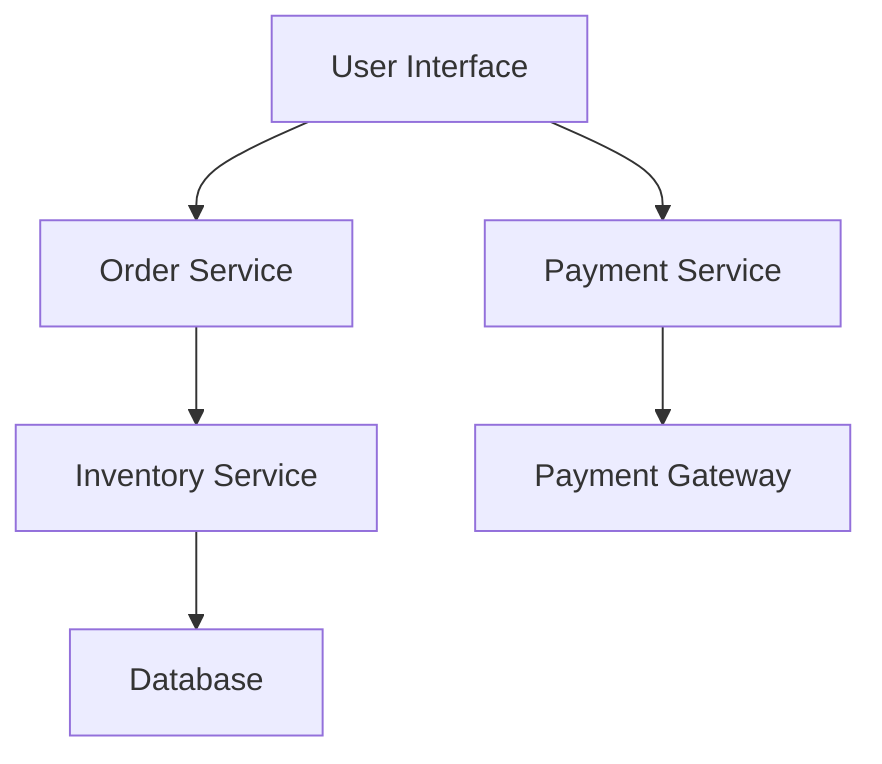

## 3.4.1 Embracing Change

In the dynamic world of software development, change is not just inevitable; it's essential for survival and growth. Microservices architecture, with its inherent flexibility and scalability, is particularly well-suited to embrace change. This section delves into the concept of Evolutionary Architecture, a paradigm that supports the continuous adaptation and growth of systems in response to changing requirements. We'll explore how to promote incremental development, encourage flexibility, implement modular design, and foster a culture of adaptability, all while leveraging Continuous Integration and Deployment (CI/CD) practices and feedback loops to plan for scalability.

### Defining Evolutionary Architecture

Evolutionary Architecture is an approach that prioritizes the ability of a system to evolve over time. It is designed to accommodate change, allowing systems to grow and adapt in response to new requirements, technologies, and business goals. This adaptability is achieved through a combination of architectural principles and practices that support continuous improvement and innovation.

#### Key Characteristics of Evolutionary Architecture:

- **Incremental Change:** Systems evolve through small, manageable changes rather than large, disruptive overhauls.
- **Flexibility:** The architecture is designed to accommodate new features and technologies without significant rework.
- **Modularity:** Components are loosely coupled, enabling independent evolution and replacement.
- **Feedback-Driven:** Continuous feedback from users and system performance informs ongoing improvements.

### Promoting Incremental Development

Incremental development is a cornerstone of Evolutionary Architecture. By building systems incrementally, teams can deliver value early and often, while continuously refining and enhancing the system based on real-world feedback.

#### Benefits of Incremental Development:

- **Reduced Risk:** Smaller changes are easier to test and validate, reducing the risk of introducing errors.
- **Faster Time-to-Market:** Delivering features incrementally allows for quicker releases and faster user feedback.
- **Adaptability:** Teams can pivot and adjust priorities based on changing requirements and feedback.

**Example:**

Consider a microservices-based e-commerce platform. Instead of launching a complete overhaul of the checkout process, the team might incrementally introduce new payment options, test them with a subset of users, and gather feedback before rolling them out to the entire user base.

### Encouraging Flexibility

Flexibility is crucial in an evolutionary architecture, allowing systems to adapt to unforeseen changes and innovations. Designing services with flexibility in mind ensures that they can evolve without requiring extensive rework.

#### Strategies for Building Flexible Services:

- **Use Interfaces and Abstractions:** Define clear interfaces and use abstractions to decouple components, making it easier to swap or modify implementations.
- **Design for Extensibility:** Anticipate future needs by designing components that can be extended without modifying existing code.
- **Embrace Polyglot Programming:** Allow different services to use the most appropriate languages and technologies for their specific needs.

**Java Code Example:**

```java
public interface PaymentService {
    void processPayment(PaymentDetails details);
}

public class CreditCardPaymentService implements PaymentService {
    @Override
    public void processPayment(PaymentDetails details) {
        // Implementation for processing credit card payments
    }
}

public class PayPalPaymentService implements PaymentService {
    @Override
    public void processPayment(PaymentDetails details) {
        // Implementation for processing PayPal payments
    }
}

// Usage
PaymentService paymentService = new CreditCardPaymentService();
paymentService.processPayment(new PaymentDetails());
```

In this example, the `PaymentService` interface allows for flexibility in adding new payment methods without altering existing code.

### Implementing Modular Design

Modular design is a fundamental principle of Evolutionary Architecture, enabling the independent evolution of different system components. By breaking down a system into smaller, self-contained modules, teams can develop, test, and deploy each module independently.

#### Advantages of Modular Design:

- **Independent Deployment:** Modules can be deployed independently, reducing downtime and risk.
- **Scalability:** Modules can be scaled independently based on demand.
- **Maintainability:** Smaller, focused modules are easier to understand and maintain.

**Mermaid Diagram:**



This diagram illustrates a modular architecture where each service can evolve independently.

### Fostering a Culture of Adaptability

An evolutionary architecture thrives in an environment that supports adaptability. Organizations must cultivate a culture that encourages teams to embrace change and respond proactively to new challenges and opportunities.

#### Building a Culture of Adaptability:

- **Empower Teams:** Give teams the autonomy to make decisions and experiment with new ideas.
- **Encourage Learning:** Promote continuous learning and knowledge sharing across teams.
- **Celebrate Innovation:** Recognize and reward innovative solutions and improvements.

### Adopting Continuous Integration and Deployment (CI/CD)

CI/CD practices are essential for supporting the rapid iteration and deployment of changes in an evolutionary architecture. By automating the build, test, and deployment processes, teams can deliver changes quickly and reliably.

#### Benefits of CI/CD:

- **Faster Feedback:** Automated tests provide immediate feedback on code changes, enabling quick identification and resolution of issues.
- **Reduced Manual Effort:** Automation reduces the need for manual intervention, freeing up time for more valuable tasks.
- **Consistent Deployments:** Automated deployments ensure consistency across environments, reducing the risk of errors.

**Example CI/CD Pipeline:**

1. **Code Commit:** Developers commit code changes to a version control system.
2. **Automated Build:** The system automatically builds the application and runs unit tests.
3. **Automated Testing:** Integration and end-to-end tests are executed to validate the changes.
4. **Deployment:** Successful builds are automatically deployed to staging or production environments.

### Using Feedback Loops

Feedback loops are critical for monitoring system performance and gathering user input to inform ongoing improvements and adaptations. By continuously collecting and analyzing feedback, teams can make informed decisions about future changes.

#### Implementing Effective Feedback Loops:

- **User Feedback:** Collect user feedback through surveys, interviews, and analytics to understand user needs and preferences.
- **Performance Monitoring:** Use monitoring tools to track system performance and identify areas for improvement.
- **Iterative Improvements:** Use feedback to prioritize and implement iterative improvements.

### Planning for Scalability

Scalability is a key consideration in an evolutionary architecture, ensuring that services can grow and evolve in response to increasing demands and changing business needs.

#### Guidelines for Designing Scalable Services:

- **Horizontal Scaling:** Design services to scale horizontally by adding more instances rather than increasing the capacity of a single instance.
- **Load Balancing:** Use load balancers to distribute traffic evenly across service instances.
- **Stateless Services:** Design services to be stateless, allowing them to be easily replicated and scaled.

**Real-World Scenario:**

A media streaming service might implement a scalable architecture by using a content delivery network (CDN) to distribute content globally, ensuring fast and reliable access for users regardless of their location.

### Conclusion

Embracing change through Evolutionary Architecture enables microservices to adapt and grow in response to evolving requirements. By promoting incremental development, encouraging flexibility, implementing modular design, fostering a culture of adaptability, adopting CI/CD practices, using feedback loops, and planning for scalability, organizations can build resilient and adaptable systems that thrive in a rapidly changing environment.

## Quiz Time!



### What is a key characteristic of Evolutionary Architecture?

- [x] Incremental Change
- [ ] Monolithic Design
- [ ] Fixed Requirements
- [ ] Centralized Control

> **Explanation:** Evolutionary Architecture emphasizes incremental change, allowing systems to evolve through small, manageable updates.

### Which practice supports rapid iteration and deployment in Evolutionary Architecture?

- [x] Continuous Integration and Deployment (CI/CD)
- [ ] Waterfall Development
- [ ] Manual Testing
- [ ] Centralized Governance

> **Explanation:** CI/CD practices automate the build, test, and deployment processes, facilitating rapid iteration and deployment.

### What is a benefit of modular design in microservices?

- [x] Independent Deployment
- [ ] Increased Complexity
- [ ] Tight Coupling
- [ ] Centralized Data Management

> **Explanation:** Modular design allows for independent deployment of components, reducing downtime and risk.

### How does incremental development reduce risk?

- [x] By implementing smaller, manageable changes
- [ ] By delaying changes until the end of the project
- [ ] By avoiding user feedback
- [ ] By centralizing decision-making

> **Explanation:** Incremental development reduces risk by implementing smaller, manageable changes that are easier to test and validate.

### What role do feedback loops play in Evolutionary Architecture?

- [x] Inform ongoing improvements and adaptations
- [ ] Eliminate the need for user input
- [ ] Centralize decision-making
- [ ] Increase system complexity

> **Explanation:** Feedback loops inform ongoing improvements and adaptations by providing insights into user needs and system performance.

### Which strategy helps in building flexible services?

- [x] Use Interfaces and Abstractions
- [ ] Hardcode Dependencies
- [ ] Centralize All Logic
- [ ] Avoid Documentation

> **Explanation:** Using interfaces and abstractions helps decouple components, making it easier to swap or modify implementations.

### What is a cultural aspect that supports Evolutionary Architecture?

- [x] Empowering Teams
- [ ] Centralizing Control
- [ ] Avoiding Change
- [ ] Rigid Hierarchies

> **Explanation:** Empowering teams encourages adaptability and innovation, supporting the evolutionary nature of the architecture.

### How can services be designed to scale horizontally?

- [x] By adding more instances
- [ ] By increasing the capacity of a single instance
- [ ] By centralizing data storage
- [ ] By avoiding load balancing

> **Explanation:** Horizontal scaling involves adding more instances of a service to handle increased load.

### What is a benefit of using a content delivery network (CDN) in a scalable architecture?

- [x] Fast and reliable access to content globally
- [ ] Centralized data processing
- [ ] Increased latency
- [ ] Reduced availability

> **Explanation:** A CDN distributes content globally, ensuring fast and reliable access for users regardless of their location.

### True or False: Evolutionary Architecture requires significant upfront planning.

- [ ] True
- [x] False

> **Explanation:** Evolutionary Architecture focuses on continuous adaptation and growth, reducing the need for significant upfront planning.


