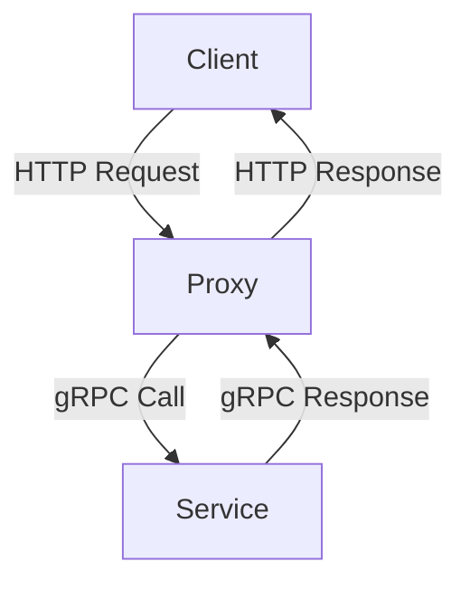

---

linkTitle: "4.2.1 Intercepting Requests and Responses"
title: "Intercepting Requests and Responses in Microservices with Proxy Pattern"
description: "Explore the Proxy Pattern in microservices architecture, focusing on intercepting requests and responses to enhance functionality such as logging, authentication, and traffic management."
categories:
- Microservices
- Design Patterns
- Software Architecture
tags:
- Proxy Pattern
- Request Interception
- Middleware
- Microservices Architecture
- Traffic Management
date: 2024-10-25
type: docs
nav_weight: 4210

---

## 4.2.1 Intercepting Requests and Responses

In the realm of microservices architecture, the Proxy Pattern plays a pivotal role in managing and enhancing the interaction between clients and services. By acting as an intermediary, a proxy can intercept requests and responses, providing a centralized point for implementing cross-cutting concerns such as logging, authentication, and traffic management. This section delves into the intricacies of the Proxy Pattern, offering insights into its responsibilities, implementation strategies, and best practices.

### Defining the Proxy Pattern

The Proxy Pattern is a structural design pattern that introduces an intermediary layer between a client and a target service. This intermediary, known as the proxy, is responsible for managing the communication flow, allowing for additional processing of requests and responses. In microservices, proxies are often used to encapsulate complex logic that should not be directly handled by the services themselves.

**Key Characteristics of the Proxy Pattern:**

- **Intermediary Role:** Acts as a middleman between clients and services.
- **Encapsulation:** Encapsulates additional functionality such as security, logging, and caching.
- **Transparency:** Ideally, the presence of a proxy should be transparent to the client.

### Identifying Proxy Responsibilities

A proxy in a microservices architecture can handle a variety of responsibilities, each contributing to the robustness and efficiency of the system:

1. **Request Logging:** Capturing and storing details about incoming requests for auditing and monitoring purposes.
2. **Authentication and Authorization:** Verifying the identity of clients and ensuring they have the necessary permissions to access resources.
3. **Rate Limiting:** Controlling the number of requests a client can make within a specified timeframe to prevent abuse.
4. **Caching:** Storing responses temporarily to reduce load on services and improve response times.
5. **Protocol Translation:** Converting requests and responses between different communication protocols.
6. **Traffic Routing:** Directing requests to the appropriate service instances based on rules or metrics.

### Implementing Interception Logic

To effectively intercept and process requests and responses, a proxy must implement specific logic that can be customized to meet the needs of the application. Here are the steps to implement interception logic:

1. **Capture Incoming Requests:** Use hooks or middleware to capture requests as they arrive at the proxy.
2. **Process Requests:** Analyze and potentially modify the request before forwarding it to the target service.
3. **Capture Outgoing Responses:** Intercept responses from the service before they are sent back to the client.
4. **Process Responses:** Modify or log responses as needed, ensuring any changes are compliant with business rules.

### Using Middleware Components

Middleware components are essential in a proxy architecture, providing a modular approach to handling various aspects of request and response processing. Middleware can be stacked to form a pipeline, where each component performs a specific task.

**Example Middleware Stack:**

- **Authentication Middleware:** Verifies client credentials.
- **Logging Middleware:** Records request and response details.
- **Rate Limiting Middleware:** Enforces request limits.
- **Response Compression Middleware:** Compresses responses to reduce bandwidth usage.

**Java Code Example:**

```java
public class ProxyServer {
    private List<Middleware> middlewareStack = new ArrayList<>();

    public ProxyServer() {
        middlewareStack.add(new AuthenticationMiddleware());
        middlewareStack.add(new LoggingMiddleware());
        middlewareStack.add(new RateLimitingMiddleware());
        middlewareStack.add(new ResponseCompressionMiddleware());
    }

    public Response handleRequest(Request request) {
        for (Middleware middleware : middlewareStack) {
            if (!middleware.process(request)) {
                return new Response("Request blocked by middleware", 403);
            }
        }
        // Forward request to target service and get response
        Response response = forwardRequestToService(request);
        // Process response through middleware
        for (Middleware middleware : middlewareStack) {
            middleware.process(response);
        }
        return response;
    }
}
```

### Handling Protocol Translation

One of the powerful features of a proxy is its ability to translate between different communication protocols. This is particularly useful in heterogeneous environments where clients and services may use different protocols.

**Protocol Translation Example:**

- **HTTP to gRPC:** Convert incoming HTTP requests to gRPC calls for services that use gRPC.
- **SOAP to REST:** Translate SOAP requests into RESTful API calls.

**Diagram: Protocol Translation in Proxy**



### Managing Traffic Routing

A proxy can intelligently route traffic to different service instances based on predefined rules or real-time metrics. This capability is crucial for load balancing and ensuring high availability.

**Traffic Routing Strategies:**

- **Round Robin:** Distribute requests evenly across service instances.
- **Least Connections:** Route requests to the instance with the fewest active connections.
- **Geolocation-Based:** Direct requests to the nearest data center.

### Ensuring Performance Efficiency

While intercepting requests and responses provides numerous benefits, it is essential to ensure that the proxy does not become a performance bottleneck. Here are some strategies to maintain efficiency:

- **Optimize Middleware:** Ensure middleware components are lightweight and efficient.
- **Asynchronous Processing:** Use asynchronous operations to handle requests and responses without blocking.
- **Load Testing:** Regularly test the proxy under load to identify and address performance issues.

### Testing Intercepted Interactions

Testing is a critical aspect of ensuring that the proxy correctly manages and transforms requests and responses. Here are some testing strategies:

- **Unit Testing:** Test individual middleware components for correctness.
- **Integration Testing:** Validate the interaction between the proxy and services.
- **Performance Testing:** Measure the impact of the proxy on response times and throughput.

### Conclusion

The Proxy Pattern is a versatile tool in the microservices architect's toolkit, offering a centralized point for implementing cross-cutting concerns. By intercepting requests and responses, proxies can enhance security, improve performance, and ensure seamless communication between clients and services. Implementing a proxy requires careful consideration of its responsibilities and potential impact on system performance, but when done correctly, it can significantly contribute to the robustness and scalability of a microservices architecture.

## Quiz Time!



### What is the primary role of a proxy in microservices architecture?

- [x] Act as an intermediary between clients and services
- [ ] Directly handle business logic
- [ ] Store data persistently
- [ ] Replace the need for service discovery

> **Explanation:** The proxy acts as an intermediary, managing requests and responses between clients and services.

### Which of the following is NOT a responsibility of a proxy?

- [ ] Request logging
- [ ] Authentication
- [ ] Rate limiting
- [x] Database management

> **Explanation:** Database management is not typically a responsibility of a proxy.

### How can a proxy handle protocol translation?

- [x] By converting requests and responses between different communication protocols
- [ ] By storing protocol definitions
- [ ] By directly modifying service implementations
- [ ] By caching protocol data

> **Explanation:** A proxy can translate requests and responses to facilitate communication between different protocols.

### What is a common strategy to ensure a proxy does not become a performance bottleneck?

- [x] Optimize middleware components
- [ ] Increase the number of proxies
- [ ] Reduce service instances
- [ ] Disable logging

> **Explanation:** Optimizing middleware components helps maintain performance efficiency.

### Which middleware component is responsible for verifying client credentials?

- [x] Authentication Middleware
- [ ] Logging Middleware
- [ ] Rate Limiting Middleware
- [ ] Response Compression Middleware

> **Explanation:** Authentication Middleware handles client credential verification.

### What is the purpose of rate limiting in a proxy?

- [x] To control the number of requests a client can make within a timeframe
- [ ] To increase the speed of requests
- [ ] To store request data
- [ ] To translate protocols

> **Explanation:** Rate limiting controls request frequency to prevent abuse.

### How can a proxy manage traffic routing?

- [x] By directing requests to appropriate service instances based on rules
- [ ] By storing routing tables
- [ ] By modifying service endpoints
- [ ] By caching responses

> **Explanation:** A proxy routes traffic based on predefined rules or real-time metrics.

### What is a benefit of using middleware in a proxy?

- [x] Modular handling of request and response processing
- [ ] Direct access to database operations
- [ ] Elimination of service dependencies
- [ ] Increased latency

> **Explanation:** Middleware allows for modular and flexible processing of requests and responses.

### What is a key consideration when implementing interception logic in a proxy?

- [x] Ensuring it does not introduce significant latency
- [ ] Storing all intercepted data
- [ ] Directly modifying client applications
- [ ] Eliminating all middleware

> **Explanation:** It's crucial to ensure interception logic does not significantly impact performance.

### True or False: A proxy should always be visible to the client.

- [ ] True
- [x] False

> **Explanation:** Ideally, the presence of a proxy should be transparent to the client.


