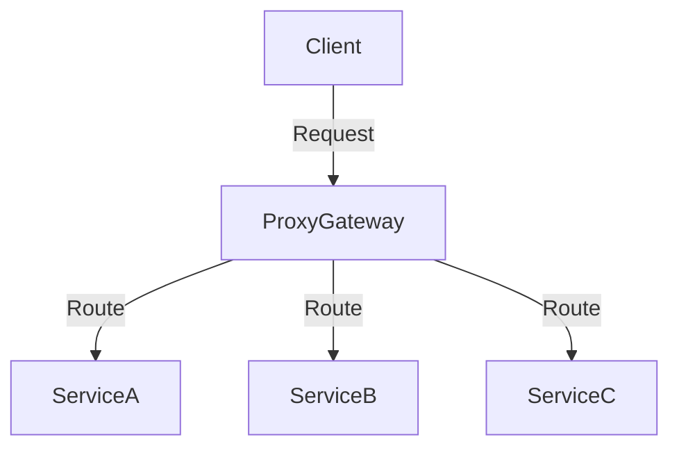

## 4.2.3 Implementation Strategies

The Proxy Pattern is a critical component in microservices architecture, acting as an intermediary that manages requests from clients to services. Implementing this pattern effectively requires careful consideration of technology, deployment strategies, and configuration management. This section provides a detailed guide on implementing the Proxy Pattern, focusing on selecting the right proxy technology, deploying it as a gateway, configuring routing and security, and ensuring efficient operation through automation and monitoring.

### Choose the Right Proxy Technology

Selecting the appropriate proxy technology is the first step in implementing the Proxy Pattern. Popular choices include NGINX, Envoy, and HAProxy, each offering unique features and benefits.

- **NGINX**: Known for its high performance and reliability, NGINX is widely used for serving static content, load balancing, and acting as a reverse proxy. It supports SSL termination and can handle a large number of concurrent connections efficiently.

- **Envoy**: Developed by Lyft, Envoy is a modern, high-performance proxy designed for cloud-native applications. It offers advanced features like dynamic service discovery, load balancing, and observability, making it ideal for complex microservices environments.

- **HAProxy**: HAProxy is renowned for its robust load balancing capabilities and is often used in scenarios requiring high availability and fault tolerance. It supports a wide range of protocols and is highly configurable.

**Considerations for Selection**:
- **Performance Requirements**: Evaluate the expected traffic load and choose a proxy that can handle peak demands.
- **Feature Set**: Identify the features critical to your architecture, such as SSL termination, routing flexibility, and observability.
- **Community and Support**: Consider the community support and available documentation for the proxy technology.

### Deploy the Proxy as a Gateway

Deploying the proxy as an API gateway or edge service is crucial for managing client requests efficiently. The gateway serves as the single entry point, handling authentication, routing, and other cross-cutting concerns.

**Deployment Steps**:
1. **Setup**: Install the chosen proxy software on a dedicated server or container.
2. **Configuration**: Define the gateway's configuration to handle incoming requests, including setting up virtual hosts and listeners.
3. **Security**: Implement security measures such as IP whitelisting and rate limiting to protect the gateway from malicious traffic.

**Diagram: API Gateway Deployment**



### Configure Routing Rules

Routing rules are essential for directing client requests to the appropriate microservices. These rules can be based on URL patterns, HTTP headers, or other criteria.

**Guidelines for Routing Configuration**:
- **URL Patterns**: Use regular expressions or path matching to route requests based on URL structures.
- **Header-Based Routing**: Direct traffic based on specific HTTP headers, such as `Content-Type` or custom headers.
- **Load Balancing**: Implement strategies like round-robin or least connections to distribute requests evenly.

**Example: NGINX Routing Configuration**

```nginx
http {
    upstream backend {
        server serviceA:8080;
        server serviceB:8080;
    }

    server {
        listen 80;
        location /serviceA {
            proxy_pass http://serviceA;
        }
        location /serviceB {
            proxy_pass http://serviceB;
        }
    }
}
```

### Implement SSL Termination

SSL termination at the proxy offloads the encryption and decryption tasks from individual microservices, improving performance and simplifying certificate management.

**Steps for SSL Termination**:
1. **Obtain SSL Certificates**: Acquire valid SSL certificates from a trusted Certificate Authority (CA).
2. **Configure SSL**: Set up SSL termination on the proxy by specifying the certificate and key files.
3. **Redirect HTTP to HTTPS**: Ensure all HTTP traffic is redirected to HTTPS for secure communication.

**Example: SSL Configuration in NGINX**

```nginx
server {
    listen 443 ssl;
    server_name example.com;

    ssl_certificate /etc/ssl/certs/example.com.crt;
    ssl_certificate_key /etc/ssl/private/example.com.key;

    location / {
        proxy_pass http://backend;
    }
}
```

### Set Up Load Balancing

Load balancing is critical for distributing incoming requests across multiple service instances, ensuring high availability and reliability.

**Load Balancing Strategies**:
- **Round Robin**: Distributes requests sequentially across service instances.
- **Least Connections**: Routes requests to the instance with the fewest active connections.
- **IP Hash**: Directs requests from the same client IP to the same service instance.

**Example: Load Balancing with HAProxy**

```haproxy
frontend http_front
    bind *:80
    default_backend servers

backend servers
    balance roundrobin
    server server1 192.168.1.1:8080 check
    server server2 192.168.1.2:8080 check
```

### Integrate with Service Discovery

Integrating the proxy with service discovery mechanisms allows dynamic routing to available service instances, enhancing flexibility and scalability.

**Integration Steps**:
1. **Choose a Service Discovery Tool**: Options include Consul, Eureka, and etcd.
2. **Configure the Proxy**: Set up the proxy to query the service registry for available instances.
3. **Dynamic Updates**: Ensure the proxy configuration updates automatically as services register or deregister.

**Example: Envoy with Service Discovery**

```yaml
static_resources:
  clusters:
  - name: service_cluster
    connect_timeout: 0.25s
    type: STRICT_DNS
    lb_policy: ROUND_ROBIN
    load_assignment:
      cluster_name: service_cluster
      endpoints:
      - lb_endpoints:
        - endpoint:
            address:
              socket_address:
                address: service.example.com
                port_value: 8080
```

### Automate Configuration Management

Automating proxy configuration using Infrastructure as Code (IaC) tools ensures consistency and simplifies updates across environments.

**Tools for Automation**:
- **Terraform**: Manage proxy infrastructure and configurations as code.
- **Ansible**: Automate deployment and configuration tasks.
- **Chef/Puppet**: Use for configuration management and orchestration.

**Example: Automating NGINX Configuration with Ansible**

```yaml
- name: Configure NGINX
  hosts: proxy
  tasks:
    - name: Install NGINX
      apt:
        name: nginx
        state: present

    - name: Deploy NGINX Configuration
      template:
        src: nginx.conf.j2
        dest: /etc/nginx/nginx.conf
      notify:
        - Restart NGINX

  handlers:
    - name: Restart NGINX
      service:
        name: nginx
        state: restarted
```

### Monitor and Maintain the Proxy

Ongoing monitoring and maintenance are vital to ensure the proxy operates efficiently and adapts to changing traffic patterns.

**Monitoring Tools**:
- **Prometheus**: Collect metrics and set up alerts for proxy performance.
- **Grafana**: Visualize metrics and create dashboards for real-time monitoring.
- **ELK Stack**: Aggregate and analyze logs for troubleshooting and insights.

**Maintenance Practices**:
- **Regular Updates**: Keep the proxy software up-to-date with the latest security patches.
- **Performance Tuning**: Adjust configurations based on traffic analysis to optimize performance.
- **Capacity Planning**: Anticipate growth and scale the proxy infrastructure accordingly.

### Conclusion

Implementing the Proxy Pattern in a microservices architecture involves selecting the right technology, deploying it effectively, and ensuring robust configuration and monitoring. By following these strategies, you can enhance the scalability, security, and reliability of your microservices ecosystem.

## Quiz Time!



### Which of the following is NOT a commonly used proxy technology for implementing the Proxy Pattern?

- [ ] NGINX
- [ ] Envoy
- [ ] HAProxy
- [x] Apache Tomcat

> **Explanation:** Apache Tomcat is a servlet container and web server, not typically used as a proxy technology for implementing the Proxy Pattern.

### What is the primary role of deploying a proxy as an API gateway?

- [x] To serve as the single entry point for client requests
- [ ] To store data for microservices
- [ ] To replace microservices
- [ ] To act as a database

> **Explanation:** The primary role of deploying a proxy as an API gateway is to serve as the single entry point for client requests, handling routing, security, and other cross-cutting concerns.

### Which configuration is essential for directing client requests to the appropriate microservices?

- [x] Routing rules
- [ ] Database schemas
- [ ] User authentication
- [ ] Data encryption

> **Explanation:** Routing rules are essential for directing client requests to the appropriate microservices based on URL patterns, headers, or other criteria.

### What is SSL termination, and why is it implemented at the proxy?

- [x] It offloads encryption tasks from services by handling secure communications at the proxy
- [ ] It terminates all service connections
- [ ] It encrypts data within the database
- [ ] It is used for load balancing

> **Explanation:** SSL termination is implemented at the proxy to offload encryption and decryption tasks from individual services, improving performance and simplifying certificate management.

### Which load balancing strategy distributes requests to the instance with the fewest active connections?

- [ ] Round Robin
- [x] Least Connections
- [ ] IP Hash
- [ ] Random

> **Explanation:** The Least Connections strategy distributes requests to the instance with the fewest active connections, balancing the load more effectively.

### How does integrating the proxy with service discovery enhance microservices architecture?

- [x] It allows dynamic routing to available service instances
- [ ] It increases storage capacity
- [ ] It reduces the need for SSL
- [ ] It simplifies database management

> **Explanation:** Integrating the proxy with service discovery allows dynamic routing to available service instances, enhancing flexibility and scalability.

### Which tool is NOT typically used for automating proxy configuration?

- [ ] Terraform
- [ ] Ansible
- [ ] Chef
- [x] MySQL

> **Explanation:** MySQL is a database management system, not a tool for automating proxy configuration.

### What is a key benefit of automating proxy configuration using Infrastructure as Code (IaC)?

- [x] Ensures consistency and simplifies updates
- [ ] Increases manual intervention
- [ ] Reduces the need for monitoring
- [ ] Eliminates the need for security

> **Explanation:** Automating proxy configuration using IaC ensures consistency and simplifies updates across environments.

### Which tool is commonly used for collecting metrics and setting up alerts for proxy performance?

- [x] Prometheus
- [ ] MySQL
- [ ] Apache Kafka
- [ ] Redis

> **Explanation:** Prometheus is commonly used for collecting metrics and setting up alerts for proxy performance.

### True or False: Regular updates and performance tuning are unnecessary for maintaining a proxy.

- [ ] True
- [x] False

> **Explanation:** Regular updates and performance tuning are necessary for maintaining a proxy to ensure it operates efficiently and adapts to changing traffic patterns.


