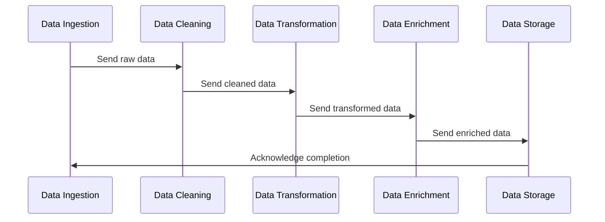

---

linkTitle: "4.3.2 Sequential Processing"
title: "Sequential Processing in Chained Microservices: Design Patterns and Best Practices"
description: "Explore the intricacies of sequential processing in microservices, focusing on design patterns, data flow control, service dependencies, and optimization strategies."
categories:
- Microservices
- Software Architecture
- Design Patterns
tags:
- Sequential Processing
- Microservices
- Data Flow
- Service Dependencies
- Optimization
date: 2024-10-25
type: docs
nav_weight: 4320

---

## 4.3.2 Sequential Processing

In the world of microservices, the Chained Microservice Pattern is a powerful architectural approach that allows services to be organized in a sequence, where each service performs a specific task. This section delves into the concept of sequential processing within this pattern, exploring its necessity, design considerations, and best practices.

### Understanding Sequential Processing Needs

Sequential processing is essential in scenarios where tasks must be performed in a specific order. Common use cases include:

- **Data Transformation Pipelines:** Where raw data needs to be processed through multiple stages, such as cleaning, transformation, and enrichment, before reaching its final form.
- **Validation Pipelines:** Where data must pass through a series of validation checks, each ensuring compliance with different rules or standards.
- **Order Processing Systems:** Where each step, such as inventory check, payment processing, and order confirmation, must occur in a defined sequence.

Sequential processing ensures that each step is completed successfully before moving to the next, maintaining data integrity and consistency throughout the pipeline.

### Design Processing Steps

Designing a sequential processing pipeline involves defining clear, discrete tasks for each microservice. Each service should focus on a single responsibility, adhering to the Single Responsibility Principle (SRP). This design approach not only simplifies each service but also enhances maintainability and scalability.

#### Example Design

Consider a data processing pipeline with the following steps:

1. **Data Ingestion Service:** Collects raw data from various sources.
2. **Data Cleaning Service:** Removes duplicates and corrects errors.
3. **Data Transformation Service:** Converts data into a desired format.
4. **Data Enrichment Service:** Adds additional information from external sources.
5. **Data Storage Service:** Saves the processed data into a database.

Each service in this chain performs a specific task, passing the processed data to the next service in the sequence.

### Implement Data Flow Control

Controlling the flow of data between services is crucial to ensure that each step receives the necessary input and produces the expected output. This can be achieved through:

- **Synchronous Communication:** Using HTTP/REST or gRPC for real-time data transfer, ensuring each service waits for the previous one to complete.
- **Asynchronous Communication:** Utilizing message brokers like RabbitMQ or Kafka to decouple services, allowing them to process data independently and improve resilience.

#### Java Code Example

Here's a simple example using Spring Boot and RabbitMQ for asynchronous communication:

```java
@RestController
public class DataIngestionController {

    @Autowired
    private RabbitTemplate rabbitTemplate;

    @PostMapping("/ingest")
    public ResponseEntity<String> ingestData(@RequestBody String rawData) {
        rabbitTemplate.convertAndSend("dataQueue", rawData);
        return ResponseEntity.ok("Data ingested successfully");
    }
}

@Service
public class DataCleaningService {

    @RabbitListener(queues = "dataQueue")
    public void cleanData(String rawData) {
        String cleanedData = performCleaning(rawData);
        rabbitTemplate.convertAndSend("cleanedDataQueue", cleanedData);
    }

    private String performCleaning(String data) {
        // Implement data cleaning logic here
        return data.trim();
    }
}
```

In this example, the `DataIngestionController` sends raw data to a RabbitMQ queue, which is then consumed by the `DataCleaningService` for processing.

### Manage Service Dependencies

Managing dependencies between services is vital to prevent tight coupling, which can hinder scalability and flexibility. Strategies include:

- **Loose Coupling:** Use interfaces and contracts to define interactions, allowing services to evolve independently.
- **Service Registry and Discovery:** Implement a service registry (e.g., Eureka) to dynamically discover service endpoints, reducing hard-coded dependencies.

### Optimize Throughput

To optimize throughput in sequential processing:

- **Parallelize Independent Steps:** Identify steps that can be executed concurrently and parallelize them to reduce overall processing time.
- **Asynchronous Processing:** Use asynchronous communication to allow services to process data at their own pace, improving system responsiveness.

### Handle Exceptions

Handling exceptions gracefully is crucial to maintaining the reliability of the processing pipeline. Consider the following strategies:

- **Retry Mechanisms:** Implement retry logic for transient errors, ensuring temporary issues do not disrupt the entire pipeline.
- **Fallback Strategies:** Define fallback actions for critical failures, such as sending alerts or storing data for later reprocessing.

### Implement Idempotency

Idempotency ensures that repeated processing of the same data does not produce unintended side effects. This is particularly important in distributed systems where retries are common.

#### Example Implementation

```java
@Service
public class DataTransformationService {

    private Set<String> processedIds = ConcurrentHashMap.newKeySet();

    public void transformData(String dataId, String data) {
        if (processedIds.contains(dataId)) {
            return; // Already processed
        }
        // Perform transformation
        processedIds.add(dataId);
    }
}
```

In this example, a `Set` is used to track processed data IDs, preventing duplicate processing.

### Monitor and Trace Processing Steps

Monitoring and distributed tracing provide visibility into each step of the processing pipeline, aiding in debugging and performance optimization.

- **Distributed Tracing:** Use tools like OpenTelemetry to trace requests across services, identifying bottlenecks and failures.
- **Logging and Metrics:** Implement comprehensive logging and metrics collection to monitor service health and performance.

#### Mermaid Diagram



This diagram illustrates the sequential flow of data through the processing pipeline, highlighting the interactions between services.

### Best Practices and Common Pitfalls

- **Best Practices:**
  - Design services with clear, single responsibilities.
  - Use asynchronous communication to decouple services.
  - Implement robust error handling and idempotency.
  - Monitor and trace service interactions for visibility.

- **Common Pitfalls:**
  - Tight coupling between services, leading to scalability issues.
  - Lack of error handling, causing pipeline failures.
  - Ignoring idempotency, resulting in duplicate processing.

### Conclusion

Sequential processing in microservices is a powerful pattern for organizing tasks that must be performed in a specific order. By designing clear processing steps, managing dependencies, optimizing throughput, and implementing robust error handling, you can build resilient and scalable systems. Monitoring and tracing further enhance the ability to maintain and optimize these systems over time.

For further exploration, consider reading about distributed systems design, service orchestration, and advanced error handling techniques. Resources such as "Building Microservices" by Sam Newman and "Designing Data-Intensive Applications" by Martin Kleppmann offer deeper insights into these topics.

## Quiz Time!



### Which scenario is NOT typically suited for sequential processing?

- [ ] Data Transformation Pipelines
- [ ] Validation Pipelines
- [x] Independent Microservices with No Dependencies
- [ ] Order Processing Systems

> **Explanation:** Independent microservices with no dependencies do not require sequential processing as they can operate independently without a specific order.

### What is a key benefit of designing microservices with single responsibility?

- [x] Enhances maintainability and scalability
- [ ] Increases coupling between services
- [ ] Reduces the need for monitoring
- [ ] Complicates error handling

> **Explanation:** Designing microservices with a single responsibility simplifies each service, making them easier to maintain and scale independently.

### Which communication method is best for decoupling services in a sequential processing pipeline?

- [ ] Synchronous Communication
- [x] Asynchronous Communication
- [ ] Direct Database Access
- [ ] Shared Memory

> **Explanation:** Asynchronous communication decouples services, allowing them to operate independently and improving resilience.

### What is the purpose of implementing idempotency in sequential processing?

- [x] To ensure repeated processing does not produce unintended side effects
- [ ] To increase processing speed
- [ ] To enhance data transformation
- [ ] To simplify service dependencies

> **Explanation:** Idempotency ensures that repeated processing of the same data does not lead to adverse effects, which is crucial in distributed systems with retries.

### How can throughput be optimized in a sequential processing pipeline?

- [x] Parallelize Independent Steps
- [ ] Increase Service Coupling
- [ ] Use Synchronous Communication
- [ ] Reduce Monitoring

> **Explanation:** Parallelizing independent steps can reduce overall processing time, optimizing throughput.

### Which tool is commonly used for distributed tracing in microservices?

- [ ] RabbitMQ
- [ ] Docker
- [x] OpenTelemetry
- [ ] Jenkins

> **Explanation:** OpenTelemetry is a popular tool for distributed tracing, providing visibility into service interactions.

### What strategy helps manage service dependencies in a microservices architecture?

- [x] Loose Coupling
- [ ] Hard-Coded Endpoints
- [ ] Direct Database Access
- [ ] Shared Memory

> **Explanation:** Loose coupling allows services to evolve independently, reducing dependencies and enhancing scalability.

### What is a common pitfall in sequential processing?

- [ ] Implementing idempotency
- [x] Tight coupling between services
- [ ] Using asynchronous communication
- [ ] Monitoring service interactions

> **Explanation:** Tight coupling between services can hinder scalability and flexibility, making it a common pitfall.

### Which of the following is NOT a best practice for sequential processing?

- [ ] Implement robust error handling
- [ ] Use asynchronous communication
- [ ] Monitor and trace interactions
- [x] Ignore idempotency

> **Explanation:** Ignoring idempotency can lead to duplicate processing and adverse effects, making it not a best practice.

### True or False: Sequential processing is only applicable to data processing pipelines.

- [ ] True
- [x] False

> **Explanation:** Sequential processing is applicable to various scenarios, including order processing systems and validation pipelines, not just data processing.


