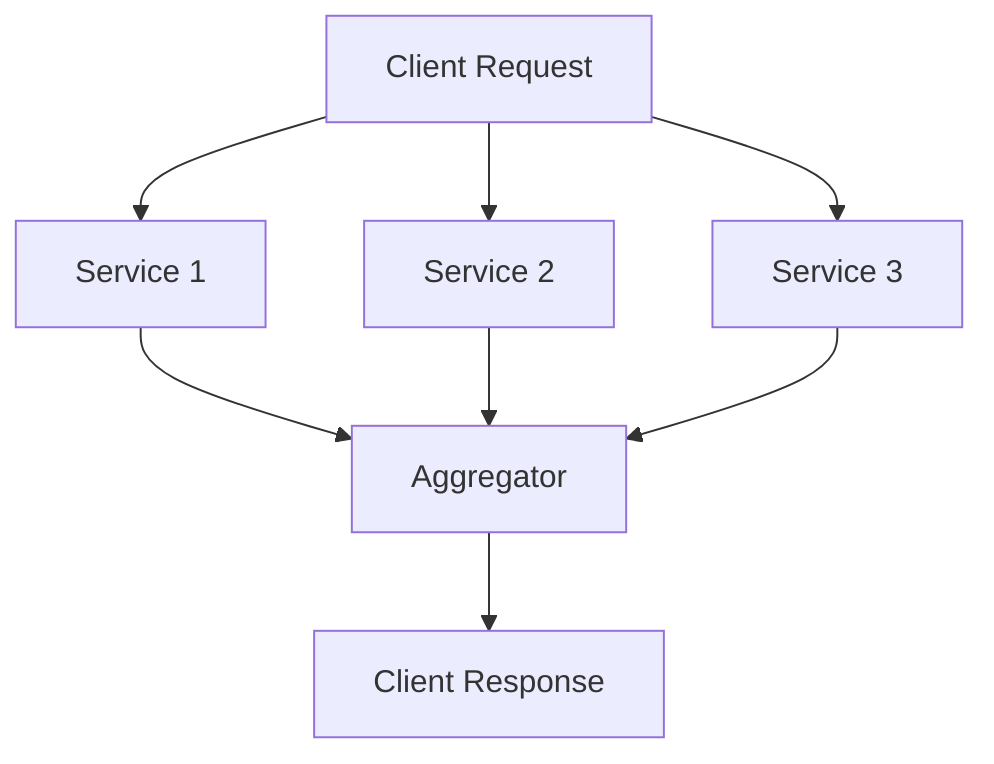
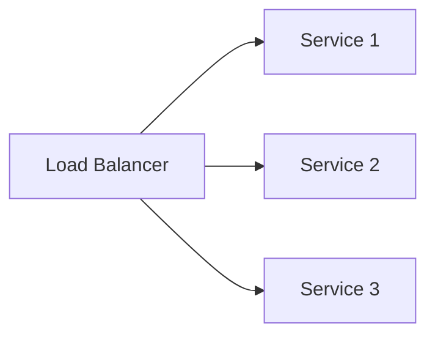
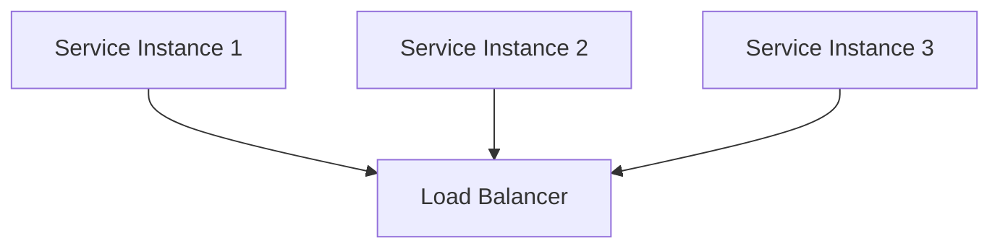

## 4.4.3 Optimizing Performance

In microservices architecture, the Branch Pattern is a powerful structural pattern that allows for parallel processing paths, enabling services to handle tasks concurrently and combine results efficiently. However, optimizing performance in this pattern is crucial to ensure that the system remains responsive and scalable. This section delves into various strategies for enhancing performance within the Branch Pattern, focusing on identifying bottlenecks, implementing caching, load balancing, optimizing communication protocols, minimizing data transfer, and more.

### Analyzing Performance Bottlenecks

The first step in optimizing performance is identifying where bottlenecks occur. In the Branch Pattern, bottlenecks can arise in parallel processing paths and during result aggregation. To effectively analyze these bottlenecks, consider the following steps:

1. **Profiling and Monitoring:** Use profiling tools to monitor the execution time of each service in the branch. Tools like Prometheus and Grafana can help visualize performance metrics.

2. **Identifying Slow Services:** Determine which services are taking the longest to process requests. This can be done by analyzing logs and tracing requests through distributed tracing tools like OpenTelemetry.

3. **Analyzing Aggregation Delays:** Examine the time taken to aggregate results from parallel paths. This may involve analyzing network latency and data processing times.

4. **Diagramming Service Interactions:**



This diagram illustrates how multiple services process requests in parallel and aggregate results before responding to the client. Identifying which service or path is the slowest can help target optimization efforts.

### Implementing Caching Mechanisms

Caching is a powerful technique to improve performance by storing frequently accessed data, thus reducing the need for repetitive processing. Here's how to implement caching effectively:

1. **Identify Cacheable Data:** Determine which data can be cached without compromising data integrity. This often includes static data or data that changes infrequently.

2. **Use Distributed Caching:** Implement distributed caching solutions like Redis or Memcached to store data across multiple nodes, ensuring high availability and scalability.

3. **Cache Invalidation Strategies:** Establish strategies for cache invalidation to ensure that stale data is not served. This can include time-based expiration or event-driven invalidation.

4. **Code Example:**

```java
import redis.clients.jedis.Jedis;

public class CacheService {
    private Jedis jedis;

    public CacheService() {
        this.jedis = new Jedis("localhost");
    }

    public void cacheData(String key, String value) {
        jedis.setex(key, 3600, value); // Cache with a TTL of 1 hour
    }

    public String getCachedData(String key) {
        return jedis.get(key);
    }
}
```

This Java snippet demonstrates a simple caching mechanism using Redis, where data is cached with a time-to-live (TTL) of one hour.

### Use Load Balancing

Load balancing is essential to distribute workloads evenly across parallel services, preventing any single service from becoming a bottleneck. Consider these strategies:

1. **Round Robin Load Balancing:** Distribute requests evenly across services in a cyclic order, ensuring a balanced load.

2. **Least Connections Strategy:** Direct requests to the service with the fewest active connections, optimizing resource utilization.

3. **Implementing Load Balancers:** Use tools like NGINX or HAProxy to manage load balancing efficiently.

4. **Diagram:**



This diagram illustrates how a load balancer distributes incoming requests to multiple services, ensuring even workload distribution.

### Optimize Communication Protocols

Choosing the right communication protocol can significantly impact performance. Consider the following:

1. **Use gRPC Over REST:** gRPC is a high-performance, open-source RPC framework that uses HTTP/2 for transport, providing better performance than traditional REST over HTTP/1.1.

2. **Binary Protocols:** Opt for binary protocols like Protocol Buffers (used by gRPC) for efficient serialization and deserialization.

3. **Code Example:**

```java
// gRPC service definition
service ExampleService {
    rpc GetExampleData (ExampleRequest) returns (ExampleResponse);
}
```

This gRPC service definition shows how to define a high-performance RPC service.

### Minimize Data Transfer

Reducing the amount of data transferred between services can lower latency and bandwidth usage. Here are some techniques:

1. **Data Compression:** Use compression algorithms like GZIP to reduce the size of data being transferred.

2. **Selective Data Fetching:** Implement mechanisms to fetch only the necessary data, avoiding over-fetching.

3. **Example:**

```java
// Compressing data before sending
byte[] compressedData = compressData(originalData);
sendData(compressedData);
```

This code snippet demonstrates compressing data before transmission to minimize data transfer.

### Implement Asynchronous Processing

Asynchronous processing allows services to handle tasks without blocking resources, improving throughput. Here's how to implement it:

1. **Use Message Queues:** Implement message queues like RabbitMQ or Kafka to decouple services and enable asynchronous processing.

2. **Event-Driven Architecture:** Adopt an event-driven architecture where services react to events rather than direct requests.

3. **Code Example:**

```java
// Asynchronous processing with a message queue
public void processMessage() {
    Message message = messageQueue.receive();
    CompletableFuture.runAsync(() -> handleMessage(message));
}
```

This Java code snippet shows how to process messages asynchronously using a CompletableFuture.

### Scale Services Horizontally

Horizontal scaling involves adding more instances of a service to handle increased demand. Consider these points:

1. **Containerization:** Use containerization technologies like Docker to deploy multiple instances of a service easily.

2. **Orchestration Tools:** Leverage orchestration tools like Kubernetes to manage and scale services automatically.

3. **Diagram:**



This diagram illustrates horizontal scaling with multiple instances of a service behind a load balancer.

### Monitor and Tune Performance

Continuous monitoring and tuning are vital to ensure the Branch Pattern operates efficiently. Follow these steps:

1. **Set Up Monitoring Tools:** Use tools like Prometheus and Grafana to monitor service performance and resource utilization.

2. **Performance Tuning:** Regularly analyze performance metrics and adjust configurations to optimize throughput and latency.

3. **Feedback Loop:** Establish a feedback loop to incorporate monitoring insights into performance tuning efforts.

### Conclusion

Optimizing performance in the Branch Pattern involves a multifaceted approach, from identifying bottlenecks to implementing caching, load balancing, and asynchronous processing. By following these strategies, you can ensure that your microservices architecture remains efficient, scalable, and responsive to changing demands.

## Quiz Time!



### What is the first step in optimizing performance in the Branch Pattern?

- [x] Analyzing performance bottlenecks
- [ ] Implementing caching mechanisms
- [ ] Using load balancing
- [ ] Optimizing communication protocols

> **Explanation:** Identifying performance bottlenecks is crucial to understanding where optimization efforts should be focused.

### Which tool can be used for distributed caching in microservices?

- [x] Redis
- [ ] MySQL
- [ ] Apache Kafka
- [ ] Jenkins

> **Explanation:** Redis is a popular distributed caching solution that helps store frequently accessed data.

### What is the advantage of using gRPC over REST in microservices?

- [x] Better performance due to HTTP/2 and binary protocols
- [ ] Easier to implement
- [ ] More secure
- [ ] Requires less coding

> **Explanation:** gRPC uses HTTP/2 and Protocol Buffers, providing better performance compared to REST over HTTP/1.1.

### What is a common strategy for load balancing in microservices?

- [x] Round Robin
- [ ] FIFO
- [ ] LIFO
- [ ] Random Selection

> **Explanation:** Round Robin is a common load balancing strategy that distributes requests evenly across services.

### How can data transfer between services be minimized?

- [x] Data compression and selective data fetching
- [ ] Increasing bandwidth
- [ ] Using larger data packets
- [ ] Reducing the number of services

> **Explanation:** Data compression and selective data fetching help reduce the amount of data transferred, minimizing latency and bandwidth usage.

### What is the benefit of asynchronous processing in microservices?

- [x] Improved throughput by non-blocking resource handling
- [ ] Simplified code structure
- [ ] Reduced memory usage
- [ ] Enhanced security

> **Explanation:** Asynchronous processing allows services to handle tasks without blocking resources, improving overall throughput.

### Which technology is commonly used for containerization in microservices?

- [x] Docker
- [ ] Apache Tomcat
- [ ] Jenkins
- [ ] MySQL

> **Explanation:** Docker is widely used for containerizing applications, making it easier to deploy and scale services.

### What is the purpose of using orchestration tools like Kubernetes?

- [x] To manage and scale services automatically
- [ ] To write code faster
- [ ] To secure applications
- [ ] To reduce costs

> **Explanation:** Kubernetes helps manage and scale containerized applications automatically, ensuring efficient resource utilization.

### Which tool is used for monitoring service performance in microservices?

- [x] Prometheus
- [ ] GitHub
- [ ] Eclipse
- [ ] Apache Maven

> **Explanation:** Prometheus is a monitoring tool that collects and analyzes performance metrics in microservices.

### True or False: Horizontal scaling involves adding more instances of a service to handle increased demand.

- [x] True
- [ ] False

> **Explanation:** Horizontal scaling means adding more instances of a service to distribute the load and handle increased demand effectively.


