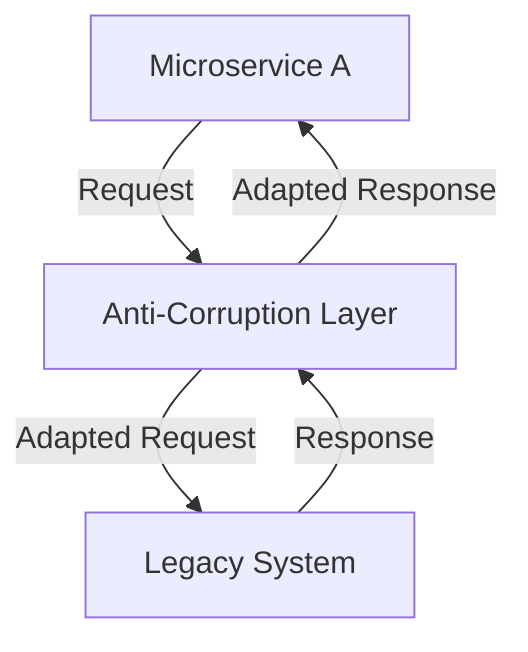
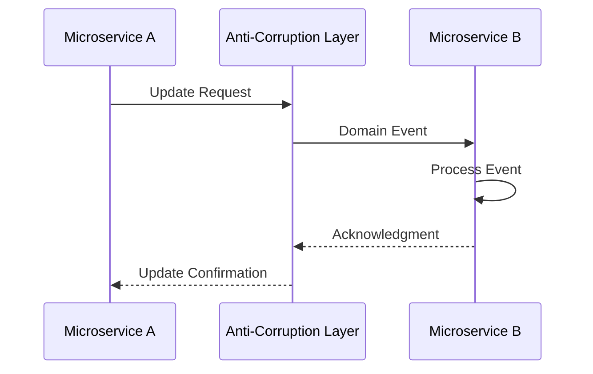

## 4.8.3 Maintaining Domain Integrity

In the realm of microservices architecture, maintaining domain integrity is crucial for ensuring that the system's domain models and business rules remain consistent and correct across various services. The Anti-Corruption Layer (ACL) pattern plays a pivotal role in achieving this by acting as a protective barrier between different domain models, particularly when integrating with legacy systems. This section delves into the strategies and practices for maintaining domain integrity using the ACL pattern.

### Defining Domain Integrity

Domain integrity refers to the preservation of consistency and correctness within domain models and business rules across services. It ensures that each service adheres to the defined domain logic and constraints, preventing unauthorized interactions and data inconsistencies. In microservices, where services are independently developed and deployed, maintaining domain integrity is essential to avoid the propagation of errors and inconsistencies throughout the system.

### Enforcing Domain Boundaries

The ACL enforces clear boundaries between different domain models, acting as a mediator that translates and adapts interactions between microservices and legacy systems. This separation prevents unauthorized interactions and data leakage, ensuring that each service operates within its defined domain context.

#### Diagram: Enforcing Domain Boundaries



In the diagram above, the ACL acts as a buffer, adapting requests and responses to maintain domain boundaries.

### Implementing Validation Rules

Validation rules within the ACL ensure that data exchanged between legacy systems and microservices adheres to business rules and constraints. By implementing these rules, the ACL can intercept and validate data, preventing invalid or inconsistent data from entering the system.

#### Java Code Example: Implementing Validation Rules

```java
public class AntiCorruptionLayer {

    public void validateData(DomainObject domainObject) throws ValidationException {
        if (domainObject.getValue() < 0) {
            throw new ValidationException("Value cannot be negative");
        }
        // Additional validation rules...
    }
}
```

In this example, the `validateData` method checks that a domain object's value is not negative, enforcing a simple business rule.

### Managing Business Logic

Encapsulating business logic within the ACL is essential for maintaining consistency across different models. The ACL can centralize domain-specific behaviors, ensuring that all interactions conform to the established business logic.

#### Example: Encapsulating Business Logic

```java
public class BusinessLogicHandler {

    public Result processRequest(Request request) {
        // Business logic implementation
        if (request.isValid()) {
            return new Result("Success");
        } else {
            return new Result("Failure");
        }
    }
}
```

Here, the `processRequest` method encapsulates business logic, determining the outcome based on the request's validity.

### Using Domain Events

Domain events within the ACL can propagate changes and ensure that domain integrity is preserved across services. By emitting events when significant domain changes occur, the ACL can notify other services, allowing them to react accordingly.

#### Diagram: Domain Events Propagation



This sequence diagram illustrates how a domain event is propagated from Microservice A through the ACL to Microservice B.

### Ensuring Transactional Consistency

Maintaining transactional consistency when operations span multiple services and legacy systems is challenging. Patterns like sagas can be employed to manage distributed transactions, ensuring that all parts of a transaction are completed successfully or rolled back in case of failure.

#### Strategy: Using Sagas for Transactional Consistency

A saga is a sequence of local transactions where each transaction updates the database and publishes a message or event to trigger the next transaction step. If a step fails, the saga executes compensating transactions to undo the changes.

### Monitoring and Auditing Domain Interactions

Monitoring and auditing interactions managed by the ACL are crucial for detecting and addressing any violations of domain integrity. By logging interactions and changes, the system can provide insights into potential issues and ensure compliance with domain rules.

#### Example: Monitoring Interactions

```java
public class InteractionLogger {

    public void logInteraction(String interactionDetails) {
        // Log interaction details for auditing
        System.out.println("Interaction logged: " + interactionDetails);
    }
}
```

This simple logger captures interaction details, aiding in monitoring and auditing efforts.

### Continuously Refining ACL Logic

As domain models evolve, it is vital to continuously refine and update the ACL logic to ensure ongoing alignment and integrity. Regular reviews and updates to the ACL can accommodate changes in business rules and domain models, preventing drift and maintaining consistency.

### Best Practices and Challenges

- **Best Practices:**
  - Clearly define domain boundaries and enforce them through the ACL.
  - Regularly update validation rules and business logic to reflect changes in domain models.
  - Use domain events to propagate changes and maintain consistency across services.
  - Implement monitoring and auditing to detect and address domain integrity violations.

- **Common Challenges:**
  - Managing the complexity of distributed transactions across multiple services.
  - Ensuring that validation rules and business logic remain up-to-date with evolving domain models.
  - Balancing the need for domain integrity with performance and scalability considerations.

### Conclusion

Maintaining domain integrity is a critical aspect of microservices architecture, ensuring that domain models and business rules remain consistent and correct across services. The Anti-Corruption Layer pattern provides a robust framework for enforcing domain boundaries, implementing validation rules, managing business logic, and ensuring transactional consistency. By adopting these practices, organizations can build scalable and resilient microservices systems that uphold domain integrity.

## Quiz Time!



### What is domain integrity in microservices?

- [x] Maintaining consistency and correctness of domain models and business rules across services
- [ ] Ensuring high availability of services
- [ ] Optimizing service performance
- [ ] Reducing service latency

> **Explanation:** Domain integrity involves maintaining the consistency and correctness of domain models and business rules across services.

### How does the Anti-Corruption Layer enforce domain boundaries?

- [x] By acting as a mediator that translates and adapts interactions between microservices and legacy systems
- [ ] By directly modifying domain models
- [ ] By bypassing legacy systems
- [ ] By merging domain models

> **Explanation:** The ACL acts as a mediator, translating and adapting interactions to enforce domain boundaries.

### What is the purpose of validation rules in the ACL?

- [x] To ensure data exchanged between systems adheres to business rules and constraints
- [ ] To increase system performance
- [ ] To simplify service interactions
- [ ] To reduce code complexity

> **Explanation:** Validation rules ensure that data exchanged between systems adheres to business rules and constraints.

### How can domain events help maintain domain integrity?

- [x] By propagating changes and notifying other services
- [ ] By reducing service dependencies
- [ ] By simplifying data models
- [ ] By increasing data redundancy

> **Explanation:** Domain events propagate changes and notify other services, helping maintain domain integrity.

### What pattern can be used to ensure transactional consistency across services?

- [x] Sagas
- [ ] Circuit Breaker
- [ ] Proxy
- [ ] Singleton

> **Explanation:** Sagas manage distributed transactions, ensuring transactional consistency across services.

### Why is monitoring and auditing domain interactions important?

- [x] To detect and address violations of domain integrity
- [ ] To increase service throughput
- [ ] To simplify service architecture
- [ ] To reduce system costs

> **Explanation:** Monitoring and auditing help detect and address violations of domain integrity.

### What is a common challenge in maintaining domain integrity?

- [x] Managing distributed transactions across multiple services
- [ ] Increasing service latency
- [ ] Reducing service availability
- [ ] Simplifying codebase

> **Explanation:** Managing distributed transactions across multiple services is a common challenge in maintaining domain integrity.

### How often should the ACL logic be refined?

- [x] Regularly, to accommodate changes in business rules and domain models
- [ ] Only during initial development
- [ ] Once a year
- [ ] Never

> **Explanation:** The ACL logic should be regularly refined to accommodate changes in business rules and domain models.

### What is the role of business logic in the ACL?

- [x] To enforce domain-specific behaviors and maintain consistency across models
- [ ] To increase system performance
- [ ] To reduce code complexity
- [ ] To simplify service interactions

> **Explanation:** Business logic in the ACL enforces domain-specific behaviors and maintains consistency across models.

### True or False: The ACL pattern can help prevent unauthorized interactions and data leakage.

- [x] True
- [ ] False

> **Explanation:** The ACL pattern enforces domain boundaries, helping prevent unauthorized interactions and data leakage.


