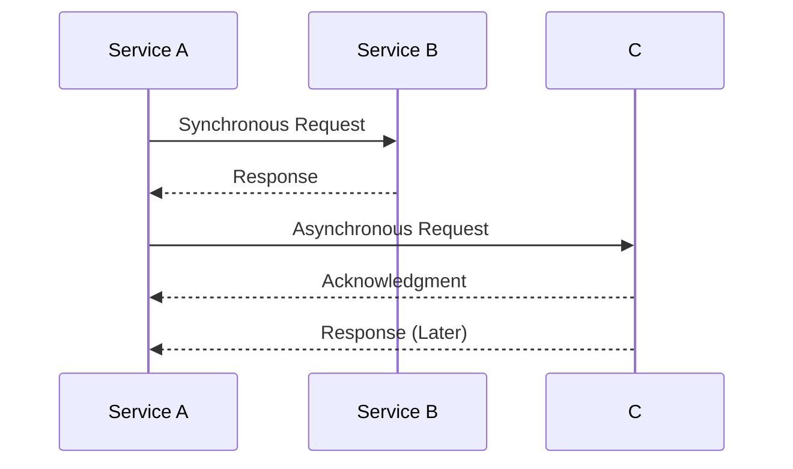

## 5.1.1 Synchronous vs. Asynchronous Communication in Microservices

In the realm of microservices, choosing the right communication pattern is crucial for building scalable and resilient systems. Two primary communication styles are synchronous and asynchronous communication. Understanding the differences between these styles, their use cases, and their implications on system design is essential for architects and developers.

### Synchronous Communication

**Definition:** Synchronous communication involves direct interaction between services where the calling service waits for a response from the called service before proceeding. This pattern is akin to a phone call where both parties are engaged in real-time communication.

**Characteristics:**
- **Real-time Interaction:** The caller waits for the callee to process the request and return a response.
- **Blocking Nature:** The calling service is blocked until the response is received.
- **Immediate Feedback:** Provides immediate results, which can be crucial for certain operations.

**Use Cases:**
- **User Authentication:** When a user logs in, the authentication service must verify credentials before granting access. This requires immediate feedback to the user.
- **Payment Processing:** In e-commerce, confirming payment details often requires synchronous communication to ensure transaction validity before proceeding with order fulfillment.

**Java Example:**

```java
public class SynchronousClient {
    public static void main(String[] args) {
        // Simulating a synchronous HTTP call
        HttpClient client = HttpClient.newHttpClient();
        HttpRequest request = HttpRequest.newBuilder()
                .uri(URI.create("https://api.example.com/authenticate"))
                .build();

        try {
            HttpResponse<String> response = client.send(request, HttpResponse.BodyHandlers.ofString());
            System.out.println("Response: " + response.body());
        } catch (IOException | InterruptedException e) {
            e.printStackTrace();
        }
    }
}
```

### Asynchronous Communication

**Definition:** Asynchronous communication allows services to interact without waiting for an immediate response. This pattern is similar to sending an email, where the sender can continue with other tasks without waiting for the recipient's reply.

**Characteristics:**
- **Non-blocking:** The caller can continue processing other tasks without waiting for the response.
- **Decoupled Processes:** Services can operate independently, enhancing system flexibility.
- **Event-Driven:** Often involves message queues or event streams to handle communication.

**Use Cases:**
- **Order Processing:** In an e-commerce system, once an order is placed, various services (inventory, shipping, billing) can process the order asynchronously.
- **Notification Systems:** Sending notifications (emails, SMS) can be handled asynchronously, allowing the main application flow to continue without delay.

**Java Example:**

```java
import java.util.concurrent.CompletableFuture;

public class AsynchronousClient {
    public static void main(String[] args) {
        // Simulating an asynchronous HTTP call
        HttpClient client = HttpClient.newHttpClient();
        HttpRequest request = HttpRequest.newBuilder()
                .uri(URI.create("https://api.example.com/notify"))
                .build();

        CompletableFuture<HttpResponse<String>> responseFuture = client.sendAsync(request, HttpResponse.BodyHandlers.ofString());

        // Continue with other tasks
        System.out.println("Request sent, continuing with other tasks...");

        // Handle the response when it arrives
        responseFuture.thenAccept(response -> System.out.println("Response: " + response.body()));
    }
}
```

### Latency Implications

Synchronous communication can introduce latency as the caller waits for a response, potentially leading to bottlenecks in high-traffic scenarios. In contrast, asynchronous communication decouples processes, allowing systems to handle tasks concurrently, thus reducing perceived latency and improving throughput.

**Diagram:**



### Reliability Factors

Asynchronous communication enhances system reliability by decoupling services. If a service is down, messages can be queued and processed later, ensuring resilience. Synchronous communication, however, can lead to cascading failures if a dependent service is unavailable.

### Scalability Considerations

Asynchronous communication supports scalability by allowing services to process requests independently, thus handling higher loads without being bottlenecked by synchronous dependencies. This is particularly beneficial in distributed systems where network latency and service availability can vary.

### Complexity Trade-offs

While asynchronous communication offers scalability and resilience, it introduces complexity in managing message queues, ensuring message delivery, and handling eventual consistency. Developers must implement mechanisms to handle retries, deduplication, and message ordering.

### Best Practices

- **Choose Synchronous Communication When:**
  - Immediate feedback is necessary (e.g., user interactions).
  - Operations are short-lived and require real-time responses.

- **Choose Asynchronous Communication When:**
  - Tasks can be decoupled and processed independently.
  - Scalability and resilience are priorities.

- **Hybrid Approach:** Often, a combination of both patterns is used, leveraging the strengths of each based on specific use cases.

### Conclusion

Understanding the trade-offs between synchronous and asynchronous communication is vital for designing effective microservices architectures. By carefully selecting the appropriate communication pattern, developers can build systems that are both responsive and resilient.

## Quiz Time!



### What is synchronous communication?

- [x] Communication where the caller waits for a response before proceeding
- [ ] Communication where the caller does not wait for a response
- [ ] Communication that always uses message queues
- [ ] Communication that is always faster than asynchronous

> **Explanation:** Synchronous communication involves the caller waiting for a response before proceeding, which is characteristic of real-time interactions.

### What is a primary advantage of asynchronous communication?

- [x] It allows services to operate independently
- [ ] It always reduces complexity
- [ ] It ensures immediate feedback
- [ ] It is always easier to implement

> **Explanation:** Asynchronous communication allows services to operate independently, enhancing system flexibility and scalability.

### Which scenario is best suited for synchronous communication?

- [x] User authentication
- [ ] Order processing
- [ ] Notification systems
- [ ] Data analytics

> **Explanation:** User authentication requires immediate feedback, making it well-suited for synchronous communication.

### What is a common tool used for asynchronous communication?

- [x] Message queues
- [ ] Direct HTTP calls
- [ ] Sockets
- [ ] REST APIs

> **Explanation:** Message queues are commonly used in asynchronous communication to handle decoupled processes.

### How does asynchronous communication affect latency?

- [x] It reduces perceived latency by decoupling processes
- [ ] It increases latency by requiring more resources
- [ ] It has no effect on latency
- [ ] It always increases latency

> **Explanation:** Asynchronous communication reduces perceived latency by allowing processes to continue independently, improving throughput.

### What is a potential drawback of asynchronous communication?

- [x] Increased complexity in managing message delivery
- [ ] Immediate feedback
- [ ] Blocking nature
- [ ] Real-time interaction

> **Explanation:** Asynchronous communication introduces complexity in managing message delivery, retries, and eventual consistency.

### Which communication style is more resilient to service failures?

- [x] Asynchronous communication
- [ ] Synchronous communication
- [ ] Both are equally resilient
- [ ] Neither is resilient

> **Explanation:** Asynchronous communication is more resilient to service failures as it allows messages to be queued and processed later.

### What is a key characteristic of synchronous communication?

- [x] Blocking nature
- [ ] Non-blocking nature
- [ ] Event-driven
- [ ] Always uses message queues

> **Explanation:** Synchronous communication is characterized by its blocking nature, where the caller waits for a response.

### Which pattern is more suitable for high-load scenarios?

- [x] Asynchronous communication
- [ ] Synchronous communication
- [ ] Both are equally suitable
- [ ] Neither is suitable

> **Explanation:** Asynchronous communication is more suitable for high-load scenarios as it allows services to handle requests independently.

### True or False: Asynchronous communication always requires more resources than synchronous communication.

- [ ] True
- [x] False

> **Explanation:** Asynchronous communication does not always require more resources; it depends on the implementation and use case.


