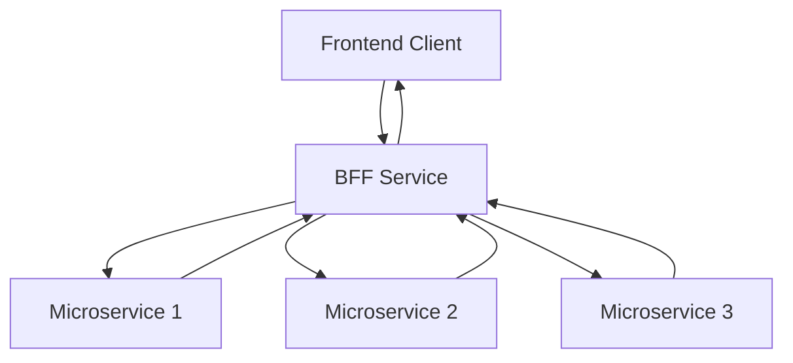

## 5.2.4 Backend for Frontend (BFF)

In the realm of microservices architecture, the Backend for Frontend (BFF) pattern emerges as a powerful strategy to tailor backend services to the specific needs of different frontend clients. This pattern addresses the diverse requirements of various clients, such as mobile apps, web applications, and IoT devices, by providing specialized backend services that optimize data flow, enhance security, and facilitate independent development.

### Defining the BFF Pattern

The Backend for Frontend (BFF) pattern involves creating distinct backend services for each type of frontend client. Unlike a one-size-fits-all approach, BFFs are designed to cater to the unique requirements of different clients, ensuring that each frontend receives the data and functionality it needs in the most efficient manner.

#### Key Concepts of BFF

- **Client-Specific Backends:** Each frontend client, such as a mobile app or web application, has its own dedicated backend service.
- **Optimized Data Handling:** BFFs aggregate, filter, and transform data from multiple microservices to meet the specific needs of the frontend.
- **Enhanced Security:** BFFs implement client-specific security measures, ensuring proper authentication and authorization.

### Identifying Client-Specific Needs

To effectively implement the BFF pattern, it's crucial to identify the unique requirements of each frontend client. This involves understanding the data formats, protocols, and functionalities that each client demands.

#### Steps to Identify Needs

1. **Analyze Client Usage Patterns:** Study how different clients interact with your services. Mobile users might require less data but more frequent updates, while web users might need richer data sets.
2. **Gather Feedback:** Engage with frontend developers to gather insights into the challenges they face with existing backend services.
3. **Define Data Requirements:** Determine the specific data each client needs, including any transformations or aggregations required.
4. **Consider Protocols and Formats:** Identify the preferred communication protocols (e.g., REST, GraphQL) and data formats (e.g., JSON, XML) for each client.

### Designing BFF Services

Designing BFF services involves creating backend services that cater to the specific data formats, protocols, and functionalities required by each frontend. This design process ensures that each client receives a tailored experience.

#### Design Principles

- **Modularity:** Design BFFs as modular components that can be independently developed and deployed.
- **Scalability:** Ensure that BFFs can scale independently to handle varying loads from different clients.
- **Flexibility:** Allow BFFs to adapt to changes in frontend requirements without impacting other services.

#### Example: Designing a BFF for a Mobile App

Consider a mobile app that requires real-time updates and minimal data payloads. The BFF for this app might aggregate data from multiple microservices, filter out unnecessary information, and deliver concise updates to the app.

```java
@RestController
@RequestMapping("/mobile")
public class MobileBFFController {

    @Autowired
    private DataAggregationService dataAggregationService;

    @GetMapping("/dashboard")
    public ResponseEntity<MobileDashboardData> getDashboardData() {
        // Aggregate data from various microservices
        MobileDashboardData data = dataAggregationService.aggregateDataForMobile();
        return ResponseEntity.ok(data);
    }
}
```

### Optimizing Data Flow

BFFs play a crucial role in optimizing data flow between frontend clients and microservices. By aggregating, filtering, and transforming data, BFFs ensure that each client receives only the necessary information in the desired format.

#### Techniques for Data Optimization

- **Aggregation:** Combine data from multiple sources to provide a comprehensive view.
- **Filtering:** Remove unnecessary data to reduce payload size and improve performance.
- **Transformation:** Convert data into the format required by the frontend, such as converting JSON to XML.

#### Diagram: Data Flow Optimization



### Implementing Security Measures

Security is a critical aspect of BFFs, as they handle client-specific authorization and authentication. Implementing robust security measures ensures that data is protected and access is controlled.

#### Security Strategies

- **Authentication:** Use OAuth 2.0 or JWT for secure authentication.
- **Authorization:** Implement role-based access control (RBAC) to manage permissions.
- **Data Encryption:** Encrypt data in transit using TLS to protect sensitive information.

### Facilitating Independent Development

One of the significant advantages of the BFF pattern is the ability to facilitate independent development and deployment of backend services tailored to each frontend. This reduces dependencies and increases agility.

#### Benefits of Independent Development

- **Reduced Coupling:** BFFs are decoupled from each other, allowing teams to work independently.
- **Faster Iterations:** Changes can be made to a specific BFF without affecting others, enabling rapid iterations.
- **Tailored Deployments:** Each BFF can be deployed independently, optimizing resource usage.

### Managing Communication with Microservices

Efficient communication between BFFs and underlying microservices is essential for reliable data exchange. This involves managing API calls, handling errors, and ensuring data consistency.

#### Communication Best Practices

- **Use Asynchronous Communication:** Employ message queues or event streams for non-blocking communication.
- **Implement Circuit Breakers:** Protect BFFs from cascading failures by using circuit breaker patterns.
- **Monitor Performance:** Continuously monitor API performance to identify and resolve bottlenecks.

### Testing Client-Backend Interactions

Testing the interactions between each BFF and its respective frontend client is crucial to ensure seamless integration and functionality. This involves validating data formats, checking response times, and verifying security measures.

#### Testing Strategies

- **Unit Testing:** Test individual components of the BFF to ensure correctness.
- **Integration Testing:** Validate the interaction between BFFs and microservices.
- **End-to-End Testing:** Simulate real-world scenarios to test the entire flow from frontend to backend.

### Conclusion

The Backend for Frontend (BFF) pattern is a powerful approach to optimizing microservices architecture for client-specific needs. By creating dedicated backend services for each frontend, organizations can enhance data flow, improve security, and facilitate independent development. Implementing BFFs requires careful consideration of client requirements, data optimization techniques, and robust security measures. By following best practices and continuously testing client-backend interactions, teams can ensure seamless integration and deliver tailored experiences to their users.

## Quiz Time!



### What is the primary purpose of the Backend for Frontend (BFF) pattern?

- [x] To create specific backend services for different frontend clients
- [ ] To replace the API Gateway in microservices architecture
- [ ] To handle all backend logic in a single service
- [ ] To eliminate the need for frontend development

> **Explanation:** The BFF pattern is designed to create specific backend services tailored to the needs of different frontend clients, such as mobile and web applications.

### Which of the following is NOT a benefit of using the BFF pattern?

- [ ] Optimized data flow
- [ ] Enhanced security
- [x] Increased coupling between services
- [ ] Independent development

> **Explanation:** The BFF pattern reduces coupling between services by allowing independent development and deployment of backend services tailored to each frontend.

### How does the BFF pattern optimize data flow?

- [x] By aggregating, filtering, and transforming data from multiple microservices
- [ ] By storing all data in a single database
- [ ] By using a single communication protocol for all clients
- [ ] By eliminating the need for data transformation

> **Explanation:** BFFs optimize data flow by aggregating, filtering, and transforming data to meet the specific needs of each frontend client.

### What security measure is commonly used in BFFs for authentication?

- [x] OAuth 2.0
- [ ] Basic Authentication
- [ ] API Keys
- [ ] CAPTCHA

> **Explanation:** OAuth 2.0 is a common authentication method used in BFFs to securely authenticate users.

### What is a key advantage of independent development in the BFF pattern?

- [x] Faster iterations and deployments
- [ ] Reduced need for testing
- [ ] Elimination of frontend development
- [ ] Centralized control of all services

> **Explanation:** Independent development allows for faster iterations and deployments, as changes can be made to specific BFFs without affecting others.

### Which communication strategy is recommended for BFFs to handle non-blocking communication?

- [x] Asynchronous communication
- [ ] Synchronous communication
- [ ] Polling
- [ ] Direct database access

> **Explanation:** Asynchronous communication, such as using message queues or event streams, is recommended for non-blocking communication in BFFs.

### What type of testing validates the interaction between BFFs and microservices?

- [ ] Unit Testing
- [x] Integration Testing
- [ ] Load Testing
- [ ] Stress Testing

> **Explanation:** Integration testing validates the interaction between BFFs and microservices to ensure seamless data exchange and functionality.

### Which of the following is a common protocol used by BFFs to communicate with frontend clients?

- [x] REST
- [ ] FTP
- [ ] SMTP
- [ ] SNMP

> **Explanation:** REST is a common protocol used by BFFs to communicate with frontend clients, providing a flexible and widely adopted approach.

### What role does the BFF pattern play in microservices architecture?

- [x] It tailors backend services to the specific needs of different frontend clients.
- [ ] It centralizes all backend logic in a single service.
- [ ] It eliminates the need for microservices.
- [ ] It replaces the API Gateway.

> **Explanation:** The BFF pattern tailors backend services to the specific needs of different frontend clients, enhancing the overall architecture.

### True or False: The BFF pattern can help reduce dependencies and increase agility in development.

- [x] True
- [ ] False

> **Explanation:** True. The BFF pattern reduces dependencies by allowing independent development and deployment of backend services tailored to each frontend, increasing agility.


