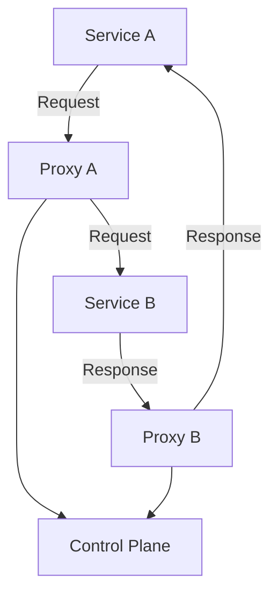

---

linkTitle: "5.5.1 Introduction to Service Meshes"
title: "Service Meshes: Enhancing Microservices Communication"
description: "Explore the role of service meshes in microservices architecture, focusing on traffic management, security, and observability."
categories:
- Microservices
- Architecture
- Communication
tags:
- Service Mesh
- Istio
- Linkerd
- Microservices Architecture
- Traffic Management
date: 2024-10-25
type: docs
nav_weight: 551000
---

## 5.5.1 Introduction to Service Meshes

In the evolving landscape of microservices architecture, managing service-to-service communication efficiently and securely is paramount. As microservices grow in complexity, traditional methods of handling communication can become cumbersome and error-prone. This is where a **service mesh** comes into play, offering a dedicated infrastructure layer to streamline and enhance communication between services.

### What is a Service Mesh?

A **service mesh** is an architectural pattern that provides a dedicated layer for managing service-to-service communications within a microservices architecture. It abstracts the network communication logic from the application code, allowing developers to focus on business logic while the mesh handles aspects like traffic management, security, and observability.

At its core, a service mesh consists of two main components:

- **Control Plane:** This component manages and configures the proxies to route traffic, enforce policies, and collect telemetry.
- **Data Plane:** This consists of lightweight proxies (often deployed as sidecars) that handle the actual communication between services.

The sidecar proxy pattern is integral to a service mesh, where each service instance is paired with a proxy that intercepts all incoming and outgoing network traffic. This setup allows for consistent and centralized management of communication policies.

### Core Components of a Service Mesh

#### Control Plane

The control plane is responsible for the overall management of the service mesh. It provides the necessary configuration and policy enforcement across the data plane. Key responsibilities include:

- **Configuration Management:** Distributing configuration updates to the data plane proxies.
- **Policy Enforcement:** Implementing security policies, such as mutual TLS (mTLS) for encrypted communication.
- **Telemetry Collection:** Gathering metrics, logs, and traces for observability.

#### Data Plane

The data plane consists of the sidecar proxies that are deployed alongside each service. These proxies handle:

- **Traffic Routing:** Directing requests to the appropriate service instances based on policies.
- **Load Balancing:** Distributing requests evenly across service instances to ensure reliability and performance.
- **Security:** Encrypting traffic and enforcing access control policies.

### Benefits of Implementing a Service Mesh

Implementing a service mesh offers several advantages that can significantly enhance a microservices architecture:

- **Enhanced Security:** Service meshes provide robust security features, such as mTLS for encrypting service-to-service communication, ensuring data privacy and integrity.
- **Improved Traffic Control:** With advanced traffic management capabilities, service meshes allow for intelligent routing, load balancing, and failure recovery, improving system resilience.
- **Better Observability:** Service meshes offer deep insights into service interactions through comprehensive telemetry data, enabling better monitoring and troubleshooting.
- **Simplified Operations:** By abstracting communication logic from the application, service meshes simplify the operational complexity of managing microservices.

### Use Cases for Service Meshes

Service meshes are particularly beneficial in scenarios where:

- **Complex Microservices Architectures:** As the number of services grows, managing communication becomes increasingly challenging. A service mesh provides a scalable solution for handling this complexity.
- **High-Security Environments:** For applications requiring stringent security measures, a service mesh offers features like mTLS and policy enforcement to secure communications.
- **Fine-Grained Traffic Management:** Applications needing precise control over traffic routing and load balancing can leverage a service mesh for advanced traffic management capabilities.

### Architectural Impact of Service Meshes

Introducing a service mesh into an existing architecture can have significant implications:

- **Deployment Changes:** Each service instance is paired with a sidecar proxy, which may require changes to deployment configurations and resource allocations.
- **Communication Patterns:** The service mesh abstracts communication logic, allowing for more flexible and dynamic routing policies without altering application code.

Below is a diagram illustrating the architecture of a typical service mesh:

### Comparing Popular Service Mesh Solutions

Several service mesh solutions are available, each with unique features and capabilities. Here, we compare three popular options:

#### Istio

- **Features:** Comprehensive traffic management, security, and observability features.
- **Performance:** Known for its robust capabilities but can introduce significant resource overhead.
- **Ease of Use:** Requires a steep learning curve but offers extensive documentation and community support.

#### Linkerd

- **Features:** Focuses on simplicity and performance, providing essential service mesh features.
- **Performance:** Lightweight and efficient, with minimal resource consumption.
- **Ease of Use:** Easier to set up and manage compared to Istio, making it suitable for smaller teams.

#### Consul Connect

- **Features:** Integrates well with HashiCorp's ecosystem, offering service discovery and configuration management.
- **Performance:** Efficient with a focus on security and service discovery.
- **Ease of Use:** Offers a straightforward setup, especially for users familiar with HashiCorp tools.

### Operational Overhead and Considerations

While a service mesh provides numerous benefits, it also introduces operational overhead:

- **Resource Consumption:** The addition of sidecar proxies increases resource usage, which may impact performance and cost.
- **Complexity:** Managing a service mesh requires additional expertise and can complicate the overall architecture.

### Implementation Guidelines

When planning to deploy a service mesh, consider the following guidelines:

1. **Assess Needs:** Determine if a service mesh is necessary based on the complexity and requirements of your architecture.
2. **Choose the Right Solution:** Evaluate different service mesh solutions to find one that aligns with your needs and expertise.
3. **Plan Deployment:** Start with a small subset of services to minimize disruption and gradually expand the mesh.
4. **Monitor Performance:** Continuously monitor the impact of the service mesh on system performance and resource usage.
5. **Iterate and Optimize:** Use telemetry data to refine configurations and optimize the mesh for your specific use case.

### Conclusion

A service mesh is a powerful tool for managing service-to-service communication in microservices architectures. By providing enhanced security, traffic management, and observability, it addresses many challenges associated with complex systems. However, careful consideration of the operational overhead and a well-planned implementation strategy are crucial for successful integration.

## Quiz Time!



### What is a service mesh primarily used for in microservices architecture?

- [x] Managing service-to-service communication
- [ ] Storing application data
- [ ] Compiling application code
- [ ] Designing user interfaces

> **Explanation:** A service mesh is primarily used to manage service-to-service communication, providing features like traffic management, security, and observability.

### Which component of a service mesh is responsible for managing proxies and enforcing policies?

- [x] Control Plane
- [ ] Data Plane
- [ ] Application Layer
- [ ] Network Layer

> **Explanation:** The control plane is responsible for managing proxies, enforcing policies, and configuring the data plane in a service mesh.

### What is the role of the data plane in a service mesh?

- [x] Handling actual communication between services
- [ ] Managing configuration updates
- [ ] Collecting telemetry data
- [ ] Enforcing security policies

> **Explanation:** The data plane handles the actual communication between services, typically using sidecar proxies.

### Which of the following is a benefit of using a service mesh?

- [x] Enhanced security
- [ ] Increased application size
- [ ] Reduced network latency
- [ ] Simplified user interfaces

> **Explanation:** A service mesh enhances security by providing features like mutual TLS for encrypted communication.

### In which scenario is a service mesh particularly beneficial?

- [x] Complex microservices architectures
- [ ] Single monolithic applications
- [ ] Static web pages
- [ ] Standalone desktop applications

> **Explanation:** A service mesh is beneficial in complex microservices architectures where managing service-to-service communication is challenging.

### What is a potential downside of implementing a service mesh?

- [x] Increased resource consumption
- [ ] Decreased security
- [ ] Reduced observability
- [ ] Simplified traffic management

> **Explanation:** Implementing a service mesh can lead to increased resource consumption due to the addition of sidecar proxies.

### Which service mesh solution is known for its simplicity and performance?

- [x] Linkerd
- [ ] Istio
- [ ] Consul Connect
- [ ] Envoy

> **Explanation:** Linkerd is known for its simplicity and performance, making it a lightweight option for service mesh implementation.

### How does a service mesh affect service deployment?

- [x] Each service is paired with a sidecar proxy
- [ ] Services are deployed without any changes
- [ ] Services require additional code changes
- [ ] Services are deployed on separate servers

> **Explanation:** In a service mesh, each service is typically paired with a sidecar proxy to handle communication.

### What is the primary function of sidecar proxies in a service mesh?

- [x] Intercepting and managing service communication
- [ ] Storing application data
- [ ] Compiling service code
- [ ] Designing user interfaces

> **Explanation:** Sidecar proxies in a service mesh intercept and manage service communication, handling tasks like routing and security.

### True or False: A service mesh can simplify the operational complexity of managing microservices.

- [x] True
- [ ] False

> **Explanation:** A service mesh can simplify the operational complexity by abstracting communication logic from the application, allowing for centralized management of policies and configurations.



