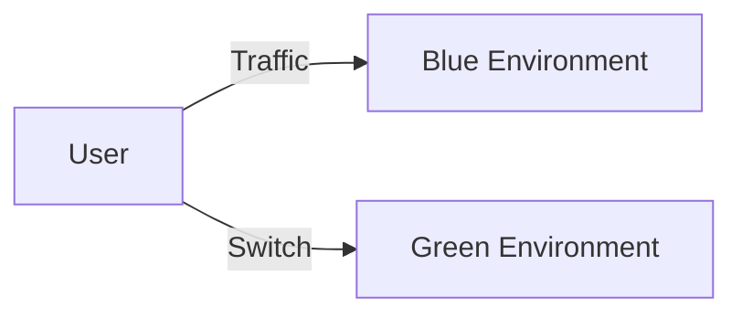
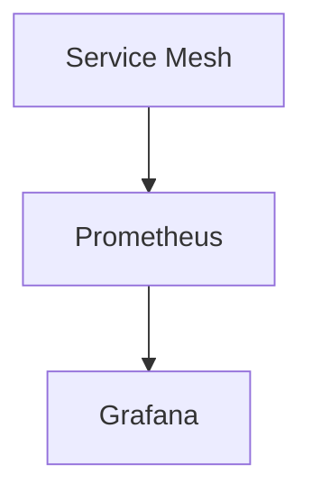

---

linkTitle: "5.5.2 Patterns and Best Practices"
title: "Service Mesh Patterns and Best Practices for Advanced Communication"
description: "Explore advanced communication patterns and best practices using service meshes in microservices architecture, including traffic control, mTLS, observability, fault injection, and more."
categories:
- Microservices
- Architecture
- Communication
tags:
- Service Mesh
- Traffic Control
- mTLS
- Observability
- Load Balancing
date: 2024-10-25
type: docs
nav_weight: 5520

---

## 5.5.2 Patterns and Best Practices

In the realm of microservices, managing communication between services is crucial for ensuring reliability, security, and performance. A service mesh offers a sophisticated approach to handling these concerns by providing a dedicated infrastructure layer for service-to-service communication. This section delves into the patterns and best practices for leveraging a service mesh to enhance communication in microservices architectures.

### Implement Fine-Grained Traffic Control

Service meshes enable fine-grained traffic control, allowing you to manage and direct traffic with precision. This capability is essential for implementing deployment strategies such as canary releases, blue-green deployments, and traffic splitting.

#### Canary Releases

Canary releases involve gradually rolling out a new version of a service to a small subset of users before a full deployment. This approach helps in identifying potential issues early.

```java
// Example of a canary release configuration using Istio
apiVersion: networking.istio.io/v1alpha3
kind: VirtualService
metadata:
  name: my-service
spec:
  hosts:
  - my-service
  http:
  - route:
    - destination:
        host: my-service
        subset: v1
      weight: 90
    - destination:
        host: my-service
        subset: v2
      weight: 10
```

In this example, 10% of the traffic is routed to the new version (v2) while 90% continues to go to the stable version (v1).

#### Blue-Green Deployments

Blue-green deployments involve running two identical production environments, referred to as "blue" and "green." At any time, one environment is live, while the other is idle.



Switching traffic from blue to green can be done seamlessly using service mesh routing rules.

#### Traffic Splitting

Traffic splitting allows you to direct a percentage of traffic to different service versions based on specific rules or metrics.

```java
// Traffic splitting based on headers
apiVersion: networking.istio.io/v1alpha3
kind: VirtualService
metadata:
  name: my-service
spec:
  hosts:
  - my-service
  http:
  - match:
    - headers:
        user-agent:
          regex: ".*Chrome.*"
    route:
    - destination:
        host: my-service
        subset: v2
  - route:
    - destination:
        host: my-service
        subset: v1
```

This configuration routes traffic from Chrome users to version v2 while others continue to use v1.

### Ensure Mutual TLS (mTLS)

Mutual TLS (mTLS) is a security feature that ensures encrypted communication and mutual authentication between services. Configuring mTLS within a service mesh enhances security by preventing unauthorized access and data breaches.

```yaml
apiVersion: security.istio.io/v1beta1
kind: PeerAuthentication
metadata:
  name: default
  namespace: istio-system
spec:
  mtls:
    mode: STRICT
```

This configuration enforces strict mTLS, ensuring that all service-to-service communications are encrypted and authenticated.

### Leverage Observability Features

A service mesh provides built-in observability features that are crucial for monitoring and debugging microservices.

#### Metrics Collection

Service meshes collect metrics such as request count, latency, and error rates, which can be visualized using tools like Prometheus and Grafana.



#### Distributed Tracing

Distributed tracing helps in tracking requests as they traverse multiple services, providing insights into service interactions and performance bottlenecks.

#### Log Aggregation

Centralized log aggregation allows you to collect and analyze logs from all services, aiding in troubleshooting and performance analysis.

### Manage Fault Injection

Fault injection is a technique used to test the resilience of a system by introducing faults and observing how the system responds.

```yaml
apiVersion: networking.istio.io/v1alpha3
kind: VirtualService
metadata:
  name: my-service
spec:
  hosts:
  - my-service
  http:
  - fault:
      delay:
        percentage:
          value: 10.0
        fixedDelay: 5s
    route:
    - destination:
        host: my-service
        subset: v1
```

This configuration introduces a 5-second delay to 10% of the requests, simulating network latency.

### Optimize Load Balancing

Advanced load balancing strategies in a service mesh help distribute traffic efficiently, improving system performance and reliability.

#### Round Robin

Round robin is a simple load balancing strategy where requests are distributed evenly across available instances.

#### Least Connections

This strategy directs traffic to the instance with the fewest active connections, optimizing resource utilization.

#### Weighted Load Balancing

Weighted load balancing allows you to assign different weights to instances, directing more traffic to more capable instances.

### Automate Configuration Management

Automating the configuration of a service mesh using Infrastructure as Code (IaC) tools ensures consistency and simplifies updates.

```yaml
helm install istio-base manifests/charts/base
helm install istiod manifests/charts/istio-control/istio-discovery
```

Using tools like Helm or Terraform, you can manage service mesh configurations programmatically, ensuring repeatability and version control.

### Implement Policy Enforcement

Service meshes provide policy management capabilities to enforce security and compliance across all services.

#### Access Control Policies

Define policies to control which services can communicate with each other, enhancing security.

```yaml
apiVersion: security.istio.io/v1beta1
kind: AuthorizationPolicy
metadata:
  name: allow-read
  namespace: my-namespace
spec:
  rules:
  - from:
    - source:
        principals: ["cluster.local/ns/my-namespace/sa/my-service-account"]
    to:
    - operation:
        methods: ["GET"]
```

### Promote Continuous Improvement

Continuous improvement involves regularly evaluating and refining service mesh configurations and policies to adapt to changing requirements and insights.

- **Regular Audits:** Conduct regular audits of service mesh configurations to identify areas for improvement.
- **Feedback Loops:** Establish feedback loops to gather insights from monitoring and observability tools.
- **Iterative Refinement:** Use insights to iteratively refine configurations and policies, ensuring optimal performance and security.

### Conclusion

Implementing a service mesh in a microservices architecture provides a robust framework for managing communication, security, and observability. By following these patterns and best practices, you can enhance the reliability, performance, and security of your microservices, ensuring they meet the demands of modern applications.

## Quiz Time!



### What is a canary release in the context of microservices?

- [x] Gradually rolling out a new version of a service to a small subset of users
- [ ] Deploying a new version of a service to all users at once
- [ ] Running two identical production environments simultaneously
- [ ] Directing traffic based on user-agent headers

> **Explanation:** A canary release involves gradually rolling out a new version of a service to a small subset of users to identify potential issues early.

### How does mutual TLS (mTLS) enhance security in a service mesh?

- [x] By ensuring encrypted communication and mutual authentication between services
- [ ] By encrypting data at rest
- [ ] By providing a centralized logging solution
- [ ] By balancing traffic across services

> **Explanation:** mTLS ensures encrypted communication and mutual authentication between services, preventing unauthorized access and data breaches.

### Which tool is commonly used for visualizing metrics collected by a service mesh?

- [ ] Elasticsearch
- [x] Grafana
- [ ] Kibana
- [ ] Splunk

> **Explanation:** Grafana is commonly used for visualizing metrics collected by a service mesh, often in conjunction with Prometheus.

### What is the purpose of fault injection in a service mesh?

- [ ] To improve load balancing
- [x] To test system resilience and recovery mechanisms under failure conditions
- [ ] To enhance observability
- [ ] To automate configuration management

> **Explanation:** Fault injection is used to test system resilience and recovery mechanisms by introducing faults and observing the system's response.

### Which load balancing strategy directs traffic to the instance with the fewest active connections?

- [ ] Round Robin
- [x] Least Connections
- [ ] Weighted Load Balancing
- [ ] Random

> **Explanation:** The least connections strategy directs traffic to the instance with the fewest active connections, optimizing resource utilization.

### What is the benefit of automating service mesh configuration using Infrastructure as Code (IaC)?

- [x] Ensures consistency and simplifies updates
- [ ] Increases manual intervention
- [ ] Reduces the need for observability
- [ ] Decreases security

> **Explanation:** Automating service mesh configuration using IaC ensures consistency, simplifies updates, and provides version control.

### How can access control policies enhance security in a service mesh?

- [x] By controlling which services can communicate with each other
- [ ] By encrypting data at rest
- [ ] By providing distributed tracing
- [ ] By balancing traffic across services

> **Explanation:** Access control policies enhance security by controlling which services can communicate with each other, preventing unauthorized access.

### What is the role of feedback loops in promoting continuous improvement of service mesh configurations?

- [ ] To automate configuration management
- [x] To gather insights from monitoring and observability tools
- [ ] To enforce security policies
- [ ] To balance traffic

> **Explanation:** Feedback loops gather insights from monitoring and observability tools, which are used to iteratively refine service mesh configurations and policies.

### Which deployment strategy involves running two identical production environments, one live and one idle?

- [ ] Canary Release
- [x] Blue-Green Deployment
- [ ] Traffic Splitting
- [ ] Fault Injection

> **Explanation:** Blue-green deployment involves running two identical production environments, one live and one idle, allowing for seamless traffic switching.

### True or False: A service mesh can be used to automate the enforcement of security and compliance policies across all services.

- [x] True
- [ ] False

> **Explanation:** A service mesh provides policy management capabilities that can automate the enforcement of security and compliance policies across all services.


