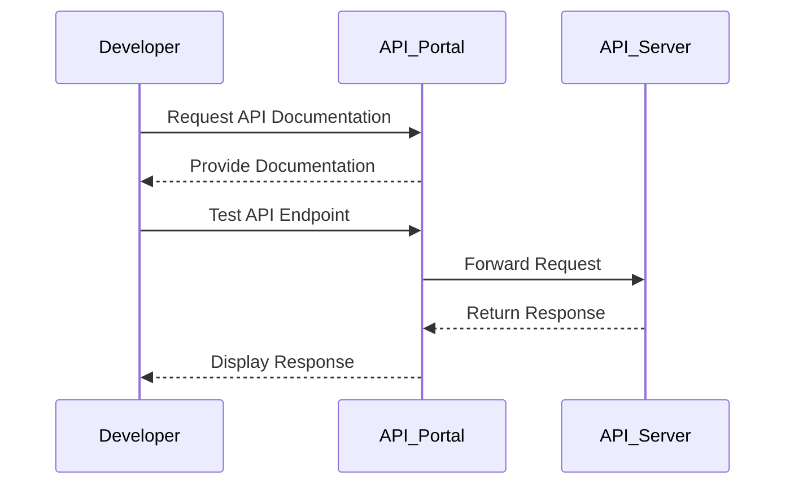

## 6.4.2 API Portals

In the world of microservices, APIs are the glue that binds various services together, enabling seamless communication and integration. As organizations increasingly adopt microservices architectures, the need for effective API management and discoverability becomes paramount. This is where API portals come into play. API portals serve as centralized platforms that provide access to API documentation, developer resources, and management tools for API consumers. In this section, we will delve into the key aspects of API portals, exploring their design, functionality, and benefits.

### Defining API Portals

API portals are comprehensive platforms designed to facilitate the interaction between API providers and consumers. They act as a single point of access where developers can discover, understand, and interact with APIs. A well-designed API portal not only provides detailed documentation but also offers tools for testing, monitoring, and managing APIs.

**Key Components of an API Portal:**

- **Documentation:** Detailed guides, reference materials, and examples.
- **Interactive Tools:** Features like Swagger UI for testing APIs.
- **Authentication and Access Control:** Secure access management.
- **Developer Resources:** SDKs, tutorials, and onboarding materials.
- **Analytics and Feedback:** Usage monitoring and feedback collection.

### Designing User-Friendly Interfaces

A critical aspect of API portals is their interface design. A user-friendly interface ensures that developers can easily navigate, search, and explore available APIs. Here are some best practices for designing intuitive API portal interfaces:

- **Clear Navigation:** Use a logical structure with categories and subcategories to help users find APIs quickly.
- **Search Functionality:** Implement robust search features that allow users to search by keywords, tags, or categories.
- **Consistent Layout:** Maintain a consistent design across the portal to reduce the learning curve for new users.
- **Responsive Design:** Ensure the portal is accessible on various devices, including desktops, tablets, and smartphones.

### Providing Comprehensive Documentation

Comprehensive and up-to-date documentation is the backbone of any successful API portal. It should include:

- **Usage Guides:** Step-by-step instructions on how to use the API.
- **Reference Materials:** Detailed descriptions of API endpoints, parameters, and response formats.
- **Example Requests/Responses:** Sample code snippets in various programming languages to demonstrate API usage.

**Example Java Code Snippet:**

```java
// Example of making an API request using Java's HttpURLConnection
import java.io.BufferedReader;
import java.io.InputStreamReader;
import java.net.HttpURLConnection;
import java.net.URL;

public class ApiExample {
    public static void main(String[] args) {
        try {
            URL url = new URL("https://api.example.com/data");
            HttpURLConnection conn = (HttpURLConnection) url.openConnection();
            conn.setRequestMethod("GET");

            // Reading the response
            BufferedReader in = new BufferedReader(new InputStreamReader(conn.getInputStream()));
            String inputLine;
            StringBuilder content = new StringBuilder();
            while ((inputLine = in.readLine()) != null) {
                content.append(inputLine);
            }
            in.close();

            // Print the response
            System.out.println(content.toString());

        } catch (Exception e) {
            e.printStackTrace();
        }
    }
}
```

### Implementing Authentication and Access Control

Security is a crucial consideration for API portals. Implementing robust authentication and access control mechanisms ensures that only authorized users can access the APIs. Common practices include:

- **API Keys:** Unique keys assigned to each developer for API access.
- **OAuth 2.0:** A widely used protocol for secure authorization.
- **Role-Based Access Control (RBAC):** Assigning permissions based on user roles.

### Enabling Interactive API Exploration

Interactive exploration tools allow developers to test APIs directly from the portal, enhancing the developer experience. Tools like Swagger UI and Postman collections can be integrated into the portal to provide:

- **Live Testing:** Execute API calls and view responses in real-time.
- **Try-It-Now Features:** Allow users to experiment with API endpoints without writing code.

**Mermaid Diagram Example:**



### Facilitating API Registration and Management

API portals should streamline the process for API providers to register, manage, and update their APIs. This includes:

- **API Registration:** A straightforward process for adding new APIs to the portal.
- **Version Management:** Tools to manage different API versions and deprecate outdated ones.
- **Monitoring and Analytics:** Insights into API usage patterns and performance metrics.

### Providing Developer Onboarding Resources

Effective onboarding resources are essential for helping developers integrate with APIs. These resources may include:

- **Tutorials:** Step-by-step guides for common use cases.
- **SDKs:** Software Development Kits in various languages to simplify integration.
- **Sample Applications:** Example projects demonstrating API usage.

### Monitoring Usage and Gathering Feedback

Incorporating analytics and feedback mechanisms within the API portal allows for continuous improvement. Key features include:

- **Usage Analytics:** Track API calls, response times, and error rates.
- **Feedback Forms:** Allow developers to provide feedback on API functionality and documentation.
- **Community Forums:** Enable interaction and knowledge sharing among developers.

### Conclusion

API portals are indispensable tools in the microservices ecosystem, providing a centralized platform for API management and discoverability. By designing user-friendly interfaces, offering comprehensive documentation, and integrating interactive tools, API portals enhance the developer experience and facilitate seamless API integration. Implementing robust security measures and providing valuable onboarding resources further contribute to the success of API portals. As organizations continue to embrace microservices, the role of API portals in managing and scaling APIs will only grow in importance.

## Quiz Time!



### What is the primary purpose of an API portal?

- [x] To provide a centralized platform for API documentation and management.
- [ ] To host microservices applications.
- [ ] To serve as a database for storing API data.
- [ ] To replace traditional web servers.

> **Explanation:** An API portal serves as a centralized platform that provides access to API documentation, developer resources, and management tools for API consumers.

### Which feature is essential for a user-friendly API portal interface?

- [x] Clear navigation and search functionality.
- [ ] Complex design elements.
- [ ] Minimal documentation.
- [ ] Limited access controls.

> **Explanation:** Clear navigation and search functionality are essential for a user-friendly API portal interface, allowing users to easily find and explore APIs.

### What is a common method for securing access to APIs in a portal?

- [x] API Keys
- [ ] Open access
- [ ] Plain text passwords
- [ ] Public URLs

> **Explanation:** API keys are a common method for securing access to APIs, providing a unique identifier for each developer.

### Which tool can be integrated into an API portal for interactive API exploration?

- [x] Swagger UI
- [ ] Microsoft Word
- [ ] Excel Sheets
- [ ] PDF Reader

> **Explanation:** Swagger UI is a tool that can be integrated into an API portal to allow developers to test APIs interactively.

### What should comprehensive API documentation include?

- [x] Usage guides, reference materials, and example requests/responses.
- [ ] Only a list of API endpoints.
- [ ] Marketing materials.
- [ ] Company history.

> **Explanation:** Comprehensive API documentation should include usage guides, reference materials, and example requests/responses to help developers understand and use the API effectively.

### How can API portals assist in developer onboarding?

- [x] By providing tutorials, SDKs, and sample applications.
- [ ] By offering limited access to APIs.
- [ ] By restricting documentation access.
- [ ] By removing all interactive features.

> **Explanation:** API portals assist in developer onboarding by providing tutorials, SDKs, and sample applications, which help developers integrate with APIs effectively.

### What is the role of analytics in an API portal?

- [x] To monitor API usage patterns and gather feedback.
- [ ] To increase the complexity of the portal.
- [ ] To restrict developer access.
- [ ] To replace documentation.

> **Explanation:** Analytics in an API portal are used to monitor API usage patterns and gather feedback, which helps in continuous improvement of the APIs.

### Which authentication method is commonly used in API portals?

- [x] OAuth 2.0
- [ ] Basic HTTP Authentication
- [ ] No authentication
- [ ] CAPTCHA

> **Explanation:** OAuth 2.0 is a commonly used authentication method in API portals, providing secure authorization for API access.

### What is a benefit of providing interactive API exploration tools in a portal?

- [x] It allows developers to test APIs directly from the portal.
- [ ] It complicates the API usage process.
- [ ] It restricts API access.
- [ ] It removes the need for documentation.

> **Explanation:** Interactive API exploration tools allow developers to test APIs directly from the portal, enhancing the developer experience.

### True or False: API portals should only focus on providing documentation.

- [ ] True
- [x] False

> **Explanation:** False. API portals should provide comprehensive documentation, interactive tools, security features, and developer resources to effectively manage and promote APIs.


