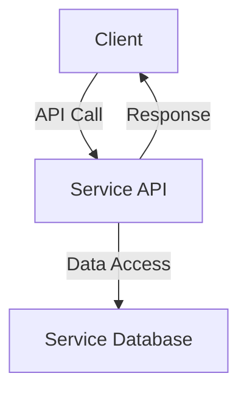

## 7.1.2 Ensuring Data Ownership

In the realm of microservices architecture, ensuring data ownership is a cornerstone principle that underpins the design and operation of scalable, autonomous services. This section delves into the concept of data ownership, its significance, and the strategies to implement it effectively within a microservices ecosystem.

### Defining Data Ownership

Data ownership in microservices refers to the principle that each service is solely responsible for managing its own data, including its structure, lifecycle, and integrity. This means that a microservice has exclusive control over its data, ensuring that it can make changes independently without affecting other services. This autonomy is crucial for maintaining the flexibility and scalability of the system.

### Assigning Clear Boundaries

To effectively implement data ownership, it's essential to assign clear boundaries based on business domains and service responsibilities. This involves delineating which data belongs to which service, ensuring minimal overlap and avoiding data silos. By aligning data ownership with business capabilities, services can be more focused and efficient.

#### Example: E-Commerce Platform

Consider an e-commerce platform with services such as `OrderService`, `CustomerService`, and `InventoryService`. Each service should own its respective data:

- **OrderService**: Manages order details, statuses, and history.
- **CustomerService**: Handles customer profiles, preferences, and authentication.
- **InventoryService**: Oversees product availability, stock levels, and supplier information.

By clearly defining these boundaries, each service can evolve independently, reducing the risk of data conflicts and duplication.

### Implementing Access Controls

Implementing strict access controls is vital to prevent unauthorized access to a service’s data by other services. This can be achieved through:

- **Authentication and Authorization**: Use OAuth 2.0 or JWT tokens to authenticate and authorize requests.
- **Role-Based Access Control (RBAC)**: Define roles and permissions to restrict access based on the user's role.
- **API Gateways**: Act as a single entry point for all service requests, enforcing security policies and access controls.

#### Java Example: Securing Access with Spring Security

```java
import org.springframework.security.config.annotation.web.builders.HttpSecurity;
import org.springframework.security.config.annotation.web.configuration.EnableWebSecurity;
import org.springframework.security.config.annotation.web.configuration.WebSecurityConfigurerAdapter;

@EnableWebSecurity
public class SecurityConfig extends WebSecurityConfigurerAdapter {
    @Override
    protected void configure(HttpSecurity http) throws Exception {
        http
            .authorizeRequests()
            .antMatchers("/orders/**").hasRole("USER")
            .antMatchers("/admin/**").hasRole("ADMIN")
            .and()
            .oauth2Login();
    }
}
```

In this example, Spring Security is configured to restrict access to different endpoints based on user roles, ensuring that only authorized users can access sensitive data.

### Using Unique Identifiers

Unique identifiers, such as UUIDs, play a crucial role in managing and referencing data across services without sharing databases. They ensure that each piece of data can be uniquely identified and accessed, even in a distributed system.

#### Example: Generating UUIDs in Java

```java
import java.util.UUID;

public class UniqueIdentifierExample {
    public static void main(String[] args) {
        UUID uniqueID = UUID.randomUUID();
        System.out.println("Generated Unique ID: " + uniqueID.toString());
    }
}
```

By using UUIDs, services can reference data without needing to access each other's databases directly, maintaining data ownership integrity.

### Encapsulating Data Manipulation

Encapsulating data manipulation within services is a best practice that ensures all data access or modifications required by other services are done through well-defined APIs. This encapsulation prevents direct database access, promoting data integrity and security.

#### Example: Encapsulating Data Access with REST APIs

```java
@RestController
@RequestMapping("/customers")
public class CustomerController {

    @Autowired
    private CustomerService customerService;

    @GetMapping("/{id}")
    public ResponseEntity<Customer> getCustomer(@PathVariable String id) {
        Customer customer = customerService.findCustomerById(id);
        return ResponseEntity.ok(customer);
    }

    @PostMapping
    public ResponseEntity<Customer> createCustomer(@RequestBody Customer customer) {
        Customer createdCustomer = customerService.createCustomer(customer);
        return ResponseEntity.status(HttpStatus.CREATED).body(createdCustomer);
    }
}
```

In this example, the `CustomerService` encapsulates all data access and manipulation logic, exposing only the necessary endpoints for interaction.

### Avoiding Direct Database Access

Avoiding direct database access by other services is crucial for maintaining data ownership. All interactions with a service's data should go through its API, ensuring that the service retains control over its data.

#### Diagram: Data Access Flow



This diagram illustrates the flow of data access, where the client interacts with the service API, which in turn accesses the service's database. This encapsulation ensures that the service maintains control over its data.

### Promoting Service Autonomy

Ensuring data ownership is fundamental to promoting service autonomy. When services own their data, they can evolve and scale independently, adapting to changing business needs without data conflicts. This autonomy allows for more agile development and deployment processes.

### Monitoring and Enforcing Ownership Policies

To maintain data ownership, it's essential to monitor adherence to ownership policies and enforce them through automated checks and governance mechanisms. This can include:

- **Automated Testing**: Ensure that services only access their own data.
- **Auditing and Logging**: Track data access and modifications for compliance and security.
- **Governance Tools**: Use tools like Open Policy Agent (OPA) to enforce policies across services.

### Conclusion

Ensuring data ownership in microservices architecture is a critical practice that supports service autonomy, scalability, and security. By defining clear boundaries, implementing strict access controls, and encapsulating data manipulation, organizations can build robust and flexible systems. As you design your microservices, keep these principles in mind to foster a resilient and efficient architecture.

## Quiz Time!



### What is the primary principle of data ownership in microservices?

- [x] Each microservice exclusively manages its own data.
- [ ] Data is shared among all microservices.
- [ ] Data is managed by a central database.
- [ ] Data ownership is not important in microservices.

> **Explanation:** Data ownership in microservices means each service manages its own data, ensuring autonomy and flexibility.

### How can clear data ownership boundaries be assigned?

- [x] Based on business domains and service responsibilities.
- [ ] By sharing data across all services.
- [ ] By using a single database for all services.
- [ ] By allowing services to access each other's databases.

> **Explanation:** Clear boundaries are assigned based on business domains to ensure minimal overlap and efficient service operation.

### What is the role of unique identifiers in data ownership?

- [x] To manage and reference data across services without sharing databases.
- [ ] To allow direct database access by other services.
- [ ] To centralize data management.
- [ ] To replace service APIs.

> **Explanation:** Unique identifiers like UUIDs help manage data references across services without sharing databases.

### Why is encapsulating data manipulation important?

- [x] It ensures all data access or modifications are done through APIs.
- [ ] It allows direct database access by other services.
- [ ] It centralizes data management.
- [ ] It eliminates the need for APIs.

> **Explanation:** Encapsulation ensures data integrity and security by using APIs for data access and modifications.

### What is a key benefit of promoting service autonomy through data ownership?

- [x] Services can evolve and scale independently.
- [ ] Services become dependent on each other.
- [ ] Data is centralized for all services.
- [ ] Services lose flexibility.

> **Explanation:** Service autonomy allows services to evolve and scale independently, adapting to business changes.

### How can unauthorized access to a service's data be prevented?

- [x] Implementing strict access controls.
- [ ] Allowing open access to all services.
- [ ] Sharing databases among services.
- [ ] Using a single authentication method for all services.

> **Explanation:** Strict access controls prevent unauthorized access, ensuring data security.

### What is the purpose of using API gateways in data ownership?

- [x] To enforce security policies and access controls.
- [ ] To allow direct database access.
- [ ] To centralize data management.
- [ ] To eliminate the need for service APIs.

> **Explanation:** API gateways enforce security policies and control access to services.

### Why should direct database access by other services be avoided?

- [x] To maintain data ownership and integrity.
- [ ] To allow easier data sharing.
- [ ] To centralize data management.
- [ ] To simplify service interactions.

> **Explanation:** Avoiding direct access ensures the service retains control over its data, maintaining integrity.

### What tools can be used to enforce data ownership policies?

- [x] Open Policy Agent (OPA)
- [ ] Centralized databases
- [ ] Shared data repositories
- [ ] Single authentication methods

> **Explanation:** Tools like OPA help enforce policies across services, maintaining data ownership.

### True or False: Data ownership supports service autonomy in microservices.

- [x] True
- [ ] False

> **Explanation:** Data ownership is crucial for service autonomy, allowing services to operate independently.


