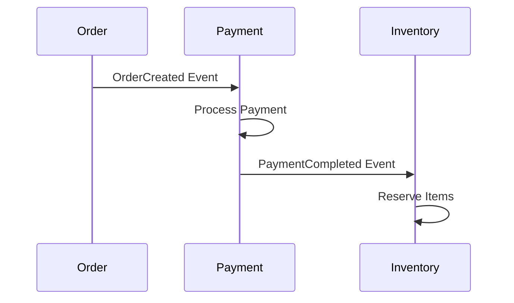

---

linkTitle: "7.2.2 Choreography-Based Sagas"
title: "Choreography-Based Sagas: Event-Driven Coordination in Microservices"
description: "Explore choreography-based sagas in microservices, focusing on event-driven coordination, implementation of event handlers, and best practices for managing distributed transactions."
categories:
- Microservices
- Data Management
- Consistency Patterns
tags:
- Choreography-Based Sagas
- Event-Driven Architecture
- Microservices Patterns
- Distributed Transactions
- Data Consistency
date: 2024-10-25
type: docs
nav_weight: 722000
---

## 7.2.2 Choreography-Based Sagas

In the realm of microservices, managing distributed transactions poses a significant challenge due to the inherently decentralized nature of the architecture. Choreography-based sagas offer a compelling solution by enabling services to coordinate transactions through event-driven mechanisms, eliminating the need for a central orchestrator. This section delves into the intricacies of choreography-based sagas, providing insights into their implementation, coordination, and best practices.

### Defining Choreography-Based Sagas

Choreography-based sagas are a pattern for managing distributed transactions across multiple microservices. Unlike orchestration-based sagas, where a central orchestrator manages the transaction flow, choreography-based sagas rely on each service autonomously reacting to events. Each service involved in the saga listens for specific events and performs actions or compensations based on those events.

This decentralized approach enhances the autonomy and scalability of microservices, as each service independently decides how to react to events without relying on a central controller. The key to choreography-based sagas is the use of well-defined events that trigger actions across services.

### Event-Driven Coordination

In choreography-based sagas, services communicate and coordinate through events. Each service publishes events when significant actions occur, and other services listen for these events to determine their next steps. This event-driven coordination ensures that all services involved in the saga are aware of the transaction's progress and can react accordingly.

Consider a simple example of an e-commerce order processing system involving three services: Order, Payment, and Inventory. When an order is placed, the Order service publishes an `OrderCreated` event. The Payment service listens for this event and processes the payment, publishing a `PaymentCompleted` event upon success. The Inventory service, in turn, listens for the `PaymentCompleted` event to reserve the items.



### Implementing Event Handlers

To implement choreography-based sagas, each service must have event handlers that respond to relevant saga-related events. These handlers execute the necessary business logic or compensating actions when an event is received.

In Java, event handlers can be implemented using frameworks like Spring Boot with Spring Cloud Stream, which facilitates event-driven communication. Here's a simple example of an event handler in a Payment service:

```java
@Service
public class PaymentService {

    @StreamListener(target = "orderChannel", condition = "headers['eventType']=='OrderCreated'")
    public void handleOrderCreated(OrderCreatedEvent event) {
        // Process payment logic
        boolean paymentSuccess = processPayment(event.getOrderId(), event.getAmount());

        if (paymentSuccess) {
            // Publish PaymentCompleted event
            publishPaymentCompletedEvent(event.getOrderId());
        } else {
            // Handle payment failure
            publishPaymentFailedEvent(event.getOrderId());
        }
    }

    private boolean processPayment(String orderId, double amount) {
        // Payment processing logic
        return true; // Assume payment is successful for this example
    }

    private void publishPaymentCompletedEvent(String orderId) {
        // Logic to publish PaymentCompleted event
    }

    private void publishPaymentFailedEvent(String orderId) {
        // Logic to publish PaymentFailed event
    }
}
```

### Defining Clear Event Contracts

Clear and consistent event contracts are crucial for seamless communication and coordination between services. An event contract defines the structure and semantics of the events exchanged between services. This includes the event name, payload structure, and any metadata required for processing.

Using a schema definition language like JSON Schema or Avro can help ensure that all services adhere to the same event contracts. This consistency reduces the risk of miscommunication and errors in the saga flow.

### Managing Event Ordering

In a distributed system, managing the order of events is critical to maintaining transaction consistency. Services must react to events in the correct sequence to ensure that the saga progresses smoothly. Event ordering can be managed using techniques such as:

- **Event Versioning:** Including version numbers in events to track changes and ensure compatibility.
- **Sequence Numbers:** Assigning sequence numbers to events to maintain order.
- **Idempotency:** Ensuring that event handlers are idempotent, meaning they can safely process the same event multiple times without adverse effects.

### Ensuring Loose Coupling

Choreography-based sagas promote loose coupling between services, which is a fundamental principle of microservices architecture. By relying on events for communication, services can evolve independently without tight dependencies on each other. This loose coupling enhances scalability and flexibility, allowing services to be updated or replaced without affecting the entire system.

### Handling Failure Scenarios

In a choreography-based saga, handling failure scenarios is crucial to ensure data consistency and reliability. When a service fails to perform its action, it must trigger compensating actions to revert the changes made by previous services. This requires careful design of compensating transactions and robust error handling mechanisms.

For example, if the Inventory service fails to reserve items after a payment is completed, it should publish an `InventoryReservationFailed` event. The Payment service can listen for this event and initiate a refund process as a compensating action.

### Best Practices for Choreography-Based Sagas

Implementing choreography-based sagas effectively requires adherence to best practices:

- **Standardized Event Formats:** Use consistent event formats and schemas to ensure compatibility and ease of integration.
- **Robust Event Logging:** Maintain comprehensive logs of all events and actions to facilitate debugging and auditing.
- **Idempotent Event Handling:** Design event handlers to be idempotent, preventing duplicate compensations and ensuring reliability.
- **Monitoring and Alerting:** Implement monitoring and alerting mechanisms to detect and respond to failures promptly.
- **Testing and Validation:** Thoroughly test saga flows to validate the correctness and resilience of the system.

### Conclusion

Choreography-based sagas offer a powerful approach to managing distributed transactions in microservices by leveraging event-driven coordination. By enabling services to autonomously react to events, this pattern enhances scalability, flexibility, and resilience. However, it requires careful design and implementation to handle complexities such as event ordering, failure scenarios, and loose coupling. By following best practices and leveraging appropriate tools, organizations can effectively implement choreography-based sagas to achieve robust and scalable microservices architectures.

## Quiz Time!



### What is a key characteristic of choreography-based sagas?

- [x] Each service autonomously reacts to events.
- [ ] A central orchestrator manages the transaction flow.
- [ ] Services communicate through direct API calls.
- [ ] Transactions are managed through a single database.

> **Explanation:** In choreography-based sagas, each service autonomously reacts to events, eliminating the need for a central orchestrator.

### How do services communicate in a choreography-based saga?

- [x] Through events
- [ ] Through direct method calls
- [ ] Through shared databases
- [ ] Through a central orchestrator

> **Explanation:** Services in a choreography-based saga communicate and coordinate through events.

### What is the role of an event handler in a choreography-based saga?

- [x] To respond to saga-related events and execute actions or compensations
- [ ] To manage the entire transaction flow centrally
- [ ] To store events in a database
- [ ] To create new events for unrelated services

> **Explanation:** Event handlers respond to saga-related events and execute appropriate actions or compensations.

### Why is it important to define clear event contracts in choreography-based sagas?

- [x] To facilitate seamless communication and coordination between services
- [ ] To ensure all services use the same programming language
- [ ] To centralize event management
- [ ] To reduce the number of events in the system

> **Explanation:** Clear event contracts ensure seamless communication and coordination between services by defining the structure and semantics of events.

### What is a strategy for managing event ordering in choreography-based sagas?

- [x] Using sequence numbers
- [ ] Using a central orchestrator
- [ ] Using shared databases
- [ ] Using synchronous communication

> **Explanation:** Sequence numbers can be used to manage event ordering, ensuring that services react to events in the correct sequence.

### How do choreography-based sagas promote loose coupling?

- [x] By relying on events for communication
- [ ] By using a central orchestrator
- [ ] By sharing databases among services
- [ ] By using direct method calls

> **Explanation:** Choreography-based sagas promote loose coupling by relying on events for communication, allowing services to evolve independently.

### What should be done when a service fails to perform its action in a choreography-based saga?

- [x] Trigger compensating actions
- [ ] Retry the action indefinitely
- [ ] Ignore the failure
- [ ] Centralize the failure handling

> **Explanation:** When a service fails, compensating actions should be triggered to revert changes made by previous services.

### What is a best practice for implementing choreography-based sagas?

- [x] Designing idempotent event handlers
- [ ] Using a single database for all services
- [ ] Centralizing event management
- [ ] Avoiding event logging

> **Explanation:** Designing idempotent event handlers is a best practice to prevent duplicate compensations and ensure reliability.

### Which tool can be used in Java to facilitate event-driven communication in choreography-based sagas?

- [x] Spring Cloud Stream
- [ ] Hibernate
- [ ] Apache Kafka
- [ ] JPA

> **Explanation:** Spring Cloud Stream can be used in Java to facilitate event-driven communication in choreography-based sagas.

### True or False: Choreography-based sagas require a central orchestrator to manage transactions.

- [ ] True
- [x] False

> **Explanation:** False. Choreography-based sagas do not require a central orchestrator; each service autonomously reacts to events.


