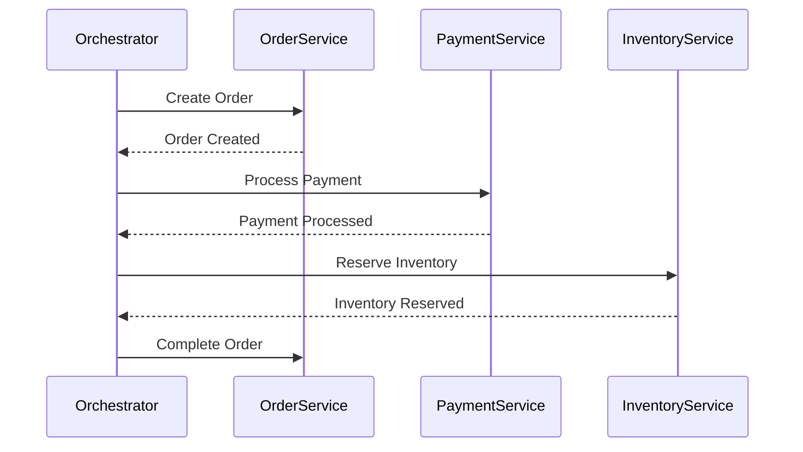

## 7.2.3 Implementing Sagas Effectively

Implementing sagas effectively in a microservices architecture is crucial for managing distributed transactions and ensuring data consistency across services. This section explores the key aspects of implementing sagas, including choosing the right approach, designing comprehensive diagrams, ensuring reliable messaging, and more.

### Choose the Right Saga Approach

When implementing sagas, the first decision is choosing between orchestration-based and choreography-based approaches. This choice depends on several factors:

- **System Complexity:** Orchestration is often preferred in complex systems where a central controller can manage the sequence of transactions. Choreography suits simpler systems where services can independently handle their part of the transaction.
  
- **Team Expertise:** Teams with experience in building centralized systems might find orchestration easier to implement, while those familiar with event-driven architectures might lean towards choreography.

- **Scalability Requirements:** Choreography can offer better scalability as it avoids a single point of failure. However, orchestration provides more control and visibility, which can be beneficial for managing complex workflows.

#### Orchestration-Based Sagas

In orchestration, a central saga orchestrator manages the sequence of transactions. It sends commands to services and listens for events to determine the next steps. This approach provides a clear view of the entire transaction flow.

```java
public class OrderSagaOrchestrator {

    private final OrderService orderService;
    private final PaymentService paymentService;
    private final InventoryService inventoryService;

    public OrderSagaOrchestrator(OrderService orderService, PaymentService paymentService, InventoryService inventoryService) {
        this.orderService = orderService;
        this.paymentService = paymentService;
        this.inventoryService = inventoryService;
    }

    public void executeOrderSaga(Order order) {
        try {
            orderService.createOrder(order);
            paymentService.processPayment(order);
            inventoryService.reserveInventory(order);
        } catch (Exception e) {
            compensate(order);
        }
    }

    private void compensate(Order order) {
        paymentService.refundPayment(order);
        orderService.cancelOrder(order);
    }
}
```

#### Choreography-Based Sagas

In choreography, each service is responsible for listening to events and performing its actions. There is no central controller, which can lead to more decentralized and scalable solutions.

```java
public class OrderService {

    public void onOrderCreated(Order order) {
        // Logic to handle order creation
        publishEvent(new OrderCreatedEvent(order));
    }

    public void onPaymentProcessed(PaymentProcessedEvent event) {
        // Logic to handle payment processing
        publishEvent(new PaymentProcessedEvent(event.getOrder()));
    }
}
```

### Design Comprehensive Saga Diagrams

Designing saga diagrams helps visualize the sequence of transactions, interactions, and compensating actions. These diagrams serve as blueprints for implementation and troubleshooting.



### Implement Reliable Messaging Systems

Reliable messaging is critical to ensure that saga-related events and commands are delivered in the correct order. Consider using message brokers like RabbitMQ or Apache Kafka, which provide durability and ordering guarantees.

- **RabbitMQ:** Offers robust message delivery with features like message acknowledgments and retries.
- **Apache Kafka:** Provides high throughput and fault tolerance, making it suitable for large-scale systems.

### Ensure Idempotent Operations

Idempotency ensures that operations can be retried without causing unintended effects. This is crucial for handling retries in sagas, especially when network failures or service downtimes occur.

```java
public class PaymentService {

    public void processPayment(Order order) {
        if (!isPaymentProcessed(order)) {
            // Process payment
            markPaymentAsProcessed(order);
        }
    }

    private boolean isPaymentProcessed(Order order) {
        // Check if payment has already been processed
    }

    private void markPaymentAsProcessed(Order order) {
        // Mark payment as processed
    }
}
```

### Manage Saga State Transitions

Managing the state of a saga involves tracking its progress and outcomes. Use a state machine or a persistent store to record the current state of each saga instance.

```java
public enum SagaState {
    ORDER_CREATED,
    PAYMENT_PROCESSED,
    INVENTORY_RESERVED,
    COMPLETED,
    COMPENSATED
}

public class SagaStateManager {

    private final Map<String, SagaState> sagaStates = new ConcurrentHashMap<>();

    public void updateState(String sagaId, SagaState state) {
        sagaStates.put(sagaId, state);
    }

    public SagaState getState(String sagaId) {
        return sagaStates.get(sagaId);
    }
}
```

### Implement Comprehensive Monitoring

Monitoring saga executions is essential for detecting anomalies or failures. Implement logging and alerting mechanisms to track the status of each step and respond to issues promptly.

- **Logging:** Use structured logging to capture detailed information about each saga step.
- **Alerting:** Set up alerts for failed or stalled sagas to enable quick intervention.

### Facilitate Automated Compensation

Automating compensating actions minimizes manual intervention and downtime. Implement compensating logic that can be triggered automatically when a failure occurs.

```java
public class CompensationService {

    public void compensate(Order order) {
        // Logic to revert changes
        refundPayment(order);
        cancelOrder(order);
    }

    private void refundPayment(Order order) {
        // Refund payment logic
    }

    private void cancelOrder(Order order) {
        // Cancel order logic
    }
}
```

### Test Sagas Thoroughly

Thorough testing is crucial to ensure reliable and consistent transaction management. Use scenario-based testing, failure injection, and validation of compensating actions.

- **Scenario-Based Testing:** Test various success and failure scenarios to ensure all paths are covered.
- **Failure Injection:** Simulate failures to test the robustness of compensating actions.
- **Compensating Action Validation:** Verify that compensating actions correctly revert changes.

### Conclusion

Implementing sagas effectively requires careful consideration of the right approach, reliable messaging, idempotency, state management, monitoring, and thorough testing. By following these guidelines, you can ensure that your microservices architecture handles distributed transactions reliably and consistently.

## Quiz Time!



### Which approach is suitable for complex systems with a need for centralized control?

- [x] Orchestration-Based Sagas
- [ ] Choreography-Based Sagas
- [ ] Event-Driven Architecture
- [ ] Monolithic Architecture

> **Explanation:** Orchestration-based sagas are suitable for complex systems where a central controller can manage the sequence of transactions.

### What is a key advantage of choreography-based sagas?

- [ ] Centralized control
- [x] Better scalability
- [ ] Simplicity in implementation
- [ ] Easier debugging

> **Explanation:** Choreography-based sagas offer better scalability as they avoid a single point of failure and allow services to handle their part of the transaction independently.

### What is the purpose of designing saga diagrams?

- [x] To visualize the sequence of transactions and interactions
- [ ] To replace documentation
- [ ] To simplify code implementation
- [ ] To eliminate the need for testing

> **Explanation:** Saga diagrams help visualize the sequence of transactions, interactions, and compensating actions, serving as blueprints for implementation and troubleshooting.

### Which messaging system is known for high throughput and fault tolerance?

- [ ] RabbitMQ
- [x] Apache Kafka
- [ ] ActiveMQ
- [ ] ZeroMQ

> **Explanation:** Apache Kafka provides high throughput and fault tolerance, making it suitable for large-scale systems.

### Why are idempotent operations important in sagas?

- [x] To handle retries without causing data inconsistencies
- [ ] To improve performance
- [ ] To simplify code
- [ ] To reduce network traffic

> **Explanation:** Idempotent operations ensure that operations can be retried without causing unintended effects, which is crucial for handling retries in sagas.

### What is a common method for managing saga state transitions?

- [ ] Using a centralized database
- [x] Using a state machine or persistent store
- [ ] Using a message queue
- [ ] Using a REST API

> **Explanation:** Managing saga state transitions involves tracking progress and outcomes, often using a state machine or a persistent store.

### What is the role of automated compensation in sagas?

- [x] To minimize manual intervention and downtime
- [ ] To increase transaction speed
- [ ] To simplify code
- [ ] To improve security

> **Explanation:** Automating compensating actions minimizes manual intervention and downtime by swiftly reverting changes when failures occur.

### Which testing strategy involves simulating failures?

- [ ] Scenario-Based Testing
- [x] Failure Injection
- [ ] Unit Testing
- [ ] Integration Testing

> **Explanation:** Failure injection involves simulating failures to test the robustness of compensating actions in sagas.

### What is the benefit of comprehensive monitoring in sagas?

- [x] Detecting anomalies or failures promptly
- [ ] Reducing code complexity
- [ ] Increasing transaction speed
- [ ] Simplifying architecture

> **Explanation:** Comprehensive monitoring helps detect anomalies or failures promptly, enabling quick intervention and resolution.

### True or False: Choreography-based sagas require a central controller.

- [ ] True
- [x] False

> **Explanation:** Choreography-based sagas do not require a central controller; each service listens to events and performs its actions independently.


