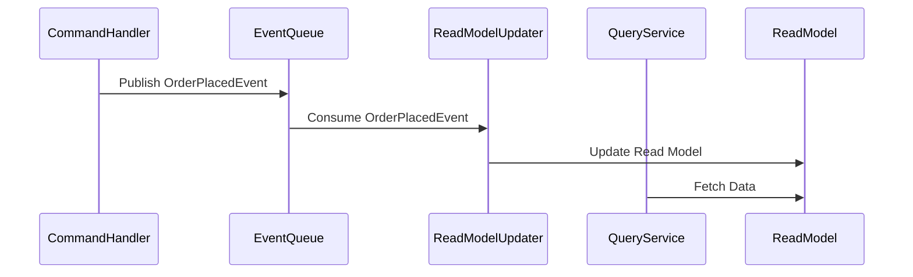

---

linkTitle: "7.3.3 Implementing CQRS"
title: "Implementing CQRS: A Comprehensive Guide to Command Query Responsibility Segregation"
description: "Explore the implementation of CQRS in microservices architecture, focusing on separating command and query responsibilities for enhanced scalability and performance."
categories:
- Microservices
- Software Architecture
- Data Management
tags:
- CQRS
- Microservices
- Data Consistency
- Event Sourcing
- Java
date: 2024-10-25
type: docs
nav_weight: 733000
---

## 7.3.3 Implementing CQRS

Command Query Responsibility Segregation (CQRS) is a powerful architectural pattern that separates the responsibilities of handling commands (write operations) and queries (read operations) within a system. This separation can lead to improved scalability, performance, and maintainability, especially in complex systems. In this section, we'll explore how to implement CQRS effectively, providing practical insights and examples to guide you through the process.

### Assess Applicability

Before diving into implementation, it's crucial to assess whether CQRS is suitable for your application. Consider the following factors:

- **Complexity:** CQRS introduces additional complexity by separating the read and write models. Ensure that the benefits outweigh the complexity for your specific use case.
- **Scalability Needs:** If your application requires high scalability, especially for read operations, CQRS can be beneficial by allowing independent scaling of read and write components.
- **Existing Architecture:** Evaluate how CQRS fits into your current architecture. It may require significant changes, so ensure your team is prepared for the transition.

### Design Separate Models

In CQRS, the separation of concerns is achieved by designing distinct models for commands and queries:

- **Command Model:** This model handles write operations. It focuses on capturing intent and enforcing business rules. The command model is often more complex due to the need to validate and process data.
- **Query Model:** This model handles read operations. It is optimized for data retrieval, often denormalized to improve performance. The query model can be tailored to specific use cases, enabling fast and efficient data access.

#### Example: Designing Models

Consider an e-commerce application where customers can place orders and view order history. The command model would handle order placement, while the query model would provide order history views.

### Implement Command Handlers

Command handlers are responsible for processing incoming write requests. They validate data, enforce business rules, and update the write model. Here's how to implement them:

1. **Define Commands:** Create command classes that represent actions in your system. For example, `PlaceOrderCommand` might include details like customer ID, product ID, and quantity.

2. **Create Command Handlers:** Implement handlers that process these commands. Each handler should focus on a single command type, ensuring clear separation of responsibilities.

3. **Validate and Process:** Within the handler, validate the command data, apply business rules, and update the write model. Use domain-driven design principles to encapsulate business logic.

#### Java Example: Command Handler

```java
public class PlaceOrderCommand {
    private final String customerId;
    private final String productId;
    private final int quantity;

    // Constructor, getters, and setters
}

public class PlaceOrderCommandHandler {
    private final OrderRepository orderRepository;

    public PlaceOrderCommandHandler(OrderRepository orderRepository) {
        this.orderRepository = orderRepository;
    }

    public void handle(PlaceOrderCommand command) {
        // Validate command
        if (command.getQuantity() <= 0) {
            throw new IllegalArgumentException("Quantity must be greater than zero.");
        }

        // Create and save order
        Order order = new Order(command.getCustomerId(), command.getProductId(), command.getQuantity());
        orderRepository.save(order);
    }
}
```

### Develop Query Services

Query services handle read requests, fetching data from optimized read models or views. Here's how to develop them:

1. **Define Queries:** Create query classes that represent data retrieval requests. For example, `GetOrderHistoryQuery` might include a customer ID.

2. **Implement Query Services:** Develop services that execute these queries, accessing the read model to fetch data.

3. **Optimize for Performance:** Design the read model to be denormalized and indexed for fast retrieval. Consider using caching strategies to further enhance performance.

#### Java Example: Query Service

```java
public class GetOrderHistoryQuery {
    private final String customerId;

    // Constructor, getters, and setters
}

public class OrderHistoryService {
    private final OrderHistoryRepository orderHistoryRepository;

    public OrderHistoryService(OrderHistoryRepository orderHistoryRepository) {
        this.orderHistoryRepository = orderHistoryRepository;
    }

    public List<Order> handle(GetOrderHistoryQuery query) {
        return orderHistoryRepository.findByCustomerId(query.getCustomerId());
    }
}
```

### Choose Appropriate Data Storage

Selecting the right data storage solutions for both the write and read models is crucial for optimizing performance:

- **Write Model Storage:** Use a database that supports ACID transactions to ensure data integrity. Relational databases are often suitable for this purpose.
- **Read Model Storage:** Consider using NoSQL databases or in-memory data stores for the read model, as they can provide faster read access and scalability.

### Synchronize Models

Synchronizing data between the write and read models is essential to maintain consistency. Here are some strategies:

- **Event Queues:** Use event queues to propagate changes from the write model to the read model. This approach allows for eventual consistency and decouples the models.
- **Messaging Systems:** Implement messaging systems like Apache Kafka or RabbitMQ to handle event distribution.
- **Direct Updates:** In some cases, direct updates to the read model may be appropriate, especially for simple systems.

#### Diagram: Synchronization Process



### Implement Event Processing

Event processing mechanisms handle events generated by the write model and propagate changes to the read model in real-time:

1. **Define Events:** Create event classes that represent changes in the system. For example, `OrderPlacedEvent` might include order details.

2. **Implement Event Handlers:** Develop handlers that process these events, updating the read model accordingly.

3. **Ensure Consistency:** Use idempotent operations to ensure that event processing does not introduce inconsistencies.

#### Java Example: Event Processing

```java
public class OrderPlacedEvent {
    private final String orderId;
    private final String customerId;
    private final String productId;
    private final int quantity;

    // Constructor, getters, and setters
}

public class OrderPlacedEventHandler {
    private final OrderHistoryRepository orderHistoryRepository;

    public OrderPlacedEventHandler(OrderHistoryRepository orderHistoryRepository) {
        this.orderHistoryRepository = orderHistoryRepository;
    }

    public void handle(OrderPlacedEvent event) {
        // Update read model
        Order order = new Order(event.getOrderId(), event.getCustomerId(), event.getProductId(), event.getQuantity());
        orderHistoryRepository.save(order);
    }
}
```

### Test and Validate

Thorough testing and validation are crucial to ensure that the separation of command and query pathways does not introduce inconsistencies or performance issues:

- **Unit Testing:** Test individual components, such as command handlers and query services, to ensure they function correctly.
- **Integration Testing:** Verify that the entire system, including event processing and model synchronization, works as expected.
- **Performance Testing:** Assess the performance of both read and write operations to ensure scalability and efficiency.

### Conclusion

Implementing CQRS can significantly enhance the scalability and performance of your microservices architecture. By separating command and query responsibilities, you can optimize each pathway for its specific needs, leading to more maintainable and efficient systems. However, it's essential to carefully assess the applicability of CQRS for your application and ensure thorough testing and validation to avoid potential pitfalls.

### Further Reading and Resources

- **Books:** "Domain-Driven Design: Tackling Complexity in the Heart of Software" by Eric Evans.
- **Online Courses:** "Microservices with Spring Boot and Spring Cloud" on Udemy.
- **Documentation:** [Apache Kafka Documentation](https://kafka.apache.org/documentation/), [RabbitMQ Documentation](https://www.rabbitmq.com/documentation.html).

## Quiz Time!



### What is the primary goal of implementing CQRS in a microservices architecture?

- [x] To separate command and query responsibilities for improved scalability and performance.
- [ ] To consolidate command and query responsibilities into a single model.
- [ ] To enhance security by encrypting data at rest.
- [ ] To simplify the deployment process.

> **Explanation:** CQRS aims to separate command and query responsibilities, allowing each to be optimized for its specific purpose, thereby improving scalability and performance.

### Which model in CQRS is typically more complex due to the need to validate and process data?

- [x] Command Model
- [ ] Query Model
- [ ] Read Model
- [ ] Event Model

> **Explanation:** The command model is more complex because it handles write operations, requiring data validation and business rule enforcement.

### What is a common strategy for synchronizing data between the write and read models in CQRS?

- [x] Event Queues
- [ ] Direct Database Access
- [ ] Manual Synchronization
- [ ] Batch Processing

> **Explanation:** Event queues are commonly used to propagate changes from the write model to the read model, allowing for eventual consistency.

### In CQRS, what type of database is often used for the read model to enhance performance?

- [x] NoSQL Database
- [ ] Relational Database
- [ ] Flat File System
- [ ] In-Memory Database

> **Explanation:** NoSQL databases are often used for the read model due to their ability to provide fast read access and scalability.

### What is the role of command handlers in a CQRS architecture?

- [x] To process incoming write requests and update the write model.
- [ ] To fetch data from the read model for queries.
- [ ] To manage event processing and synchronization.
- [ ] To handle user authentication and authorization.

> **Explanation:** Command handlers process write requests, validate data, enforce business rules, and update the write model.

### Which of the following is a benefit of using CQRS?

- [x] Improved scalability for read operations.
- [ ] Simplified architecture with fewer components.
- [ ] Reduced need for data validation.
- [ ] Elimination of event processing.

> **Explanation:** CQRS allows for independent scaling of read operations, improving scalability and performance.

### What is a key consideration when deciding to implement CQRS?

- [x] The complexity it introduces versus the benefits it provides.
- [ ] The ability to eliminate all read operations.
- [ ] The need for a single database for both read and write models.
- [ ] The requirement for a monolithic architecture.

> **Explanation:** It's important to weigh the complexity introduced by CQRS against the potential benefits for your specific use case.

### How can event processing ensure consistency in a CQRS system?

- [x] By using idempotent operations to prevent inconsistencies.
- [ ] By directly modifying the read model without events.
- [ ] By ignoring events that do not affect the read model.
- [ ] By batching events for later processing.

> **Explanation:** Idempotent operations ensure that event processing does not introduce inconsistencies, even if events are processed multiple times.

### What is a potential challenge when implementing CQRS?

- [x] Increased complexity in managing separate models and synchronization.
- [ ] Reduced performance for read operations.
- [ ] Difficulty in scaling write operations.
- [ ] Inability to handle complex business rules.

> **Explanation:** CQRS introduces complexity in managing separate models and ensuring synchronization, which can be challenging to implement correctly.

### True or False: CQRS can be beneficial for applications with high read-to-write ratios.

- [x] True
- [ ] False

> **Explanation:** True. CQRS is particularly beneficial for applications with high read-to-write ratios, as it allows for optimized read models that can be scaled independently.


