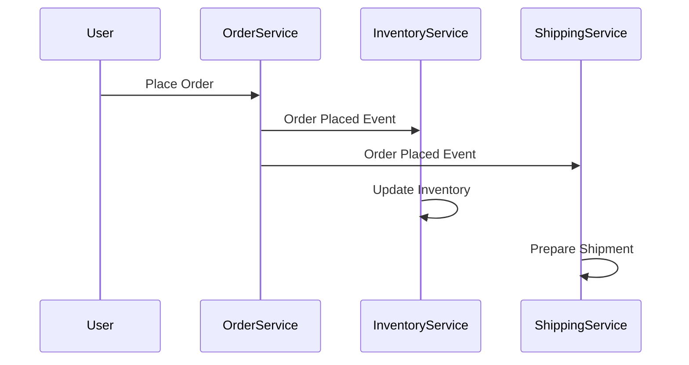

## 7.5.2 Eventual Consistency

In the realm of distributed systems and microservices, achieving data consistency is a critical yet challenging task. Eventual consistency is a consistency model that offers a pragmatic approach to managing data across distributed nodes, where updates are propagated asynchronously, and all nodes will eventually converge to a consistent state. This model is particularly relevant in microservices architectures, where services are often distributed across multiple nodes and geographical locations.

### Defining Eventual Consistency

Eventual consistency is a consistency model used in distributed computing to ensure that, given enough time, all replicas of a piece of data will converge to the same value. Unlike strong consistency, which requires immediate synchronization across all nodes, eventual consistency allows for temporary discrepancies between nodes. This model is beneficial in scenarios where availability and partition tolerance are prioritized over immediate consistency.

In eventual consistency, updates to data are propagated asynchronously. This means that when a change is made to a piece of data, it is not immediately reflected across all nodes. Instead, the update is gradually propagated, and nodes will eventually become consistent. This approach is particularly useful in systems where network partitions or latency can impact synchronization.

### Contrast with Strong Consistency

To understand eventual consistency, it's essential to contrast it with strong consistency. Strong consistency ensures that any read operation returns the most recent write for a given piece of data. This model is straightforward but can be costly in terms of performance and availability, especially in distributed systems where network latency and partitions are common.

The trade-offs between eventual and strong consistency can be summarized as follows:

- **Availability:** Eventual consistency prioritizes availability, allowing the system to remain operational even when some nodes are temporarily inconsistent. Strong consistency, on the other hand, may sacrifice availability to ensure immediate synchronization.
- **Performance:** Eventual consistency can offer better performance by reducing the need for immediate synchronization, which can be resource-intensive. Strong consistency often requires locking mechanisms or consensus protocols, which can introduce latency.
- **Data Accuracy:** While eventual consistency allows for temporary discrepancies, strong consistency ensures that all nodes reflect the most recent data at all times.

### Implementing Asynchronous Updates

Implementing eventual consistency in a microservices architecture involves designing systems that can handle asynchronous data updates. This typically involves the use of message queues or event streams to propagate changes across services.

Here's a simple example using Java and a message broker like Apache Kafka to implement asynchronous updates:

```java
import org.apache.kafka.clients.producer.KafkaProducer;
import org.apache.kafka.clients.producer.ProducerRecord;
import java.util.Properties;

public class EventProducer {
    private KafkaProducer<String, String> producer;

    public EventProducer() {
        Properties props = new Properties();
        props.put("bootstrap.servers", "localhost:9092");
        props.put("key.serializer", "org.apache.kafka.common.serialization.StringSerializer");
        props.put("value.serializer", "org.apache.kafka.common.serialization.StringSerializer");
        producer = new KafkaProducer<>(props);
    }

    public void sendUpdateEvent(String key, String value) {
        ProducerRecord<String, String> record = new ProducerRecord<>("update-topic", key, value);
        producer.send(record);
    }

    public void close() {
        producer.close();
    }
}
```

In this example, the `EventProducer` class sends update events to a Kafka topic. Other services can subscribe to this topic and process updates asynchronously, ensuring eventual consistency across the system.

### Use Conflict Resolution Strategies

In an eventually consistent system, conflicts can arise when concurrent updates occur. It's crucial to have strategies in place to resolve these conflicts. Common strategies include:

- **Last-Write-Wins:** The most recent update overwrites previous ones. This is simple but may lead to data loss if not carefully managed.
- **Versioning:** Each update carries a version number, and conflicts are resolved based on version history.
- **Merging Changes:** In some cases, changes can be merged intelligently, such as combining updates to different fields of a data object.

### Design Idempotent Operations

Idempotency is a critical concept in eventual consistency, ensuring that repeated operations do not lead to unintended side effects. An idempotent operation can be applied multiple times without changing the result beyond the initial application.

For example, consider a service that updates a user's profile information. The update operation should be designed such that applying the same update multiple times results in the same final state.

```java
public class UserProfileService {
    private Map<String, UserProfile> userProfiles = new HashMap<>();

    public void updateProfile(String userId, UserProfile newProfile) {
        userProfiles.put(userId, newProfile); // Idempotent operation
    }
}
```

In this example, the `updateProfile` method is idempotent because it simply replaces the existing profile with the new one, ensuring consistent results even if the update is applied multiple times.

### Leverage Event-Driven Architectures

Event-driven architectures are well-suited for implementing eventual consistency. In this model, services communicate through events, allowing them to react to changes asynchronously. This decouples services and enables them to process updates independently.

Consider a scenario where a user places an order. The order service can publish an event, and other services, such as inventory and shipping, can subscribe to this event and update their data accordingly.



In this diagram, the `OrderService` publishes an "Order Placed" event, which is consumed by the `InventoryService` and `ShippingService` to update their respective states.

### Monitor Data Synchronization

Monitoring is crucial in an eventually consistent system to ensure that data synchronization processes are functioning correctly. This involves tracking the propagation of updates and detecting any delays or discrepancies.

Tools like Prometheus and Grafana can be used to monitor metrics related to data synchronization, such as the time taken for updates to propagate and the number of pending updates.

### Provide Best Practices

Implementing eventual consistency requires careful planning and execution. Here are some best practices to consider:

- **Clear Communication:** Clearly communicate the consistency model to stakeholders, ensuring they understand the trade-offs involved.
- **Thorough Testing:** Test synchronization mechanisms thoroughly to ensure they handle updates correctly and efficiently.
- **Graceful Handling of Inconsistencies:** Design systems to handle temporary inconsistencies gracefully, providing users with accurate information about the state of the system.
- **Continuous Monitoring:** Implement continuous monitoring to detect and address synchronization issues promptly.

### Conclusion

Eventual consistency is a powerful model for managing data in distributed systems, offering a balance between availability and consistency. By implementing asynchronous updates, using conflict resolution strategies, and leveraging event-driven architectures, microservices can achieve eventual consistency while maintaining high availability and performance. Monitoring and best practices are essential to ensure the system operates smoothly and efficiently.

## Quiz Time!



### What is eventual consistency?

- [x] A consistency model where updates are propagated asynchronously, and all nodes eventually become consistent.
- [ ] A model that ensures immediate synchronization across all nodes.
- [ ] A model that prioritizes data accuracy over availability.
- [ ] A model that requires locking mechanisms for data updates.

> **Explanation:** Eventual consistency allows updates to be propagated asynchronously, ensuring that all nodes will eventually converge to a consistent state.

### How does eventual consistency differ from strong consistency?

- [x] Eventual consistency prioritizes availability and performance, while strong consistency ensures immediate synchronization.
- [ ] Eventual consistency requires locking mechanisms, while strong consistency does not.
- [ ] Eventual consistency is more accurate than strong consistency.
- [ ] Eventual consistency is only used in single-node systems.

> **Explanation:** Eventual consistency allows for temporary discrepancies to prioritize availability and performance, whereas strong consistency ensures immediate synchronization at the cost of availability.

### Which strategy can be used to resolve data conflicts in an eventually consistent system?

- [x] Last-Write-Wins
- [ ] Immediate Synchronization
- [ ] Locking Mechanisms
- [ ] Data Partitioning

> **Explanation:** Last-Write-Wins is a common strategy to resolve conflicts by overwriting previous updates with the most recent one.

### What is the role of idempotent operations in eventual consistency?

- [x] To ensure that repeated operations do not lead to unintended side effects.
- [ ] To guarantee immediate synchronization across nodes.
- [ ] To prioritize data accuracy over availability.
- [ ] To implement locking mechanisms for updates.

> **Explanation:** Idempotent operations ensure that applying the same update multiple times results in the same final state, preventing unintended side effects.

### How do event-driven architectures facilitate eventual consistency?

- [x] By enabling services to react to and process events asynchronously.
- [ ] By requiring immediate synchronization across all nodes.
- [ ] By implementing locking mechanisms for data updates.
- [ ] By prioritizing data accuracy over availability.

> **Explanation:** Event-driven architectures allow services to process updates independently and asynchronously, supporting eventual consistency.

### What is a common tool used for monitoring data synchronization in microservices?

- [x] Prometheus
- [ ] Kafka
- [ ] Docker
- [ ] Jenkins

> **Explanation:** Prometheus is a monitoring tool that can track metrics related to data synchronization, helping to detect delays or discrepancies.

### Which of the following is a best practice for implementing eventual consistency?

- [x] Clearly communicate the consistency model to stakeholders.
- [ ] Ensure immediate synchronization across all nodes.
- [ ] Use locking mechanisms for data updates.
- [ ] Prioritize data accuracy over availability.

> **Explanation:** Clear communication of the consistency model helps stakeholders understand the trade-offs involved in eventual consistency.

### What is the purpose of monitoring in an eventually consistent system?

- [x] To detect and address synchronization issues promptly.
- [ ] To ensure immediate synchronization across all nodes.
- [ ] To implement locking mechanisms for data updates.
- [ ] To prioritize data accuracy over availability.

> **Explanation:** Monitoring helps detect synchronization issues, ensuring that data updates are propagated correctly and efficiently.

### Which Java class is used in the example to send update events to a Kafka topic?

- [x] EventProducer
- [ ] EventConsumer
- [ ] DataSynchronizer
- [ ] UpdateManager

> **Explanation:** The `EventProducer` class is used to send update events to a Kafka topic, facilitating asynchronous updates.

### Eventual consistency is suitable for systems where availability is prioritized over immediate data accuracy.

- [x] True
- [ ] False

> **Explanation:** Eventual consistency allows for temporary discrepancies to ensure high availability, making it suitable for systems where availability is prioritized.


