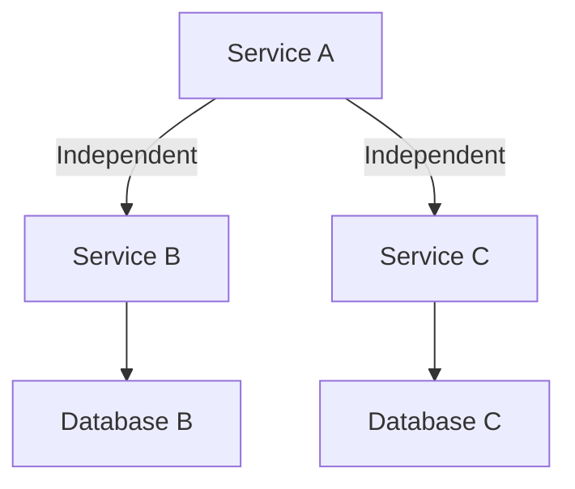

## 8.1.2 Principles of Fault Tolerance

In the realm of microservices, fault tolerance is a critical aspect that ensures systems remain operational even when individual components fail. Given the distributed nature of microservices, the likelihood of encountering failures increases, making it imperative to design systems that can withstand and recover from such events. This section delves into the core principles of fault tolerance, providing insights and practical strategies to build resilient microservices.

### Defining Fault Tolerance

Fault tolerance refers to the ability of a system to continue functioning correctly even when some of its components fail. This capability is crucial in microservices architectures, where services are distributed across multiple nodes and environments. A fault-tolerant system can detect failures, isolate them, and recover without significant disruption to the overall service.

### Emphasizing Redundancy

Redundancy is a foundational principle of fault tolerance. By having multiple instances of critical components, systems can continue to operate even if one instance fails. Redundancy can be implemented at various levels, including:

- **Service Level Redundancy:** Deploying multiple instances of a service across different nodes or data centers.
- **Data Redundancy:** Replicating data across multiple storage systems to prevent data loss.
- **Network Redundancy:** Using multiple network paths to ensure connectivity even if one path fails.

**Example:**

```java
// Example of a redundant service deployment using a load balancer
public class RedundantService {
    private List<ServiceInstance> instances;

    public RedundantService(List<ServiceInstance> instances) {
        this.instances = instances;
    }

    public Response handleRequest(Request request) {
        for (ServiceInstance instance : instances) {
            try {
                return instance.process(request);
            } catch (Exception e) {
                // Log and try the next instance
                System.out.println("Instance failed, trying next: " + e.getMessage());
            }
        }
        throw new RuntimeException("All instances failed");
    }
}
```

### Implementing Graceful Degradation

Graceful degradation ensures that a system continues to function with reduced capabilities when some components fail. This approach prioritizes core functionalities while temporarily disabling non-essential features.

**Real-World Scenario:**

In an e-commerce application, if the recommendation service fails, the system can still process orders and display product information, albeit without personalized recommendations.

### Ensuring Fail-Fast Behavior

Fail-fast behavior is about designing services to quickly detect and respond to errors, preventing cascading failures. By failing fast, systems can avoid prolonged periods of instability and reduce the impact of failures.

**Example:**

```java
// Example of a fail-fast approach using exception handling
public class PaymentService {
    public void processPayment(PaymentRequest request) {
        if (!isValid(request)) {
            throw new IllegalArgumentException("Invalid payment request");
        }
        // Proceed with payment processing
    }

    private boolean isValid(PaymentRequest request) {
        // Validate request
        return request != null && request.getAmount() > 0;
    }
}
```

### Promoting Isolation

Isolation involves designing systems so that failures in one component do not affect unrelated parts. This can be achieved through:

- **Service Isolation:** Deploying services independently to prevent failures from propagating.
- **Data Isolation:** Ensuring that each service has its own database to avoid cross-service data corruption.

**Mermaid Diagram:**



### Leveraging Retry Mechanisms

Retry mechanisms are essential for handling transient failures, such as temporary network issues. By retrying operations, systems can recover from these failures without manual intervention.

**Example:**

```java
// Example of a retry mechanism with exponential backoff
public class RetryService {
    private static final int MAX_RETRIES = 3;

    public Response callService(Request request) {
        int attempt = 0;
        while (attempt < MAX_RETRIES) {
            try {
                return externalService.call(request);
            } catch (TransientException e) {
                attempt++;
                try {
                    Thread.sleep((long) Math.pow(2, attempt) * 1000);
                } catch (InterruptedException ie) {
                    Thread.currentThread().interrupt();
                }
            }
        }
        throw new RuntimeException("Service call failed after retries");
    }
}
```

### Using Timeouts and Circuit Breakers

Timeouts and circuit breakers are critical for preventing services from waiting indefinitely and stopping calls to failing services.

- **Timeouts:** Set limits on how long a service will wait for a response, ensuring that slow responses do not degrade overall system performance.
- **Circuit Breakers:** Monitor service calls and open a circuit (stop calls) when failures exceed a threshold, allowing the system to recover before retrying.

**Example:**

```java
// Example of a circuit breaker implementation
public class CircuitBreaker {
    private int failureCount = 0;
    private final int threshold = 5;
    private boolean open = false;

    public Response callService(Request request) {
        if (open) {
            throw new RuntimeException("Circuit is open");
        }

        try {
            Response response = externalService.call(request);
            reset();
            return response;
        } catch (Exception e) {
            failureCount++;
            if (failureCount >= threshold) {
                open = true;
            }
            throw e;
        }
    }

    private void reset() {
        failureCount = 0;
        open = false;
    }
}
```

### Adopting Health Checks

Regular health checks are vital for detecting failures early and triggering appropriate fault tolerance measures. Health checks can be implemented at various levels:

- **Application-Level Health Checks:** Verify the status of services and their dependencies.
- **Infrastructure-Level Health Checks:** Monitor the health of servers, network connections, and other infrastructure components.

**Example:**

```java
// Example of a simple health check endpoint
@RestController
public class HealthCheckController {
    @GetMapping("/health")
    public ResponseEntity<String> healthCheck() {
        // Perform health checks
        boolean healthy = checkServiceHealth();
        return healthy ? ResponseEntity.ok("Healthy") : ResponseEntity.status(HttpStatus.SERVICE_UNAVAILABLE).body("Unhealthy");
    }

    private boolean checkServiceHealth() {
        // Check service dependencies and return health status
        return true; // Simplified for example
    }
}
```

### Conclusion

Building fault-tolerant microservices requires a comprehensive approach that incorporates redundancy, graceful degradation, fail-fast behavior, isolation, retry mechanisms, timeouts, circuit breakers, and health checks. By implementing these principles, you can create resilient systems that withstand failures and maintain service continuity.

### References and Further Reading

- [Designing Data-Intensive Applications by Martin Kleppmann](https://dataintensive.net/)
- [Release It! by Michael T. Nygard](https://pragprog.com/titles/mnee2/release-it-second-edition/)
- [Microservices Patterns by Chris Richardson](https://www.manning.com/books/microservices-patterns)

## Quiz Time!



### What is fault tolerance?

- [x] The ability of a system to continue operating properly in the event of the failure of some of its components.
- [ ] The ability of a system to prevent any failures from occurring.
- [ ] The ability of a system to operate without any redundancy.
- [ ] The ability of a system to degrade completely when a failure occurs.

> **Explanation:** Fault tolerance refers to a system's ability to continue functioning correctly even when some components fail.

### How does redundancy contribute to fault tolerance?

- [x] By having multiple instances of critical components to ensure continuity.
- [ ] By eliminating the need for backups.
- [ ] By making the system more complex and harder to manage.
- [ ] By reducing the overall system performance.

> **Explanation:** Redundancy involves having multiple instances of critical components, ensuring that if one fails, others can take over, maintaining system operation.

### What is graceful degradation?

- [x] A system's ability to continue functioning with reduced capabilities when some components fail.
- [ ] A system's ability to shut down completely when a failure occurs.
- [ ] A system's ability to prevent any failures from occurring.
- [ ] A system's ability to operate without any dependencies.

> **Explanation:** Graceful degradation allows a system to maintain core functionalities while disabling non-essential features when failures occur.

### Why is fail-fast behavior important?

- [x] It helps quickly detect and respond to errors, preventing cascading failures.
- [ ] It ensures that the system never fails.
- [ ] It allows the system to operate indefinitely without maintenance.
- [ ] It reduces the need for error handling.

> **Explanation:** Fail-fast behavior ensures that errors are detected and handled quickly, preventing them from causing further issues.

### What is the purpose of isolation in fault tolerance?

- [x] To minimize the impact of failures on unrelated parts of the system.
- [ ] To ensure that all services share the same resources.
- [ ] To make the system more complex.
- [ ] To eliminate the need for redundancy.

> **Explanation:** Isolation helps contain failures within a specific component, preventing them from affecting other parts of the system.

### How do retry mechanisms enhance fault tolerance?

- [x] By recovering from transient failures through repeated attempts.
- [ ] By eliminating the need for error handling.
- [ ] By making the system more complex.
- [ ] By reducing the system's performance.

> **Explanation:** Retry mechanisms allow systems to recover from temporary issues by retrying operations, enhancing fault tolerance.

### What role do timeouts play in fault tolerance?

- [x] They prevent services from waiting indefinitely for a response.
- [ ] They ensure that services never fail.
- [ ] They make the system more complex.
- [ ] They reduce the need for error handling.

> **Explanation:** Timeouts set limits on how long a service will wait for a response, preventing indefinite waits and potential system degradation.

### What is a circuit breaker in the context of fault tolerance?

- [x] A mechanism that stops calls to failing services when failures exceed a threshold.
- [ ] A device used to protect electrical circuits.
- [ ] A tool for monitoring system performance.
- [ ] A method for encrypting data.

> **Explanation:** A circuit breaker monitors service calls and stops them when failures exceed a threshold, allowing the system to recover.

### Why are health checks important in fault-tolerant systems?

- [x] They detect failures early and trigger appropriate fault tolerance measures.
- [ ] They eliminate the need for redundancy.
- [ ] They reduce the need for error handling.
- [ ] They make the system more complex.

> **Explanation:** Health checks help detect failures early, allowing systems to take corrective actions and maintain operation.

### True or False: Fault tolerance eliminates the need for system maintenance.

- [ ] True
- [x] False

> **Explanation:** Fault tolerance does not eliminate the need for maintenance; it ensures systems can operate during failures but regular maintenance is still necessary.


