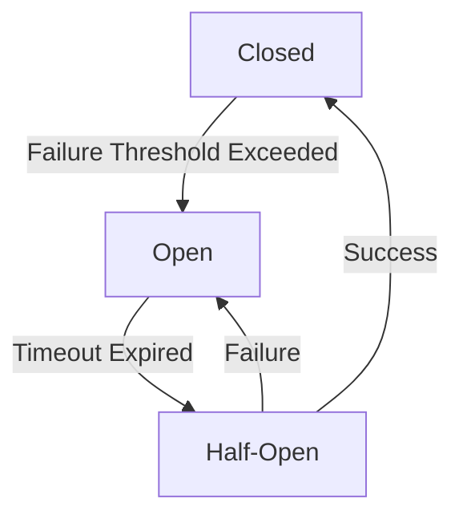

## 8.2.1 Circuit Breaker Pattern

In the world of microservices, where systems are distributed and often complex, ensuring resilience and fault tolerance is paramount. The Circuit Breaker Pattern is a critical design pattern that helps prevent a service from repeatedly performing an action that is likely to fail, allowing it to recover before retrying. This pattern is inspired by electrical circuit breakers, which prevent electrical overloads by breaking the circuit when a fault is detected.

### Understanding the Circuit Breaker Pattern

The Circuit Breaker Pattern acts as a protective barrier around a service, monitoring its interactions and halting requests when failures reach a certain threshold. This prevents further strain on the failing service and allows it time to recover, thereby maintaining the overall health of the system.

### Circuit States: Closed, Open, and Half-Open

A circuit breaker operates in three primary states:

1. **Closed State:** In this state, the circuit breaker allows requests to flow through to the service. It monitors the success and failure rates of these requests. If the failure rate exceeds a predefined threshold, the circuit transitions to the Open state.

2. **Open State:** When in the Open state, the circuit breaker halts all requests to the service, immediately returning an error or a fallback response. This state gives the service time to recover from its failures without being overwhelmed by new requests.

3. **Half-Open State:** After a specified timeout, the circuit breaker transitions to the Half-Open state, allowing a limited number of requests to test if the service has recovered. If these requests succeed, the circuit transitions back to the Closed state. If they fail, it returns to the Open state.



### Implementing Thresholds

Setting appropriate thresholds is crucial for the effective functioning of a circuit breaker. These thresholds determine when the circuit transitions from Closed to Open. Consider the following guidelines:

- **Failure Rate Threshold:** Define a percentage of failed requests that will trigger the circuit to open. This should be based on historical data and the criticality of the service.
- **Timeout Duration:** Specify how long the circuit remains open before transitioning to the Half-Open state. This duration should be long enough to allow the service to recover.
- **Success Threshold in Half-Open State:** Determine the number of successful requests required to transition back to the Closed state.

### Designing Fallback Mechanisms

When the circuit is Open, it's essential to provide fallback mechanisms to ensure a graceful degradation of service. These mechanisms can include:

- **Default Responses:** Return a predefined response that indicates the service is unavailable.
- **Cached Data:** Serve data from a cache if available, providing stale but potentially useful information.
- **Alternative Services:** Redirect requests to a backup service or a different instance that can handle the request.

### Managing State Transitions

Effective management of state transitions is vital to ensure the circuit breaker responds appropriately to changing conditions. Consider these strategies:

- **Dynamic Thresholds:** Adjust thresholds based on real-time data and system load to optimize performance.
- **Exponential Backoff:** Use exponential backoff strategies to gradually increase the time between retries, reducing the load on the recovering service.
- **Monitoring and Alerts:** Integrate with monitoring systems to track the status of circuit breakers and alert operators to potential issues.

### Integrating with Monitoring Systems

Integrating circuit breakers with monitoring systems is crucial for maintaining visibility into their status and the health of services. This integration allows for:

- **Real-Time Metrics:** Collect metrics on request success and failure rates, circuit state transitions, and fallback usage.
- **Alerts and Notifications:** Set up alerts to notify operators when a circuit transitions to the Open state or when fallback mechanisms are frequently used.
- **Dashboards:** Create dashboards to visualize the health of services and the status of circuit breakers across the system.

### Using Existing Libraries

Implementing a circuit breaker from scratch can be complex and error-prone. Fortunately, several libraries and frameworks provide robust implementations:

- **Resilience4j:** A lightweight, easy-to-use library for implementing circuit breakers in Java applications. It offers a flexible API and integrates well with Spring Boot.
- **Hystrix:** Developed by Netflix, Hystrix provides a comprehensive solution for latency and fault tolerance in distributed systems. Although now in maintenance mode, it remains a popular choice for legacy systems.

#### Example: Implementing a Circuit Breaker with Resilience4j

```java
import io.github.resilience4j.circuitbreaker.CircuitBreaker;
import io.github.resilience4j.circuitbreaker.CircuitBreakerConfig;
import io.github.resilience4j.circuitbreaker.CircuitBreakerRegistry;
import io.github.resilience4j.circuitbreaker.event.CircuitBreakerEvent;
import io.github.resilience4j.circuitbreaker.event.CircuitBreakerOnErrorEvent;

import java.time.Duration;
import java.util.function.Supplier;

public class CircuitBreakerExample {

    public static void main(String[] args) {
        // Create a custom configuration for a CircuitBreaker
        CircuitBreakerConfig config = CircuitBreakerConfig.custom()
                .failureRateThreshold(50) // 50% failure rate threshold
                .waitDurationInOpenState(Duration.ofSeconds(10)) // 10 seconds open state duration
                .permittedNumberOfCallsInHalfOpenState(3) // 3 calls in half-open state
                .build();

        // Create a CircuitBreakerRegistry with a custom global configuration
        CircuitBreakerRegistry registry = CircuitBreakerRegistry.of(config);

        // Get or create a CircuitBreaker from the registry
        CircuitBreaker circuitBreaker = registry.circuitBreaker("myCircuitBreaker");

        // Register an event listener to monitor circuit breaker events
        circuitBreaker.getEventPublisher()
                .onError(event -> handleCircuitBreakerError(event));

        // Decorate a supplier with the circuit breaker
        Supplier<String> decoratedSupplier = CircuitBreaker
                .decorateSupplier(circuitBreaker, CircuitBreakerExample::callService);

        // Execute the decorated supplier
        try {
            String result = decoratedSupplier.get();
            System.out.println("Service call result: " + result);
        } catch (Exception e) {
            System.out.println("Service call failed: " + e.getMessage());
        }
    }

    private static String callService() {
        // Simulate a service call that may fail
        throw new RuntimeException("Service failure");
    }

    private static void handleCircuitBreakerError(CircuitBreakerEvent event) {
        if (event instanceof CircuitBreakerOnErrorEvent) {
            System.out.println("Circuit breaker error: " + event.toString());
        }
    }
}
```

### Testing Circuit Breakers

Thorough testing is essential to ensure circuit breakers function correctly under various failure scenarios. Consider the following testing strategies:

- **Simulate Failures:** Use tools or mock services to simulate failures and observe how the circuit breaker responds.
- **Load Testing:** Conduct load tests to ensure the circuit breaker can handle high traffic and transitions smoothly between states.
- **Integration Testing:** Verify that circuit breakers integrate correctly with other components and do not introduce unintended side effects.

### Conclusion

The Circuit Breaker Pattern is a powerful tool for enhancing the resilience and fault tolerance of microservices architectures. By preventing repeated failures and allowing services time to recover, circuit breakers help maintain system stability and improve user experience. Integrating circuit breakers with monitoring systems and using established libraries like Resilience4j can streamline implementation and ensure robust fault tolerance.

For further exploration, consider the following resources:

- **Resilience4j Documentation:** [Resilience4j GitHub](https://github.com/resilience4j/resilience4j)
- **Hystrix Documentation:** [Hystrix GitHub](https://github.com/Netflix/Hystrix)
- **Book:** "Release It!" by Michael T. Nygard, which covers patterns for building resilient systems.

## Quiz Time!



### What is the primary purpose of the Circuit Breaker Pattern?

- [x] To prevent a service from performing an action likely to fail
- [ ] To enhance the speed of service requests
- [ ] To reduce the cost of service operations
- [ ] To improve the user interface of a service

> **Explanation:** The Circuit Breaker Pattern is designed to prevent a service from repeatedly performing an action that is likely to fail, allowing it to recover before retrying.

### Which state of the circuit breaker allows requests to flow through to the service?

- [x] Closed
- [ ] Open
- [ ] Half-Open
- [ ] Broken

> **Explanation:** In the Closed state, the circuit breaker allows requests to flow through to the service while monitoring success and failure rates.

### What happens when a circuit breaker is in the Open state?

- [x] Requests are halted, and an error or fallback response is returned
- [ ] Requests are allowed through without monitoring
- [ ] The service is shut down completely
- [ ] The service is restarted automatically

> **Explanation:** In the Open state, the circuit breaker halts requests to the service, returning an error or fallback response to allow the service time to recover.

### How does the circuit breaker transition from Open to Half-Open state?

- [x] After a specified timeout
- [ ] When the service is manually reset
- [ ] When the failure rate drops to zero
- [ ] When the service is restarted

> **Explanation:** The circuit breaker transitions from Open to Half-Open state after a specified timeout, allowing a limited number of requests to test if the service has recovered.

### What is a common fallback mechanism when a circuit is Open?

- [x] Returning a default response
- [ ] Increasing the request rate
- [x] Serving cached data
- [ ] Shutting down the service

> **Explanation:** Common fallback mechanisms include returning a default response or serving cached data to ensure a graceful degradation of service.

### Which library is recommended for implementing circuit breakers in Java applications?

- [x] Resilience4j
- [ ] Log4j
- [ ] Spring Boot
- [ ] Hibernate

> **Explanation:** Resilience4j is a lightweight, easy-to-use library for implementing circuit breakers in Java applications.

### What is the purpose of integrating circuit breakers with monitoring systems?

- [x] To track the status of circuit breakers and the health of services
- [ ] To increase the speed of service requests
- [ ] To reduce the cost of service operations
- [ ] To improve the user interface of a service

> **Explanation:** Integrating circuit breakers with monitoring systems helps track their status and the health of services, providing real-time metrics and alerts.

### What should be tested to ensure circuit breakers function correctly?

- [x] Simulated failures and load testing
- [ ] Only the user interface
- [ ] Only the database connections
- [ ] Only the network latency

> **Explanation:** Testing should include simulated failures and load testing to ensure circuit breakers respond correctly under different failure scenarios.

### What is the role of the Half-Open state in a circuit breaker?

- [x] To test if the service has recovered by allowing a limited number of requests
- [ ] To permanently halt all requests
- [ ] To increase the request rate
- [ ] To shut down the service

> **Explanation:** The Half-Open state allows a limited number of requests to test if the service has recovered, determining whether to transition back to Closed or return to Open.

### True or False: A circuit breaker can help improve the resilience of a microservices architecture.

- [x] True
- [ ] False

> **Explanation:** True. A circuit breaker improves resilience by preventing repeated failures and allowing services time to recover, maintaining system stability.


