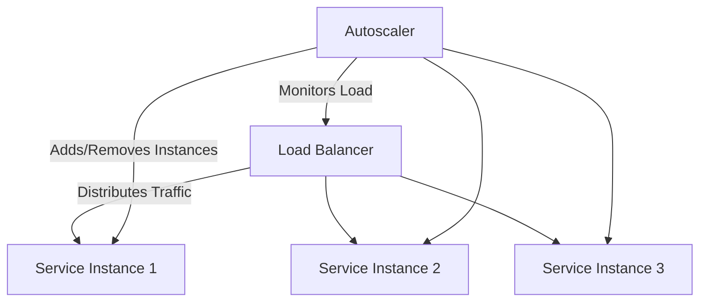

## 8.4.3 Protecting Services from Overload

In the dynamic world of microservices, protecting services from overload is crucial for maintaining system stability and reliability. Overload protection involves a set of strategies and mechanisms designed to prevent services from becoming overwhelmed by excessive requests. This ensures that your system remains responsive and continues to deliver core functionalities even under high load conditions.

### Understanding Overload Protection

Overload protection is essential in microservices architecture to prevent system failures and maintain service quality. It involves implementing strategies that help services handle excessive load gracefully, ensuring that critical functionalities remain available while non-essential features may be temporarily limited. This approach not only protects individual services but also contributes to the overall resilience of the system.

### Identifying Overload Indicators

To effectively protect services from overload, it's important to identify signs of service overload early. Common indicators include:

- **Increased Response Times:** A noticeable delay in service response times can indicate that the service is struggling to handle the current load.
- **Error Rates:** A spike in error rates, such as HTTP 500 errors, can signal that the service is overwhelmed and unable to process requests correctly.
- **Resource Exhaustion:** High CPU, memory, or network usage can indicate that the service is reaching its resource limits.

Monitoring and alerting tools play a critical role in detecting these indicators. Tools like Prometheus, Grafana, and ELK Stack can help you set up alerts and dashboards to monitor service health and performance.

### Implementing Graceful Degradation

Graceful degradation is a technique that allows services to maintain core functionality while limiting non-essential features under high load. This ensures that users can still access critical features even when the system is under stress. Here are some guidelines for implementing graceful degradation:

- **Prioritize Core Features:** Identify and prioritize the most critical features of your service. Ensure these features remain available during high load.
- **Limit Non-Essential Features:** Temporarily disable or limit features that are not critical to the core functionality of the service.
- **Provide Feedback to Users:** Inform users about the limited functionality and expected recovery time, enhancing user experience and trust.

### Using Rate Limiting and Throttling

Rate limiting and throttling are effective patterns for controlling the influx of requests to a service, preventing it from being overwhelmed. These techniques help maintain service stability by ensuring that requests are processed at a manageable rate.

- **Rate Limiting:** Set limits on the number of requests a client can make within a specific time frame. This can be implemented using tools like NGINX or API Gateway, which provide built-in rate limiting capabilities.

- **Throttling:** Dynamically adjust the rate of incoming requests based on current load and resource availability. Throttling can be implemented at the application level, allowing more granular control over request processing.

Here's a simple example of rate limiting in Java using a token bucket algorithm:

```java
import java.util.concurrent.TimeUnit;
import com.google.common.util.concurrent.RateLimiter;

public class RateLimiterExample {
    private final RateLimiter rateLimiter;

    public RateLimiterExample(double permitsPerSecond) {
        this.rateLimiter = RateLimiter.create(permitsPerSecond);
    }

    public void handleRequest() {
        if (rateLimiter.tryAcquire()) {
            // Process the request
            System.out.println("Request processed.");
        } else {
            // Reject the request or respond with a rate limit message
            System.out.println("Request rejected due to rate limiting.");
        }
    }

    public static void main(String[] args) {
        RateLimiterExample limiter = new RateLimiterExample(5.0); // 5 requests per second
        for (int i = 0; i < 10; i++) {
            limiter.handleRequest();
            try {
                TimeUnit.MILLISECONDS.sleep(100);
            } catch (InterruptedException e) {
                Thread.currentThread().interrupt();
            }
        }
    }
}
```

### Implementing Circuit Breakers

Circuit breakers are a crucial component in protecting services from overload by detecting and isolating failing services. They prevent a service from processing further requests until it recovers, thereby avoiding cascading failures.

- **Open State:** When a failure is detected, the circuit breaker opens, preventing further requests from reaching the service.
- **Half-Open State:** After a cooldown period, the circuit breaker allows a limited number of requests to test if the service has recovered.
- **Closed State:** If the service is healthy, the circuit breaker closes, allowing normal request flow.

Here's a basic implementation of a circuit breaker pattern in Java:

```java
public class CircuitBreaker {
    private enum State { CLOSED, OPEN, HALF_OPEN }
    private State state = State.CLOSED;
    private int failureCount = 0;
    private final int failureThreshold = 3;
    private final long timeout = 5000; // 5 seconds
    private long lastFailureTime = 0;

    public boolean allowRequest() {
        if (state == State.OPEN) {
            if (System.currentTimeMillis() - lastFailureTime > timeout) {
                state = State.HALF_OPEN;
                return true;
            }
            return false;
        }
        return true;
    }

    public void recordFailure() {
        failureCount++;
        lastFailureTime = System.currentTimeMillis();
        if (failureCount >= failureThreshold) {
            state = State.OPEN;
        }
    }

    public void recordSuccess() {
        if (state == State.HALF_OPEN) {
            state = State.CLOSED;
            failureCount = 0;
        }
    }
}
```

### Adopting Autoscaling

Autoscaling allows services to dynamically adjust their resources based on current load and demand. This ensures that services have sufficient resources to handle peak loads while optimizing costs during low demand periods.

- **Horizontal Scaling:** Add or remove instances of a service based on load. This is commonly used in cloud environments with tools like Kubernetes and AWS Auto Scaling.
- **Vertical Scaling:** Increase or decrease the resources (CPU, memory) of a single instance. This is less common in microservices due to potential downtime during scaling.

Here's a diagram illustrating horizontal autoscaling with Kubernetes:



### Optimizing Resource Utilization

Efficient resource utilization is key to preventing overload and ensuring that services can handle high loads effectively. Here are some strategies:

- **Efficient Code Practices:** Write optimized code that minimizes resource consumption. Avoid unnecessary computations and optimize algorithms for performance.
- **Caching Frequently Accessed Data:** Use caching mechanisms to store frequently accessed data, reducing the need for repeated computations or database queries.
- **Minimizing Resource-Intensive Operations:** Identify and optimize resource-intensive operations, such as large data processing tasks, to reduce their impact on service performance.

### Best Practices for Protecting Services from Overload

To effectively protect services from overload, consider the following best practices:

- **Proactive Capacity Planning:** Regularly assess and plan for capacity needs based on expected load and growth.
- **Prioritizing Critical Workloads:** Ensure that critical workloads are prioritized during high load conditions, maintaining essential service functionality.
- **Implementing Fallback Mechanisms:** Provide fallback mechanisms for non-critical features, allowing them to degrade gracefully under load.
- **Building Resilient Architectures:** Design architectures that can absorb and recover from high load conditions, leveraging patterns like circuit breakers and autoscaling.

By implementing these strategies and best practices, you can ensure that your microservices remain stable and reliable, even under challenging load conditions. Protecting services from overload is not just about handling peak loads but also about building a resilient system that can adapt and recover from unexpected challenges.

## Quiz Time!



### What is the primary goal of overload protection in microservices?

- [x] To prevent services from becoming overwhelmed by excessive requests
- [ ] To increase the number of requests a service can handle
- [ ] To reduce the cost of running microservices
- [ ] To eliminate the need for monitoring tools

> **Explanation:** Overload protection aims to prevent services from being overwhelmed by excessive requests, ensuring system stability and reliability.

### Which of the following is an indicator of service overload?

- [x] Increased response times
- [x] High error rates
- [x] Resource exhaustion
- [ ] Decreased request volume

> **Explanation:** Increased response times, high error rates, and resource exhaustion are common indicators of service overload.

### What is the purpose of graceful degradation?

- [x] To maintain core functionality while limiting non-essential features under high load
- [ ] To completely shut down a service during high load
- [ ] To increase the number of features available during high load
- [ ] To prioritize non-essential features over core functionality

> **Explanation:** Graceful degradation allows services to maintain core functionality while limiting non-essential features under high load.

### How does rate limiting help protect services from overload?

- [x] By controlling the influx of requests to a service
- [ ] By increasing the processing power of a service
- [ ] By reducing the number of service instances
- [ ] By eliminating the need for monitoring

> **Explanation:** Rate limiting controls the influx of requests to a service, preventing it from being overwhelmed.

### What is the role of a circuit breaker in overload protection?

- [x] To detect and isolate failing services
- [ ] To increase the number of requests a service can handle
- [ ] To reduce the cost of running microservices
- [ ] To eliminate the need for autoscaling

> **Explanation:** Circuit breakers detect and isolate failing services, preventing them from processing further requests until they recover.

### What is the difference between horizontal and vertical scaling?

- [x] Horizontal scaling adds or removes instances, while vertical scaling adjusts resources of a single instance
- [ ] Horizontal scaling adjusts resources of a single instance, while vertical scaling adds or removes instances
- [ ] Both involve adding more instances to handle load
- [ ] Both involve reducing the number of instances to save costs

> **Explanation:** Horizontal scaling adds or removes instances, while vertical scaling adjusts the resources of a single instance.

### Which strategy involves storing frequently accessed data to reduce repeated computations?

- [x] Caching
- [ ] Rate limiting
- [ ] Circuit breaking
- [ ] Throttling

> **Explanation:** Caching involves storing frequently accessed data to reduce the need for repeated computations or database queries.

### What is the benefit of proactive capacity planning?

- [x] It helps ensure that services have sufficient resources to handle expected load and growth
- [ ] It eliminates the need for monitoring tools
- [ ] It reduces the cost of running microservices
- [ ] It increases the number of features available during high load

> **Explanation:** Proactive capacity planning helps ensure that services have sufficient resources to handle expected load and growth.

### Which of the following is a best practice for protecting services from overload?

- [x] Prioritizing critical workloads
- [x] Implementing fallback mechanisms
- [x] Building resilient architectures
- [ ] Disabling monitoring tools

> **Explanation:** Prioritizing critical workloads, implementing fallback mechanisms, and building resilient architectures are best practices for protecting services from overload.

### True or False: Autoscaling only involves adding more instances to handle load.

- [ ] True
- [x] False

> **Explanation:** Autoscaling involves both adding and removing instances based on current load and demand, ensuring optimal resource utilization.


