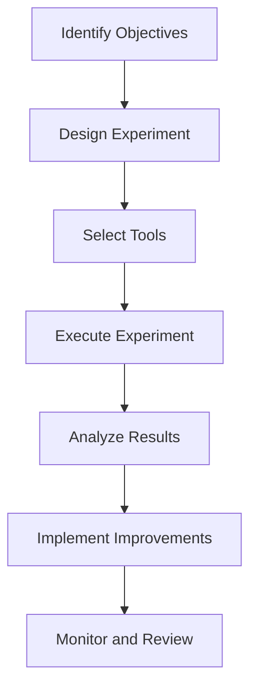

## 8.5.3 Case Studies

Chaos Engineering has emerged as a pivotal practice for enhancing the resilience of microservices architectures. By intentionally injecting failures into systems, organizations can uncover weaknesses and fortify their infrastructure against real-world disruptions. In this section, we delve into several compelling case studies from diverse industries, illustrating how Chaos Engineering has been effectively implemented to bolster system resilience.

### Case Study 1: Netflix - Pioneering Chaos Engineering

#### Initial Challenges

Netflix, a leader in streaming services, faced significant challenges in maintaining system resilience due to its complex and highly distributed architecture. The need to ensure uninterrupted service for millions of global users prompted Netflix to explore innovative strategies for identifying and mitigating potential points of failure.

#### Experiment Objectives

Netflix aimed to test the robustness of its failover mechanisms and validate the redundancy of its microservices. The primary objectives included:

- Assessing the system's ability to handle unexpected service outages.
- Ensuring that failover processes were seamless and did not impact user experience.
- Identifying any single points of failure within the architecture.

#### Experiment Methodologies

Netflix employed its internally developed tool, Chaos Monkey, to conduct chaos experiments. Chaos Monkey randomly terminated instances within their production environment to simulate failures. This approach was part of a broader suite known as the Simian Army, designed to test various aspects of system resilience.

```java
// Example of a simple Chaos Monkey implementation in Java
public class ChaosMonkey {

    private final List<ServiceInstance> instances;

    public ChaosMonkey(List<ServiceInstance> instances) {
        this.instances = instances;
    }

    public void unleashChaos() {
        Random random = new Random();
        int index = random.nextInt(instances.size());
        ServiceInstance instance = instances.get(index);
        instance.terminate(); // Simulate failure
        System.out.println("Chaos Monkey terminated instance: " + instance.getId());
    }
}
```

#### Outcomes and Insights

The chaos experiments revealed several critical insights:

- Some services lacked adequate redundancy, leading to cascading failures.
- The need for improved monitoring and alerting mechanisms was identified.
- The experiments led to the implementation of more robust failover strategies and enhanced redundancy across services.

#### Lessons Learned

Netflix's experience underscored the importance of continuous testing and monitoring. Key lessons included:

- Regular chaos experiments are essential for maintaining resilience.
- Building a culture of resilience requires buy-in from all levels of the organization.
- Automated recovery processes are crucial for minimizing downtime.

### Case Study 2: Amazon - Ensuring E-commerce Stability

#### Initial Challenges

Amazon, a global e-commerce giant, faced the challenge of ensuring system stability during peak shopping periods. The complexity of its infrastructure, coupled with high transaction volumes, necessitated a proactive approach to resilience.

#### Experiment Objectives

Amazon's chaos experiments focused on:

- Validating the effectiveness of load balancing and auto-scaling mechanisms.
- Testing the system's ability to recover from database failures.
- Ensuring that customer data integrity was maintained during disruptions.

#### Experiment Methodologies

Amazon utilized a combination of internal tools and open-source solutions to conduct chaos experiments. These included simulating network latency, introducing database failures, and testing the limits of auto-scaling capabilities.

```java
// Simulating network latency in a Java microservice
public class NetworkLatencySimulator {

    public void simulateLatency() {
        try {
            Thread.sleep(5000); // Introduce 5 seconds of latency
        } catch (InterruptedException e) {
            Thread.currentThread().interrupt();
        }
    }
}
```

#### Outcomes and Insights

The experiments led to several improvements:

- Enhanced load balancing algorithms were developed to handle sudden traffic spikes.
- Auto-scaling policies were refined to ensure rapid response to increased demand.
- Database replication strategies were optimized to prevent data loss.

#### Lessons Learned

Amazon's case study highlighted the value of chaos engineering in large-scale systems. Key takeaways included:

- Chaos experiments should be integrated into regular testing cycles.
- Collaboration between development and operations teams is vital for effective resilience strategies.
- Continuous improvement of resilience practices is necessary to keep pace with evolving threats.

### Case Study 3: LinkedIn - Maintaining Social Network Reliability

#### Initial Challenges

LinkedIn, a professional networking platform, faced challenges in maintaining service reliability due to its rapid growth and increasing user base. The need to ensure seamless connectivity and data integrity was paramount.

#### Experiment Objectives

LinkedIn's chaos engineering objectives included:

- Testing the resilience of its messaging and notification services.
- Ensuring data consistency across distributed databases.
- Validating the effectiveness of disaster recovery plans.

#### Experiment Methodologies

LinkedIn employed a combination of fault injection tools and real-time monitoring to conduct chaos experiments. These experiments involved simulating service outages and testing the system's ability to recover without data loss.

```java
// Fault injection example in a LinkedIn microservice
public class FaultInjector {

    public void injectFault(Service service) {
        service.setStatus(ServiceStatus.DOWN); // Simulate service outage
        System.out.println("Injected fault into service: " + service.getName());
    }
}
```

#### Outcomes and Insights

The chaos experiments provided valuable insights:

- Messaging services were optimized to handle increased load and ensure timely delivery.
- Data replication strategies were enhanced to maintain consistency during failures.
- Disaster recovery plans were refined to minimize downtime.

#### Lessons Learned

LinkedIn's experience emphasized the importance of resilience in user-centric applications. Key lessons included:

- Regular chaos experiments help identify and address potential weaknesses.
- A proactive approach to resilience can prevent costly outages.
- Continuous collaboration between engineering and operations teams is essential for success.

### Visual Aids

To better understand the chaos engineering processes and outcomes, consider the following diagram illustrating a typical chaos experiment workflow:



### Encouraging Application of Insights

These case studies demonstrate the transformative power of Chaos Engineering in enhancing system resilience. As you reflect on these examples, consider how similar strategies can be applied to your own microservices architecture. By embracing a culture of resilience and continuous improvement, you can build systems that withstand the challenges of today's dynamic digital landscape.

## Quiz Time!



### What was the primary objective of Netflix's chaos experiments?

- [x] To test the robustness of failover mechanisms and validate redundancy
- [ ] To increase the number of microservices
- [ ] To reduce operational costs
- [ ] To improve user interface design

> **Explanation:** Netflix aimed to test the robustness of its failover mechanisms and validate the redundancy of its microservices to ensure uninterrupted service.

### Which tool did Netflix use for chaos experiments?

- [x] Chaos Monkey
- [ ] Gremlin
- [ ] Chaos Toolkit
- [ ] Simian Army

> **Explanation:** Netflix used Chaos Monkey, part of the Simian Army suite, to conduct chaos experiments by randomly terminating instances.

### What was a key outcome of Amazon's chaos experiments?

- [x] Enhanced load balancing algorithms
- [ ] Reduced server costs
- [ ] Increased number of microservices
- [ ] Improved user interface

> **Explanation:** Amazon's chaos experiments led to the development of enhanced load balancing algorithms to handle sudden traffic spikes.

### What challenge did LinkedIn face that led to chaos engineering adoption?

- [x] Maintaining service reliability due to rapid growth
- [ ] Reducing the number of microservices
- [ ] Decreasing operational costs
- [ ] Improving user interface design

> **Explanation:** LinkedIn faced challenges in maintaining service reliability due to its rapid growth and increasing user base.

### What methodology did LinkedIn use for chaos experiments?

- [x] Fault injection tools and real-time monitoring
- [ ] Manual testing
- [ ] Increasing server capacity
- [ ] Reducing microservices

> **Explanation:** LinkedIn used a combination of fault injection tools and real-time monitoring to conduct chaos experiments.

### What is a key lesson learned from Netflix's chaos engineering experience?

- [x] Regular chaos experiments are essential for maintaining resilience
- [ ] Reducing the number of microservices improves resilience
- [ ] Manual testing is sufficient for resilience
- [ ] Increasing server capacity is the best solution

> **Explanation:** Netflix learned that regular chaos experiments are essential for maintaining resilience and identifying potential weaknesses.

### What was a primary focus of Amazon's chaos experiments?

- [x] Validating load balancing and auto-scaling mechanisms
- [ ] Reducing the number of microservices
- [ ] Improving user interface design
- [ ] Decreasing operational costs

> **Explanation:** Amazon focused on validating the effectiveness of load balancing and auto-scaling mechanisms during chaos experiments.

### What tool did Netflix use to simulate failures?

- [x] Chaos Monkey
- [ ] Gremlin
- [ ] Chaos Toolkit
- [ ] Simian Army

> **Explanation:** Netflix used Chaos Monkey to simulate failures by randomly terminating instances within their production environment.

### What was a key outcome of LinkedIn's chaos experiments?

- [x] Optimized messaging services for increased load
- [ ] Reduced server costs
- [ ] Increased number of microservices
- [ ] Improved user interface

> **Explanation:** LinkedIn's chaos experiments led to optimized messaging services to handle increased load and ensure timely delivery.

### True or False: Chaos Engineering is only applicable to large-scale systems.

- [ ] True
- [x] False

> **Explanation:** Chaos Engineering can be applied to systems of various scales to enhance resilience and identify potential weaknesses.


