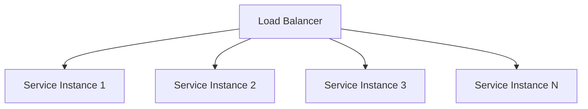
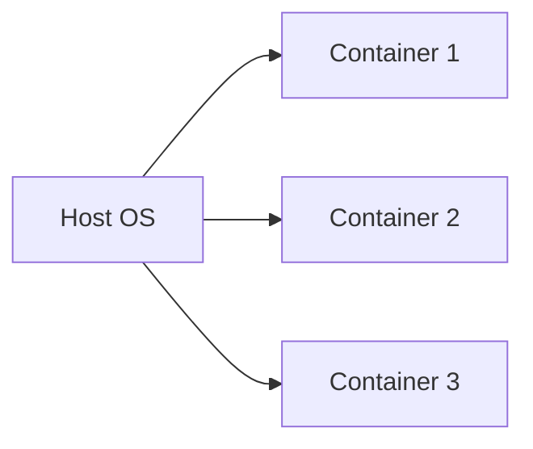
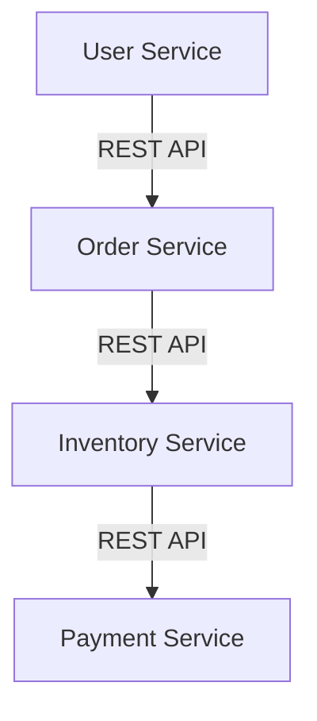

---

linkTitle: "9.1.1 Benefits of Containerization"
title: "Benefits of Containerization: Enhancing Portability, Scalability, and Efficiency"
description: "Explore the transformative benefits of containerization in microservices architecture, including portability, scalability, resource optimization, and more."
categories:
- Microservices
- Deployment
- Containerization
tags:
- Containerization
- Microservices
- Scalability
- Portability
- CI/CD
date: 2024-10-25
type: docs
nav_weight: 9110

---

## 9.1.1 Benefits of Containerization

Containerization has revolutionized the way we develop, deploy, and manage applications, particularly in the realm of microservices. By encapsulating an application and its dependencies into a single, portable unit, containers offer a host of benefits that enhance the efficiency, scalability, and reliability of software systems. In this section, we will delve into the key benefits of containerization and how it supports modern software development practices.

### Enhance Portability

One of the most significant advantages of containerization is its ability to enhance portability. Containers encapsulate an application along with its dependencies, libraries, and configuration files, ensuring that it can run consistently across different environments. This is achieved by packaging the application into a container image that can be deployed on any system with a compatible container runtime, such as Docker.

**Example:**

Consider a Java-based microservice that relies on specific versions of libraries and a particular configuration. By containerizing this service, developers can ensure that it behaves the same way on a developer's laptop, a testing server, or a production environment, eliminating the "it works on my machine" problem.

```java
// Dockerfile example for a Java application
FROM openjdk:11-jre-slim
COPY target/myapp.jar /usr/app/myapp.jar
WORKDIR /usr/app
ENTRYPOINT ["java", "-jar", "myapp.jar"]
```

This Dockerfile creates a container image for a Java application, ensuring that the correct Java runtime and application dependencies are included.

### Improve Scalability

Containers are lightweight and can be spun up quickly, making them ideal for horizontal scaling. This means that as demand increases, additional instances of a service can be deployed rapidly to handle the load. This is particularly beneficial in microservices architectures, where different services may need to scale independently based on their specific load.

**Real-World Scenario:**

Imagine an e-commerce platform experiencing a surge in traffic during a holiday sale. With containerization, the platform can quickly scale out its checkout and payment services to handle the increased demand without affecting other services.



This diagram illustrates how a load balancer can distribute traffic across multiple containerized service instances, enabling efficient scaling.

### Facilitate Continuous Deployment

Containerization plays a crucial role in continuous integration and continuous deployment (CI/CD) pipelines. Containers provide consistent and reproducible deployment units, which simplifies the process of testing and deploying applications across different stages of the pipeline.

**Example:**

In a CI/CD pipeline, a container image is built once and then deployed to various environments (e.g., staging, production) without modification. This ensures that the same code is tested and deployed, reducing the risk of discrepancies between environments.

```yaml
stages:
  - build
  - test
  - deploy

build:
  stage: build
  script:
    - docker build -t myapp .

test:
  stage: test
  script:
    - docker run myapp test

deploy:
  stage: deploy
  script:
    - docker push myapp
```

This YAML configuration outlines a simple CI/CD pipeline that builds, tests, and deploys a containerized application.

### Optimize Resource Utilization

Containers share the host system's kernel, which allows them to use system resources more efficiently than traditional virtual machines (VMs). This means that more containers can be run on a single host compared to VMs, leading to better resource utilization and cost savings.

**Comparison:**

- **Virtual Machines:** Each VM includes a full operating system, which consumes significant resources.
- **Containers:** Share the host OS kernel, reducing overhead and allowing more instances to run on the same hardware.



This diagram shows how containers share the host OS, leading to efficient resource utilization.

### Enable Microservices Architecture

Containerization naturally aligns with the microservices architecture by isolating services, making them easier to develop, deploy, and manage independently. Each microservice can be packaged into its own container, allowing teams to work on different services without interference.

**Example:**

In a microservices-based application, each service (e.g., user management, order processing, inventory) can be developed in different languages or frameworks and deployed independently as containers.



This diagram illustrates how different microservices can interact through APIs, with each service running in its own container.

### Simplify Environment Management

Containers eliminate environment-specific issues by ensuring that code runs the same way in development, testing, and production. This consistency reduces the complexity of managing different environments and minimizes the risk of deployment failures.

**Scenario:**

A development team can use containers to create identical environments for development, testing, and production, ensuring that any issues are caught early and resolved before reaching production.

### Enhance Isolation and Security

Containers provide process isolation, reducing the risk of resource conflicts and enhancing security by limiting the scope of potential vulnerabilities. Each container runs in its own isolated environment, which helps prevent one compromised container from affecting others.

**Security Features:**

- **Namespace Isolation:** Ensures that containers have their own view of the system, including process IDs and network interfaces.
- **Control Groups (cgroups):** Limit the resources a container can use, preventing any single container from consuming all system resources.

### Support Rapid Deployment and Rollbacks

Containers enable quick deployment cycles and easy rollbacks, enhancing the system's resilience and reliability. If a new version of a service fails, it can be rolled back to a previous version quickly by redeploying the earlier container image.

**Example:**

A deployment script can automate the process of rolling back to a previous container image if a new deployment fails health checks.

```bash
#!/bin/bash
docker pull myapp:new_version
docker run -d --name myapp_new myapp:new_version

if ! curl -f http://localhost:8080/health; then
  echo "Deployment failed, rolling back..."
  docker stop myapp_new
  docker run -d --name myapp_old myapp:old_version
fi
```

This script demonstrates how to automate deployment and rollback using containers.

### Conclusion

Containerization offers numerous benefits that make it an essential technology for modern software development, particularly in microservices architectures. By enhancing portability, improving scalability, facilitating continuous deployment, optimizing resource utilization, and supporting rapid deployment and rollbacks, containers empower development teams to build and manage applications more efficiently and reliably.

For further exploration, consider diving into official documentation and resources such as Docker's [official documentation](https://docs.docker.com/) and Kubernetes' [official site](https://kubernetes.io/).

## Quiz Time!



### What is one of the primary benefits of containerization in terms of application deployment?

- [x] Portability across different environments
- [ ] Increased application size
- [ ] Decreased application security
- [ ] Reduced application functionality

> **Explanation:** Containerization enhances portability by encapsulating applications and their dependencies, allowing them to run consistently across different environments.

### How do containers improve scalability in microservices architectures?

- [x] By enabling rapid horizontal scaling
- [ ] By requiring more resources per instance
- [ ] By limiting the number of services
- [ ] By increasing deployment time

> **Explanation:** Containers enable rapid horizontal scaling, allowing services to scale out quickly in response to increased demand.

### What role do containers play in CI/CD pipelines?

- [x] They provide consistent and reproducible deployment units
- [ ] They increase the complexity of deployments
- [ ] They require manual intervention for each deployment
- [ ] They decrease the reliability of deployments

> **Explanation:** Containers provide consistent and reproducible deployment units, streamlining the CI/CD process.

### How do containers optimize resource utilization compared to traditional virtual machines?

- [x] By sharing the host system’s kernel
- [ ] By requiring a full operating system per container
- [ ] By increasing memory usage
- [ ] By reducing the number of containers per host

> **Explanation:** Containers share the host system’s kernel, leading to more efficient use of system resources compared to traditional virtual machines.

### In what way do containers support the microservices architecture?

- [x] By isolating services for independent development and deployment
- [ ] By combining all services into a single unit
- [ ] By requiring all services to use the same programming language
- [ ] By limiting the number of services that can be deployed

> **Explanation:** Containers support microservices architecture by isolating services, allowing them to be developed and deployed independently.

### How do containers simplify environment management?

- [x] By ensuring code runs the same way in development, testing, and production
- [ ] By requiring different configurations for each environment
- [ ] By increasing the complexity of environment setup
- [ ] By limiting the number of environments

> **Explanation:** Containers ensure that code runs the same way in different environments, simplifying environment management.

### What security feature do containers provide to enhance isolation?

- [x] Namespace Isolation
- [ ] Increased network access
- [ ] Shared memory space
- [ ] Unlimited resource usage

> **Explanation:** Containers provide namespace isolation, ensuring that each container has its own view of the system.

### How do containers support rapid deployment and rollbacks?

- [x] By enabling quick deployment cycles and easy rollbacks
- [ ] By requiring manual rollback procedures
- [ ] By increasing deployment time
- [ ] By limiting the number of deployments

> **Explanation:** Containers enable quick deployment cycles and easy rollbacks, enhancing system resilience.

### What is a common tool used for containerization?

- [x] Docker
- [ ] VirtualBox
- [ ] VMware
- [ ] Hyper-V

> **Explanation:** Docker is a common tool used for containerization, providing a platform for building, deploying, and managing containers.

### True or False: Containers require a full operating system for each instance.

- [ ] True
- [x] False

> **Explanation:** False. Containers share the host system's kernel and do not require a full operating system for each instance, unlike virtual machines.


